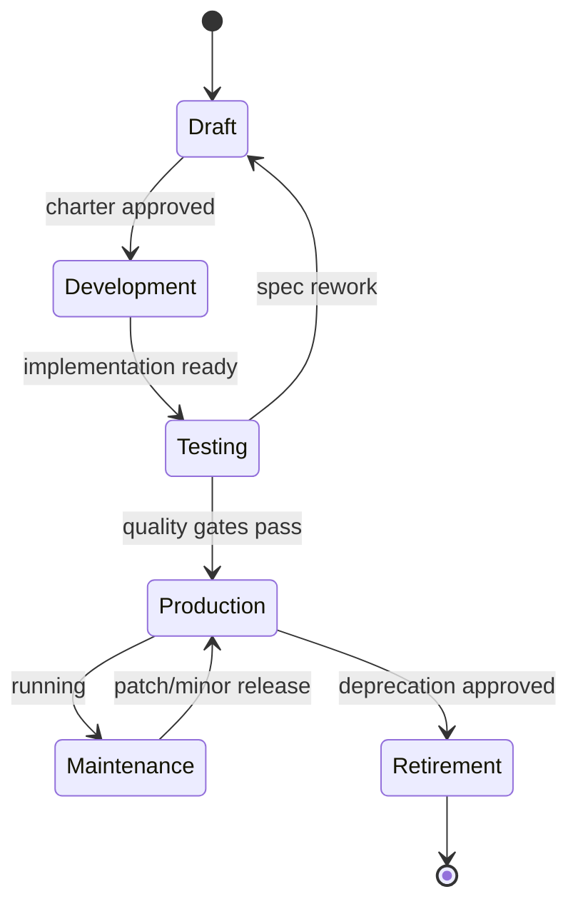
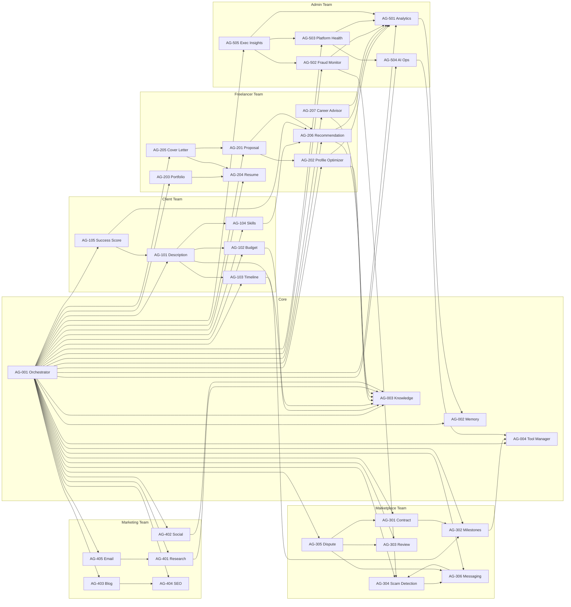
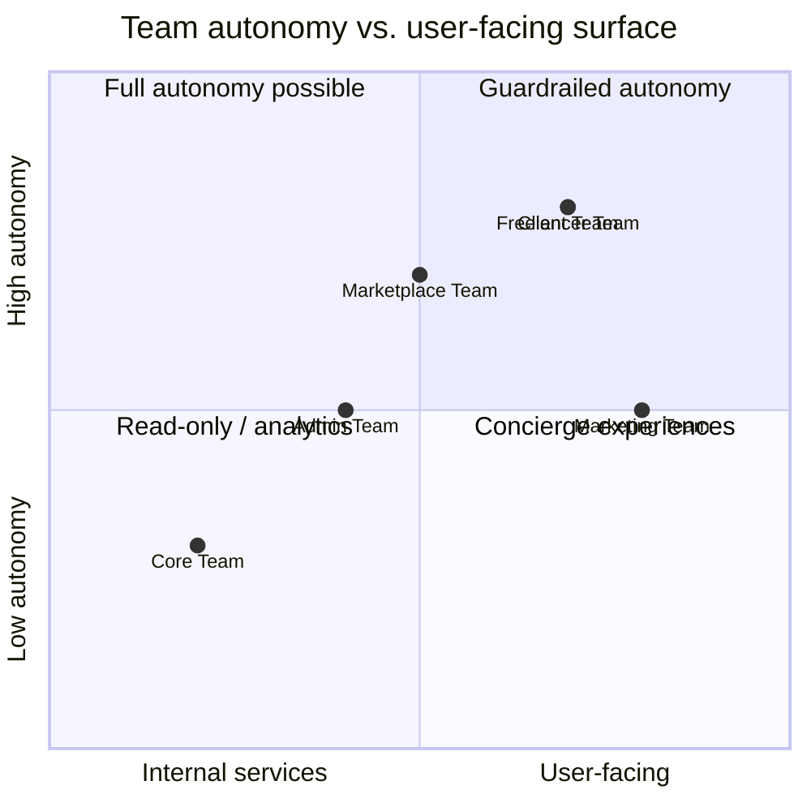
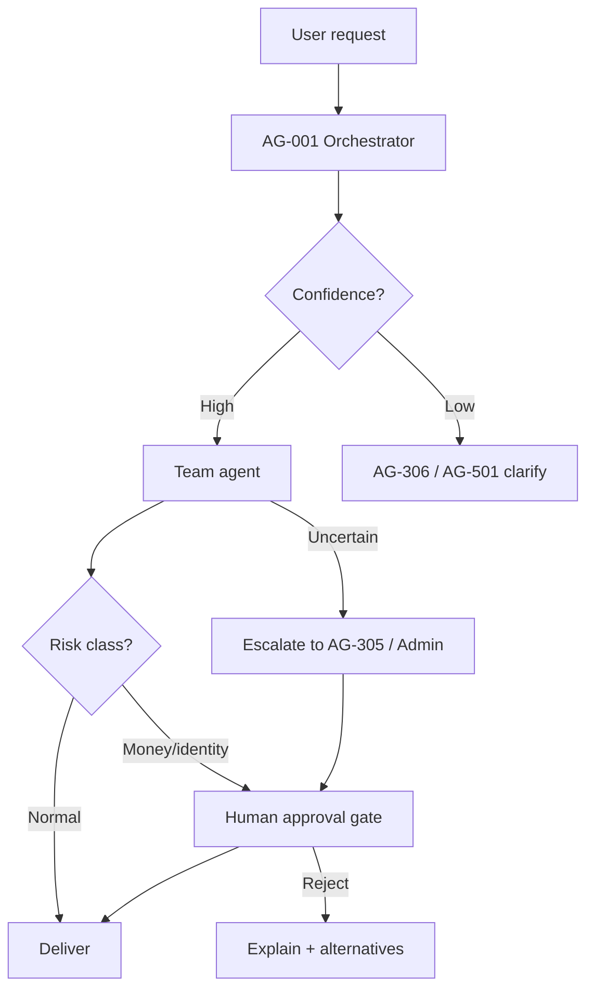

# Freelancify AI — Agent Catalog & Registry v1.0

**Version:** v1.0 · **Status:** Official registry · **Owner:** FreelancifyHub Engineering
**Last updated:** 2026-08-01

> [!IMPORTANT]
> **Source of truth.** This catalog defines every AI agent in the Freelancify
> AI ecosystem. It is fully governed by, and must never contradict:
>
> - [`docs/freelancify-ai-blueprint-v1.0.md`](./freelancify-ai-blueprint-v1.0.md) — the architecture guide
> - [`docs/product-requirements-v1.md`](./product-requirements-v1.md) — the PRD / functional spec
>
> No implementation code is included. If a required behaviour is missing from
> the source documents, it is recorded as an **assumption** in §19 rather than
> invented here.

---

## Table of Contents

1. [How to Use This Catalog](#1-how-to-use-this-catalog)
2. [Agent Lifecycle](#2-agent-lifecycle)
3. [Naming Convention](#3-naming-convention)
4. [Folder Convention](#4-folder-convention)
5. [Versioning Strategy](#5-versioning-strategy)
6. [Documentation Convention](#6-documentation-convention)
7. [Common Defaults](#7-common-defaults)
8. [Registry Summary](#8-registry-summary)
9. [Core Agents (AG-0xx)](#9-core-agents-ag-0xx)
10. [Client Team (AG-1xx)](#10-client-team-ag-1xx)
11. [Freelancer Team (AG-2xx)](#11-freelancer-team-ag-2xx)
12. [Marketplace Team (AG-3xx)](#12-marketplace-team-ag-3xx)
13. [Marketing Team (AG-4xx)](#13-marketing-team-ag-4xx)
14. [Admin Team (AG-5xx)](#14-admin-team-ag-5xx)
15. [Agent Dependency Graph](#15-agent-dependency-graph)
16. [Team Architecture](#16-team-architecture)
17. [Communication Matrix](#17-communication-matrix)
18. [Escalation Flow](#18-escalation-flow)
19. [Assumptions & Source Mapping](#19-assumptions--source-mapping)
20. [Quality Gates](#20-quality-gates)
21. [Definition of Done](#21-definition-of-done)
22. [Best Practices & Future Recommendations](#22-best-practices--future-recommendations)

---

## 1. How to Use This Catalog

- Every agent has a **stable Agent ID** (`AG-NNN`). IDs never change.
- Each agent entry is a self-contained spec: purpose → contract → operations →
  governance → metrics.
- Agents are **product components**: changes to an agent are versioned,
  reviewed and shipped through the Quality Gates (§20).
- Cross-references use the blueprint (`§N` = blueprint section) and PRD (`F#` =
  PRD AI feature; `BR-*` = PRD business rule).

---

## 2. Agent Lifecycle



| Stage           | Entry criteria                 | Exit criteria                         |
| --------------- | ------------------------------ | ------------------------------------- |
| **Draft**       | Idea + owner                   | Charter reviewed; status set          |
| **Development** | Approved charter               | Contract tests + prompt tests written |
| **Testing**     | Implementation                 | Quality gates (§20) green             |
| **Production**  | Green gates                    | Live, monitored, KPIs tracked         |
| **Maintenance** | In production                  | Patch/minor releases; health reports  |
| **Retirement**  | Deprecation notice + migration | Removed; logs archived                |

---

## 3. Naming Convention

| Element       | Rule                                                                            | Example                                        |
| ------------- | ------------------------------------------------------------------------------- | ---------------------------------------------- |
| Agent ID      | `AG-` + 3-digit team-scoped number                                              | `AG-201`                                       |
| Agent name    | PascalCase, human-readable                                                      | `Proposal Writer`                              |
| Code/dir name | kebab-case, matches ID                                                          | `proposal-writer`                              |
| Team prefix   | Core `0`, Client `1`, Freelancer `2`, Marketplace `3`, Marketing `4`, Admin `5` | `AG-3xx` = Marketplace                         |
| Prompt file   | `prompts/<team>/<agent-id>/prompt.md`                                           | `prompts/marketplace/scam-detection/prompt.md` |
| Charter file  | `agents/<team>/<agent-id>/agent.md`                                             | `agents/core/master-orchestrator/agent.md`     |

---

## 4. Folder Convention

Per blueprint §22, agent artefacts live under:

```text
agents/                      # OpenClaw agent identity/charter files
  core/                      # AG-001..AG-004
  client/                    # AG-101..AG-105
  freelancer/                # AG-201..AG-207
  marketplace/               # AG-301..AG-306
  marketing/                 # AG-401..AG-405
  admin/                     # AG-501..AG-505
prompts/                     # prompt templates per agent
workflows/                   # declarative flows per agent/team
knowledge/                   # ground-truth sources agents cite
memory/                      # persistent agent state
tools/                       # capability catalogue (Tool Registry)
```

Each agent directory contains `agent.md` (identity charter), `prompt.md`
(prompt), and optional `SOUL.md` / `AGENTS.md` per OpenClaw convention.

---

## 5. Versioning Strategy

Semantic versioning applies to **agent behaviour contracts**:

| Bump      | Meaning                                               | Requires                     |
| --------- | ----------------------------------------------------- | ---------------------------- |
| **Major** | Breaking contract (inputs/outputs/permissions change) | Full review + migration note |
| **Minor** | New capability, backward compatible                   | Charter update + tests       |
| **Patch** | Fix/guardrail, no contract change                     | Fast-track review            |

Rules:

- `agent.md` and the catalog entry carry the same `Version`.
- Prompt changes that alter output schema are **major**.
- Retired majors keep a deprecation record for 2 minor cycles.

---

## 6. Documentation Convention

- **Catalog entry** (this file): the registry of record for every agent.
- **`agent.md` charter**: operational identity for the OpenClaw runtime.
- **`prompt.md`**: the executable prompt (follows Prompt Standards, blueprint §19).
- All three stay in sync; CI checks version parity (see §20).

---

## 7. Common Defaults

Defaults applied to every agent unless an agent entry overrides them.

| Area                | Default                                                                                          |
| ------------------- | ------------------------------------------------------------------------------------------------ |
| **Preferred model** | `anthropic/claude-sonnet` class                                                                  |
| **Fallback model**  | `gpt-4o` class (multi-provider routing, blueprint §6)                                            |
| **Reasoning level** | Balanced (default); `high` only for scoring/fraud agents                                         |
| **Temperature**     | 0.2 extraction/scoring · 0.7 creative                                                            |
| **Token limits**    | Input 8k · output 2k (per agent may differ)                                                      |
| **Logging**         | pino JSON, `service=freelancify-ai`, fields `team`, `agent`, `trace_id`, `event` (blueprint §23) |
| **Redaction**       | PII/secrets redacted at logger boundary (blueprint §24)                                          |
| **Retry**           | Exponential backoff, max 3, idempotent where applicable                                          |
| **Rate limits**     | Per BR-RATE-1: Free 5 AI assists/day · Pro 100 AI assists/day                                    |
| **Security**        | Default-deny Tool Registry; no autonomous money/identity actions (BR-AI-2)                       |
| **Privacy**         | Namespace-scoped memory; data minimisation (blueprint §15, §24)                                  |
| **Observability**   | Trace ID across hops; metrics latency/cost/tokens; audit events                                  |
| **Cost**            | Tracked per agent; alert on > 2× baseline (AG-504)                                               |

---

## 8. Registry Summary

| ID     | Agent                     | Team        | Category      | Status         | Priority |
| ------ | ------------------------- | ----------- | ------------- | -------------- | -------- |
| AG-001 | Master Orchestrator       | Core        | Core          | In Development | Critical |
| AG-002 | Memory Manager            | Core        | Memory        | In Development | Critical |
| AG-003 | Knowledge Manager         | Core        | Knowledge     | In Development | Critical |
| AG-004 | Tool Manager              | Core        | Core          | In Development | Critical |
| AG-101 | Project Description Agent | Client      | Client        | In Development | High     |
| AG-102 | Budget Estimator          | Client      | Client        | In Development | High     |
| AG-103 | Timeline Estimator        | Client      | Client        | In Development | High     |
| AG-104 | Skills Recommendation     | Client      | Client        | In Development | High     |
| AG-105 | Project Success Score     | Client      | Analytics     | In Development | High     |
| AG-201 | Proposal Writer           | Freelancer  | Freelancer    | In Development | High     |
| AG-202 | Profile Optimizer         | Freelancer  | Freelancer    | Planned        | High     |
| AG-203 | Portfolio Builder         | Freelancer  | Freelancer    | Planned        | Medium   |
| AG-204 | Resume Builder            | Freelancer  | Freelancer    | Planned        | Medium   |
| AG-205 | Cover Letter Generator    | Freelancer  | Freelancer    | Planned        | Medium   |
| AG-206 | Project Recommendation    | Freelancer  | Marketplace   | In Development | Critical |
| AG-207 | Career Advisor            | Freelancer  | Freelancer    | Planned        | Medium   |
| AG-301 | Contract Generator        | Marketplace | Marketplace   | Planned        | High     |
| AG-302 | Milestone Planner         | Marketplace | Marketplace   | Planned        | High     |
| AG-303 | Review Generator          | Marketplace | Marketplace   | Planned        | Medium   |
| AG-304 | Scam Detection            | Marketplace | Security      | In Development | Critical |
| AG-305 | Dispute Assistant         | Marketplace | Marketplace   | Planned        | High     |
| AG-306 | Messaging Assistant       | Marketplace | Communication | In Development | High     |
| AG-401 | Research Agent            | Marketing   | Marketing     | Planned        | Low      |
| AG-402 | Social Media Manager      | Marketing   | Marketing     | Planned        | Low      |
| AG-403 | Blog Writer               | Marketing   | Marketing     | Planned        | Low      |
| AG-404 | SEO Specialist            | Marketing   | Marketing     | Planned        | Low      |
| AG-405 | Email Marketing           | Marketing   | Marketing     | Planned        | Low      |
| AG-501 | Analytics Agent           | Admin       | Analytics     | In Development | High     |
| AG-502 | Fraud Monitoring          | Admin       | Security      | In Development | Critical |
| AG-503 | Platform Health           | Admin       | Analytics     | Planned        | High     |
| AG-504 | AI Operations             | Admin       | Core          | Planned        | High     |
| AG-505 | Executive Insights        | Admin       | Analytics     | Planned        | Medium   |

> [!NOTE]
> Statuses reflect the v1 roadmap (PRD §Roadmap). "In Development" items belong
> to Phases 1–3; "Planned" items to Phases 3–5.

---

## 9. Core Agents (AG-0xx)

Core agents provide the platform capabilities all teams depend on. They
implement blueprint §§9, 15, 16, 17.

### AG-001 — Master Orchestrator

| Field                                                 | Value                                                                                                                 |
| ----------------------------------------------------- | --------------------------------------------------------------------------------------------------------------------- |
| **Agent ID / Version / Status / Priority / Category** | AG-001 · 1.0.0 · In Development · Critical · Core                                                                     |
| **Purpose**                                           | Single entry point for every agent interaction; route, delegate, enforce policy (blueprint §9)                        |
| **Responsibilities**                                  | Intent classification; policy/approval enforcement; plan composition (fan-out/fan-in); error handling; audit emission |
| **Business Value**                                    | Deterministic, safe coordination across all teams; auditability for every decision                                    |
| **User Types**                                        | Client, Freelancer, Admin, Guest                                                                                      |
| **Inputs**                                            | Routed request, intent, context, policy rules                                                                         |
| **Outputs**                                           | Delegated plan, response, audit record                                                                                |
| **Triggers**                                          | Manual, API, Webhook                                                                                                  |
| **Dependencies**                                      | AG-002 (memory), AG-003 (knowledge), AG-004 (tool), all team agents, Database                                         |
| **Permissions**                                       | Read policy config; write audit; no direct money/identity mutations                                                   |
| **Context Requirements**                              | Trace ID; user identity; namespace scope; active plan state                                                           |
| **Memory Usage**                                      | Short-term (active plans) + Project Memory (state)                                                                    |
| **Knowledge Sources**                                 | Policy docs, routing tables (KB)                                                                                      |
| **LLM Requirements**                                  | Preferred `claude-sonnet` · Fallback `gpt-4o` · Reasoning balanced · Temp 0.2 · 8k/2k tokens                          |
| **Tool Access**                                       | Route/lookup tools only; no direct business tools                                                                     |
| **Failure Handling**                                  | Fail-closed: unknown intent → human escalation (blueprint §4)                                                         |
| **Retry Policy**                                      | Idempotent plan retry, max 3, backoff                                                                                 |
| **Logging Requirements**                              | Every route + policy decision logged (pino JSON)                                                                      |
| **Observability**                                     | Trace spans per delegation; routing latency; error rate                                                               |
| **Security Considerations**                           | Default-deny routing; policy-as-config; injection-resistant                                                           |
| **Privacy Considerations**                            | Never leaks cross-namespace context                                                                                   |
| **Rate Limits**                                       | 100 req/min (BR-RATE-2)                                                                                               |
| **Cost Considerations**                               | Single LLM hop budgeted; fan-out amortised                                                                            |
| **KPIs**                                              | Routing accuracy; % fail-closed; p95 latency                                                                          |
| **Success Metrics**                                   | Correct-team routing ≥ 99%; escalation time < 2 min                                                                   |
| **Acceptance Criteria**                               | AC: unknown intent returns fail-closed message; every decision is auditable                                           |
| **Future Roadmap**                                    | Adaptive routing; plan templates per domain                                                                           |

### AG-002 — Memory Manager

| Field                                                 | Value                                                                                 |
| ----------------------------------------------------- | ------------------------------------------------------------------------------------- |
| **Agent ID / Version / Status / Priority / Category** | AG-002 · 1.0.0 · In Development · Critical · Memory                                   |
| **Purpose**                                           | Own the Shared Memory layer: read/write/expire namespaced state (blueprint §15)       |
| **Responsibilities**                                  | Namespace enforcement; TTL/expiry; session continuity; project/user memory; event log |
| **Business Value**                                    | Stateless agents; seamless multi-session UX; auditable state                          |
| **User Types**                                        | Client, Freelancer, Admin                                                             |
| **Inputs**                                            | Memory read/write requests with namespace + TTL                                       |
| **Outputs**                                           | Context payloads; write confirmations; event log entries                              |
| **Triggers**                                          | Automatic (context load), API                                                         |
| **Dependencies**                                      | Database (store), AG-001 (orchestration)                                              |
| **Permissions**                                       | Full CRUD within namespace allow-list only                                            |
| **Context Requirements**                              | Namespace key (`domain:entity:attribute`); actor; reason                              |
| **Memory Usage**                                      | Short-term (sessions), Long-term, Project Memory, User Memory — all namespaced        |
| **Knowledge Sources**                                 | (None; state, not facts)                                                              |
| **LLM Requirements**                                  | Not LLM-heavy — deterministic service; fallback not required                          |
| **Tool Access**                                       | Storage engine only                                                                   |
| **Failure Handling**                                  | Read-through cache; write-behind with retry                                           |
| **Retry Policy**                                      | Write retry max 3; read falls back to source                                          |
| **Logging Requirements**                              | Writes logged with owner + reason (audit)                                             |
| **Observability**                                     | Namespace usage; TTL churn; write latency                                             |
| **Security Considerations**                           | Namespace isolation enforced; no cross-namespace reads (BR-ADM-1)                     |
| **Privacy Considerations**                            | PII minimisation; no raw PII duplication (blueprint §15)                              |
| **Rate Limits**                                       | Backed by store limits; per-request caps                                              |
| **Cost Considerations**                               | Storage + egress; TTL bounds growth                                                   |
| **KPIs**                                              | Read hit-rate; write error rate; stale-context rate                                   |
| **Success Metrics**                                   | Session continuity ≥ 99%; expiry enforced 100%                                        |
| **Acceptance Criteria**                               | Cross-namespace read is rejected; expired keys unreachable                            |
| **Future Roadmap**                                    | Embeddings for semantic memory retrieval                                              |

### AG-003 — Knowledge Manager

| Field                                                 | Value                                                                                             |
| ----------------------------------------------------- | ------------------------------------------------------------------------------------------------- |
| **Agent ID / Version / Status / Priority / Category** | AG-003 · 1.0.0 · In Development · Critical · Knowledge                                            |
| **Purpose**                                           | Own the Knowledge Base: ingest, version, retrieve, and cite (blueprint §16)                       |
| **Responsibilities**                                  | Chunk/embed pipeline; version + review gates; retrieval with mandatory citations; freshness flags |
| **Business Value**                                    | Grounded, verifiable AI answers; consistency of policy and brand                                  |
| **User Types**                                        | Client, Freelancer, Admin                                                                         |
| **Inputs**                                            | Source docs; retrieval queries                                                                    |
| **Outputs**                                           | Citation-grounded snippets; versioned documents                                                   |
| **Triggers**                                          | Automatic (pipeline), Scheduled (freshness), API                                                  |
| **Dependencies**                                      | Storage + vector index, AG-001, all agents consuming knowledge                                    |
| **Permissions**                                       | Ingest: KB editors; Retrieve: read-only for agents                                                |
| **Context Requirements**                              | Document source, version, trust level                                                             |
| **Memory Usage**                                      | Long-term (immutable versions)                                                                    |
| **Knowledge Sources**                                 | Policies, FAQ, brand guide, glossaries, market snapshots (blueprint §16.2)                        |
| **LLM Requirements**                                  | Preferred `claude-sonnet` · Fallback `gpt-4o` · Reasoning balanced · Temp 0.2 · 4k/2k             |
| **Tool Access**                                       | Vector search, document store                                                                     |
| **Failure Handling**                                  | Uncited answers blocked; retrieval fail → no answer, escalate                                     |
| **Retry Policy**                                      | Retrieval retry max 2                                                                             |
| **Logging Requirements**                              | Retrieval + citation usage logged                                                                 |
| **Observability**                                     | Retrieval latency; citation coverage; freshness staleness                                         |
| **Security Considerations**                           | Version trust; no unauthorised edits (BR-AI-4)                                                    |
| **Privacy Considerations**                            | Documents classified; no PII in KB                                                                |
| **Rate Limits**                                       | Query rate-limit per agent                                                                        |
| **Cost Considerations**                               | Embedding + vector search cost tracked per feature                                                |
| **KPIs**                                              | Citation rate; answer accuracy; stale-doc count                                                   |
| **Success Metrics**                                   | ≥ 95% factual answers cite a KB entry; stale docs < 5%                                            |
| **Acceptance Criteria**                               | Uncited factual answer is blocked (BR-AI-4)                                                       |
| **Future Roadmap**                                    | Semantic deduplication; KB quality scoring                                                        |

### AG-004 — Tool Manager

| Field                                                 | Value                                                                                                     |
| ----------------------------------------------------- | --------------------------------------------------------------------------------------------------------- |
| **Agent ID / Version / Status / Priority / Category** | AG-004 · 1.0.0 · In Development · Critical · Core                                                         |
| **Purpose**                                           | Own the Tool Registry: default-deny capability catalogue (blueprint §17)                                  |
| **Responsibilities**                                  | Contract validation (JSON Schema); permission enforcement; rate-limit; cost-track; audit every invocation |
| **Business Value**                                    | Least privilege, safe tool use, full audit of side effects                                                |
| **User Types**                                        | Client, Freelancer, Admin                                                                                 |
| **Inputs**                                            | Tool invocation request (agent + args)                                                                    |
| **Outputs**                                           | Allowed → executed result; Denied → reason                                                                |
| **Triggers**                                          | Automatic (every tool call), API                                                                          |
| **Dependencies**                                      | AG-001, Tool catalogue (tools/), Stripe, Email, Search, Database                                          |
| **Permissions**                                       | Read-only policy table; enforces agent allow-lists                                                        |
| **Context Requirements**                              | Agent ID, tool ID, args schema, trace ID                                                                  |
| **Memory Usage**                                      | None (stateless)                                                                                          |
| **Knowledge Sources**                                 | Tool contract docs                                                                                        |
| **LLM Requirements**                                  | Deterministic; no LLM required                                                                            |
| **Tool Access**                                       | All tools; mediation only                                                                                 |
| **Failure Handling**                                  | Deny-by-default; schema failure returns contract error                                                    |
| **Retry Policy**                                      | No blind retry; surface to orchestrator                                                                   |
| **Logging Requirements**                              | Every invocation: actor, args-hash, result (blueprint §17.2)                                              |
| **Observability**                                     | Invocation counts; cost; failure rates per tool                                                           |
| **Security Considerations**                           | Default-deny; mutating tools require approval gate (blueprint §17)                                        |
| **Privacy Considerations**                            | Args validated to avoid PII leakage                                                                       |
| **Rate Limits**                                       | Per-agent + per-tool quotas (BR-RATE-1)                                                                   |
| **Cost Considerations**                               | Tool cost attribution per agent                                                                           |
| **KPIs**                                              | Denied-call rate; contract-pass rate; cost per call                                                       |
| **Success Metrics**                                   | 0 unauthorised invocations; 100% audit coverage                                                           |
| **Acceptance Criteria**                               | Unauthorised tool call is denied with reason (AC-24 parity)                                               |
| **Future Roadmap**                                    | Tool self-description discovery                                                                           |

---

## 10. Client Team (AG-1xx)

Client team agents implement PRD Client Journey + AI features F1–F5.

### AG-101 — Project Description Agent

| Field                                                 | Value                                                                                                                    |
| ----------------------------------------------------- | ------------------------------------------------------------------------------------------------------------------------ |
| **Agent ID / Version / Status / Priority / Category** | AG-101 · 1.0.0 · In Development · High · Client                                                                          |
| **Purpose**                                           | Turn raw briefs into clear, complete project descriptions (PRD F1)                                                       |
| **Responsibilities**                                  | Brief structuring; clarification prompts; publishable description (headline, summary, deliverables, acceptance criteria) |
| **Business Value**                                    | Higher-quality listings → better matching (BG2)                                                                          |
| **User Types**                                        | Client                                                                                                                   |
| **Inputs**                                            | Raw brief, uploaded files, selected skills/budget/timeline                                                               |
| **Outputs**                                           | Structured description, 50–500 words                                                                                     |
| **Triggers**                                          | Manual (on post/edit), Automatic (first draft)                                                                           |
| **Dependencies**                                      | AG-003 (KB glossaries), AG-104 (skills), AG-102/103 (estimators), Memory                                                 |
| **Permissions**                                       | Client scope only; write to own project                                                                                  |
| **Context Requirements**                              | Project draft, client profile                                                                                            |
| **Memory Usage**                                      | Project Memory (draft state)                                                                                             |
| **Knowledge Sources**                                 | Writing guidelines, domain glossaries                                                                                    |
| **LLM Requirements**                                  | Preferred `claude-sonnet` · Fallback `gpt-4o` · Balanced · Temp 0.4 · 8k/2k                                              |
| **Tool Access**                                       | File reader, KB retrieval                                                                                                |
| **Failure Handling**                                  | Partial failure → keep manual inputs; retry AI                                                                           |
| **Retry Policy**                                      | Retry max 2; then degrade to manual                                                                                      |
| **Logging Requirements**                              | Generation logged with prompt/model version (BR-AI-1)                                                                    |
| **Observability**                                     | Generation latency; acceptance rate                                                                                      |
| **Security Considerations**                           | No invention of requirements (BR-AI-5)                                                                                   |
| **Privacy Considerations**                            | Brief data stays in client namespace                                                                                     |
| **Rate Limits**                                       | Per BR-RATE-1 assists                                                                                                    |
| **Cost Considerations**                               | One generation per post/edit                                                                                             |
| **KPIs**                                              | Edit-to-publish rate; completion rate                                                                                    |
| **Success Metrics**                                   | ≥ 60% posts use AI enrichment (BG5/PRD AC-04)                                                                            |
| **Acceptance Criteria**                               | AC-04: 20-word brief → publishable description < 10s                                                                     |
| **Future Roadmap**                                    | Voice-to-brief; interview-style builder (PRD)                                                                            |

### AG-102 — Budget Estimator

| Field                                                 | Value                                                                       |
| ----------------------------------------------------- | --------------------------------------------------------------------------- |
| **Agent ID / Version / Status / Priority / Category** | AG-102 · 1.0.0 · In Development · High · Client                             |
| **Purpose**                                           | Suggest realistic budget range with rationale (PRD F2)                      |
| **Responsibilities**                                  | Market-rate analysis; cost drivers; range output (min/mid/max)              |
| **Business Value**                                    | Realistic budgets → better matches + fewer disputes                         |
| **User Types**                                        | Client                                                                      |
| **Inputs**                                            | Brief, skills, duration, market rates (KB)                                  |
| **Outputs**                                           | Budget range ≥ $50 + assumptions                                            |
| **Triggers**                                          | Manual/Automatic (on post/edit)                                             |
| **Dependencies**                                      | AG-003 (market data), AG-104 (skills), AG-101                               |
| **Permissions**                                       | Client scope; pricing model read-only                                       |
| **Permissions**                                       | Client; write to project only                                               |
| **Context Requirements**                              | Scope summary, skill set                                                    |
| **Memory Usage**                                      | Project Memory                                                              |
| **Knowledge Sources**                                 | Market-rate snapshots (KB, approved by Marketplace team)                    |
| **LLM Requirements**                                  | Preferred `claude-sonnet` · Fallback `gpt-4o` · Balanced · Temp 0.2 · 4k/2k |
| **Tool Access**                                       | KB retrieval, pricing model                                                 |
| **Failure Handling**                                  | Range flagged ±20%; no rate data → conservative floor                       |
| **Retry Policy**                                      | Retry max 2                                                                 |
| **Logging Requirements**                              | Estimate + assumptions logged                                               |
| **Observability**                                     | Estimate vs. accepted-bid delta (bias monitor)                              |
| **Security Considerations**                           | Estimates never presented as quotes                                         |
| **Privacy Considerations**                            | No cross-client data                                                        |
| **Rate Limits**                                       | BR-RATE-1                                                                   |
| **Cost Considerations**                               | Low; cached market data                                                     |
| **KPIs**                                              | Estimate accuracy; adoption                                                 |
| **Success Metrics**                                   | Median estimate vs. accepted bid within ±20% (PRD AC-05)                    |
| **Acceptance Criteria**                               | AC-05: returns min/mid/max + rationale < 10s                                |
| **Future Roadmap**                                    | Live market-rate dashboard                                                  |

### AG-103 — Timeline Estimator

| Field                                                 | Value                                                                       |
| ----------------------------------------------------- | --------------------------------------------------------------------------- |
| **Agent ID / Version / Status / Priority / Category** | AG-103 · 1.0.0 · In Development · High · Client                             |
| **Purpose**                                           | Estimate delivery duration from scope (PRD F3)                              |
| **Responsibilities**                                  | Scope→hours model; milestone dates; capacity-aware ceilings                 |
| **Business Value**                                    | Realistic timelines → fewer disputes, better planning                       |
| **User Types**                                        | Client                                                                      |
| **Inputs**                                            | Scope, milestones, availability, skill levels                               |
| **Outputs**                                           | Duration estimate + milestone dates                                         |
| **Triggers**                                          | Manual/Automatic (post/edit, milestone change)                              |
| **Dependencies**                                      | AG-101, AG-104, AG-302 (milestones)                                         |
| **Permissions**                                       | Client; Freelancer sees final plan                                          |
| **Context Requirements**                              | Scope, capacity data                                                        |
| **Memory Usage**                                      | Project Memory                                                              |
| **Knowledge Sources**                                 | Historical project duration data (KB/analytics)                             |
| **LLM Requirements**                                  | Preferred `claude-sonnet` · Fallback `gpt-4o` · Balanced · Temp 0.2 · 4k/2k |
| **Tool Access**                                       | KB, analytics                                                               |
| **Failure Handling**                                  | Insufficient data → wider range + disclaimer                                |
| **Retry Policy**                                      | Retry max 2                                                                 |
| **Logging Requirements**                              | Estimate logged with inputs                                                 |
| **Observability**                                     | Estimate vs. actual duration                                                |
| **Security Considerations**                           | No over-promising                                                           |
| **Privacy Considerations**                            | Capacity data private                                                       |
| **Rate Limits**                                       | BR-RATE-1                                                                   |
| **Cost Considerations**                               | Low                                                                         |
| **KPIs**                                              | Estimate accuracy; adoption                                                 |
| **Success Metrics**                                   | Within ±25% of actual 70% of time (PRD AC)                                  |
| **Acceptance Criteria**                               | Re-runs when milestones change; output bounded                              |
| **Future Roadmap**                                    | Projected-delay alerts                                                      |

### AG-104 — Skills Recommendation

| Field                                                 | Value                                                                       |
| ----------------------------------------------------- | --------------------------------------------------------------------------- |
| **Agent ID / Version / Status / Priority / Category** | AG-104 · 1.0.0 · In Development · High · Client                             |
| **Purpose**                                           | Recommend required skills from a brief (PRD F4)                             |
| **Responsibilities**                                  | Taxonomy mapping; required/nice-to-have split; Matcher input                |
| **Business Value**                                    | Feeds matching quality (BG2)                                                |
| **User Types**                                        | Client                                                                      |
| **Inputs**                                            | Brief text, taxonomy, similar projects                                      |
| **Outputs**                                           | Ordered skill list (required/nice-to-have)                                  |
| **Triggers**                                          | Manual/Automatic (post/edit)                                                |
| **Dependencies**                                      | AG-003 (taxonomy), AG-101, AG-206 (matching)                                |
| **Permissions**                                       | Client; taxonomy read                                                       |
| **Context Requirements**                              | Brief, taxonomy                                                             |
| **Memory Usage**                                      | Project Memory                                                              |
| **Knowledge Sources**                                 | Skills taxonomy (KB)                                                        |
| **LLM Requirements**                                  | Preferred `claude-sonnet` · Fallback `gpt-4o` · Balanced · Temp 0.2 · 4k/2k |
| **Tool Access**                                       | KB retrieval                                                                |
| **Failure Handling**                                  | Taxonomy miss → closest match suggestion                                    |
| **Retry Policy**                                      | Retry max 2                                                                 |
| **Logging Requirements**                              | Recommended skills logged                                                   |
| **Observability**                                     | Taxonomy coverage; mis-match rate                                           |
| **Security Considerations**                           | Taxonomy only (BR-AI-5)                                                     |
| **Privacy Considerations**                            | None beyond scope                                                           |
| **Rate Limits**                                       | BR-RATE-1                                                                   |
| **Cost Considerations**                               | Low                                                                         |
| **KPIs**                                              | Coverage; acceptance                                                        |
| **Success Metrics**                                   | Returns only taxonomy skills (PRD AC-06)                                    |
| **Acceptance Criteria**                               | AC-06 enforced                                                              |
| **Future Roadmap**                                    | Auto-verified synonyms                                                      |

### AG-105 — Project Success Score

| Field                                                 | Value                                                                             |
| ----------------------------------------------------- | --------------------------------------------------------------------------------- |
| **Agent ID / Version / Status / Priority / Category** | AG-105 · 1.0.0 · In Development · High · Analytics                                |
| **Purpose**                                           | Predict likelihood a project gets hired (PRD F5)                                  |
| **Responsibilities**                                  | Scoring (0–100); improvement drivers; advisory only                               |
| **Business Value**                                    | Guides clients to better briefs → higher hire rate (BG1)                          |
| **User Types**                                        | Client                                                                            |
| **Inputs**                                            | Brief completeness, budget realism, clarity, skill-pool match                     |
| **Outputs**                                           | Score + top-3 drivers                                                             |
| **Triggers**                                          | Manual/Automatic (post/edit)                                                      |
| **Dependencies**                                      | AG-101–104 outputs, AG-206 (pool depth), AG-501 (data)                            |
| **Permissions**                                       | Client (own project); model read                                                  |
| **Context Requirements**                              | Enriched brief snapshot                                                           |
| **Memory Usage**                                      | Project Memory (score history)                                                    |
| **Knowledge Sources**                                 | Historical outcome data (KB/analytics)                                            |
| **LLM Requirements**                                  | Preferred `claude-sonnet` · Fallback `gpt-4o` · High reasoning · Temp 0.1 · 4k/1k |
| **Tool Access**                                       | Analytics, KB                                                                     |
| **Failure Handling**                                  | Never blocks publishing (advisory)                                                |
| **Retry Policy**                                      | Retry max 2                                                                       |
| **Logging Requirements**                              | Score + drivers logged; recalibration tracked                                     |
| **Observability**                                     | Score calibration vs. hire outcomes                                               |
| **Security Considerations**                           | Bias-monitored (blueprint §4, §12)                                                |
| **Privacy Considerations**                            | Own-project data only                                                             |
| **Rate Limits**                                       | BR-RATE-1                                                                         |
| **Cost Considerations**                               | Higher reasoning cost; cached per save                                            |
| **KPIs**                                              | Calibration; improvement adoption                                                 |
| **Success Metrics**                                   | Score 0–100; never blocks publish (PRD AC-07)                                     |
| **Acceptance Criteria**                               | AC-07 enforced                                                                    |
| **Future Roadmap**                                    | Post-publish score updates                                                        |

---

## 11. Freelancer Team (AG-2xx)

Freelancer team agents implement PRD Freelancer Journey + features F6–F11, F22.

### AG-201 — Proposal Writer

| Field                                                 | Value                                                                       |
| ----------------------------------------------------- | --------------------------------------------------------------------------- |
| **Agent ID / Version / Status / Priority / Category** | AG-201 · 1.0.0 · In Development · High · Freelancer                         |
| **Purpose**                                           | Draft personalised proposals (PRD F6)                                       |
| **Responsibilities**                                  | Brief-aware drafting; factual grounding; structured output                  |
| **Business Value**                                    | Higher win rates; faster applies (FR-05)                                    |
| **User Types**                                        | Freelancer                                                                  |
| **Inputs**                                            | Project brief, freelancer profile, prior wins                               |
| **Outputs**                                           | Proposal draft 50–1000 words                                                |
| **Triggers**                                          | Manual (on apply)                                                           |
| **Dependencies**                                      | AG-206 (match context), AG-202 (profile), Memory, KB                        |
| **Permissions**                                       | Freelancer (own profile data only)                                          |
| **Context Requirements**                              | Brief, profile, tone preference                                             |
| **Memory Usage**                                      | User Memory (preferences)                                                   |
| **Knowledge Sources**                                 | Writing guidelines, proposal best practices                                 |
| **LLM Requirements**                                  | Preferred `claude-sonnet` · Fallback `gpt-4o` · Balanced · Temp 0.6 · 8k/2k |
| **Tool Access**                                       | KB retrieval, profile reader                                                |
| **Failure Handling**                                  | Timeout → template fallback (no empty submit)                               |
| **Retry Policy**                                      | Retry max 2                                                                 |
| **Logging Requirements**                              | Draft logged (prompt/model version)                                         |
| **Observability**                                     | Draft-to-edit rate; acceptance                                              |
| **Security Considerations**                           | No fabricated credentials (BR-AI-5)                                         |
| **Privacy Considerations**                            | Own data only                                                               |
| **Rate Limits**                                       | BR-RATE-1                                                                   |
| **Cost Considerations**                               | Medium; per-apply generation                                                |
| **KPIs**                                              | AI-draft usage; edit rate                                                   |
| **Success Metrics**                                   | Proposal completion ≥ 70% (PRD)                                             |
| **Acceptance Criteria**                               | AC-10/AC-11 compatible; factual constraint enforced                         |
| **Future Roadmap**                                    | A/B proposal variants                                                       |

### AG-202 — Profile Optimizer

| Field                                                 | Value                                                                       |
| ----------------------------------------------------- | --------------------------------------------------------------------------- |
| **Agent ID / Version / Status / Priority / Category** | AG-202 · 1.0.0 · Planned · High · Freelancer                                |
| **Purpose**                                           | Improve profile discoverability and credibility (PRD F7)                    |
| **Responsibilities**                                  | Headline/bio/skills suggestions; no fabrication; consent to save            |
| **Business Value**                                    | More wins; higher match quality                                             |
| **User Types**                                        | Freelancer                                                                  |
| **Inputs**                                            | Profile, portfolio, ratings, market demand                                  |
| **Outputs**                                           | Suggestion list (editable)                                                  |
| **Triggers**                                          | Manual, Scheduled (monthly nudge)                                           |
| **Dependencies**                                      | AG-003 (market demand), AG-501 (analytics), Memory                          |
| **Permissions**                                       | Freelancer (own profile); consent required to save                          |
| **Context Requirements**                              | Full profile snapshot                                                       |
| **Memory Usage**                                      | User Memory (optimisation history)                                          |
| **Knowledge Sources**                                 | Market demand, brand guidelines                                             |
| **LLM Requirements**                                  | Preferred `claude-sonnet` · Fallback `gpt-4o` · Balanced · Temp 0.5 · 4k/2k |
| **Tool Access**                                       | Profile service (read), KB                                                  |
| **Failure Handling**                                  | Manual edit always available                                                |
| **Retry Policy**                                      | Retry max 2                                                                 |
| **Logging Requirements**                              | Suggestions logged; save consented                                          |
| **Observability**                                     | Optimised-profile completion rate                                           |
| **Security Considerations**                           | No fabrication (BR-AI-5)                                                    |
| **Privacy Considerations**                            | Own profile data                                                            |
| **Rate Limits**                                       | BR-RATE-1                                                                   |
| **Cost Considerations**                               | Low                                                                         |
| **KPIs**                                              | Optimisation adoption; profile completeness                                 |
| **Success Metrics**                                   | Optimised profiles ≥ 85% complete (PRD)                                     |
| **Acceptance Criteria**                               | Consent-gated save; factual integrity                                       |
| **Future Roadmap**                                    | Profile strength score                                                      |

### AG-203 — Portfolio Builder

| Field                                                 | Value                                                                       |
| ----------------------------------------------------- | --------------------------------------------------------------------------- |
| **Agent ID / Version / Status / Priority / Category** | AG-203 · 1.0.0 · Planned · Medium · Freelancer                              |
| **Purpose**                                           | Build portfolio items from past work (PRD F8)                               |
| **Responsibilities**                                  | Item cards (title, blurb, tags); rights confirmation; link validation       |
| **Business Value**                                    | Credible profiles → more hires                                              |
| **User Types**                                        | Freelancer                                                                  |
| **Inputs**                                            | Links, files, descriptions, ownership confirmation                          |
| **Outputs**                                           | Portfolio cards                                                             |
| **Triggers**                                          | Manual                                                                      |
| **Dependencies**                                      | AG-202, file service, AG-204 (resume sync)                                  |
| **Permissions**                                       | Freelancer (own content)                                                    |
| **Context Requirements**                              | Ownership confirmation                                                      |
| **Memory Usage**                                      | User Memory                                                                 |
| **Knowledge Sources**                                 | Formatting guidelines                                                       |
| **LLM Requirements**                                  | Preferred `claude-sonnet` · Fallback `gpt-4o` · Balanced · Temp 0.5 · 4k/2k |
| **Tool Access**                                       | File reader, URL validator                                                  |
| **Failure Handling**                                  | Scrape failure → graceful manual entry                                      |
| **Retry Policy**                                      | Retry max 1                                                                 |
| **Logging Requirements**                              | Items + rights confirmation logged                                          |
| **Observability**                                     | Portfolio completeness                                                      |
| **Security Considerations**                           | No NDA-encumbered content (BR)                                              |
| **Privacy Considerations**                            | Own content                                                                 |
| **Rate Limits**                                       | BR-RATE-1                                                                   |
| **Cost Considerations**                               | Low                                                                         |
| **KPIs**                                              | ≥ 3 items per freelancer                                                    |
| **Success Metrics**                                   | ≥ 50% freelancers have ≥ 3 items (PRD)                                      |
| **Acceptance Criteria**                               | Rights confirmed before publish                                             |
| **Future Roadmap**                                    | Auto case-studies                                                           |

### AG-204 — Resume Builder

| Field                                                 | Value                                                                       |
| ----------------------------------------------------- | --------------------------------------------------------------------------- |
| **Agent ID / Version / Status / Priority / Category** | AG-204 · 1.0.0 · Planned · Medium · Freelancer                              |
| **Purpose**                                           | Produce structured resume from profile data (PRD F9)                        |
| **Responsibilities**                                  | Section generation; export (PDF/Markdown); verified-field sourcing          |
| **Business Value**                                    | Freelancer retention; off-platform utility                                  |
| **User Types**                                        | Freelancer                                                                  |
| **Inputs**                                            | Profile, skills, portfolio, employment history                              |
| **Outputs**                                           | Resume sections + export                                                    |
| **Triggers**                                          | Manual (on export)                                                          |
| **Dependencies**                                      | AG-202, AG-203, profile service                                             |
| **Permissions**                                       | Freelancer (own data)                                                       |
| **Context Requirements**                              | Profile snapshot                                                            |
| **Memory Usage**                                      | User Memory                                                                 |
| **Knowledge Sources**                                 | Format guidelines                                                           |
| **LLM Requirements**                                  | Preferred `claude-sonnet` · Fallback `gpt-4o` · Balanced · Temp 0.4 · 4k/2k |
| **Tool Access**                                       | PDF/export service                                                          |
| **Failure Handling**                                  | Export fallback to Markdown                                                 |
| **Retry Policy**                                      | Retry max 2                                                                 |
| **Logging Requirements**                              | Export logged                                                               |
| **Observability**                                     | Export volume                                                               |
| **Security Considerations**                           | Verified fields only                                                        |
| **Privacy Considerations**                            | Own data; export is a copy (BR)                                             |
| **Rate Limits**                                       | BR-RATE-1                                                                   |
| **Cost Considerations**                               | Low                                                                         |
| **KPIs**                                              | Export volume                                                               |
| **Success Metrics**                                   | Exports reflect verified fields                                             |
| **Acceptance Criteria**                               | No fabricated history                                                       |
| **Future Roadmap**                                    | ATS-optimised variants                                                      |

### AG-205 — Cover Letter Generator

| Field                                                 | Value                                                                       |
| ----------------------------------------------------- | --------------------------------------------------------------------------- |
| **Agent ID / Version / Status / Priority / Category** | AG-205 · 1.0.0 · Planned · Medium · Freelancer                              |
| **Purpose**                                           | Draft project-specific cover letters (PRD F10)                              |
| **Responsibilities**                                  | Brief-aware drafting; tone control; factual grounding                       |
| **Business Value**                                    | Improves apply quality                                                      |
| **User Types**                                        | Freelancer                                                                  |
| **Inputs**                                            | Project, resume, tone preference                                            |
| **Outputs**                                           | Cover letter ≤ 300 words                                                    |
| **Triggers**                                          | Manual (on apply)                                                           |
| **Dependencies**                                      | AG-201, AG-204, AG-206                                                      |
| **Permissions**                                       | Freelancer                                                                  |
| **Context Requirements**                              | Brief + resume                                                              |
| **Memory Usage**                                      | User Memory                                                                 |
| **Knowledge Sources**                                 | Writing guidelines                                                          |
| **LLM Requirements**                                  | Preferred `claude-sonnet` · Fallback `gpt-4o` · Balanced · Temp 0.6 · 4k/1k |
| **Tool Access**                                       | KB retrieval                                                                |
| **Failure Handling**                                  | Fallback template                                                           |
| **Retry Policy**                                      | Retry max 2                                                                 |
| **Logging Requirements**                              | Draft logged                                                                |
| **Observability**                                     | Usage; acceptance                                                           |
| **Security Considerations**                           | Factual only                                                                |
| **Privacy Considerations**                            | Own data                                                                    |
| **Rate Limits**                                       | BR-RATE-1                                                                   |
| **Cost Considerations**                               | Low                                                                         |
| **KPIs**                                              | Usage; edit rate                                                            |
| **Success Metrics**                                   | ≤ 300 words; factual                                                        |
| **Acceptance Criteria**                               | Length + factuality enforced                                                |
| **Future Roadmap**                                    | Voice variants                                                              |

### AG-206 — Project Recommendation

| Field                                                 | Value                                                                             |
| ----------------------------------------------------- | --------------------------------------------------------------------------------- |
| **Agent ID / Version / Status / Priority / Category** | AG-206 · 1.0.0 · In Development · Critical · Marketplace                          |
| **Purpose**                                           | Rank projects for freelancers and shortlists for clients (PRD F11)                |
| **Responsibilities**                                  | Transparent ranking; fit scores; fairness audit; daily digests                    |
| **Business Value**                                    | Core matching quality — the marketplace north star (BG2)                          |
| **User Types**                                        | Client, Freelancer                                                                |
| **Inputs**                                            | Brief, profiles, history, availability, budget                                    |
| **Outputs**                                           | Ranked lists + fit score + reasons                                                |
| **Triggers**                                          | Automatic (post/search), Scheduled (digest)                                       |
| **Dependencies**                                      | AG-003 (market data), AG-104 (skills), AG-501 (analytics), Search, Memory         |
| **Permissions**                                       | Client sees shortlist; Freelancer sees own matches                                |
| **Context Requirements**                              | Query/availability context                                                        |
| **Memory Usage**                                      | User Memory (preferences) + Project Memory                                        |
| **Knowledge Sources**                                 | Market data, taxonomy, historical outcomes                                        |
| **LLM Requirements**                                  | Preferred `claude-sonnet` · Fallback `gpt-4o` · High reasoning · Temp 0.1 · 8k/2k |
| **Tool Access**                                       | Search index, analytics                                                           |
| **Failure Handling**                                  | Degrade to rules-based ranking; no hallucinated scores                            |
| **Retry Policy**                                      | Queue-based; retry with backoff                                                   |
| **Logging Requirements**                              | Score factors logged (explainability, blueprint §12)                              |
| **Observability**                                     | Bid-acceptance on matched; bias monitor                                           |
| **Security Considerations**                           | Fairness-audited; no auto-hire                                                    |
| **Privacy Considerations**                            | Availability/earnings private                                                     |
| **Rate Limits**                                       | Backend queues; per-user caps                                                     |
| **Cost Considerations**                               | Embedding + ranking cost; cached                                                  |
| **KPIs**                                              | Match acceptance rate; precision/recall                                           |
| **Success Metrics**                                   | Top-ranked accepted ≥ 60% (PRD)                                                   |
| **Acceptance Criteria**                               | AC-09: shortlist within 5 min; explainable factors                                |
| **Future Roadmap**                                    | Embedding-based semantic matching                                                 |

### AG-207 — Career Advisor

| Field                                                 | Value                                                                       |
| ----------------------------------------------------- | --------------------------------------------------------------------------- |
| **Agent ID / Version / Status / Priority / Category** | AG-207 · 1.0.0 · Planned · Medium · Freelancer                              |
| **Purpose**                                           | Recommend career actions for freelancers (PRD F22)                          |
| **Responsibilities**                                  | Skill-gap analysis; pricing guidance; category suggestions; honest output   |
| **Business Value**                                    | Freelancer retention and growth (BG6)                                       |
| **User Types**                                        | Freelancer                                                                  |
| **Inputs**                                            | Profile, earnings, market trends, ratings                                   |
| **Outputs**                                           | Recommendation list (actionable)                                            |
| **Triggers**                                          | Scheduled (monthly), Manual                                                 |
| **Dependencies**                                      | AG-501 (analytics), AG-003 (trends), AG-202, Memory                         |
| **Permissions**                                       | Freelancer (own data); Pro gating (FR-20)                                   |
| **Context Requirements**                              | Earnings + market context                                                   |
| **Memory Usage**                                      | User Memory (long-term)                                                     |
| **Knowledge Sources**                                 | Market trends, demand forecasts (KB)                                        |
| **LLM Requirements**                                  | Preferred `claude-sonnet` · Fallback `gpt-4o` · Balanced · Temp 0.5 · 4k/2k |
| **Tool Access**                                       | Analytics, KB                                                               |
| **Failure Handling**                                  | No data → generic onboarding advice                                         |
| **Retry Policy**                                      | Retry max 2                                                                 |
| **Logging Requirements**                              | Recommendations logged                                                      |
| **Observability**                                     | Recommendation adoption                                                     |
| **Security Considerations**                           | No inflated promises (BR-AI-5)                                              |
| **Privacy Considerations**                            | Earnings private                                                            |
| **Rate Limits**                                       | BR-RATE-1                                                                   |
| **Cost Considerations**                               | Low; monthly cadence                                                        |
| **KPIs**                                              | Adoption; retention lift                                                    |
| **Success Metrics**                                   | Actionable + honest (PRD)                                                   |
| **Acceptance Criteria**                               | No financial guarantees made                                                |
| **Future Roadmap**                                    | Skill-demand forecasts                                                      |

---

## 12. Marketplace Team (AG-3xx)

Marketplace team agents implement PRD Marketplace/trust features F12–F17.

### AG-301 — Contract Generator

| Field                                                 | Value                                                                       |
| ----------------------------------------------------- | --------------------------------------------------------------------------- |
| **Agent ID / Version / Status / Priority / Category** | AG-301 · 1.0.0 · Planned · High · Marketplace                               |
| **Purpose**                                           | Produce contracts from agreed terms (PRD F13)                               |
| **Responsibilities**                                  | Template-based generation; party/terms binding; jurisdiction flags          |
| **Business Value**                                    | Trust + enforceability (BG3)                                                |
| **User Types**                                        | Client, Freelancer                                                          |
| **Inputs**                                            | Terms, milestones, budget, fee, parties                                     |
| **Outputs**                                           | Contract document                                                           |
| **Triggers**                                          | Manual (on hire), Webhook (acceptance)                                      |
| **Dependencies**                                      | AG-302 (milestones), AG-004 (tools), Legal-approved templates (KB)          |
| **Permissions**                                       | Both parties; Admin read                                                    |
| **Context Requirements**                              | Agreed terms snapshot                                                       |
| **Memory Usage**                                      | Project Memory (contract)                                                   |
| **Knowledge Sources**                                 | Legal-approved templates (KB)                                               |
| **LLM Requirements**                                  | Preferred `claude-sonnet` · Fallback `gpt-4o` · Balanced · Temp 0.2 · 8k/3k |
| **Tool Access**                                       | Contract service, e-signature                                               |
| **Failure Handling**                                  | Block generation on missing mandatory terms                                 |
| **Retry Policy**                                      | Retry max 2                                                                 |
| **Logging Requirements**                              | Generation + signing events logged (audit)                                  |
| **Observability**                                     | Signing completion; dispute rate on contracts                               |
| **Security Considerations**                           | Not legal advice disclaimer; jurisdiction flags                             |
| **Privacy Considerations**                            | PII of both parties handled per §24                                         |
| **Rate Limits**                                       | Pro gated (BR-PRO-3)                                                        |
| **Cost Considerations**                               | Low; template-based                                                         |
| **KPIs**                                              | Signing rate; dispute rate                                                  |
| **Success Metrics**                                   | Contracts reflect agreed terms 100%                                         |
| **Acceptance Criteria**                               | Both-sign before work starts; fee correct                                   |
| **Future Roadmap**                                    | E-signature integration (PRD)                                               |

### AG-302 — Milestone Planner

| Field                                                 | Value                                                                       |
| ----------------------------------------------------- | --------------------------------------------------------------------------- |
| **Agent ID / Version / Status / Priority / Category** | AG-302 · 1.0.0 · Planned · High · Marketplace                               |
| **Purpose**                                           | Propose milestone/deliverable plans (PRD F14)                               |
| **Responsibilities**                                  | Deliverable/amount/date split; escrow-split rule enforcement                |
| **Business Value**                                    | Predictable payments → fewer disputes                                       |
| **User Types**                                        | Client, Freelancer                                                          |
| **Inputs**                                            | Budget, scope, timeline, payment-split rules                                |
| **Outputs**                                           | Milestone plan                                                              |
| **Triggers**                                          | Manual (on hire)                                                            |
| **Dependencies**                                      | AG-103 (timeline), AG-004 (escrow rules)                                    |
| **Permissions**                                       | Client proposes; Freelancer accepts                                         |
| **Context Requirements**                              | Scope + budget + rules                                                      |
| **Memory Usage**                                      | Project Memory                                                              |
| **Knowledge Sources**                                 | Payment-split rules (KB)                                                    |
| **LLM Requirements**                                  | Preferred `claude-sonnet` · Fallback `gpt-4o` · Balanced · Temp 0.2 · 4k/2k |
| **Tool Access**                                       | Escrow rules service                                                        |
| **Failure Handling**                                  | Sum≠budget → validation block                                               |
| **Retry Policy**                                      | Retry max 2                                                                 |
| **Logging Requirements**                              | Plan logged                                                                 |
| **Observability**                                     | Milestone adherence                                                         |
| **Security Considerations**                           | Sum = budget enforced (BR-ESC)                                              |
| **Privacy Considerations**                            | Engagement-scope data                                                       |
| **Rate Limits**                                       | Pro gated                                                                   |
| **Cost Considerations**                               | Low                                                                         |
| **KPIs**                                              | Milestone completion; disputes per plan                                     |
| **Success Metrics**                                   | 0 plans with sum ≠ budget                                                   |
| **Acceptance Criteria**                               | Escrow split rules enforced (BR-ESC-1)                                      |
| **Future Roadmap**                                    | Progress-based auto-replanning                                              |

### AG-303 — Review Generator

| Field                                                 | Value                                                                       |
| ----------------------------------------------------- | --------------------------------------------------------------------------- |
| **Agent ID / Version / Status / Priority / Category** | AG-303 · 1.0.0 · Planned · Medium · Marketplace                             |
| **Purpose**                                           | Draft reviews from interaction history (PRD F12)                            |
| **Responsibilities**                                  | Neutral drafting; rating suggestion; user confirmation                      |
| **Business Value**                                    | Higher review completion → reputation integrity                             |
| **User Types**                                        | Client, Freelancer                                                          |
| **Inputs**                                            | Milestones, messages, outcome                                               |
| **Outputs**                                           | Review draft + suggested rating                                             |
| **Triggers**                                          | Automatic (on payment release)                                              |
| **Dependencies**                                      | Memory (history), AG-001 (gating)                                           |
| **Permissions**                                       | Parties to the engagement only                                              |
| **Context Requirements**                              | Engagement history                                                          |
| **Memory Usage**                                      | Project Memory                                                              |
| **Knowledge Sources**                                 | Review guidelines                                                           |
| **LLM Requirements**                                  | Preferred `claude-sonnet` · Fallback `gpt-4o` · Balanced · Temp 0.5 · 4k/1k |
| **Tool Access**                                       | Message/history reader                                                      |
| **Failure Handling**                                  | Neutral default; user edits before post                                     |
| **Retry Policy**                                      | Retry max 2                                                                 |
| **Logging Requirements**                              | Draft + post logged                                                         |
| **Observability**                                     | Review completion; flagged retaliatory reviews                              |
| **Security Considerations**                           | 1 review/engagement (BR-REV-1); retaliation flag                            |
| **Privacy Considerations**                            | Engagement-scope                                                            |
| **Rate Limits**                                       | BR-RATE-1                                                                   |
| **Cost Considerations**                               | Low                                                                         |
| **KPIs**                                              | Review completion ≥ 50% (PRD)                                               |
| **Success Metrics**                                   | Neutral tone; user-confirmed                                                |
| **Acceptance Criteria**                               | AC-20 enforced; window respected                                            |
| **Future Roadmap**                                    | Verified badge                                                              |

### AG-304 — Scam Detection

| Field                                                 | Value                                                                             |
| ----------------------------------------------------- | --------------------------------------------------------------------------------- |
| **Agent ID / Version / Status / Priority / Category** | AG-304 · 1.0.0 · In Development · Critical · Security                             |
| **Purpose**                                           | Detect fraud, phishing and policy abuse (PRD F15)                                 |
| **Responsibilities**                                  | Continuous risk scoring; evidence packs; false-positive review; drift management  |
| **Business Value**                                    | Marketplace trust and safety (BG3)                                                |
| **User Types**                                        | Admin (consumer-facing alerts limited)                                            |
| **Inputs**                                            | Messages, payment patterns, device/session signals                                |
| **Outputs**                                           | Risk score + flags + evidence pack                                                |
| **Triggers**                                          | Automatic (continuous), Scheduled (batch)                                         |
| **Dependencies**                                      | AG-002 (session data), AG-501 (analytics), Payments/Stripe data, Memory           |
| **Permissions**                                       | System/Admin; no auto-bans                                                        |
| **Context Requirements**                              | Anonymised signals + policy rules                                                 |
| **Memory Usage**                                      | Long-term (signal history)                                                        |
| **Knowledge Sources**                                 | Fraud-pattern rules (KB)                                                          |
| **LLM Requirements**                                  | Preferred `claude-sonnet` · Fallback `gpt-4o` · High reasoning · Temp 0.1 · 8k/2k |
| **Tool Access**                                       | Payments reader (masked), message reader                                          |
| **Failure Handling**                                  | False-positive queue → human review; no auto-action                               |
| **Retry Policy**                                      | Batch retry with backoff                                                          |
| **Logging Requirements**                              | Every flag + evidence logged (audit)                                              |
| **Observability**                                     | Precision/recall; flag SLA; FP rate                                               |
| **Security Considerations**                           | No auto-bans (BR-DIS/BR-ADM); evidence preserved                                  |
| **Privacy Considerations**                            | Masked PII; signal minimisation                                                   |
| **Rate Limits**                                       | Backend batch; no user-facing limit                                               |
| **Cost Considerations**                               | Medium; prioritised triage                                                        |
| **KPIs**                                              | FP rate < 10%; high-risk SLA < 24 h                                               |
| **Success Metrics**                                   | AC-19: flags with evidence; no auto-ban                                           |
| **Acceptance Criteria**                               | AC-19 enforced; evidence pack complete                                            |
| **Future Roadmap**                                    | Graph-based fraud networks                                                        |

### AG-305 — Dispute Assistant

| Field                                                 | Value                                                                             |
| ----------------------------------------------------- | --------------------------------------------------------------------------------- |
| **Agent ID / Version / Status / Priority / Category** | AG-305 · 1.0.0 · Planned · High · Marketplace                                     |
| **Purpose**                                           | Help admins resolve disputes (PRD F16)                                            |
| **Responsibilities**                                  | Timeline summary; evidence pack; resolution options; appeal path                  |
| **Business Value**                                    | Faster, fairer dispute resolution (BG3)                                           |
| **User Types**                                        | Admin                                                                             |
| **Inputs**                                            | Dispute record, messages, deliverables, payments                                  |
| **Outputs**                                           | Case summary + evidence + options                                                 |
| **Triggers**                                          | Webhook (dispute open)                                                            |
| **Dependencies**                                      | AG-303, AG-301, Memory, Messages, Payments                                        |
| **Permissions**                                       | Admin; parties see redacted outcome                                               |
| **Context Requirements**                              | Dispute + engagement data                                                         |
| **Memory Usage**                                      | Project Memory (case)                                                             |
| **Knowledge Sources**                                 | Dispute policy rules (KB)                                                         |
| **LLM Requirements**                                  | Preferred `claude-sonnet` · Fallback `gpt-4o` · High reasoning · Temp 0.2 · 8k/3k |
| **Tool Access**                                       | Message/payment readers, case service                                             |
| **Failure Handling**                                  | Recommendation only; human decides (BR-DIS-3)                                     |
| **Retry Policy**                                      | Retry max 2                                                                       |
| **Logging Requirements**                              | Case + recommendation logged                                                      |
| **Observability**                                     | Resolution time; appeal rate                                                      |
| **Security Considerations**                           | No subjective judgment of quality                                                 |
| **Privacy Considerations**                            | Redacted evidence to parties                                                      |
| **Rate Limits**                                       | Admin-internal                                                                    |
| **Cost Considerations**                               | Medium; per-case                                                                  |
| **KPIs**                                              | Resolution < 5 days; satisfaction ≥ 70%                                           |
| **Success Metrics**                                   | Evidence pack < 2 min (PRD AC-18)                                                 |
| **Acceptance Criteria**                               | AC-17/18 enforced                                                                 |
| **Future Roadmap**                                    | Auto-mediation suggestions                                                        |

### AG-306 — Messaging Assistant

| Field                                                 | Value                                                                                                 |
| ----------------------------------------------------- | ----------------------------------------------------------------------------------------------------- |
| **Agent ID / Version / Status / Priority / Category** | AG-306 · 1.0.0 · In Development · High · Communication                                                |
| **Purpose**                                           | Assist in-project messaging; flag policy/risk (PRD Messages pages; F15 chat signal; F17 support rail) |
| **Responsibilities**                                  | Policy filtering; scam-flag signalling to AG-304; support rail; reply suggestions (future)            |
| **Business Value**                                    | Safe, on-platform communication (BR-MSG)                                                              |
| **User Types**                                        | Client, Freelancer                                                                                    |
| **Inputs**                                            | Message, sender, engagement context                                                                   |
| **Outputs**                                           | Filter verdict, risk signal, support suggestions                                                      |
| **Triggers**                                          | Automatic (on message), Manual (support rail)                                                         |
| **Dependencies**                                      | AG-304 (risk), AG-003 (KB), Memory, Messaging service                                                 |
| **Permissions**                                       | Read message scope; no editing                                                                        |
| **Context Requirements**                              | Engagement + policy scope                                                                             |
| **Memory Usage**                                      | Short-term (thread context)                                                                           |
| **Knowledge Sources**                                 | Messaging policy (KB)                                                                                 |
| **LLM Requirements**                                  | Preferred `claude-sonnet` · Fallback `gpt-4o` · Balanced · Temp 0.3 · 4k/1k                           |
| **Tool Access**                                       | Message reader, policy service                                                                        |
| **Failure Handling**                                  | Policy uncertainty → hold + human review                                                              |
| **Retry Policy**                                      | Retry max 2                                                                                           |
| **Logging Requirements**                              | Filter + flag decisions logged                                                                        |
| **Observability**                                     | Filter accuracy; flag precision                                                                       |
| **Security Considerations**                           | On-platform enforcement (BR-MSG-4)                                                                    |
| **Privacy Considerations**                            | Message PII redacted in logs                                                                          |
| **Rate Limits**                                       | Per-message async                                                                                     |
| **Cost Considerations**                               | Low; streaming                                                                                        |
| **KPIs**                                              | Filter accuracy; FP rate                                                                              |
| **Success Metrics**                                   | Off-platform solicitation caught; chat adoption ≥ 80% (PRD)                                           |
| **Acceptance Criteria**                               | Flagged messages reach AG-304 with context                                                            |
| **Future Roadmap**                                    | Reply suggestions; meeting scheduler                                                                  |

---

## 13. Marketing Team (AG-4xx)

Marketing agents implement PRD Marketing features F18–F20 (Phases 4–5).

### AG-401 — Research Agent

| Field                                                 | Value                                                                       |
| ----------------------------------------------------- | --------------------------------------------------------------------------- |
| **Agent ID / Version / Status / Priority / Category** | AG-401 · 1.0.0 · Planned · Low · Marketing                                  |
| **Purpose**                                           | Market/competitor research feeding the KB (PRD F18 inputs)                  |
| **Responsibilities**                                  | Trend research; competitor analysis; sourced summaries                      |
| **Business Value**                                    | Data-driven campaigns                                                       |
| **User Types**                                        | Admin (Marketing)                                                           |
| **Inputs**                                            | Research brief, sources                                                     |
| **Outputs**                                           | Sourced insight summaries → KB                                              |
| **Triggers**                                          | Manual, Scheduled                                                           |
| **Dependencies**                                      | AG-003 (KB write), Search                                                   |
| **Permissions**                                       | Marketing read; KB write for editors                                        |
| **Context Requirements**                              | Research brief                                                              |
| **Memory Usage**                                      | Short-term                                                                  |
| **Knowledge Sources**                                 | External sources (cited)                                                    |
| **LLM Requirements**                                  | Preferred `claude-sonnet` · Fallback `gpt-4o` · Balanced · Temp 0.4 · 8k/2k |
| **Tool Access**                                       | Web search (sandboxed)                                                      |
| **Failure Handling**                                  | Unverifiable → not written to KB                                            |
| **Retry Policy**                                      | Retry max 2                                                                 |
| **Logging Requirements**                              | Sources logged                                                              |
| **Observability**                                     | Insight adoption                                                            |
| **Security Considerations**                           | Cited sources only (BR-AI-4)                                                |
| **Privacy Considerations**                            | No personal data collection                                                 |
| **Rate Limits**                                       | Backend                                                                     |
| **Cost Considerations**                               | Low                                                                         |
| **KPIs**                                              | Insight adoption; citation quality                                          |
| **Success Metrics**                                   | 100% cited insights                                                         |
| **Acceptance Criteria**                               | Uncited insights rejected                                                   |
| **Future Roadmap**                                    | Automated trend alerts                                                      |

### AG-402 — Social Media Manager

| Field                                                 | Value                                                                       |
| ----------------------------------------------------- | --------------------------------------------------------------------------- |
| **Agent ID / Version / Status / Priority / Category** | AG-402 · 1.0.0 · Planned · Low · Marketing                                  |
| **Purpose**                                           | Create on-brand social content (PRD F18)                                    |
| **Responsibilities**                                  | Post drafts; brand voice; platform variants; human review gate              |
| **Business Value**                                    | Consistent acquisition presence (BG5)                                       |
| **User Types**                                        | Admin (Marketing)                                                           |
| **Inputs**                                            | Content brief, brand KB, audience segments                                  |
| **Outputs**                                           | Post drafts per platform                                                    |
| **Triggers**                                          | Manual                                                                      |
| **Dependencies**                                      | AG-003 (brand KB), AG-401                                                   |
| **Permissions**                                       | Marketing; publish requires human gate                                      |
| **Context Requirements**                              | Brand + audience                                                            |
| **Memory Usage**                                      | Short-term                                                                  |
| **Knowledge Sources**                                 | Brand style guide (KB)                                                      |
| **LLM Requirements**                                  | Preferred `claude-sonnet` · Fallback `gpt-4o` · Creative · Temp 0.7 · 4k/1k |
| **Tool Access**                                       | Social API (scheduled only)                                                 |
| **Failure Handling**                                  | Draft blocked until human review                                            |
| **Retry Policy**                                      | Retry max 2                                                                 |
| **Logging Requirements**                              | Draft + publish logged                                                      |
| **Observability**                                     | Engagement; review gate compliance                                          |
| **Security Considerations**                           | No auto-publish (BR-AI-2/BR)                                                |
| **Privacy Considerations**                            | Audience data policy                                                        |
| **Rate Limits**                                       | Backend                                                                     |
| **Cost Considerations**                               | Low                                                                         |
| **KPIs**                                              | Engagement; on-brand compliance                                             |
| **Success Metrics**                                   | 100% human-approved before publish                                          |
| **Acceptance Criteria**                               | Publish gate enforced                                                       |
| **Future Roadmap**                                    | Platform-specific variants                                                  |

### AG-403 — Blog Writer

| Field                                                 | Value                                                                       |
| ----------------------------------------------------- | --------------------------------------------------------------------------- |
| **Agent ID / Version / Status / Priority / Category** | AG-403 · 1.0.0 · Planned · Low · Marketing                                  |
| **Purpose**                                           | Draft on-brand blog content (PRD F18)                                       |
| **Responsibilities**                                  | Article drafts from briefs; SEO-ready structure; human review               |
| **Business Value**                                    | SEO + thought leadership (BG5)                                              |
| **User Types**                                        | Admin (Marketing)                                                           |
| **Inputs**                                            | Topic, outline, brand KB                                                    |
| **Outputs**                                           | Blog draft                                                                  |
| **Triggers**                                          | Manual                                                                      |
| **Dependencies**                                      | AG-404 (SEO), AG-003 (brand), AG-401 (research)                             |
| **Permissions**                                       | Marketing; publish gate                                                     |
| **Context Requirements**                              | Topic + audience                                                            |
| **Memory Usage**                                      | Short-term                                                                  |
| **Knowledge Sources**                                 | Brand KB, research insights                                                 |
| **LLM Requirements**                                  | Preferred `claude-sonnet` · Fallback `gpt-4o` · Creative · Temp 0.7 · 8k/3k |
| **Tool Access**                                       | KB retrieval                                                                |
| **Failure Handling**                                  | Draft blocked until review                                                  |
| **Retry Policy**                                      | Retry max 2                                                                 |
| **Logging Requirements**                              | Draft + publish logged                                                      |
| **Observability**                                     | Readership; review compliance                                               |
| **Security Considerations**                           | No inflated promises (BR-AI-5)                                              |
| **Privacy Considerations**                            | None                                                                        |
| **Rate Limits**                                       | Backend                                                                     |
| **Cost Considerations**                               | Medium (long output)                                                        |
| **KPIs**                                              | Readership; conversion                                                      |
| **Success Metrics**                                   | 100% reviewed before publish                                                |
| **Acceptance Criteria**                               | Publish gate enforced                                                       |
| **Future Roadmap**                                    | Content gap analysis                                                        |

### AG-404 — SEO Specialist

| Field                                                 | Value                                                                       |
| ----------------------------------------------------- | --------------------------------------------------------------------------- |
| **Agent ID / Version / Status / Priority / Category** | AG-404 · 1.0.0 · Planned · Low · Marketing                                  |
| **Purpose**                                           | Recommend on-page SEO improvements (PRD F19)                                |
| **Responsibilities**                                  | Title/meta/heading recommendations; keyword mapping; no stuffing            |
| **Business Value**                                    | Organic acquisition (BG5)                                                   |
| **User Types**                                        | Admin (Marketing)                                                           |
| **Inputs**                                            | Page content, keywords, competitor data                                     |
| **Outputs**                                           | Actionable recommendations                                                  |
| **Triggers**                                          | Manual, Scheduled                                                           |
| **Dependencies**                                      | AG-401, AG-003 (KB), Search                                                 |
| **Permissions**                                       | Marketing read                                                              |
| **Context Requirements**                              | Page + keyword set                                                          |
| **Memory Usage**                                      | Short-term                                                                  |
| **Knowledge Sources**                                 | SEO guidelines (KB)                                                         |
| **LLM Requirements**                                  | Preferred `claude-sonnet` · Fallback `gpt-4o` · Balanced · Temp 0.3 · 4k/2k |
| **Tool Access**                                       | Search/crawl tools                                                          |
| **Failure Handling**                                  | No guarantees on ranking                                                    |
| **Retry Policy**                                      | Retry max 2                                                                 |
| **Logging Requirements**                              | Recommendations logged                                                      |
| **Observability**                                     | Implementation rate; organic traffic                                        |
| **Security Considerations**                           | No keyword stuffing (BR-AI-5)                                               |
| **Privacy Considerations**                            | None                                                                        |
| **Rate Limits**                                       | Backend                                                                     |
| **Cost Considerations**                               | Low                                                                         |
| **KPIs**                                              | Organic traffic; recommendation adoption                                    |
| **Success Metrics**                                   | Actionable, ranking-not-guaranteed framing                                  |
| **Acceptance Criteria**                               | Ethical SEO only                                                            |
| **Future Roadmap**                                    | Content gap analysis                                                        |

### AG-405 — Email Marketing

| Field                                                 | Value                                                                       |
| ----------------------------------------------------- | --------------------------------------------------------------------------- |
| **Agent ID / Version / Status / Priority / Category** | AG-405 · 1.0.0 · Planned · Low · Marketing                                  |
| **Purpose**                                           | Draft lifecycle and campaign emails (PRD F20)                               |
| **Responsibilities**                                  | Subject/body/CTA drafting; audience segmentation; opt-out honoured          |
| **Business Value**                                    | Retention + lifecycle growth (BG6)                                          |
| **User Types**                                        | Admin (Marketing)                                                           |
| **Inputs**                                            | Audience, template, offer, tone                                             |
| **Outputs**                                           | Email drafts                                                                |
| **Triggers**                                          | Manual, Automatic (lifecycle)                                               |
| **Dependencies**                                      | AG-003 (brand), AG-401 (segments)                                           |
| **Permissions**                                       | Marketing; sends gated                                                      |
| **Context Requirements**                              | Audience + campaign                                                         |
| **Memory Usage**                                      | Short-term                                                                  |
| **Knowledge Sources**                                 | Email templates, brand KB                                                   |
| **LLM Requirements**                                  | Preferred `claude-sonnet` · Fallback `gpt-4o` · Creative · Temp 0.6 · 4k/1k |
| **Tool Access**                                       | Email service (gated), CRM                                                  |
| **Failure Handling**                                  | Send blocked until approval                                                 |
| **Retry Policy**                                      | Retry max 2                                                                 |
| **Logging Requirements**                              | Draft + send logged                                                         |
| **Observability**                                     | Open/CTR; opt-out rate                                                      |
| **Security Considerations**                           | Opt-out honoured (BR); spam-policy compliant                                |
| **Privacy Considerations**                            | GDPR consent respected                                                      |
| **Rate Limits**                                       | Backend; send quotas                                                        |
| **Cost Considerations**                               | Low                                                                         |
| **KPIs**                                              | CTR; opt-out < 5% (PRD)                                                     |
| **Success Metrics**                                   | Lifecycle sends on time                                                     |
| **Acceptance Criteria**                               | Opt-out enforced; approval gate for sends                                   |
| **Future Roadmap**                                    | Send-time optimisation                                                      |

---

## 14. Admin Team (AG-5xx)

Admin agents implement PRD Admin Journey + Admin AI Team charter (blueprint §14).

### AG-501 — Analytics Agent

| Field                                                 | Value                                                                             |
| ----------------------------------------------------- | --------------------------------------------------------------------------------- |
| **Agent ID / Version / Status / Priority / Category** | AG-501 · 1.0.0 · In Development · High · Analytics                                |
| **Purpose**                                           | Answer natural-language data questions (PRD F21)                                  |
| **Responsibilities**                                  | Query → chart/narrative; row-level security; explainable measures                 |
| **Business Value**                                    | Data-driven decisions across all teams                                            |
| **User Types**                                        | Client, Freelancer, Admin                                                         |
| **Inputs**                                            | Natural-language query, permitted dataset                                         |
| **Outputs**                                           | Chart + narrative + measure definition                                            |
| **Triggers**                                          | Manual, API                                                                       |
| **Dependencies**                                      | AG-002, Data warehouse, AG-001                                                    |
| **Permissions**                                       | Per-role dataset scopes (BR-ADM)                                                  |
| **Context Requirements**                              | User role scope                                                                   |
| **Memory Usage**                                      | Short-term (query context)                                                        |
| **Knowledge Sources**                                 | Metric dictionary (KB)                                                            |
| **LLM Requirements**                                  | Preferred `claude-sonnet` · Fallback `gpt-4o` · High reasoning · Temp 0.1 · 8k/2k |
| **Tool Access**                                       | BI/query tools                                                                    |
| **Failure Handling**                                  | Complexity cap → suggest simpler query                                            |
| **Retry Policy**                                      | Retry max 2                                                                       |
| **Logging Requirements**                              | Query + result logged                                                             |
| **Observability**                                     | Query latency; scope violations                                                   |
| **Security Considerations**                           | Row-level security enforced (BR-ADM-1)                                            |
| **Privacy Considerations**                            | Aggregated where required                                                         |
| **Rate Limits**                                       | Per-role query caps                                                               |
| **Cost Considerations**                               | Medium; cached                                                                    |
| **KPIs**                                              | Query success; scope compliance                                                   |
| **Success Metrics**                                   | Drill-down < 3s; 0 scope leaks                                                    |
| **Acceptance Criteria**                               | Only permitted dataset returned                                                   |
| **Future Roadmap**                                    | Scheduled auto-reports                                                            |

### AG-502 — Fraud Monitoring

| Field                                                 | Value                                                                             |
| ----------------------------------------------------- | --------------------------------------------------------------------------------- |
| **Agent ID / Version / Status / Priority / Category** | AG-502 · 1.0.0 · In Development · Critical · Security                             |
| **Purpose**                                           | Admin-side fraud triage and monitoring (PRD Fraud Center)                         |
| **Responsibilities**                                  | Ranked alert queue; evidence compilation; SLA tracking; fairness checks           |
| **Business Value**                                    | Safety operations at scale (BG3)                                                  |
| **User Types**                                        | Admin                                                                             |
| **Inputs**                                            | Signals from AG-304, payments, sessions                                           |
| **Outputs**                                           | Ranked alerts + evidence + SLA status                                             |
| **Triggers**                                          | Automatic (continuous), Scheduled                                                 |
| **Dependencies**                                      | AG-304, AG-501, Memory, Payments                                                  |
| **Permissions**                                       | Admin; actions human-approved                                                     |
| **Context Requirements**                              | Risk scope + policy                                                               |
| **Memory Usage**                                      | Long-term (case history)                                                          |
| **Knowledge Sources**                                 | Fraud policy (KB)                                                                 |
| **LLM Requirements**                                  | Preferred `claude-sonnet` · Fallback `gpt-4o` · High reasoning · Temp 0.1 · 8k/2k |
| **Tool Access**                                       | Payments/message readers (masked)                                                 |
| **Failure Handling**                                  | No auto-bans (BR-ADM-2)                                                           |
| **Retry Policy**                                      | Batch with backoff                                                                |
| **Logging Requirements**                              | Every triage decision logged (audit)                                              |
| **Observability**                                     | Alert SLA; FP rate; fairness                                                      |
| **Security Considerations**                           | 2-admin approval for sensitive actions                                            |
| **Privacy Considerations**                            | Masked PII                                                                        |
| **Rate Limits**                                       | Backend                                                                           |
| **Cost Considerations**                               | Medium; prioritised                                                               |
| **KPIs**                                              | FP < 10%; high-risk < 24 h SLA (PRD)                                              |
| **Success Metrics**                                   | AC-22: actions audited + approved                                                 |
| **Acceptance Criteria**                               | AC-22 enforced                                                                    |
| **Future Roadmap**                                    | Fraud network analysis                                                            |

### AG-503 — Platform Health

| Field                                                 | Value                                                                       |
| ----------------------------------------------------- | --------------------------------------------------------------------------- |
| **Agent ID / Version / Status / Priority / Category** | AG-503 · 1.0.0 · Planned · High · Analytics                                 |
| **Purpose**                                           | Monitor platform health, SLOs and incidents (PRD Admin Analytics/Reports)   |
| **Responsibilities**                                  | SLO tracking; anomaly detection; incident summaries                         |
| **Business Value**                                    | Reliability at scale (99.9% availability target)                            |
| **User Types**                                        | Admin                                                                       |
| **Inputs**                                            | Metrics, logs, traces                                                       |
| **Outputs**                                           | Health reports + anomaly alerts                                             |
| **Triggers**                                          | Automatic, Scheduled                                                        |
| **Dependencies**                                      | AG-501, AG-504, Observability stack                                         |
| **Permissions**                                       | Read monitoring data                                                        |
| **Context Requirements**                              | Service topology                                                            |
| **Memory Usage**                                      | Long-term (trends)                                                          |
| **Knowledge Sources**                                 | SLO definitions (KB)                                                        |
| **LLM Requirements**                                  | Preferred `claude-sonnet` · Fallback `gpt-4o` · Balanced · Temp 0.1 · 8k/2k |
| **Tool Access**                                       | Metrics/traces readers                                                      |
| **Failure Handling**                                  | Degraded-mode reporting                                                     |
| **Retry Policy**                                      | Retry max 2                                                                 |
| **Logging Requirements**                              | Health events logged                                                        |
| **Observability**                                     | SLO burn-down                                                               |
| **Security Considerations**                           | Internal only                                                               |
| **Privacy Considerations**                            | Aggregated                                                                  |
| **Rate Limits**                                       | Backend                                                                     |
| **Cost Considerations**                               | Low                                                                         |
| **KPIs**                                              | MTTD; alert accuracy                                                        |
| **Success Metrics**                                   | 99.9% availability monitored                                                |
| **Acceptance Criteria**                               | Anomaly alerts actionable                                                   |
| **Future Roadmap**                                    | Predictive failure detection                                                |

### AG-504 — AI Operations

| Field                                                 | Value                                                                              |
| ----------------------------------------------------- | ---------------------------------------------------------------------------------- |
| **Agent ID / Version / Status / Priority / Category** | AG-504 · 1.0.0 · Planned · High · Core                                             |
| **Purpose**                                           | Operate the AI ecosystem: feature flags, models, prompts, cost (PRD AI Management) |
| **Responsibilities**                                  | Agent enable/disable; model routing; prompt versioning; cost monitoring; rollouts  |
| **Business Value**                                    | Safe, reversible AI operations                                                     |
| **User Types**                                        | Admin                                                                              |
| **Inputs**                                            | Config, metrics, cost data                                                         |
| **Outputs**                                           | Flags, rollout status, cost reports                                                |
| **Triggers**                                          | Manual, Scheduled, Webhook (deploy)                                                |
| **Dependencies**                                      | AG-004, AG-503, AG-501, Config                                                     |
| **Permissions**                                       | Admin; changes feature-flagged + reversible (BR-ADM-4)                             |
| **Context Requirements**                              | Deployment scope                                                                   |
| **Memory Usage**                                      | Long-term (rollout history)                                                        |
| **Knowledge Sources**                                 | Runbooks (KB)                                                                      |
| **LLM Requirements**                                  | Deterministic; limited LLM                                                         |
| **Tool Access**                                       | Config service, model gateway                                                      |
| **Failure Handling**                                  | Automatic rollback on metric regression                                            |
| **Retry Policy**                                      | Canary retry                                                                       |
| **Logging Requirements**                              | All changes logged                                                                 |
| **Observability**                                     | Cost per agent; rollout health                                                     |
| **Security Considerations**                           | Gated by success metrics (blueprint §7)                                            |
| **Privacy Considerations**                            | Ops data only                                                                      |
| **Rate Limits**                                       | Internal                                                                           |
| **Cost Considerations**                               | Cost governance owner                                                              |
| **KPIs**                                              | Cost per transaction; rollout success                                              |
| **Success Metrics**                                   | Reversible rollouts; cost alerts                                                   |
| **Acceptance Criteria**                               | Feature-flag revert < 1 min                                                        |
| **Future Roadmap**                                    | Auto-optimised model routing                                                       |

### AG-505 — Executive Insights

| Field                                                 | Value                                                                       |
| ----------------------------------------------------- | --------------------------------------------------------------------------- |
| **Agent ID / Version / Status / Priority / Category** | AG-505 · 1.0.0 · Planned · Medium · Analytics                               |
| **Purpose**                                           | Executive reporting on KPIs and platform trends (PRD Reports/Executive)     |
| **Responsibilities**                                  | KPI summaries; narrative reports; anomaly callouts                          |
| **Business Value**                                    | Leadership visibility (BG KPIs)                                             |
| **User Types**                                        | Admin                                                                       |
| **Inputs**                                            | Aggregated analytics, business metrics                                      |
| **Outputs**                                           | Executive summary reports                                                   |
| **Triggers**                                          | Scheduled (weekly/monthly)                                                  |
| **Dependencies**                                      | AG-501, AG-503, AG-502 (trust)                                              |
| **Permissions**                                       | Aggregated data only; row-level denied                                      |
| **Context Requirements**                              | Reporting scope                                                             |
| **Memory Usage**                                      | Long-term (trend history)                                                   |
| **Knowledge Sources**                                 | KPI dictionary (KB)                                                         |
| **LLM Requirements**                                  | Preferred `claude-sonnet` · Fallback `gpt-4o` · Balanced · Temp 0.3 · 8k/2k |
| **Tool Access**                                       | BI reader                                                                   |
| **Failure Handling**                                  | No data → skip section, flag                                                |
| **Retry Policy**                                      | Retry max 2                                                                 |
| **Logging Requirements**                              | Reports generated logged                                                    |
| **Observability**                                     | Report delivery; data accuracy                                              |
| **Security Considerations**                           | Aggregated only (BR-ADM-1)                                                  |
| **Privacy Considerations**                            | No row-level PII                                                            |
| **Rate Limits**                                       | Scheduled                                                                   |
| **Cost Considerations**                               | Low                                                                         |
| **KPIs**                                              | Report accuracy; on-time delivery                                           |
| **Success Metrics**                                   | On-time; 0 leaks                                                            |
| **Acceptance Criteria**                               | KPI reconciliation with ledger                                              |
| **Future Roadmap**                                    | Narrative anomaly insights                                                  |

---

## 15. Agent Dependency Graph



---

## 16. Team Architecture

Teams match the blueprint (§8) with an added **Core** team owning platform
services.



| Team            | Agents     | Domain owner        | Autonomy ceiling                  |
| --------------- | ---------- | ------------------- | --------------------------------- |
| **Core**        | AG-001–004 | Platform            | Config/ops; no business decisions |
| **Client**      | AG-101–105 | Client experience   | Draft + estimate (no money)       |
| **Freelancer**  | AG-201–207 | Freelancer growth   | Draft + recommend                 |
| **Marketplace** | AG-301–306 | Trust & commerce    | Prepare only; human decides       |
| **Marketing**   | AG-401–405 | Acquisition         | Draft only; human publishes       |
| **Admin**       | AG-501–505 | Operations & safety | Analyse; human acts               |

---

## 17. Communication Matrix

Communication is **orchestrator-mediated** (hub-and-spoke, blueprint §7). The
matrix shows permitted agent↔agent exchanges via the orchestrator or shared
state.

| From           | To             | Purpose                     | Channel            |
| -------------- | -------------- | --------------------------- | ------------------ |
| AG-001         | All            | Routing, delegation, policy | Direct call        |
| AG-101         | AG-102/103/104 | Enriched brief inputs       | Message via AG-001 |
| AG-101         | AG-105         | Score inputs                | Message            |
| AG-102/103     | AG-302         | Milestone planning inputs   | Message            |
| AG-104         | AG-206         | Skill requirements          | Message            |
| AG-105         | AG-206         | Score signals               | Message            |
| AG-201         | AG-206         | Match context for proposal  | Message            |
| AG-201         | AG-202         | Profile data                | Message            |
| AG-202         | AG-003         | Market demand               | Knowledge read     |
| AG-202         | AG-501         | Profile analytics           | Message            |
| AG-203         | AG-204         | Portfolio → resume          | Message            |
| AG-205         | AG-201/204     | Draft context               | Message            |
| AG-206         | AG-003         | Market data                 | Knowledge read     |
| AG-207         | AG-501         | Earnings analytics          | Message            |
| AG-301         | AG-302         | Terms ↔ milestones          | Message            |
| AG-303         | AG-306         | Interaction history         | Message            |
| AG-304         | AG-306         | Risk signals                | Event stream       |
| AG-306         | AG-304         | Policy/flag signals         | Event stream       |
| AG-305         | AG-301/303/306 | Evidence gathering          | Message            |
| AG-401         | AG-003         | Write insights              | Knowledge write    |
| AG-402/403/405 | AG-003         | Brand grounding             | Knowledge read     |
| AG-403         | AG-404         | SEO inputs                  | Message            |
| AG-501         | AG-002         | Query context               | Memory read        |
| AG-502         | AG-304         | Fraud signals               | Event stream       |
| AG-503         | AG-501/504     | Health metrics              | Message            |
| AG-505         | AG-501/502/503 | Report data                 | Message            |

> [!NOTE]
> No lateral agent-to-agent calls without the orchestrator. All exchanges are
> logged (blueprint §7.5).

---

## 18. Escalation Flow

Fail-closed escalation, consistent with the AI Philosophy (blueprint §4) and
Admin permissions (BR-ADM).



| Escalation tier | Trigger                    | Owner                   |
| --------------- | -------------------------- | ----------------------- |
| T1 — Clarify    | Low intent confidence      | AG-306 / AG-501         |
| T2 — Team       | In-scope, normal           | Team agent              |
| T3 — Approval   | Money/identity side effect | Human gate (BR-AI-3)    |
| T4 — Admin      | Dispute/fraud/policy       | AG-305/AG-502 + Admin   |
| T5 — Incident   | Platform/security issue    | AG-503/AG-504 + on-call |

Rules:

- Escalation is **always** logged with reason + SLA.
- Money/identity actions never auto-execute (BR-AI-2).
- SLA: T3 < 1 business day · T4 < 5 business days (BR-DIS-3) · T5 < 1 h.

---

## 19. Assumptions & Source Mapping

### 19.1 Cross-reference map

| Blueprint team (§8)       | PRD feature(s) | Catalog agents |
| ------------------------- | -------------- | -------------- |
| Master Orchestrator (§9)  | —              | AG-001         |
| Shared Memory (§15)       | —              | AG-002         |
| Knowledge Base (§16)      | —              | AG-003         |
| Tool Registry (§17)       | —              | AG-004         |
| Client AI Team (§10)      | F1–F5          | AG-101–105     |
| Freelancer AI Team (§11)  | F6–F11, F22    | AG-201–207     |
| Marketplace AI Team (§12) | F12–F17        | AG-301–306     |
| Marketing AI Team (§13)   | F18–F20        | AG-401–405     |
| Admin AI Team (§14)       | F21 + Admin    | AG-501–505     |

### 19.2 Assumptions (documented, not guessed)

| #    | Assumption                                                                                                                                  | Rationale                                                                                                |
| ---- | ------------------------------------------------------------------------------------------------------------------------------------------- | -------------------------------------------------------------------------------------------------------- |
| AS-1 | Client-side shortlists are served by **AG-206** (bidirectional matching), coordinated via AG-001.                                           | PRD F11 is two-sided; the required catalog places matching under Freelancer team. No new agent invented. |
| AS-2 | Freelancer vetting (blueprint Vetter) is covered by AG-304 + AG-502 signal triage; no separate Vetter agent exists in the required catalog. | Catalog list is authoritative; vetting behaviour maps to existing security agents.                       |
| AS-3 | Pricing (blueprint Pricing agent) is delivered by AG-102 (client-side) + AG-207 (freelancer-side pricing guidance).                         | PRD F2/F22; no dedicated pricing agent in the required list.                                             |
| AS-4 | **AG-306 Messaging Assistant** also hosts the PRD Support Assistant (F17) rail behaviour.                                                   | PRD Messages pages combine support + messaging; single Communication agent avoids duplication.           |
| AS-5 | Model names are placeholders (provider-agnostic, blueprint §6).                                                                             | Real models assigned at implementation via AG-504.                                                       |
| AS-6 | All agents default to the Common Defaults (§7) unless overridden.                                                                           | Keeps the catalog reviewable.                                                                            |

---

## 20. Quality Gates

Every agent must pass these gates before status becomes **Production** (see
§2, §5).

| Gate                 | Check                                                             | Blocking |
| -------------------- | ----------------------------------------------------------------- | -------- |
| QG-1 Charter review  | `agent.md` + catalog entry consistent; version parity             | Yes      |
| QG-2 Contract tests  | Input/output schemas validated (AG-004 contract)                  | Yes      |
| QG-3 Prompt tests    | Golden answers; injection resistance; fail-closed (blueprint §26) | Yes      |
| QG-4 Security review | Permissions; data scope; no autonomous money/identity (BR-AI-2)   | Yes      |
| QG-5 Privacy review  | Namespace scoping; PII redaction (blueprint §24)                  | Yes      |
| QG-6 Observability   | Logging, tracing, metrics, audit events defined                   | Yes      |
| QG-7 Cost review     | Token/cost budget per agent approved                              | Yes      |
| QG-8 Rollout plan    | Feature-flagged rollout + rollback (AG-504)                       | Yes      |
| QG-9 Docs            | Prompt, catalog, README updated                                   | Yes      |

---

## 21. Definition of Done

An agent is **Done** when **all** of the following hold:

1. Status = Production in the Registry Summary (§8).
2. All Quality Gates (§20) pass.
3. Agent behaviour matches its catalog entry and never contradicts the
   blueprint or PRD (§19.1).
4. Every required field of the agent entry (§9–14) is complete and accurate.
5. Logging, observability and audit requirements are live.
6. Acceptance criteria in the entry are met and tested.
7. Rollout is feature-flagged and reversible via AG-504.

---

## 22. Best Practices & Future Recommendations

### Best practices

- Keep agents **narrow**: one responsibility, one category (blueprint §7).
- Default-deny everything; grant via explicit allow-lists (AG-004).
- Version every prompt and charter; ship through Quality Gates.
- Treat catalog entries as **contracts** — changing an entry is a change to a
  product component.
- Never bypass the orchestrator for cross-agent communication.

### Future recommendations

- Add an **Agency/Enterprise** team and **Developer API** team (blueprint §27).
- Introduce per-agent **semantic memory** retrieval (AG-002).
- Automate contract/schema generation from the Tool Registry (AG-004).
- Add **voice channel** agents via OpenClaw channels.
- Implement **model routing optimisation** under AG-504 for cost/latency.

---

## Appendix A — Amendment Record

| Version | Date       | Change                                           |
| ------- | ---------- | ------------------------------------------------ |
| 1.0     | 2026-08-01 | Initial release of the Agent Catalog & Registry. |
