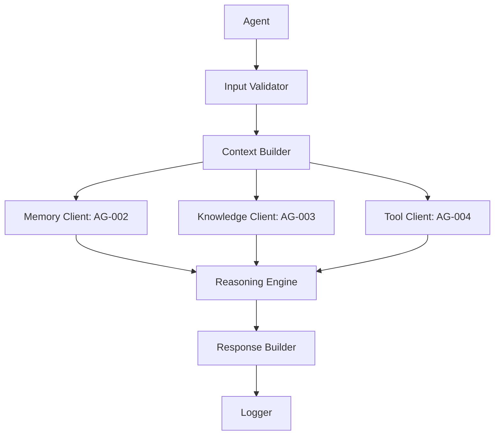
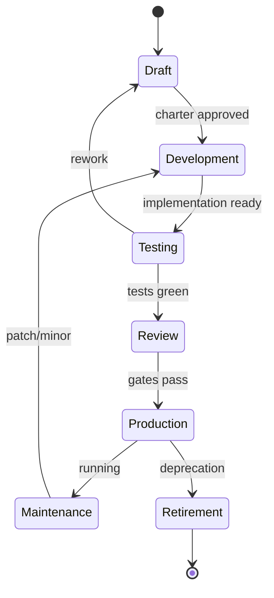

# Freelancify AI — Agent Development Kit (ADK) v1.0

**Standard:** Agent Development Kit (ADK) · **Version:** 1.0.0 · **Status:** Official · **Priority:** Mandatory
**Owner:** FreelancifyHub Engineering · **Last updated:** 2026-08-02

> [!IMPORTANT]
> This is the official **engineering standard for developing every AI agent** in
> Freelancify AI. Every present and future agent **MUST** follow it. It is
> governed by, and must never contradict:
>
> - [`docs/freelancify-ai-blueprint-v1.0.md`](./freelancify-ai-blueprint-v1.0.md) — architecture (esp. §7, §19, §20, §21, §22, §23, §26)
> - [`docs/product-requirements-v1.md`](./product-requirements-v1.md) — functional spec (BR-AI-\*, BR-\*, privacy)
> - [`docs/agent-catalog-v1.md`](./agent-catalog-v1.md) — agent registry (IDs, lifecycle, naming, folders)
> - [`docs/master-orchestrator-specification-v1.md`](./master-orchestrator-specification-v1.md) — AG-001 contracts (§15)
> - [`docs/shared-memory-architecture-v1.md`](./shared-memory-architecture-v1.md) — AG-002 memory API (§15)
> - [`docs/knowledge-base-architecture-v1.md`](./knowledge-base-architecture-v1.md) — AG-003 knowledge API (§16)
> - [`docs/tool-registry-architecture-v1.md`](./tool-registry-architecture-v1.md) — AG-004 tool API (§13)
>
> No implementation code is included. Interfaces are **logical contracts only**.
> Validation against the seven source documents is reported in §Appendix A–D.

---

## Table of Contents

1. [Executive Summary](#1-executive-summary)
2. [ADK Philosophy](#2-adk-philosophy)
3. [Standard Agent Architecture](#3-standard-agent-architecture)
4. [Standard Folder Structure](#4-standard-folder-structure)
5. [Required Files](#5-required-files)
6. [Agent Manifest Specification](#6-agent-manifest-specification)
7. [Prompt Standards](#7-prompt-standards)
8. [Input Contracts](#8-input-contracts)
9. [Output Contracts](#9-output-contracts)
10. [Memory Integration](#10-memory-integration)
11. [Knowledge Integration](#11-knowledge-integration)
12. [Tool Integration](#12-tool-integration)
13. [Logging Standards](#13-logging-standards)
14. [Error Standards](#14-error-standards)
15. [Security Standards](#15-security-standards)
16. [Testing Standards](#16-testing-standards)
17. [Versioning](#17-versioning)
18. [Quality Gates](#18-quality-gates)
19. [Agent Lifecycle](#19-agent-lifecycle)
20. [Templates](#20-templates)
21. [Checklists](#21-checklists)
22. [Acceptance Criteria](#22-acceptance-criteria)
23. [Open Questions](#23-open-questions)
24. [Architecture Decision Records (ADR)](#24-architecture-decision-records-adr)
25. [Appendices](#25-appendices)

---

## 1. Executive Summary

### Purpose

Define the **Agent Development Kit (ADK)**: the single mandatory standard for
authoring, integrating, testing, versioning and running every AI agent. It
unifies the agent-side contracts exposed by the Master Orchestrator (AG-001),
Shared Memory (AG-002), Knowledge Base (AG-003) and Tool Registry (AG-004).

### Scope

**In scope:** ADK philosophy, agent container architecture, folder layout,
required files, manifest, prompt standards, input/output contracts, memory /
knowledge / tool integration, logging, errors, security, testing, versioning,
quality gates, lifecycle, templates and checklists.

**Out of scope:** implementation code; business logic (BR-AI-*); the inner
workings of AG-001/002/003/004 (their own specs); the runtime foundation
(`src/`, `architecture.md`).

### Business Value

- **Uniform quality** across all present (31) and future agent (catalog §1).
- **Safe integration** — one standard for talking to memory/knowledge/tools,
  so contract regressions are caught before production.
- **Deterministic, citable, auditable** agents aligned to blueprint §19/§20/§26.

### Responsibilities

| #   | Responsibility                                                       |
| --- | -------------------------------------------------------------------- |
| A1  | Mandate a single agent architecture and required-file set            |
| A2  | Define the agent manifest schema every agent publishes               |
| A3  | Standardise prompt, input, output, logging, error and security rules |
| A4  | Standardise memory/knowledge/tool client integration                 |
| A5  | Define testing, quality gates, versioning and records                |

### Non-Responsibilities

| Not responsible for                | Owner                           |
| ---------------------------------- | ------------------------------- |
| Agent business logic               | Team agents + humans            |
| Architecture of AG-001/002/003/004 | Their own specs                 |
| Runtime foundation (`src/`)        | architecture.md / blueprint §20 |
| Content of the Knowledge Base      | AG-003 (knowledge spec)         |

---

## 2. ADK Philosophy

### Design principles

| Principle                 | Meaning                                                                             |
| ------------------------- | ----------------------------------------------------------------------------------- |
| **Single responsibility** | One agent owns one capability; a small boundary (catalog §1; blueprint §7)          |
| **Least privilege**       | Only the tools, memory and knowledge the agent needs — default-deny (blueprint §17) |
| **Stateless by default**  | No runtime state; all persistent state via AG-002 (blueprint §7.4)                  |
| **Shared memory usage**   | Consolidate state in AG-002, never duplicate it in agents                           |
| **Fail closed**           | Missing input, retrieval under-confidence → degrade, never guess (BR-AI-4)          |

### SOLID principles

| Principle                 | Applied to agents                                               |
| ------------------------- | --------------------------------------------------------------- |
| **Single responsibility** | Each agent holds one capability (§2)                            |
| **Open/closed**           | Extend via new agents/tools, never rewrite existing             |
| **Interface segregation** | Agents depend on narrow client contracts (§10–§12)              |
| **Dependency injection**  | Memory/KB/tool clients are injected, not global                 |
| **Least privilege**       | Default-deny tool/memory/knowledge scope (blueprint §17)        |
| **Stateless by default**  | No runtime state; persist via AG-002 (blueprint §7.4)           |
| **Shared memory**         | State consolidated in AG-002, never duplicated                  |
| **Tool isolation**        | Tools called only through AG-004; never direct                  |
| **Observability**         | Every step logged, traced and metered (blueprint §23)           |
| **Securityfirst**         | Auth, scope, PII minimisation at every boundary                 |
| **Fail closed**           | Missing input / low confidence → degrade, never guess (BR-AI-4) |

---

## 3. Standard Agent Architecture



Every agent **MUST** flow: validate input → build context → fetch memory /
knowledge / tools → reason → build response → log. Each stage schema-validates;
failures fail closed (§14).

---

## 4. Standard Folder Structure

Per catalog §3/§4 and blueprint §22, agent artefacts are **team-scoped**:

```text
agents/
  core/ag-001-master-orchestrator/
  client/ag-101-project-description/
  freelancer/ag-201-proposal-writer/
  marketplace/ag-301-proposal-vetter/
  marketing/ag-401-search-optimizer/
  admin/ag-501-support-analyst/
```

Each agent directory contains:

| Path        | Purpose                          |
| ----------- | -------------------------------- |
| `docs/`     | Agent documentation and charter  |
| `prompts/`  | Prompt templates (see §7)        |
| `schemas/`  | Input/output JSON Schemas        |
| `tests/`    | Unit, contract and prompt tests  |
| `examples/` | Worked fixtures / golden answers |
| `config/`   | Agent-scoped configuration       |
| `README.md` | Entry point and quick start      |

> [!NOTE]
> `prompts/` directories mirror `agents/` (catalog §3:
> `prompts/<team>/<agent-id>/prompt.md`).

---

## 5. Required Files

| File               | Purpose                                       | Mandatory |
| ------------------ | --------------------------------------------- | --------- |
| `agent.md`         | Identity / charter (OpenClaw `agent.md`)      | Yes       |
| `manifest.json`    | Machine-readable agent definition (§6)        | Yes       |
| `config.json`      | Agent-scoped config (limits, auth)            | Yes       |
| `README.md`        | Purpose, contract, usage                      | Yes       |
| `prompt.md`        | System + user prompts (blueprint §19)         | Yes       |
| `system-prompt.md` | Role + guardrail composition                  | Yes       |
| `user-prompt.md`   | `{{variable}}` user template                  | Yes       |
| `tools.md`         | Allowed tools + usage                         | Yes       |
| `memory.md`        | Memory namespaces + keys                      | Yes       |
| `knowledge.md`     | Knowledge sources (KB-XXX) the agent may cite | Yes       |
| `tests.md`         | Test plan / suite description                 | Yes       |
| `changelog.md`     | Semver history                                | Yes       |

---

## 6. Agent Manifest Specification

```json
{
  "manifestVersion": "1.0",
  "agentId": "AG-101",
  "name": "Project Description",
  "version": "1.0.0",
  "owner": "Client Team",
  "status": "In Development",
  "category": "Client",
  "capabilities": ["draft.description"],
  "dependencies": ["AG-001", "AG-002", "AG-003", "AG-004"],
  "memory": { "read": ["client:101"], "write": [] },
  "knowledge": { "kbIds": ["KB-001", "KB-011"] },
  "tools": { "allow": ["TL-001"], "deny": ["TL-004"] },
  "permissions": { "scope": "default" },
  "limits": { "ratePerMin": 100 },
  "models": { "primary": "claude-sonnet", "fallback": "gpt-4o", "temp": 0.2 },
  "timeouts": { "defaultMs": 10000, "longMs": 60000 },
  "retries": { "max": 2 },
  "featureFlags": ["citation.enforced"]
}
```

| Field             | Required | Value                                              |
| ----------------- | -------- | -------------------------------------------------- |
| **Agent ID**      | Yes      | `AG-NNN`, stable forever (catalog §1)              |
| **Name**          | Yes      | PascalCase, human-readable (catalog §3)            |
| **Version**       | Yes      | Semver (§17)                                       |
| **Owner**         | Yes      | Team + individual owner                            |
| **Status**        | Yes      | Lifecycle stage (§19)                              |
| **Category**      | Yes      | Core/Client/Freelancer/Marketplace/Marketing/Admin |
| **Capabilities**  | Yes      | Stable capability IDs                              |
| **Dependencies**  | Yes      | AG-001/002/003/004 + services                      |
| **Memory**        | Yes      | Namespaces + read/write scope                      |
| **Knowledge**     | Yes      | KB sources (KB-XXX) + citation defaults            |
| **Tools**         | Yes      | Default-deny allow/deny list (blueprint §17)       |
| **Permissions**   | Yes      | Role/scope                                         |
| **Limits**        | Yes      | Rate limits (§16)                                  |
| **Models**        | Yes      | Primary, fallback, temperature (catalog §4)        |
| **Timeouts**      | Yes      | Per-operation budgets                              |
| **Retries**       | Yes      | Idempotency-aware                                  |
| **Feature flags** | Yes      | Toggleable switches                                |

The manifest is validated against `agent.md` and must always agree.

---

## 7. Prompt Standards

Prompts are code — versioned and tested (blueprint §19).

| Concern              | Standard                                                      |
| -------------------- | ------------------------------------------------------------- |
| **Structure**        | Role → Context → Task → Constraints → Output format (catalog) |
| **System prompt**    | System role + guardrails (per `system-prompt.md`)             |
| **User prompt**      | `{{variable}}` template, user data only (`user-prompt.md`)    |
| **Developer prompt** | Shared instructions composed into prompt                      |
| **Guardrails**       | Fail-closed instruction at the end (blueprint §19.4)          |
| **Output style**     | Plain language; JSON where deterministic (blueprint §19.3)    |
| **Tone**             | Consistent made from the tone guideline                       |
| **Safety**           | No secrets/PII; injection-resistant (blueprint §19.4)         |
| **Formatting**       | Markdown, one worked example per prompt (blueprint §19.5)     |
| **Variables**        | Named `{{variable}}`, no hardcoded content                    |
| **Templates**        | Reuse via templates (blueprint §19.5); kept in `prompts/`     |

Every prompt ends with "fail closed" instructions, e.g.: "If none of the KB
entries apply, say you need to check with our team."

---

## 8. Input Contracts

| Concern             | Standard                                                             |
| ------------------- | -------------------------------------------------------------------- |
| **Validation**      | Every input validated at the boundary (JSON Schema, blueprint §21.2) |
| **Schemas**         | One schema per input in `schemas/`, published + versioned            |
| **Required fields** | Reject with `422` if missing                                         |
| **Optional fields** | Defaults documented; never secrets/PII                               |
| **Errors**          | Problem-details: `{ code, message, details }` (blueprint §21.2)      |

---

## 9. Output Contracts

| Concern        | Standard                                                               |
| -------------- | ---------------------------------------------------------------------- |
| **Schema**     | Structured output JSON-schema-validated on return (blueprint §19.3)    |
| **Confidence** | Non-deterministic output carries a confidence score (orchestrator §15) |
| **Citations**  | Factual answers carry `KB-XXX` citations (BR-AI-4, §11)                |
| **Metadata**   | `trace_id`, latency, tool/memory usage                                 |
| **Errors**     | Normalised `{ code, message }`, never raw internals                    |
| **Warnings**   | Freshness flags e.g. "may be stale" from AG-003                        |

---

## 10. Memory Integration

Every agent talks to **AG-002** (memory spec §5):

- **Read:** `memory.get( namespace, key )` — namespace allow-list first.
- **Write:** `memory.set( key, value, owner, reason )` — audit mandatory.
- **Scope:** only the namespaces in the manifest (§6).
- **Cross-namespace:** rejected 100% without an allow-list entry.
- **Failure:** fetch fails → degrade and log; never fake state (memory spec §20).

---

## 11. Knowledge Integration

Every agent gets ground truth from **AG-003** (knowledge spec §16):

- **Retrieve:** `knowledge.retrieve( query, agentId, filters )` → cited snippets
  with `KB-XXX` + version.
- **Cite citations are mandatory** for factual answers (BR-AI-4).
- **Low confidence** → fail closed; answer "unable" instead (orchestrator §9).
- **Freshness** → surface `"may_be_stale"` warnings.
- **Permissions:** retrieval scope is read-only for agents (knowledge spec §12).

---

## 12. Tool Integration

Every agent reaches **AG-004** (tool spec §16):

- **Discover/Validate:** `tool.search( intent, agentId )` returns allowed tools.
- **Execute:** `tool.execute( toolId, args, agentId )` → handled result.
- **Default-deny:** only tools in the manifest allow-list (blueprint §17.3).
- **Money/identity:** require an approval gate (AG-004, BR-AI-3).
- **Deny / timeout:** `TOOL_DENIED` or `TOOL_TIMEOUT` with reason; no silent
  retry unless the tool is idempotent.

---

## 13. Logging Standards

| Concern             | Standard                                                |
| ------------------- | ------------------------------------------------------- |
| **Structured logs** | pino JSON: level, message, fields (blueprint §23)       |
| **Request ID**      | `request_id` per invocation                             |
| **Trace ID**        | `correlation / trace_id` propagated across agents (§23) |
| **Audit**           | Append-only, immutable and permission-scoped            |
| **PII**             | No raw PII/secrets in any log (blueprint §23-24)        |

---

## 14. Error Standards

| Category             | Behaviour                                         | Code      |
| -------------------- | ------------------------------------------------- | --------- |
| **Validation**       | Problem-details; retriable by caller              | `422`     |
| **Tool errors**      | `TOOL_*` surfaced; retry rules follow tool (edge) | `TOOL_*`  |
| **Memory errors**    | Degrade and log; never reuse stale data           | `MEM_*`   |
| **Knowledge errors** | Fail closed; ask human / no answer                | `KB_*`    |
| **Timeouts**         | Per-contract deadlines; bounded retries           | `TIMEOUT` |
| **Fallback**         | Definable fallback model or hand-off (BR-AI-2/3)  | —         |

---

## 15. Security Standards

| Concern               | Standard                                              |
| --------------------- | ----------------------------------------------------- |
| **Authentication**    | Service-level token / mTLS (blueprint §21.2)          |
| **Authorization**     | Role scope per manifest; default-deny                 |
| **PII**               | Never stored/logged/exposed by agents (blueprint §24) |
| **Secrets**           | Environment / TL-014 only, never in code or prompt    |
| **Prompt injection**  | User input stays as data; guardrail checks            |
| **Output validation** | Schema + citation validation on all outputs           |

Fail-closed and least-privilege apply everywhere (§15, §10–§12).

---

## 16. Testing Standards

| Layer            | Scope                                                      |
| ---------------- | ---------------------------------------------------------- |
| **Unit**         | Schema, prompt rendering, token validations, failure paths |
| **Integration**  | Agent ↔ AG-002/003/004 over mock gates                     |
| **Contract**     | Agent config + JSON Schema; APIs and tools                 |
| **Prompt tests** | Template render, output schema, injection resistance       |
| **Regression**   | Golden answers + scenarios                                 |
| **Performance**  | p95 latency budgets under load                             |
| **Security**     | Injection, data scopes, path traversal                     |
| **Acceptance**   | §22 criteria                                               |

No live external calls in CI (blueprint §26.4). Tests are run gate (§18).

---

## 17. Versioning

Semantic (blueprint §19.2, §17):

| Concern         | Rule                                                    |
| --------------- | ------------------------------------------------------- |
| **Semver**      | `MAJOR.MINOR.PATCH` in manifest.json + changelog.md     |
| **Breaking**    | Backward-incompatible contract → MAJOR bump + migration |
| **Migration**   | Migrations are documented; old versions deprecated      |
| **Deprecation** | Notice → grace period → retire via lifecycle (§19)      |

---

## 18. Quality Gates

| Gate          | Requirement                                       |
| ------------- | ------------------------------------------------- |
| **Lint**      | `npm run lint` clean                              |
| **Typecheck** | `npm run typecheck` green                         |
| **Tests**     | `npm test` green                                  |
| **Coverage**  | threshold enforced (blueprint §26.4)              |
| Docs + Schema | manifest + prompts + schemas well-formed; in sync |
| **Security**  | dependency + secret scan clean                    |

---

## 19. Agent Lifecycle



| Stage           | Entry              | Exit                      |
| --------------- | ------------------ | ------------------------- |
| **Draft**       | Idea, owner        | Charter reviewed          |
| **Development** | Approved charter   | Contract + prompt tests   |
| **Testing**     | Implementation     | Quality gates (§18) green |
| **Review**      | Gates green        | Human review; done        |
| **Production**  | Review pass        | Live, monitored           |
| **Maintenance** | Production         | Health reports + patches  |
| **Retirement**  | Deprecation notice | Removed, logs archived    |

---

## 20. Templates

Documentation-only logical templates for new agents (blueprint §19).
These are one per new agent, prompt, manifest, README, test plan.

### New Agent

```text
agents/<team>/<agent-id>/
  agent.md          # achievements, role, boundary
  manifest.json     # (§6)
  config.json
  prompts/{system,user,prompt}.md
  schemas/input.json, output.json
  tests/
  README.md
  changelog.md
```

### Prompt

```markdown
## Role

You are {ROLE} for FreelancifyHub.

## Context

{context} # pulled from memory/KB

## Task

{task}

## Constraints

- MUST {rule}
- MUST NOT {prohibit}
- If KB entry does not apply, say:
  "I need to check with our team." (fail-closed)
```

### Manifest

See §6 `manifest.json` template.

### README

```markdown
# {agentId} — {Name}

- Purpose
- Contract (inputs/outputs)
- Required context
- Integrations (AG-002/003/004)
- Status, version, owner
```

### Test Plan

| Layer    | Case               | Expected                |
| -------- | ------------------ | ----------------------- |
| Unit     | render prompt      | schema + determinism    |
| Prompt   | missing KB fixture | fails closed            |
| Contract | tool/memory call   | schema-validated result |
| Security | injection payload  | rejected                |

---

## 21. Checklists

### Agent Creation Checklist

- [ ] Unique `AG-NNN` + name reserved in catalog
- [ ] `agent.md` + manifest.json valid
- [ ] All 12 required files present (§5)
- [ ] Prompt ends with fail-closed instruction
- [ ] Memory/knowledge/tools scopes declared, least-privilege

### Review Checklist

- [ ] Input/output schemas validated
- [ ] No secrets/PII in code, prompts, logs
- [ ] All tools approval-enabled
- [ ] Contract tests written
- [ ] Documentation current

### Release Checklist

- [ ] Quality gates green (§18)
- [ ] changelog.md updated
- [ ] Approval (human gate) for money
- [ ] Deprecated endpoints reviewed
- [ ] Logs/metrics migration

---

## 22. Acceptance Criteria

| #        | Criterion                                                            |
| -------- | -------------------------------------------------------------------- |
| AC-ADK-1 | Every agent has a valid manifest + all required files (100%).        |
| AC-ADK-2 | All agents integrate memory/knowledge/tools via AG-002/003/004 only. |
| AC-ADK-3 | Uncited factual answers are blocked (BR-AI-4) — 100%.                |
| AC-ADK-4 | No secret/PII/log leak found by scan.                                |
| AC-ADK-5 | All prompt suites deterministic; fail-closed verified.               |
| AC-ADK-6 | Quality gates pass before any production release.                    |
| AC-ADK-7 | Semver + changelog updated for every release.                        |
| AC-ADK-8 | Every release has tests at contract level.                           |

---

## 23. Open Questions

| #        | Question                                      | Owner    | Blocking |
| -------- | --------------------------------------------- | -------- | -------- |
| OQ-ADK-1 | Extraction of a shared guardrail library      | Platform | No       |
| OQ-ADK-2 | Auto-generated manifest from code             | Platform | No       |
| OQ-ADK-3 | Agent test-fixture data sets for prompt tests | QA       | No       |
| OQ-ADK-4 | Multi-provider routing bootstrap              | Platform | No       |

---

## 24. Architecture Decision Records (ADR)

| ID          | Decision                     | Rationale                    | Cross-ref                |
| ----------- | ---------------------------- | ---------------------------- | ------------------------ |
| ADR-ADK-001 | Single responsibility agents | Maintainable scope           | Blueprint §7, catalog §1 |
| ADR-ADK-002 | RAG-style prompting          | One prompt pattern per agent | Blueprint §19            |
| ADR-ADK-003 | AG-002 for all state         | Stateless, audited           | memory §5, blueprint §15 |
| ADR-ADK-004 | AG-003 for ground truth      | Grounded + citable           | knowledge §9, BR-AI-4    |
| ADR-ADK-005 | Tools via AG-004 only        | Default-deny safety          | tool spec §17            |
| ADR-ADK-006 | pino structured logs         | Consistency + truth          | blueprint §23            |
| ADR-ADK-007 | Test as code (golden)        | Regression safety            | blueprint §26, §19       |
| ADR-ADK-008 | Fail-closed by default       | No hallucination/leak        | BR-AI-4, §10-15          |
| ADR-ADK-009 | Semver via changelog         | Traceability                 | §17                      |
| ADR-ADK-010 | Templates for new agents     | Standard onboarding          | §20                      |
| ADR-ADK-011 | JSON manifest as source      | Single source of truth       | §5, §6                   |
| ADR-ADK-012 | Extensible manifest/agents   | Additive future agents       | §6, catalog §27          |

---

## 25. Appendices

### Appendix A — Consistency Report

| Source                         | Check                                             | Result        |
| ------------------------------ | ------------------------------------------------- | ------------- |
| Blueprint §7/19/20/21/22/23/26 | Architecture, prompts, code, folders, logs, tests | ✅ Consistent |
| Blueprint §17                  | Minimal tool access, default-deny                 | ✅ Consistent |
| Catalog §4                     | Naming + team-scoped folders                      | ✅ Consistent |
| Catalog AG-003                 | Manifest model                                    | ✅ Consistent |
| Orchestrator §15               | Output confidence / trace_id                      | ✅ Consistent |
| Memory spec §5/8               | Namespaces, degrade                               | ✅ Consistent |
| Tool spec §13/16               | Allow-list, approval gates, discovery             | ✅ Consistent |
| Knowledge spec §9/16           | Retrieval, citations, fail-close                  | ✅ Consistent |

### Appendix B — Assumptions Report

| #        | Assumption                                                         | Rationale                        |
| -------- | ------------------------------------------------------------------ | -------------------------------- |
| ADK-AS-1 | Every future agent uses the same required-file set as the current  | Standard contract applies to all |
| ADK-AS-2 | System prompts follow rule files rather than header templates      | Keep consistency with catalog §1 |
| ADK-AS-3 | Manifest `featureFlags` defaults to `citation.enforced` for all    | Knowledge spec §9 / BR-AI-4      |
| ADK-AS-4 | A single fallback model path is used before human hand-off         | Matches catalog recursion        |
| ADK-AS-5 | Incidental discovery of direct tool calls is prohibited by default | Matches tool spec §17            |

### Appendix C — Missing Decisions Report

| ID       | Missing decision                           | Resolve at          | Impact  |
| -------- | ------------------------------------------ | ------------------- | ------- |
| ADK-MD-1 | UUID format for request/correlation IDs    | Platform (OQ-ADK-1) | Logging |
| ADK-MD-2 | Golden-answer fixtures share a global repo | QA (OQ-ADK-3)       | Tests   |
| ADK-MD-3 | Default severity for guard/citation        | Platform            | Output  |

### Appendix D — Amendment Record

| Version | Date       | Change                               |
| ------- | ---------- | ------------------------------------ |
| 1.0     | 2026-08-02 | Initial release of the ADK standard. |
