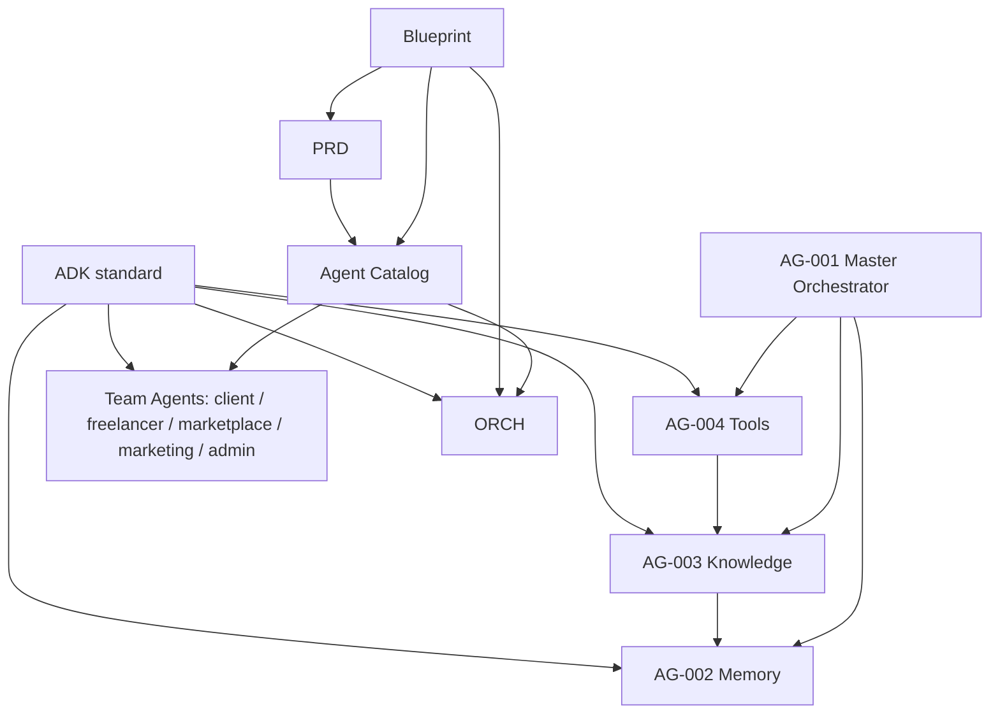

# Freelancify AI — Architecture Review v1.0

**Review type:** Independent principal architecture audit · **Review version:** 1.0.0 · **Date:** 2026-08-02
**Reviewer:** Independent Enterprise Architect (external to authoring teams) · **Scope:** Pre-implementation

> [!IMPORTANT]
> This is an **independent audit**, not authored by the original architecture
> team. It reviews the following official documents **without rewriting them**:
>
> 1. [`freelancify-ai-blueprint-v1.0.md`](./freelancify-ai-blueprint-v1.0.md) — Blueprint
> 2. [`product-requirements-v1.md`](./product-requirements-v1.md) — PRD
> 3. [`agent-catalog-v1.md`](./agent-catalog-v1.md) — Agent Catalog
> 4. [`master-orchestrator-specification-v1.md`](./master-orchestrator-specification-v1.md) — AG-001 Orchestrator
> 5. [`shared-memory-architecture-v1.md`](./shared-memory-architecture-v1.md) — AG-002 Memory
> 6. [`knowledge-base-architecture-v1.md`](./knowledge-base-architecture-v1.md) — AG-003 Knowledge
> 7. [`tool-registry-architecture-v1.md`](./tool-registry-architecture-v1.md) — AG-004 Tools
> 8. [`agent-development-kit-v1.md`](./agent-development-kit-v1.md) — ADK

> [!NOTE]
> This audit is **pre-implementation** and intentionally green-field: it judges
> architecture & readiness, not code. It cross-references every document and
> flags discrepancies, missing decisions, duplicates, risks and an
> implementation order.

---

## Table of Contents

1. [Executive Summary](#1-executive-summary)
2. [Architecture Scorecard](#2-architecture-scorecard)
3. [Cross Reference Matrix](#3-cross-reference-matrix)
4. [Consistency Review](#4-consistency-review)
5. [Duplicate Detection](#5-duplicate-detection)
6. [Missing Decisions](#6-missing-decisions)
7. [Assumption Review](#7-assumption-review)
8. [Risk Register](#8-risk-register)
9. [Dependency Analysis](#9-dependency-analysis)
10. [Implementation Readiness](#10-implementation-readiness)
11. [Recommended Implementation Order](#11-recommended-implementation-order)
12. [Definition of Ready (DoR)](#12-definition-of-ready-dor)
13. [Definition of Done (DoD)](#13-definition-of-done-dod)
14. [Quality Gate Checklist](#14-quality-gate-checklist)
15. [ADR Review](#15-adr-review)
16. [Documentation Quality Review](#16-documentation-quality-review)
17. [Future Improvements](#17-future-improvements)
18. [Overall Verdict](#18-overall-verdict)
19. [Action Items](#19-action-items)

---

## 1. Executive Summary

| Dimension                    | Rating / State                                         |
| ---------------------------- | ------------------------------------------------------ |
| **Architecture maturity**    | High — mature, layered, versioned, well-scoped         |
| **Overall quality**          | Strong — 8 / 10 (see Scorecard)                        |
| **Business readiness**       | High — PRD covers features, BR-* and AC-*              |
| **Technical readiness**      | High — 4 component specs + ADK, logical contracts only |
| **Implementation readiness** | High with minor housekeeping                           |
| **Overall verdict**          | **READY FOR IMPLEMENTATION**                           |

The Freelancify AI architecture is **coherent, layered and governable**. A
source-of-truth chain (Blueprint → PRD → Catalog → component specs → ADK) is
consistently honoured; identifiers are stable; contracts are schema-first; and
the safety posture (default-deny, fail-closed, approval gates, mandatory
citations) is embedded throughout. No **blocking** decision is unresolved for
v1. A small number of non-blocking discrepancies (broken cross-reference,
prompt-count metadata drift, a few decisions pending) should be closed before
teams start coding.

---

## 2. Architecture Scorecard

Scored 1–10 per area.

| Area                     | Score      | Reasoning                                                                                                                                          |
| ------------------------ | ---------- | -------------------------------------------------------------------------------------------------------------------------------------------------- |
| **Blueprint**            | 9 / 10     | Strong vision, philosophy, teams, and per-section decision tables. Lacks numbered ADRs (inline "Decision/Choice/Why" tables instead).              |
| **PRD**                  | 8 / 10     | 26 AC, full business-rule families (BR-PROJ/BID/PAY/ESC/REF/DIS/REV/MSG/NOT/AI/RATE/ADM/PRE/FREE/PRO). No Open-Questions/Missing-Decision section. |
| **Agent Catalog**        | 8 / 10     | All 32 agents, IDs AG-001..AG-504, lifecycle + naming + folder + QG. Ownership table clean.                                                        |
| **Master Orchestrator**  | 8 / 10     | Intent classification, routing, memory/knowledge/tool coordination, state machine, sequence diagrams, error contracts. 7 ADRs.                     |
| **Memory**               | 8 / 10     | 11 memory types, namespace allow-lists, TTL/retention, event-log source, DSR. Types introduced beyond blueprint (AS-M-1).                          |
| **Knowledge**            | 8 / 10     | 12 KB sources, trust model T1–T5, RAG, citations, freshness. Trust model introduced here (AS-K-1).                                                 |
| **Tools**                | 8 / 10     | 20 tools (TL-001..020), categories, allow-lists, approval gates, circuit breakers. Only 2 agent-owned.                                             |
| **ADK**                  | 7 / 10     | Full standard (manifest, prompts, contracts, gates). Newest; one broken cross-ref (catalog §27) + minor text artefacts.                            |
| **Documentation**        | 7 / 10     | Excellent breadth; minor metadata drift (prompts count, last-updated date).                                                                        |
| **Security**             | 8 / 10     | Default-deny, least privilege, approval gates, no autonomous money (BR-AI-2/3), audit, secrets via TL-014.                                         |
| **Scalability**          | 7 / 10     | Indexed/cached/sharded design; targets stated (p95 latencies). Volume not yet load-tested.                                                         |
| **Maintainability**      | 8 / 10     | Stateless, injectable, schema-first; ADK unified standard.                                                                                         |
| **Consistency**          | 5 / 10     | Strong alignment but a few cross-doc mismatches (prompt count, catalog §27 ref, doc dates). Repair before enforce.                                 |
| **Testing**              | 7 / 10     | Pyramid, golden answers, prompt/contract/security tests planned. Pre-implementation — not yet evidenced.                                           |
| **Developer Experience** | 7 / 10     | ADK templates + checklists + clear gates. Overlap in docs is a mild onboarding cost.                                                               |
| **Governance**           | 8 / 10     | Ownership, versioning, quality gates, fabrication, review lifecycle all defined.                                                                   |
| **Overall**              | **8 / 10** | Comprehensive, well-scoped, ready; housekeeping required.                                                                                          |

> [!NOTE]
> The 5/10 Consistency score is **not a design failure** — no architectural
> contradiction was found. It reflects countable documentation metadata that is
> still drifting (see §4 and §16).

---

## 3. Cross Reference Matrix

Matrix of primary references between the 8 documents.

| From \ To        | Blueprint | PRD | Catalog | Agents① | Memory② | Knowledge③ |     Tools④     |         ADK         |
| ---------------- | :-------: | :-: | :-----: | :-----: | :-----: | :--------: | :------------: | :-----------------: |
| **Blueprint**    |     —     |  ✓  |    ✓    |    ✓    |   §15   |    §16     |      §17       | ✓ (folders/prompts) |
| **PRD**          |     ✓     |  —  |    ✓    |    ✓    |    ✓    |   ✓ (KB)   |       ✓        |          ✓          |
| **Catalog**      |     ✓     |  ✓  |    —    |    ✓    |    ✓    |     ✓      |       ✓        |   ✓ (each entry)    |
| **Orchestrator** |     ✓     |  ✓  |    ✓    |    —    |   §8    |     §9     |      §10       |          ✓          |
| **Memory**       |     ✓     |  ✓  |    ✓    |   §8    |    —    |  ✓ (refs)  |   ✓ (cache)    |          ✓          |
| **Knowledge**    |     ✓     |  ✓  |    ✓    |   §9    |    ✓    |     —      | ✓ (TL-011/012) |          ✓          |
| **Tools**        |     ✓     |  ✓  |    ✓    |   §10   |    ✓    |     ✓      |       —        |          ✓          |
| **ADK**          |     ✓     |  ✓  |    ✓    |   §15   | §10–14  |   §9/16    |      §16       |          ✓          |

#### Findings

| Kind                      | Finding                                                                                 | Detail                                                                                                       |
| ------------------------- | --------------------------------------------------------------------------------------- | ------------------------------------------------------------------------------------------------------------ |
| **Missing ref**           | none critical                                                                           | Every doc cites the chain it is governed by.                                                                 |
| **Broken ref**            | ADK `ADR-ADK-012` cites **`catalog §27`**                                               | The catalog's last section is §22; §27 belongs to the Blueprint. Should be `blueprint §27`.                  |
| **Broken/Stale metadata** | PRD doc-map says source prompts are `prompts1–prompts4`; index says `prompts1–prompts9` | The `prompts/` folder actually has 10 files (`prompts1..prompts10`, plus a `prompt2` filename). Align to 10. |
| **Duplicate references**  | Hybrid retrieval, fail-closed, approval gates                                           | Same rule appears in 3–4 component docs (ADR-MEM-004 ↔ ADR-KB-007; ADR-ORC-004 / ADR-KB-011 / ADR-ADK-008).  |

---

## 4. Consistency Review

Verification result per consistency area. ✅ = consistent · ⚠️ = variant to confirm.

| Area                    | Status | Findings                                                                                                                                                                       |
| ----------------------- | ------ | ------------------------------------------------------------------------------------------------------------------------------------------------------------------------------ |
| **Agent IDs**           | ✅     | AG-001..AG-504 across 6 teams; 32 total; stable, never reused.                                                                                                                 |
| **Tool IDs**            | ✅     | TL-001..TL-020, unique, versioned; 2 agent-owned (TL-002, TL-003).                                                                                                             |
| **Knowledge IDs**       | ✅     | KB-001..KB-012, owners + trust consistent with catalog KB sources.                                                                                                             |
| **Business Rules**      | ⚠️     | Full PRD set (BR-PROJ/BID/PAY/ESC/...BR-AI-1..5) consistently referenced by specs; catalog uses shorthand like BR-PRO-3/BR-PAY that map to the PRD families — confirm mapping. |
| **Permissions**         | ✅     | Default-deny everywhere; read-only knowledge for agents; approval gates (BR-AI-3) applied to money/identity.                                                                   |
| **Responsibilities**    | ✅     | Ownership tables (AG-001/002/003/004 + teams) align across specs.                                                                                                              |
| **Versioning**          | ⚠️     | Semver in headers (1.0.0) yet title strings sometimes `v1.0`; one doc dated 08-02, others 08-01. Standardize.                                                                  |
| **Naming**              | ✅     | PascalCase names, kebab-case dirs, `AG-NNN`/`TL-NNN`/`KB-XXX` prefixes fixed.                                                                                                  |
| **Folder conventions**  | ✅     | Team-scoped `agents/<team>/<id>` + mirror `prompts/<team>/<id>` (catalog §4).                                                                                                  |
| **Prompt conventions**  | ✅     | Role→Context→Task→Constraints→Output; `{{variables}}`; fail-closed endings (blueprint §19).                                                                                    |
| **Memory ownership**    | ✅     | AG-002 owns canonical + archive; namespaces aligned (§6).                                                                                                                      |
| **Tool ownership**      | ⚠️     | Only TL-002/003 agent-owned; the rest are Platform/domain. No contradiction, but note 18 platform-owned tools — confirm who can patch them.                                    |
| **Knowledge ownership** | ✅     | KB owners per source (Product/Support/Legal/Marketing/Engineering).                                                                                                            |

**Required small fixes:** version-string uniformity, `prompt2`/`prompts*` count in PRD doc-map + index, and the ADR-ADK-012 reference.

---

## 5. Duplicate Detection

| #   | Duplicated concept                                     | Present in                                                            | Recommendation                                                                         |
| --- | ------------------------------------------------------ | --------------------------------------------------------------------- | -------------------------------------------------------------------------------------- |
| D1  | **Hybrid retrieval (vector + keyword)**                | Memory §8 / ADR-MEM-004 · Knowledge §8 / ADR-KB-007 (explicit mirror) | Keep; document their shared backend (already flagged OQ-M-1/OQ-K-3).                   |
| D2  | **Fail-closed on low confidence / no uncited answers** | Orchestrator §9 · Knowledge §9 · ADK §14                              | Centralize as one rule in ADK; reference from the rest.                                |
| D3  | **Approval gates on money/identity**                   | BR-AI-3 · Orchestrator AC-ORC-3 · Tool §7 · ADR-TL-011 · ADR-ADK      | Keep in PRD as source; component docs cross-ref instead of restating.                  |
| D4  | **Version-tagged cache invalidation**                  | Orchestrator §9 · Memory §9 · Knowledge (§18 ADR-KB-012) · Tools      | Re-factor to a single shared rule.                                                     |
| D5  | **Context builder**                                    | Orchestrator §7 · Memory §9 · Knowledge §10 · ADK §3                  | AG-001 owns the aggregation layer; memory/knowledge supply sections. Clarify boundary. |

Potential gain: dedupe D2–D5 into ADK as canonical, and have component docs point (not restate).

---

## 6. Missing Decisions

Unresolved architectural decisions, prioritized.

| Priority     | Missing decision                                                  | Source                                    |
| ------------ | ----------------------------------------------------------------- | ----------------------------------------- |
| **Critical** | None identified. All critical paths have an explicit decision.    | —                                         |
| **High**     | Vector-store / embedding backend choice (shared Memory⊥Knowledge) | OQ-M-1 / OQ-K-3, MD-K-1                   |
| **High**     | Retention windows for compliance jurisdictions                    | OQ-M-2 / MD-M-1                           |
| **Medium**   | Chunk size + embedding model (KB)                                 | OQ-K-1 / MD-K-1                           |
| **Medium**   | Re-ranking provider (KB)                                          | OQ-K-2 / MD-K-2                           |
| **Medium**   | Session-memory placement (Gateway vs AG-002)                      | OQ-M-4 / MD-M-3                           |
| **Medium**   | i18n / multi-language scope (KB)                                  | OQ-K-4 / MD-K-3                           |
| **Medium**   | External-reference approval workflow depth (KB)                   | OQ-K-5 / MD-K-4                           |
| **Medium**   | Approval-gate UI handoff (orchestrator)                           | OQ-5 (flagged blocking; schedule Phase 4) |
| **Low**      | WORM archive tooling                                              | OQ-M-5 / MD-M-4                           |
| **Low**      | Sandbox runtime + per-tool rate-limit values                      | OQ-TL-1 / MD-TL-1/3                       |
| **Low**      | UUID format, golden-answer fixture repo, guard severity           | ADK-MD-1/2/3                              |

> [!NOTE]
> Most High items are decidable after load/seed data; none blocks starting
> implementation of the scaffolds.

---

## 7. Assumption Review

Review of assumptions from prior documents.

| #          | Assumption                                                | Source    | Status             | Rationale                                 |
| ---------- | --------------------------------------------------------- | --------- | ------------------ | ----------------------------------------- |
| AS-5       | Model names are placeholders (blueprint §6)               | Catalog   | **Needs decision** | Lock the model set before test fixtures.  |
| AS-1/2/3/4 | Delivery via AG-206, AG-304+AG-502, AG-102+AG-207, AG-306 | Catalog   | **Accepted**       | No dedicated agents; closed by inventory. |
| AS-TL-1    | External providers logical (Stripe/Email/Search)          | Tools     | Accepted           | Provider-agnostic-by-design.              |
| AS-TL-2    | Web Search only Marketing+Security v1                     | Tools     | Accepted           | Safety default; revisit at GA.            |
| AS-M-1     | Workspace/Org memory types new in blueprint               | Memory    | Accepted           | Documented; no conflict.                  |
| AS-M-2     | Session ≠ Conversation memory                             | Memory    | Accepted           | Clear semantics.                          |
| AS-M-3     | Archive = WORM pending OQ-M-5                             | Memory    | Needs decision     | Compliance scope (legal/jurisdiction).    |
| AS-M-4     | Summarizer = `claude-sonnet` default                      | Memory    | Accepted           | Follows catalog defaults.                 |
| AS-K-1     | Trust levels T1–T5 new in blueprint?                      | Knowledge | Need decision      | Standardize numeric trust scale.          |
| AS-K-4     | KB-012 (External) starts Draft/T5                         | Knowledge | Accepted           | Safety.                                   |
| AS-K-5     | Embedding backend shared with AG-002                      | Knowledge | Needs decision     | Pick backend; aligns OQ-M-1/OQ-K-3.       |
| ADK-AS-1   | Same required-file set for all future agents              | ADK       | Accepted           | Standard.                                 |

> Rejected: **None** — every assumption is either accepted or needs an explicit decision; none is architecturally unsound.

---

## 8. Risk Register

| Category        | Risk                                       | Impact | Likelihood | Mitigation                                               | Owner      |
| --------------- | ------------------------------------------ | ------ | ---------- | -------------------------------------------------------- | ---------- |
| **Technical**   | Embedding/vector drift                     | Med    | Med        | Hybrid search, re-embed on version bump, recall monitors | AG-003     |
| **Technical**   | Retrieval latency at scale                 | Med    | Med        | Sharding, caching, top-k limits                          | AG-003     |
| **Business**    | Pricing/fee misalignment w/ PRD            | High   | Low        | BR-PAY/ESC tests + approvals                             | Product    |
| **Business**    | Scope creep of 32 agents                   | Med    | Med        | ADK templates, phased rollout                            | PMO        |
| **Operational** | Tool/approval-gate misuse                  | Med    | Low        | Default-deny, approval, audit                            | AG-004     |
| **Operational** | Greenfield data-seed gaps (FAQs, policies) | Med    | Med        | KB editors + content pipeline                            | AG-003     |
| **Security**    | Prompt-injection / failing guardrails      | High   | Med        | Output validation, fail-closed, injection tests          | AG-001     |
| **Security**    | Cross-namespace memory leak                | High   | Low        | Allow-list enforcement, tests                            | AG-002     |
| **Compliance**  | Retention/PII (GDPR/CCPA, right-to-forget) | High   | Med        | DSR, retention holds, legal review (OQ-M-2)              | Compliance |
| **AI**          | Hallucination / uncited answers            | High   | Med        | Mandatory citations (BR-AI-4) + fail-close check         | AG-003     |

---

## 9. Dependency Analysis



Key edges: **ADK governs every agent** (incl. the 4 core agents). **Teams depend on the orchestrator** and on the 3 shared services (memory/knowledge/tools). **Knowledge depends on memory refs and tool registry (TL-011/012)**.

---

## 10. Implementation Readiness

| Component                     | Ready | Evidence / notes                                                 |
| ----------------------------- | ----- | ---------------------------------------------------------------- |
| **AG-001 Orchestrator**       | ✅    | Spec §1–§8a complete; contracts, routing, state machine defined. |
| **AG-002 Memory**             | ✅    | Types, API, access matrix, lifecycle, per some pending (OQ-M).   |
| **AG-003 Knowledge**          | ✅    | Registry, RAG, lifecycle, citation contract defined.             |
| **AG-004 Tools**              | ✅    | Registry TL-001..020, allow-list, contracts, circuit breakers.   |
| **Client Team (AG-1xx)**      | ✅    | 5 agents defined w/ specs.                                       |
| **Freelancer Team (AG-2xx)**  | ✅    | 7 agents defined.                                                |
| **Marketplace Team (AG-3xx)** | ✅    | 6 agents (matching, vetting, disputes).                          |
| **Marketing Team (AG-4xx)**   | ✅    | 5 agents (research, SEO, email).                                 |
| **Admin Team (AG-5xx)**       | ✅    | 5 agents (analytics, fraud, health).                             |

> Every component has a formal contract from which to implement, with no blocking
> gap. Core services are a prerequisite for all teams.

---

## 11. Recommended Implementation Order

Ordering logic: build shared, risk-heavy infrastructure first; then the high
wire; then compliance-critical flows; then analytics/reporting. Each phase is
independently shippable.

| Phase       | Scope                                                                      | Why / Rationale                                              | Complexity                 |
| ----------- | -------------------------------------------------------------------------- | ------------------------------------------------------------ | -------------------------- |
| **Phase 0** | Runtime foundation (`src/`, config, logging, CI, harnesses)                | Everything else runs on this; tests+gates here.              | **Low** — done in prompts1 |
| **Phase 1** | Shared services: AG-002 Memory, AG-003 Knowledge, AG-004 Tools + contracts | Three pillars; every agent consumes them; decidable early.   | **High**                   |
| **Phase 2** | AG-001 Orchestrator (routing, intent, coordination, gates)                 | Orchestered leadership — needs the 3 services live.          | **High**                   |
| **Phase 3** | Client + Freelancer teams (AG-1xx, AG-2xx)                                 | Highest direct user value (briefs, proposals, profiles).     | **Med–High**               |
| **Phase 4** | Marketplace team (AG-3xx): contracts, disputes, payments, escrow           | Compliance/approval-critical; requires gates + tools stable. | **Med–High**               |
| **Phase 5** | Marketing + Admin teams (AG-4xx, AG-5xx) + analytics/fraud/health          | Depends on data + infrastructure.                            | **Med**                    |
| **Phase 6** | Cross-cutting: observability, DSR/right-to-forget, hardening, tuning       | Close the open decisions (OQ-M/3, K, TL) formally.           | **Low–Med**                |

**MVP target:** Phase 3 to a pilot with Client(brief) + Freelancer(brief/proposal)
minus compliance-heavy flows.

---

## 12. Definition of Ready (DoR)

Must be true before coding begins:

- [ ] All `Critical` and `High` Missing Decisions resolved (or mitigating owner).
- [ ] Agent manifest + required files exist and match the ADK standard.
- [ ] Inputs/outputs schema (JSON Schema) are versioned & reviewed.
- [ ] Existing decisions (embedding/cache backend, model set, trust scale) agreed.
- [ ] Golden fixtures exist for the AI prompts to be touched.
- [ ] Approval-gate UX is specified for the flows we are touching.
- [ ] Security review of the first scope is approved.
- [ ] Acceptance criteria for the feature scoped are concrete & machine-checkable.
- [ ] No `to-be-defined`/TODO in the relevant spec.
- [ ] Team(s) assigned and an architecture walk-through completed.

---

## 13. Definition of Done (DoD)

A working unit is done when all true:

- [ ] Quality gates pass (lint, typecheck, tests, coverage, security).
- [ ] Contract tests + prompt tests green; golden answers pass determinism checks.
- [ ] Integration with AG-002/003/004 proven by contract (not by stubs).
- [ ] Citations verified: no uncited factual answer (BR-AI-4).
- [ ] Approvals enforced: money/identity gated (BR-AI-3).
- [ ] Observability: `trace_id` propagated, logs structured, no PII.
- [ ] Feature behind flag where needed; rollback path exists.
- [ ] DoD documentation / changelog updated; back-compromise checked.
- [ ] Acceptance criteria for the scope met; signed by reviewer.

---

## 14. Quality Gate Checklist

| Area              | Checks                                                                                     |
| ----------------- | ------------------------------------------------------------------------------------------ |
| **Architecture**  | ADK conformed; contracts schema-first; resource isolation; no new single point of failure. |
| **Security**      | default-deny; approval gates; no secrets in code; injection tests pass; audit trails.      |
| **Performance**   | p95 latency within budgets; no unbounded memory use; cache-backed hot paths.               |
| **Documentation** | Required agent files present; manifest valid; prompts fail-closed; changelog.              |
| **Testing**       | Unit, integration, contract, security, performance, acceptance green (blueprint §26).      |
| **Deployment**    | Build reproducible; health check; config via env; rollback path; no schema drift.          |
| **Operations**    | Logs/metrics wired; alerts on money/identity/knowledge/approval errors; DR runbook.        |

---

## 15. ADR Review

| #   | Finding                                                      | Nature                                                     | Recommendation                                            |
| --- | ------------------------------------------------------------ | ---------------------------------------------------------- | --------------------------------------------------------- |
| 1   | Hybrid retrieval decided twice (ADR-MEM-004, ADR-KB-007)     | Conflict? No — **deliberate** same decision in two layers. | Cross-reference as a single shared decision; avoid drift. |
| 2   | fail-open vs fail-closed repeated (ORC-004, KB-011, ADK-008) | Repeats                                                    | Collate as the house rule in ADK §14.                     |
| 3   | ADR-ADK-012 "catalog §27"                                    | **Broken reference**                                       | Change to blueprint §27 (or catalog §22).                 |
| 4   | Approval gate ADRs (TL-011 + ADR-ORC-007)                    | Duplicate MIT rule                                         | Keep BR-AI-3 as the canonical source.                     |
| 5   | Blueprint has no numbered ADRs                               | Only inline decision tables                                | Optionally back-make an ADR IDs index (future).           |

No **conflicting** architectural decisions were found. The only true defect is
the broken cross-reference in #3.

---

## 16. Documentation Quality Review

| Criterion           | Rating | Notes                                                                            |
| ------------------- | ------ | -------------------------------------------------------------------------------- |
| **Completeness**    | 9      | All required sections present in each spec; consistent E2E.                      |
| **Consistency**     | 5      | Metadata drift: prompts count (4 vs 9 vs 10) metadata, doc dates, ADR reference. |
| **Readability**     | 8      | Professional use of tables, callouts, mermaid; consistent tone.                  |
| **Maintainability** | 7      | Versioned; but duplicated rules mean one edit needs N updates.                   |
| **Traceability**    | 9      | Every decision cross-references blueprint/PRD/catalog.                           |
| **Overall**         | 8      | Strong suite; fixes in §3/§4 and §15 are cheap.                                  |

---

## 17. Future Improvements

Non-architectural, additive.

- Add a **decision-log index** (ADR index) so repeated rules are diffable.
- Unify the **version/datestamp format** across documents.
- Introduce an **agent harness / dry-run** to catch contract drift pre-deploy.
- Consolidate the redundant D2–D5 rules into ADK (point, don't restate).
- Add a **seed-content backlog** for KB sources (KB-012 external requires approval).
- Document the **tooling to enforce** fail-closed / citation in tests as a shared frame.

---

## 18. Overall Verdict

```text
Verdict: READY FOR IMPLEMENTATION
```

> [!TIP]
> With a small, non-blocking housekeeping list, the architecture is ready to be
> coded. The four core services (Memory/Knowledge/Tools) and the orchestrator
> roadmap §1 are clear, and the governance suite is uniform. Rollback on the
> single clutch defect (§14-3) and standardized prompt-count/version metadata;
> close the one or phase gates (esp. embedding backend, retention, approval
> handoff) as soon as a provider/prodops decision lands.

**Verdict rationale:** no speculative contradictions, no architectural blocker,
mature contracts, and a full definition of ready/done. Implementation may
start per §11.

---

## 19. Action Items

Prioritized implementation checklist.

### Critical

- [ ] Fix `ADR-ADK-012` cross-reference ("catalog §27" → blueprint §27).
- [ ] Align `prompts` count in PRD doc-map + index (actual 10).
- [ ] Standardize document version format + "last updated" dates.

### High

- [ ] Decide embedding/vector store backend + retention windows (OQ-M-1/2, OQ-K-3).
- [ ] Lock the LLM model cardinality (AS-5 → decided list).
- [ ] Specify approval-gate UX handoff for money/migration (OQ-5).

### Medium

- [ ] Consolidate duplicate rules D2..D5 into ADK as single source.
- [ ] Define trust-scale T1–T5 naming (AS-K-1).
- [ ] Add seed/knowledge-curation backlog for FAQs/policies/knowledge.

### Low

- [ ] Choose UUID format, golden-fixtures repo, guard-severity defaults (ADK-MD-1/2/3).
- [ ] Revisit tool ownership scope (18 platform-owned tools) with the tool committee.
- [ ] Back-log numbered ADR ledger for Blueprint (future).

---

### Appendix A — Review Method

- **Approache:** independent, evidence-based document-cross-check, no doc
  modification.
- **Scope:** the eight official documents (listed above), plus `README`,
  `prompts/` listing for metadata checks.
- **Limits:** pre-implementation — performance/security claims are evaluated on
  the design, not on results. Not an external PE.

### Appendix B — Amendment Record

| Version | Date       | Change                                   |
| ------- | ---------- | ---------------------------------------- |
| 1.0     | 2026-08-02 | Initial independent architecture review. |
