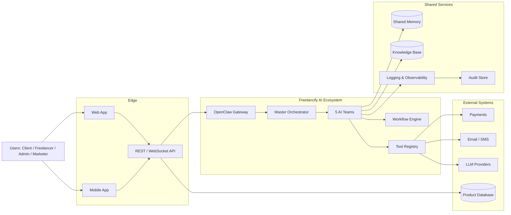
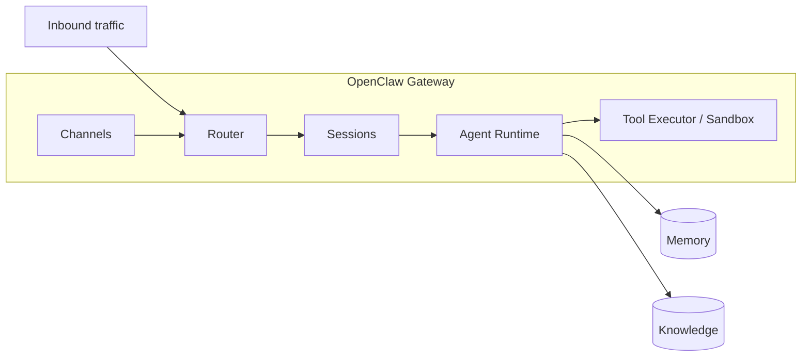
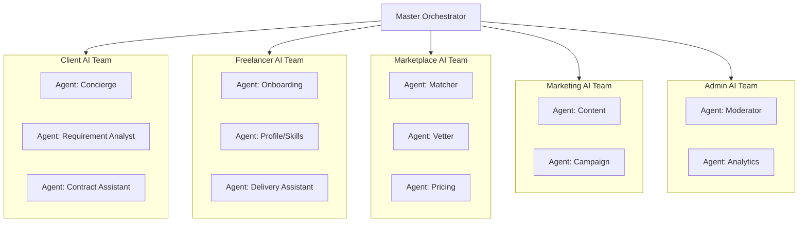
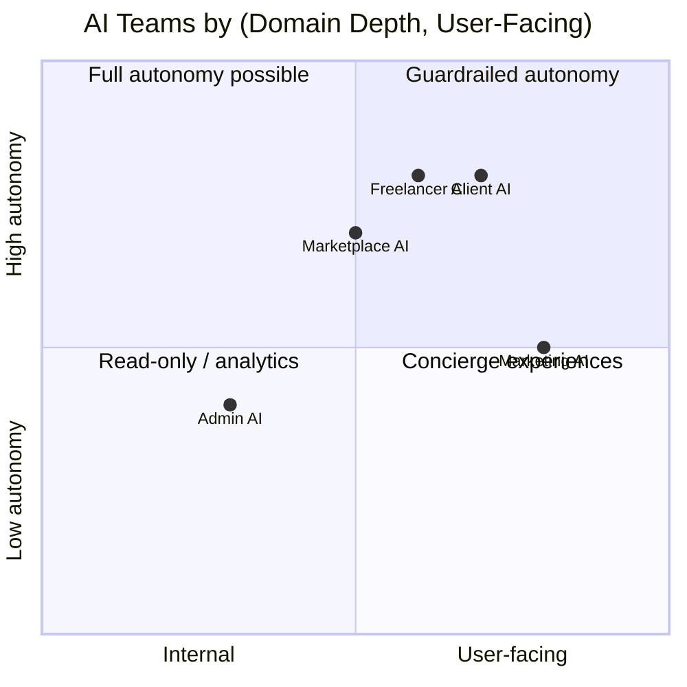
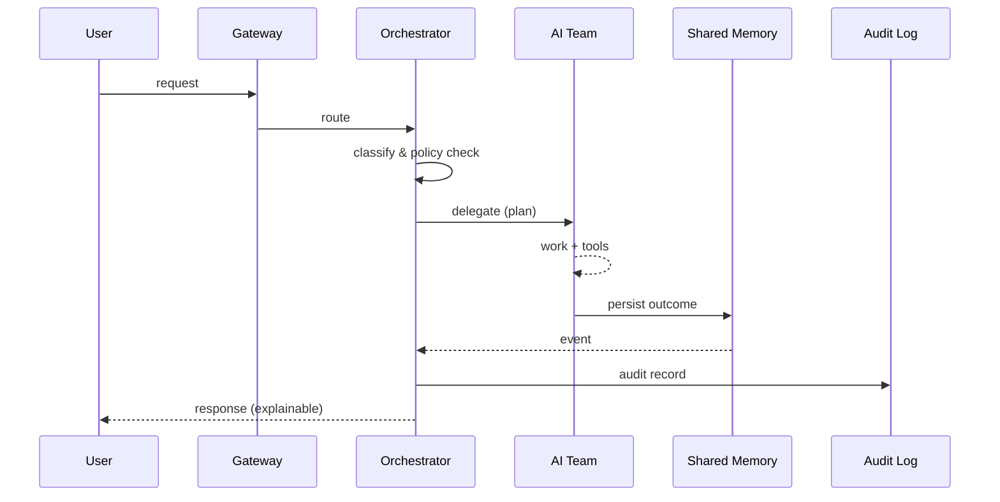
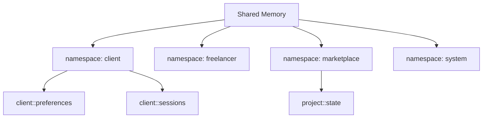
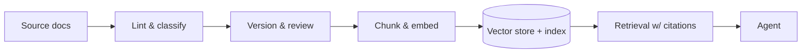
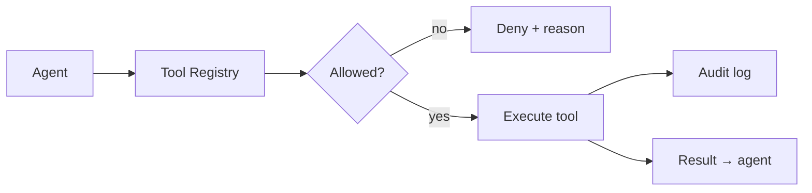
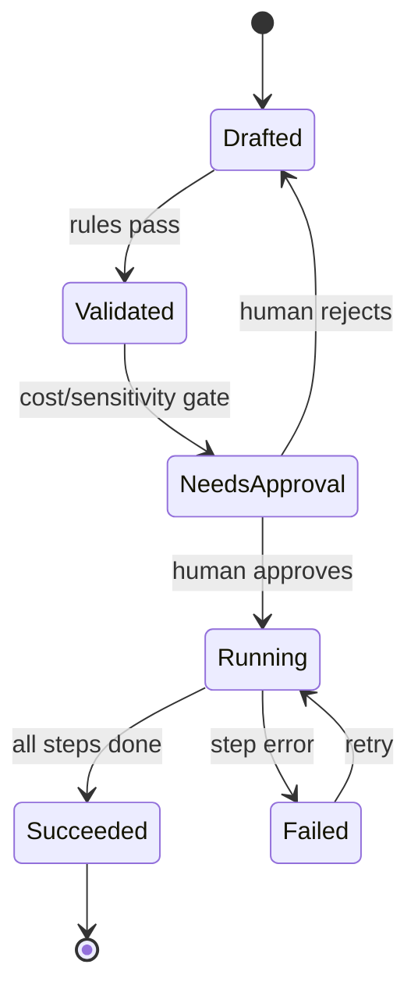
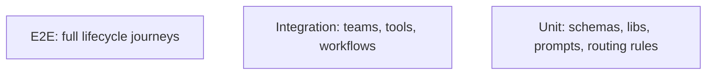

# Freelancify AI Blueprint — v1.0

**Status:** Official architecture guide · **Version:** 1.0 · **Owner:** FreelancifyHub Engineering
**Last updated:** 2026-08-01

This document is the **master architecture document** for the Freelancify AI
ecosystem. It defines the vision, team structure, agent architecture, data
flow, standards and strategy for building the AI layer of FreelancifyHub — an
AI-powered freelance marketplace.

> Scope note: this is a _blueprint_, not source code. Every section includes
> responsibilities, design decisions, constraints, best practices, scalability
> considerations, and examples. It is the single source of truth for how the
> ecosystem is designed, built and operated.

---

## Table of Contents

1. [Vision](#1-vision)
2. [Mission](#2-mission)
3. [Product Goals](#3-product-goals)
4. [AI Philosophy](#4-ai-philosophy)
5. [AI Architecture](#5-ai-architecture)
6. [OpenClaw Architecture](#6-openclaw-architecture)
7. [Multi-Agent Architecture](#7-multi-agent-architecture)
8. [Team Architecture](#8-team-architecture)
9. [Master Orchestrator](#9-master-orchestrator)
10. [Client AI Team](#10-client-ai-team)
11. [Freelancer AI Team](#11-freelancer-ai-team)
12. [Marketplace AI Team](#12-marketplace-ai-team)
13. [Marketing AI Team](#13-marketing-ai-team)
14. [Admin AI Team](#14-admin-ai-team)
15. [Shared Memory](#15-shared-memory)
16. [Knowledge Base](#16-knowledge-base)
17. [Tool Registry](#17-tool-registry)
18. [Workflow Engine](#18-workflow-engine)
19. [Prompt Standards](#19-prompt-standards)
20. [Coding Standards](#20-coding-standards)
21. [API Standards](#21-api-standards)
22. [Folder Standards](#22-folder-standards)
23. [Logging Standards](#23-logging-standards)
24. [Security Standards](#24-security-standards)
25. [Deployment Strategy](#25-deployment-strategy)
26. [Testing Strategy](#26-testing-strategy)
27. [Future Expansion](#27-future-expansion)

---

## 1. Vision

**FreelancifyHub is the freelance marketplace where AI removes the busywork** —
matching, vetting, pricing, contract handling, payments, support and marketing
are automated so that humans focus on high-value creative and technical work.

The AI ecosystem (this project) is the **intelligence layer** of that platform.
It does not replace the human marketplace — it operates _alongside_ it,
guaranteeing fairness, speed and quality at scale.

### 1.1 Responsibilities of the AI layer

- Automate the entire freelance lifecycle (post → match → vet → hire → deliver → pay → review).
- Present a single, coherent assistant experience to every stakeholder.
- Keep a **human-in-the-loop** for every irreversible or high-stakes action.
- Learn from every interaction without leaking private data.

### 1.2 Design decisions

| Decision                       | Choice            | Why                                                           |
| ------------------------------ | ----------------- | ------------------------------------------------------------- |
| Agent-native, not chatbot-only | Multi-agent teams | Complex marketplace domains need specialist, swappable agents |
| Own the orchestration          | OpenClaw gateway  | Proven agent platform; channels, memory, tools out of the box |
| Docs-first                     | This blueprint    | Every subsystem follows a documented contract before code     |

### 1.3 Constraints

- Must remain model-agnostic (no hard dependency on one LLM vendor).
- Must scale from 1 agent to 100+ without re-architecting.
- Must preserve marketplace trust; no ghost decisions on money or identity.

### 1.4 Best practices

- **Narrow agents:** each agent owns one domain, one goal, one persona.
- **Least privilege:** every agent gets only the tools it needs.
- **Observable by default:** every decision is logged and auditable.

### 1.5 Scalability considerations

The vision is horizontally scalable by **adding agents/teams**, not by growing
monolithic prompts. Orchestration, memory and knowledge are decoupled so the
ecosystem can grow along each axis independently.

### 1.6 Example

A client posts a project → Marketplace team matches it → Freelancer team vets
candidates → Client team negotiates → Workflow engine runs the contract. The
vision is that this entire chain happens without a human touching the keyboard.

---

## 2. Mission

> **Build the most trustworthy, automated freelance marketplace by combining
> specialised AI agents with strong human-in-the-loop guardrails.**

### 2.1 Responsibilities

- Deliver the blueprint's capabilities into production, incrementally.
- Reduce time-to-hire for clients and time-to-paid-work for freelancers.
- Maintain transparency: every AI action is explainable and reversible.

### 2.2 Design decisions

- **Vertical slices first:** ship one full lifecycle flow before generalising.
- **Guardrails before autonomy:** safety rules ship with the first agent, not later.

### 2.3 Constraints

- No autonomous spend of money; payments require human approval (or a
  documented, configurable threshold).
- No autonomous public statements (marketing output is human-reviewed).

### 2.4 Best practices

- Missions decompose into **OKRs** per AI team (see §8).
- Every team's mission maps to at least one measurable outcome.

### 2.5 Scalability considerations

The mission is durable; the _how_ evolves. Teams measure themselves against
outcomes so capacity growth follows demand.

### 2.6 Example

A "time-to-matched-candidate < 5 minutes" OKR for the Marketplace AI Team
drives matching latency targets and tool selection.

---

## 3. Product Goals

### 3.1 Goals

| #   | Goal                                   | Success metric                                          |
| --- | -------------------------------------- | ------------------------------------------------------- |
| G1  | Automated end-to-end project lifecycle | % of lifecycle steps executed by AI without human touch |
| G2  | High-quality matching                  | Candidate-accept rate, client satisfaction              |
| G3  | Fair and fast vetting                  | Median vet time, screening accuracy                     |
| G4  | Transparent pricing                    | Price-confidence score, negotiation success             |
| G5  | Proactive support                      | CSAT, deflection rate                                   |
| G6  | Trustworthy marketplace                | Report-to-resolution time, fraud flags                  |

### 3.2 Responsibilities

Each goal owns measurable outcomes, a sponsoring AI team, and an owner.

### 3.3 Design decisions

- Goals are **metric-owned**, not feature-owned — features are means.
- Goals are revisited each quarter; the architecture is stable underneath.

### 3.4 Constraints

- No metric is optimised at the expense of marketplace fairness or privacy.
- New goals require an impact assessment (cost, latency, privacy).

### 3.5 Best practices

- North-star metric: **time from project post to paid milestone**.
- Guardrail metrics: fairness, accuracy, complaint rate.

### 3.6 Scalability considerations

Goals scale with marketplace size; matching/screening quality must hold as
listings grow 10×. This drives the need for indexed knowledge and cached memory.

### 3.7 Example

Goal G1 is measured by "workflow completion percentage"; the Master Orchestrator
reports weekly on it via the Admin AI Team.

---

## 4. AI Philosophy

The philosophical rules every system component must obey.

### 4.1 Core principles

1. **Humans own outcomes, AI owns automation.** Every consequential decision is
   reversible and attributable to a human owner.
2. **Transparency over magic.** Agents explain _why_ in plain language.
3. **Narrowness over generalness.** A team of small specialists outperforms one
   giant generalist for safety and maintainability.
4. **Context over prompting.** Give agents curated, cited context (knowledge
   base) rather than hoping a giant prompt covers every case.
5. **Private by default.** Data minimisation, no cross-client leakage.
6. **Fail closed.** On uncertainty or error, agents stop and ask — never guess.

### 4.2 Responsibilities

The philosophy is enforced by: prompt standards (§19), tool permissions (§17),
security standards (§24) and the workflow engine (§18).

### 4.3 Design decisions

| Principle              | Enforcement mechanism                           |
| ---------------------- | ----------------------------------------------- |
| Human owns outcomes    | Approval gates in workflows (§18)               |
| Transparency           | Explainability fields on every action record    |
| Narrowness             | Team/agent charter files (§8, §19)              |
| Context over prompting | Knowledge base citation requirement (§16)       |
| Private by default     | Data-classification in security standards (§24) |
| Fail closed            | Default-deny tool policy (§17)                  |

### 4.4 Constraints

- LLM output is **never** trusted as fact without a source in the knowledge
  base or a tool result.
- Agents never access data outside their charter's data scope.

### 4.5 Best practices

- Write philosophy rules into agent charters as _must_ / _must not_ statements.
- Run a monthly "philosophy audit" sampling agent logs.

### 4.6 Scalability considerations

Philosophy is a set of rules, not a runtime component — it scales by
consistency (every new agent is charter-reviewed against it).

### 4.7 Example

A screening agent that cannot verify a freelancer's skill evidence must reply
"insufficient evidence — human review required", not invent a score.

---

## 5. AI Architecture

The end-to-end technical architecture of the ecosystem.



### 5.1 Responsibilities

- **Edge layer:** all user touchpoints (web, mobile, API).
- **Intelligence layer:** the agent ecosystem — this blueprint's focus.
- **Shared services:** memory, knowledge, logging, audit — consumed by all teams.
- **External systems:** payments, comms, model providers, product database.

### 5.2 Design decisions

- The intelligence layer is **decoupled** from the product database; it reaches
  data only through tools (API-first).
- The gateway is the **single entry point** for all AI traffic.

### 5.3 Constraints

- The intelligence layer must not become a bottleneck for the marketplace.
- All LLM calls go through the Tool Registry's model client (rate-limited,
  cost-tracked, retried).

### 5.4 Best practices

- **Clean dependencies:** intelligence → shared services → external. No cycles.
- **Versioned contracts** between teams (see §21 API standards).
- Everything is **event-driven** for audit and replay.

### 5.5 Scalability considerations

- Gateway and teams are stateless; horizontal scaling is additive.
- Memory and knowledge are separate stores, scaled independently.
- Tool calls are the only synchronous external dependency; they are cached and
  rate-limited.

### 5.6 Example

A client message arrives via API → gateway routes to Master Orchestrator →
Orchestrator fans out to Client AI Team → team runs a workflow → writes to
Shared Memory → returns a traceable response.

---

## 6. OpenClaw Architecture

OpenClaw is the runtime that hosts the agent ecosystem. It provides the
gateway, channels, sessions, memory hooks and tool execution.

### 6.1 Responsibilities

- Gateway: routing, sessions, hot-reload config.
- Channels: web, chat, mobile integrations.
- Agent hosting: running agent definitions from `agents/`.
- Sandboxing: executing tools with least privilege.

### 6.2 Component diagram



### 6.3 Design decisions

| Decision | Choice                                         | Why                                  |
| -------- | ---------------------------------------------- | ------------------------------------ |
| Config   | `clawd.json` (JSON5) at repo root              | Versioned, reviewable, gateable      |
| Identity | `agents/*/agent.md`                            | Matches OpenClaw convention          |
| State    | `memory/`, `knowledge/` dirs mounted in Docker | Portable, inspectable                |
| Logs     | `logs/` via pino                               | Standard JSON logs for the collector |

### 6.4 Constraints

- Config must pass `openclaw config validate` in CI.
- Gateway port is non-public; only the application edge may reach it.

### 6.5 Best practices

- Keep config small; put behaviour in agent charters and workflows.
- Use `$include` to split large configs into per-team files.
- Restart-free config: rely on the gateway's hot-reload for safe changes.

### 6.6 Scalability considerations

Multiple gateway replicas share memory/knowledge stores; sessions must be
routable (sticky or distributed session store) so user context is preserved.

### 6.7 Example

The `clawd.json` registers the `freelancify-core` agent and points at
`./agents`, `./memory`, `./knowledge`, `./logs` as the ecosystem roots.

---

## 7. Multi-Agent Architecture

The ecosystem is composed of **specialist agents grouped into teams**. Agents
do not talk to each other directly; they communicate through the **Master
Orchestrator** and shared state.

### 7.1 Topology



### 7.2 Responsibilities

- **Orchestrator:** routing, delegation, policy, error handling.
- **Agents:** one responsibility each; they request tools and report results.
- **No lateral calls:** agents coordinate only via orchestrator and shared memory.

### 7.3 Design decisions

| Decision        | Choice                        | Why                               |
| --------------- | ----------------------------- | --------------------------------- |
| Communication   | Star topology (hub-and-spoke) | Simpler audit, no hidden coupling |
| State sharing   | Shared memory + event log     | Decouples agents in time          |
| Delegation      | Policy-driven routing rules   | Deterministic where possible      |
| Team boundaries | Domain charters               | Clear ownership and permissions   |

### 7.4 Constraints

- Maximum one orchestrator hop for any request (avoid deep chains).
- Agents are stateless; all state lives in memory/knowledge.

### 7.5 Best practices

- Every agent has a **charter**: goal, scope, tools, inputs, outputs.
- Routing rules live in config/workflows, not in prompts.
- Idempotency: re-running a workflow produces the same result.

### 7.6 Scalability considerations

- Add capacity by scaling teams horizontally.
- Add capability by adding agents (registered in `clawd.json`), never by
  growing an existing agent's charter unboundedly.
- Routing rules are data-driven, so they scale without code changes.

### 7.7 Example

A vetting request flows Orchestrator → Marketplace Team → Vetter → tool call to
the screening service → result → orchestrator logs → reply to client.

---

## 8. Team Architecture

Five teams partition the ecosystem by **stakeholder and domain**. Each team has
a charter, an owner, shared goals and permission boundaries.



### 8.1 Responsibilities

| Team           | Domain                      | Primary goal               |
| -------------- | --------------------------- | -------------------------- |
| Client AI      | Clients & their projects    | Hire fast, hire right      |
| Freelancer AI  | Freelancers & their careers | Win work, deliver well     |
| Marketplace AI | Matching / trust / pricing  | Efficient, fair market     |
| Marketing AI   | Acquisition & brand         | Growth without noise       |
| Admin AI       | Operations & safety         | Run a trustworthy platform |

### 8.2 Design decisions

- **One owner per team** in the org chart; every agent reports to a team.
- Each team exposes a **contract** (inputs/outputs) to the orchestrator.
- Teams share infrastructure (memory, knowledge, tools) but not data scopes
  unless policy allows.

### 8.3 Constraints

- Cross-team data access requires an explicit allow-list (see §24).
- A team's charter changes only through the blueprint change process.

### 8.4 Best practices

- Charters are versioned Markdown in `agents/` or `docs/teams/`.
- Teams run on OKRs tied to product goals (§3).

### 8.5 Scalability considerations

New stakeholder types (e.g., "Agency AI Team") are added by cloning a team
charter + team in config — no architectural change required.

### 8.6 Example

A cross-team flow: Client Team drafts a brief → Marketplace Team enriches it
with market data → Freelancer Team is notified via memory event.

---

## 9. Master Orchestrator

The **only** entry point for every agent interaction in the ecosystem. It
routes, delegates, enforces policy, and manages the lifecycle of a request.

### 9.1 Responsibilities

- Intent classification → route to the correct team/agent.
- Enforce permission & policy checks (allow-lists, approval gates).
- Compose multi-agent plans; fan-out and fan-in.
- Handle errors, retries, timeouts and fail-closed behaviour.
- Emit audit events for every decision.

### 9.2 Sequence diagram



### 9.3 Design decisions

| Decision    | Choice                            | Why                      |
| ----------- | --------------------------------- | ------------------------ |
| Routing     | Config-driven rule table          | Changeable without code  |
| Delegation  | Declarative plans                 | Testable and re-runnable |
| Fail-closed | Default deny + explicit approvals | Safety-first             |
| State       | Stateless orchestrator            | Horizontal scale         |

### 9.4 Constraints

- Orchestrator never holds business state; only coordinates.
- All inter-team messages are recorded in the audit log.

### 9.5 Best practices

- Keep routing deterministic where possible; use LLM classification only for
  genuinely ambiguous intents.
- Time-box every delegated task; enforce deadlines at the orchestrator.
- Idempotent plans enable retries without side effects.

### 9.6 Scalability considerations

Stateless + event-driven means many orchestrator replicas can run behind the
gateway; queueing (e.g., a work queue) absorbs bursts.

### 9.7 Example

"Help me write a better project description" → Orchestrator classifies as
Client Team → delegates to Requirement Analyst → returns a polished brief with
a suggestion to run pricing later.

---

## 10. Client AI Team

Owns the **client experience** end-to-end: posting, briefing, hiring,
contracting and support.

### 10.1 Responsibilities

- Onboarding and brief intake (structured requirement extraction).
- Candidate shortlist presentation and comparison.
- Proposal review assistance and negotiation support.
- Contract generation from templates.
- Proactive status updates and support.

### 10.2 Agents

| Agent               | Scope                         | Core tools                  |
| ------------------- | ----------------------------- | --------------------------- |
| Client Concierge    | Intake, Q&A, status           | Search KB, comms, CRM       |
| Requirement Analyst | Structuring briefs, estimates | Schema templates, pricing   |
| Contract Assistant  | Draft/review contracts        | Contract service, templates |

### 10.3 Design decisions

- Extraction is **structured** (JSON) not free-text, feeding the Marketplace team.
- Templates are knowledge-base documents, versioned and approved by Legal.

### 10.4 Constraints

- Cannot approve spend or finalise contracts without human sign-off (approval gate).
- Client data is read-only for all other teams.

### 10.5 Best practices

- Progressive disclosure: never dump a full brief; ask one question at a time.
- Every recommendation cites the requirement or knowledge source.
- Escalation path to a human support agent is always one tap away.

### 10.6 Scalability considerations

Stateless concierge agents scale horizontally; long-lived client context lives
in Shared Memory keyed by client id.

### 10.7 Example

A client pastes "I need a website" → Analyst extracts pages, stack, timeline →
Concierge confirms with three clarifying questions → brief saved to memory →
Marketplace Team notified.

---

## 11. Freelancer AI Team

Owns the **freelancer experience**: onboarding, profile, discovery, delivery
and career growth.

### 11.1 Responsibilities

- Onboarding and skills assessment.
- Profile/skills optimisation for discoverability.
- Proposal drafting and application assistance.
- Delivery checklist and milestone reminders.
- Payment/withdrawal guidance and dispute support.

### 11.2 Agents

| Agent              | Scope                           | Core tools                      |
| ------------------ | ------------------------------- | ------------------------------- |
| Onboarding         | Sign-up, verification, skills   | ID verification, skills service |
| Profile Optimiser  | Portfolio, description, pricing | CV/portfolio analysis, KB       |
| Delivery Assistant | Milestones, files, feedback     | Project service, comms          |

### 11.3 Design decisions

- Skills are validated against evidence (projects, tests) — never self-declared alone.
- Proposal quality over volume: AI helps craft fewer, better proposals.

### 11.4 Constraints

- Cannot modify a freelancer's verified profile fields without explicit consent.
- Earnings/financial data is restricted to the freelancer and Admin audit.

### 11.5 Best practices

- Honest profile policy: AI may rewrite, never fabricate, achievements.
- Suggest improvements with examples from the freelancer's own history.

### 11.6 Scalability considerations

Profile optimisation is batch-friendly; recomputation is queued on profile
changes rather than done in the request path.

### 11.7 Example

A freelancer says "I never win web-dev jobs" → Optimiser reviews their profile
against winning profiles in the KB → suggests 3 concrete edits → proposals are
rewritten with results-focused phrasing.

---

## 12. Marketplace AI Team

Owns the **marketplace core**: matching, vetting, pricing, reputation and trust.

### 12.1 Responsibilities

- Candidate matching (skills, availability, budget, history).
- Freelancer vetting and skills verification.
- Price estimation and negotiation support.
- Reputation/rating synthesis and fraud signal detection.

### 12.2 Agents

| Agent   | Scope                     | Core tools                     |
| ------- | ------------------------- | ------------------------------ |
| Matcher | Ranking candidates        | Search index, scoring model    |
| Vetter  | Verification & risk flags | Verification service, KB rules |
| Pricing | Estimates & proposals     | Pricing model, market data     |

### 12.3 Design decisions

- Matching is a **ranking problem** with transparent, weighted signals.
- Pricing is explainable: breakdown of market rates, skills, timeline.
- Fraud signals are **alerts to humans**, never autonomous bans.

### 12.4 Constraints

- No bias-by-design: scoring inputs are audited for fairness (§4).
- Matching decisions are reversible and explainable to both sides.

### 12.5 Best practices

- Log every score's contributing factors (explainability).
- A/B test ranking changes against outcome metrics, not click metrics.
- Vetting evidence is stored in the knowledge/audit store.

### 12.6 Scalability considerations

Ranking indexes are horizontally sharded; embeddings cached; fraud detection
scales via batch jobs on an event stream.

### 12.7 Example

A brief lands → Matcher scores 40 candidates → Vetter runs lightweight checks
→ Client gets a top-5 shortlist with reasons → Pricing attaches a fair range.

---

## 13. Marketing AI Team

Owns **acquisition and brand**: content, campaigns, SEO, and lead engagement.

### 13.1 Responsibilities

- Content generation (blog, social, email) from approved templates.
- Campaign planning and segmentation.
- SEO research and on-page suggestions.
- Lead qualification and nurturing conversations.

### 13.2 Agents

| Agent            | Scope                     | Core tools                  |
| ---------------- | ------------------------- | --------------------------- |
| Content Studio   | Copy, images, emails      | Content templates, brand KB |
| Campaign Planner | Segments, budgets, timing | Analytics, ad platforms     |
| Growth Assistant | Lead Q&A, nurture         | CRM, comms                  |

### 13.3 Design decisions

- Brand voice lives in the Knowledge Base as a versioned style guide.
- All public content passes a **human review gate** before publishing.

### 13.4 Constraints

- No automated paid-ad spend without budget approval.
- Content must comply with marketplace fairness rules (no inflated promises).

### 13.5 Best practices

- Templates, not blank-page generation; humans approve the final 10%.
- A/B test copy against the brand style guide.

### 13.6 Scalability considerations

Content generation is a classic queue/worker pattern; a campaign config drives
many template instantiations cheaply.

### 13.7 Example

A blog draft for "How to price your freelance work" is generated from the style
guide + market data → Marketing owner edits → publishes → Content Studio tags
it for reuse.

---

## 14. Admin AI Team

Owns **operations and safety**: moderation, policy enforcement, analytics and
incident response.

### 14.1 Responsibilities

- Content moderation and policy enforcement.
- Fraud/abuse investigation support.
- Platform analytics and reporting.
- Compliance (GDPR/CCPA) data operations support.

### 14.2 Agents

| Agent                | Scope                         | Core tools                    |
| -------------------- | ----------------------------- | ----------------------------- |
| Moderator            | Flag, triage, escalate        | Moderation service, policy KB |
| Analytics            | Dashboards, anomaly detection | Data warehouse, BI            |
| Compliance Assistant | Data subject requests         | DSR tooling, audit store      |

### 14.3 Design decisions

- **Humans decide, AI prepares.** The moderator compiles evidence; an admin acts.
- All admin actions are immutable in the audit log.

### 14.4 Constraints

- Admin agents never self-authorise; every ban/refund is human-approved.
- Analytics agents access only aggregated or authorised data.

### 14.5 Best practices

- SLA on flagged-content triage; the moderator escalates within it.
- Run weekly fairness checks on moderation decisions.

### 14.6 Scalability considerations

Moderation is a stream-processing job; as volume grows, classifiers and human
review are both scaled behind a queue with prioritised routing.

### 14.7 Example

A flagged profile → Moderator compiles evidence (posts, payment history, rules
cited) → Admin reviews a single screen → approves or dismisses → decision is
logged and a template reply is sent.

---

## 15. Shared Memory

A single, namespaced persistence layer for **conversation and agent state**,
shared across all teams but partitioned by namespace.

### 15.1 Responsibilities

- Session and conversation continuity.
- User preferences and consent records.
- Cross-team handoff context.
- Long-term entity state (projects, proposals, evaluations).

### 15.2 Layout



### 15.3 Design decisions

| Decision       | Choice                              | Why                       |
| -------------- | ----------------------------------- | ------------------------- |
| Access control | Namespace + allow-list              | Enforces team data scopes |
| Storage        | Key-value + event log               | Simple, replayable        |
| TTL            | Conversational (short) vs long-term | Bounded growth            |
| Form           | `memory/` folder in Docker volume   | Portable, inspectable     |

### 15.4 Constraints

- No raw PII duplication: reference identifiers, not copies.
- Every write carries an owner + reason (auditable).

### 15.5 Best practices

- Keep prompts stateless; read context from memory at request time.
- Expire ephemeral context; archive long-term state.
- Namespace keys: `<domain>:<entity>:<attribute>`.

### 15.6 Scalability considerations

Memory shards by namespace; reads are cached; the event log is the source for
replay and analytics. Memory grows with users, not with traffic.

### 15.7 Example

Client A resumes a conversation 3 days later → Orchestrator pulls
`client:A:sessions` and `project:17:state` → the Client Concierge continues
seamlessly with full context.

---

## 16. Knowledge Base

The curated, versioned **ground-truth store** that agents cite instead of
improvising.

### 16.1 Responsibilities

- Policies, procedures and FAQ content.
- Brand style guides and voice rules.
- Domain glossaries and product documentation.
- Market data snapshots used by Pricing/Matcher.

### 16.2 Pipeline



### 16.3 Design decisions

| Decision   | Choice                        | Why                    |
| ---------- | ----------------------------- | ---------------------- |
| Grounding  | RAG with mandatory citations  | Answers are verifiable |
| Versioning | Semver + review gates         | Trust in content       |
| Storage    | `knowledge/` + vector index   | Portable + fast        |
| Trust      | Human-reviewed before publish | Quality control        |

### 16.4 Constraints

- Agents must **cite** the KB entry they used; uncited claims are disallowed.
- Content is versioned; agents must use the approved version.

### 16.5 Best practices

- Write docs in the language agents already read (plain, imperative Markdown).
- One fact per short chunk; headings that carry meaning.
- Track freshness: stale docs are flagged, never silently used.

### 16.6 Scalability considerations

Chunking/embedding is a batch pipeline scaled with workers; retrieval is a
vector search scaled with index shards + caching of hot queries.

### 16.7 Example

"Can I change my milestone dates?" → Vetter/Concierge retrieves the "milestones"
policy doc → answers with the rule and a link to the exact entry.

---

## 17. Tool Registry

The **default-deny** catalogue of capabilities agents may invoke. Every tool
has a contract, permission scope and audit trail.

### 17.1 Responsibilities

- Define tool contracts (input/output schemas).
- Enforce permission scope per agent.
- Rate-limit, retry and cost-track LLM/tool calls.
- Log every invocation for audit.

### 17.2 Model



### 17.3 Design decisions

| Decision      | Choice                             | Why                 |
| ------------- | ---------------------------------- | ------------------- |
| Policy        | Default-deny, allow-list per agent | Least privilege     |
| Schemas       | JSON Schema per tool               | Validated contracts |
| Effects       | Idempotent where possible          | Safe retries        |
| Observability | Every call logged                  | Full audit          |

### 17.4 Constraints

- Agents cannot register new tools; only the Admin/ops process can.
- Mutating tools require an approval gate unless explicitly whitelisted.

### 17.5 Best practices

- One tool = one capability; compose tools, don't build mega-tools.
- Keep tool outputs small and structured; let agents summarise.
- Test tools in the Tool Registry with contract tests (§26).

### 17.6 Scalability considerations

Tools are stateless services scaled behind the registry; the registry itself is
a thin, cached policy layer — cheap to replicate.

### 17.7 Example

`create_invoice(project_id, amount)` is allow-listed for Marketplace/Admin
teams, requires human approval above $1,000, and every call is logged with
actor, args-hash and result.

---

## 18. Workflow Engine

Executes **declarative multi-step workflows**: the glue between teams, tools
and approval gates. Not business logic — orchestration logic.

### 18.1 Responsibilities

- Execute step sequences with retries, timeouts and rollback.
- Manage approval gates (human-in-the-loop checkpoints).
- Emit events for every transition (audit + analytics).
- Enforce idempotency and concurrency limits.

### 18.2 State machine



### 18.3 Design decisions

| Decision   | Choice                        | Why                 |
| ---------- | ----------------------------- | ------------------- |
| Definition | YAML/Markdown in `workflows/` | Readable + diffable |
| Execution  | Event-driven workers          | Durable + scalable  |
| Approval   | Explicit gate steps           | Fail-closed         |
| Versioning | Workflow version + migration  | Safe changes        |

### 18.4 Constraints

- Workflows must be versioned; running instances pin their version.
- Any workflow with money/identity side effects requires an approval gate.

### 18.5 Best practices

- Keep steps idempotent and small; one workflow = one business outcome.
- Define timeouts and dead-letter handling for every step.
- Log transition events; the event log is the replay source.

### 18.6 Scalability considerations

Workflow engines scale by queue partitioning (shard by entity id); long-running
workflows are persisted, so workers are stateless and interchangeable.

### 18.7 Example

`hire_flow`: brief validated → match (Marketplace) → vet (Marketplace) →
contract drafted (Client Team) → **human approve** → invoice created (tool) →
memory updated → both parties notified.

---

## 19. Prompt Standards

Rules for authoring prompts across the ecosystem. Prompts are code — reviewed,
versioned, tested.

### 19.1 Responsibilities

- Ensure consistent quality, tone and safety across agents.
- Make prompts reviewable and diffable.
- Support testing (prompt test suites).

### 19.2 Conventions

| Rule       | Standard                                                       |
| ---------- | -------------------------------------------------------------- |
| Location   | `prompts/<team>/<agent>/<file>.md`                             |
| Format     | Markdown with `{{variables}}`                                  |
| Structure  | Role → Context → Task → Constraints → Output format            |
| Length     | Short role + focused instructions; heavy context comes from KB |
| Versioning | Semver; every change is a reviewable diff                      |

### 19.3 Design decisions

- **Context over prompting:** put facts in the KB, not in prompts.
- **Deterministic output where possible:** ask for JSON, schema-validated.
- Prompts are tested like code (golden answers, §26).

### 19.4 Constraints

- No secrets, credentials or PII inside prompts.
- Every prompt must end with a "fail closed" instruction.

### 19.5 Best practices

- Write instructions as **must/must not**, not "please".
- Include one worked example in every prompt.
- Never store the same instruction in two prompts (DRY via KB).

### 19.6 Scalability considerations

Prompt versioning + testing lets the ecosystem add agents without degrading
quality; a shared style guide keeps tone consistent.

### 19.7 Example

```markdown
## Role

You are the Client Concierge for FreelancifyHub.

## Context

Client: {{client_name}} · Stage: {{stage}} · Project: {{project_id}}

## Task

Answer the client's question {{question}} using the Knowledge Base.

## Constraints

- You MUST cite a KB entry. If none applies, say "I need to check with our team."
- You MUST NOT invent prices, dates or policies.
- Respond in under 120 words with a single next step.
```

---

## 20. Coding Standards

The rules for all TypeScript/Node code in the ecosystem.

### 20.1 Responsibilities

- Consistent, reviewable, safe code across `src/`, `tests/`, `scripts/`.
- Enforce quality automatically (lint, typecheck, format, tests in CI).

### 20.2 Conventions

| Concern  | Standard                                                |
| -------- | ------------------------------------------------------- |
| Language | TypeScript 5, strict mode, ESM                          |
| Runtime  | Node.js 22+                                             |
| Modules  | NodeNext resolution, explicit `.js` imports             |
| Lint     | ESLint 10 flat config + typescript-eslint               |
| Format   | Prettier (defaults from `.prettierrc.json`)             |
| Types    | Strict + `noUncheckedIndexedAccess`                     |
| Naming   | camelCase functions/vars, PascalCase types, kebab files |

### 20.3 Design decisions

- Fail-fast configuration via Zod (§21-adjacent, in `src/config`).
- Structured logging with pino; no ad-hoc `console.log` in source.
- No unused code; no commented-out code; no TODOs without an owner.

### 20.4 Constraints

- No business logic in the foundation layer (`src/` stays infrastructure).
- No secrets in code; configuration comes from the environment.

### 20.5 Best practices

- Small, pure functions with explicit inputs/outputs.
- Type everything at the boundary (schema validation, not trust).
- Prefer composition and explicit dependency injection over globals.

### 20.6 Scalability considerations

Code scales by **modules with contracts**, not by size: teams own `src/`
areas behind the standards, and CI gates keep quality uniform as contributors grow.

### 20.7 Example

Config access never reads `process.env` directly in business code; it always
goes through the Zod-parsed `env` singleton (`src/config/index.ts`).

---

## 21. API Standards

Contracts for every interface the ecosystem exposes or consumes.

### 21.1 Responsibilities

- Versioned, documented, schema-validated APIs.
- Consistent errors, status codes, and idempotency.
- Contracts that allow teams to change internals safely.

### 21.2 Conventions

| Concern     | Standard                                                         |
| ----------- | ---------------------------------------------------------------- |
| Style       | REST over HTTPS; JSON bodies                                     |
| Versioning  | URL prefix `/v1`; breaking → new version                         |
| Validation  | Zod/JSON Schema at every boundary                                |
| Errors      | Problem-details style: `{ code, message, details }`              |
| Idempotency | `Idempotency-Key` header for mutations                           |
| Auth        | OAuth2/Bearer; service-to-service via mTLS or short-lived tokens |

### 21.3 Design decisions

- All agent↔system traffic goes through the API layer (no direct DB access).
- Contracts are published as schemas; consumers generate clients.
- Rate limits and quotas are part of every contract.

### 21.4 Constraints

- Breaking changes require a deprecation window and migration notes.
- Never expose internal identifiers or PII in responses.

### 21.5 Best practices

- Paginate all list endpoints; cap page size.
- Return `429` with `Retry-After`; never silently drop work.
- Document with OpenAPI; keep it in sync via schema-first.

### 21.6 Scalability considerations

Stateless APIs scale horizontally behind a load balancer; caches key on
version so contract changes never poison the cache.

### 21.7 Example

`POST /v1/projects/:id/proposals` with `Idempotency-Key` returns
`201 Created` or `409 Conflict` on replay; a rejected request returns
`422 Unprocessable Entity` with validation details.

---

## 22. Folder Standards

The canonical repository layout and what belongs where.

### 22.1 Responsibilities

- Make the ecosystem navigable and consistent.
- Keep infrastructure, agents and knowledge clearly separated.

### 22.2 Canonical layout

```text
docs/          Architecture & guides (this blueprint lives here)
agents/        OpenClaw agent identity/charter files
prompts/       Versioned prompt templates
workflows/     Declarative workflow definitions
knowledge/     Ground-truth / RAG documents
memory/        Persistent agent state (Docker volume)
tools/         Tool catalogue + contracts
logs/          Runtime logs (Docker volume)
scripts/       Utility scripts (tsx)
config/        File-based configuration + env docs
tests/         Vitest suites (unit/integration/e2e)
src/           Infrastructure runtime (no business logic)
```

### 22.3 Design decisions

| Rule                 | Standard                                        |
| -------------------- | ----------------------------------------------- |
| Everything versioned | Repo = single source of truth                   |
| Runtime data         | `logs/`, `memory/` are volumes; never committed |
| Config               | `.env.example` documents all variables          |
| Docs                 | Every subsystem has a README                    |

### 22.4 Constraints

- Business logic never lands in `src/`; it lands in agents/workflows/knowledge.
- New top-level folders require a blueprint amendment.

### 22.5 Best practices

- Keep folders shallow; prefer files with clear names over nesting.
- Put reusable content in `knowledge/`, not in individual prompts.

### 22.6 Scalability considerations

A strict, documented layout lets many contributors add agents/workflows
without colliding — scale via convention.

### 22.7 Example

A new "Agency AI Team" adds `agents/agency/*`, `prompts/agency/*`,
`workflows/agency/*` and a section in the blueprint — no code changes.

---

## 23. Logging Standards

Observability rules for every component.

### 23.1 Responsibilities

- Structured, machine-readable logs for every decision and tool call.
- Correlation across teams via request/event IDs.
- Separation of runtime logs (debuggable) and audit logs (immutable).

### 23.2 Conventions

| Concern        | Standard                                         |
| -------------- | ------------------------------------------------ |
| Format         | JSON lines (pino)                                |
| Level          | `fatal, error, warn, info, debug, trace`         |
| Metadata       | `service`, `team`, `agent`, `trace_id`, `event`  |
| Sensitive data | Never logged; redaction on by default            |
| Destination    | `logs/` + collector (e.g., Loki/Elastic) in prod |

### 23.3 Design decisions

- **Audit log is separate and append-only** (money/identity/security events).
- Debug logs are opt-in via `LOG_LEVEL`, never performance-relevant in prod.

### 23.4 Constraints

- No PII or secrets in log payloads (see §24).
- Correlation IDs are mandatory across agent hops.

### 23.5 Best practices

- Log outcomes and reasons, not just "started/finished".
- Sample high-frequency debug logs; never drop audit events.
- Alert on error-rate and approval-gate timeouts.

### 23.6 Scalability considerations

Log volume scales with traffic; streaming to a collector keeps the app fast.
Audit store is separate and sized for append growth.

### 23.7 Example

```json
{
  "level": "info",
  "time": "...",
  "service": "freelancify-ai",
  "team": "marketplace",
  "agent": "matcher",
  "trace_id": "t-9f3",
  "event": "match.completed",
  "project_id": "p-17",
  "candidates": 40
}
```

---

## 24. Security Standards

Non-negotiable rules for trust and safety.

### 24.1 Responsibilities

- Protect user data, funds and identity at every layer.
- Enforce least-privilege across agents, tools and APIs.
- Support compliance (GDPR/CCPA) with audit and erasure.

### 24.2 Controls

| Control    | Standard                                                 |
| ---------- | -------------------------------------------------------- |
| Secrets    | Environment only; never in repo or logs                  |
| AuthN/Z    | OAuth2 + scopes; service identity via short-lived tokens |
| Data scope | Team namespaces + allow-lists (§15)                      |
| PII        | Classified; minimised; encrypted at rest and in transit  |
| Approvals  | Money/identity mutations require human gates             |
| Audit      | Immutable audit log for all consequential actions        |

### 24.3 Design decisions

- **Default-deny** everywhere; explicit allow-list for each privilege.
- AI output treated as untrusted input downstream (validation, no prompt-injection
  bypassing controls).
- Redaction at the logger boundary as a hard guarantee.

### 24.4 Constraints

- No autonomous payment/refund/ban actions (fail closed to human).
- No cross-namespace data reads without an explicit policy entry.

### 24.5 Best practices

- Threat-model every new tool and agent (who can do what, and what could go wrong).
- Rotate keys; short-lived tokens; audit access reviews monthly.
- Test injection resistance: prompt-injection suites in CI (§26).

### 24.6 Scalability considerations

Security scales via policy-as-code and automated scanning; the audit store is
append-only and horizontally partitionable.

### 24.7 Example

A tool to read a freelancer's earnings is allow-listed to the freelancer's own
namespace + Admin analytics (aggregated only); every read is logged with actor
and reason.

---

## 25. Deployment Strategy

How the ecosystem ships and runs.

### 25.1 Responsibilities

- Reproducible builds and environments from dev to production.
- Safe, incremental rollout with rollback.
- Observability of health, cost and quality.

### 25.2 Environments

| Environment   | Purpose                       | Data             |
| ------------- | ----------------------------- | ---------------- |
| `development` | Local (`npm run dev`, Docker) | Synthetic        |
| `staging`     | Pre-production validation     | Anonymised       |
| `production`  | Live marketplace              | Real (protected) |

### 25.3 Design decisions

- Multi-stage Docker image (build → runtime, non-root).
- Docker Compose for local orchestration (app + volumes).
- GitHub Actions CI: lint, format, typecheck, test, build, validate-env, image.
- Immutable image tags (`sha-…`) with environment-specific env injection.

### 25.4 Constraints

- No secrets in images; all secrets injected at runtime.
- Database/migrations deployed separately, before code.

### 25.5 Best practices

- Deploy agents/knowledge/prompts as content changes (fast, reversible).
- Feature-flag new teams; enable only when metrics are green.
- Rollback by redeploying the previous immutable tag.

### 25.6 Scalability considerations

Stateless replicas behind a load balancer; queues for batch work; memory,
knowledge and logs on persistent volumes; auto-scale by queue depth + CPU.

### 25.7 Example

A new Matcher model ships as a content/config update to staging → CI tests →
promoted to production → metric watch (match quality) → keep or rollback.

---

## 26. Testing Strategy

Quality at every layer.

### 26.1 Responsibilities

- Prove behaviour at unit, integration and e2e levels.
- Guard the ecosystem's three riskiest assets: money, identity, trust.

### 26.2 Pyramid



| Layer       | Scope                       | Examples                                     |
| ----------- | --------------------------- | -------------------------------------------- |
| Unit        | Schemas, libs, pure logic   | Env parsing, prompt rendering, routing rules |
| Integration | Teams ↔ tools ↔ memory ↔ KB | Workflow execution, tool contracts           |
| E2E         | Full journeys via API       | post→match→vet→approve flow                  |

### 26.3 Design decisions

| Concern      | Standard                                                |
| ------------ | ------------------------------------------------------- |
| Runner       | Vitest (+ v8 coverage)                                  |
| LLM          | Golden answers + determinism checks; no live LLM in CI  |
| Prompt tests | Template rendering, injection resistance, output schema |
| Contracts    | Schema tests for every API and tool                     |
| CI           | Every merge runs the full pyramid (§25.3)               |

### 26.4 Constraints

- No live external calls in CI (all mocked).
- Coverage thresholds are enforced (currently tracked; raise as suite grows).

### 26.5 Best practices

- Test the contract, not the implementation.
- Keep golden answer fixtures versioned with the prompts.
- Use property-based checks for schema parsing (env, tool IO).

### 26.6 Scalability considerations

The pyramid scales by parallelism (CI matrix) and by keeping unit tests
fast; expensive E2E runs are nightly, not per-commit.

### 26.7 Example

A prompt-test asserts the Concierge's output is ≤120 words, JSON-schema-valid
when structured output is requested, and fails closed on a missing KB entry.

---

## 27. Future Expansion

How the blueprint evolves without rework.

### 27.1 Expansion paths

| Axis     | Expansion                                      |
| -------- | ---------------------------------------------- |
| Teams    | Agency, Enterprise, Developer-API teams        |
| Channels | WhatsApp, Discord, voice (OpenClaw channels)   |
| Models   | Multi-provider routing, fine-tuned specialists |
| Autonomy | Higher automation after safety evidence        |
| Product  | Escrow, arbitration, skills marketplace        |

### 27.2 Design decisions

- Additive-only: new capability = new agent/workflow/knowledge, not rewrites.
- Autonomy increases in **staged tiers** gated by success metrics and safety audits.

### 27.3 Constraints

- Expansion never weakens existing guardrails (§4, §24).
- Every expansion updates this blueprint (amendment record).

### 27.4 Best practices

- Maintain a capability backlog per team with a status column.
- Re-evaluate the team charters quarterly against product goals (§3).

### 27.5 Scalability considerations

The ecosystem is designed to grow by composition; scaling is a matter of
adding nodes (agents/teams/replicas) within the same contracts.

### 27.6 Example

"Enterprise AI Team" is added later: charter in `agents/enterprise/`, prompts
in `prompts/enterprise/`, workflows in `workflows/enterprise/`, registered in
`clawd.json` — no change to orchestrator or standards required.

---

## Amendment record

| Version | Date       | Change                                           |
| ------- | ---------- | ------------------------------------------------ |
| 1.0     | 2026-08-01 | Initial release of the Freelancify AI Blueprint. |
