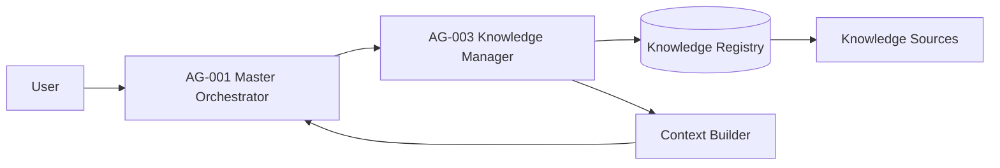
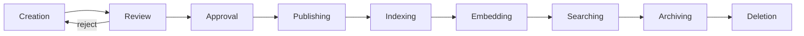

# Freelancify AI — Knowledge Base Architecture v1.0

**Component:** AG-003 Knowledge Manager · **Spec version:** 1.0.0 · **Status:** In Development · **Priority:** Critical
**Owner:** FreelancifyHub Engineering · **Last updated:** 2026-08-02

> [!IMPORTANT]
> This is the official **engineering specification for the complete Knowledge
> ecosystem** and the implementation contract for **AG-003 Knowledge Manager** —
> the ground-truth store every AI agent cites instead of improvising. It is
> governed by, and must never contradict:
>
> - [`docs/freelancify-ai-blueprint-v1.0.md`](./freelancify-ai-blueprint-v1.0.md) — architecture (esp. §16, §23, §24)
> - [`docs/product-requirements-v1.md`](./product-requirements-v1.md) — functional spec (esp. BR-AI-4, F17, AC-25)
> - [`docs/agent-catalog-v1.md`](./agent-catalog-v1.md) — agent registry (esp. AG-003 entry)
> - [`docs/master-orchestrator-specification-v1.md`](./master-orchestrator-specification-v1.md) — AG-001 knowledge coordination (§9)
> - [`docs/shared-memory-architecture-v1.md`](./shared-memory-architecture-v1.md) — AG-002 memory tools (knowledge refs)
> - [`docs/tool-registry-architecture-v1.md`](./tool-registry-architecture-v1.md) — AG-004 tools (TL-003, TL-011, TL-012)
>
> No implementation code is included. Interfaces are **logical contracts only**
> (§16). Validation against the six source documents is reported in
> §Appendix A–C.

---

## Table of Contents

1. [Executive Summary](#1-executive-summary)
2. [Knowledge Philosophy](#2-knowledge-philosophy)
3. [High-Level Architecture](#3-high-level-architecture)
4. [Knowledge Categories](#4-knowledge-categories)
5. [Knowledge Sources](#5-knowledge-sources)
6. [Knowledge Registry](#6-knowledge-registry)
7. [Knowledge Lifecycle](#7-knowledge-lifecycle)
8. [Retrieval Strategy](#8-retrieval-strategy)
9. [RAG Strategy](#9-rag-strategy)
10. [Context Builder](#10-context-builder)
11. [Knowledge Quality](#11-knowledge-quality)
12. [Security](#12-security)
13. [Privacy](#13-privacy)
14. [Performance](#14-performance)
15. [Storage Strategy](#15-storage-strategy)
16. [APIs (Logical Contracts)](#16-apis-logical-contracts)
17. [Events](#17-events)
18. [Configuration](#18-configuration)
19. [Testing Strategy](#19-testing-strategy)
20. [Risks](#20-risks)
21. [Future Roadmap](#21-future-roadmap)
22. [Acceptance Criteria](#22-acceptance-criteria)
23. [Open Questions](#23-open-questions)
24. [Architecture Decision Records (ADR)](#24-architecture-decision-records-adr)
25. [Appendices](#25-appendices)

---

## 1. Executive Summary

### Purpose

Design the complete knowledge ecosystem for every AI agent: how ground-truth
content is ingested, versioned, reviewed, indexed, retrieved and cited. This
document is the implementation contract for **AG-003 Knowledge Manager**
(catalog §9; blueprint §16).

### Scope

**In scope:** knowledge philosophy, categories, sources, the official registry
(KB-001…KB-012), lifecycle, retrieval strategy, RAG strategy, context builder,
quality, security, privacy, performance, storage tiers, logical APIs, events,
configuration, testing and governance.

**Out of scope:** implementation code; business logic (BR-AI-2/3); memory
internals (AG-002, memory spec); tool execution (AG-004, tool registry spec);
agent routing (AG-001, orchestrator spec); channel/session plumbing
(OpenClaw gateway, blueprint §6).

### Business Value

- **Grounded, verifiable AI answers** — mandatory citations make every factual
  claim auditable (BR-AI-4, blueprint §16.3).
- **Consistent policy & brand** — one versioned truth across all agents
  (blueprint §16.1).
- **Controlled trust** — human-reviewed content only; stale docs are flagged,
  never silently used (blueprint §16.5).

### Responsibilities

| #   | Responsibility                                                      |
| --- | ------------------------------------------------------------------- |
| K1  | Own the Knowledge Registry (register/update/archive/delete sources) |
| K2  | Run the chunk/embed pipeline and index content (blueprint §16.2)    |
| K3  | Enforce version + review gates; approve content before publish      |
| K4  | Serve retrieval with mandatory citations to approved versions       |
| K5  | Track freshness; flag stale docs (never silently used)              |
| K6  | Emit observability + audit events for retrieval and citation usage  |

### Non-Responsibilities

| Not responsible for            | Owner                                   |
| ------------------------------ | --------------------------------------- |
| Deciding _which_ agent answers | AG-001 (orchestrator spec §9)           |
| Persisting agent state         | AG-002 (memory spec §15)                |
| Tool permissions / execution   | AG-004 (tool registry spec §13)         |
| Content authoring              | Content owners (KB editors / teams)     |
| Factual accuracy of externals  | AG-401 research + human review (TL-012) |

---

## 2. Knowledge Philosophy

| Principle             | Meaning                                                                               |
| --------------------- | ------------------------------------------------------------------------------------- |
| **Trusted Knowledge** | Only human-reviewed, approved content is citable ground truth (blueprint §16.3).      |
| **Source of Truth**   | The KB is the canonical store; agents cite it instead of improvising (blueprint §16). |
| **Versioning**        | Semver + review gates; agents use the approved version only (blueprint §16.4).        |
| **Freshness**         | Stale docs are flagged, never silently used; freshness is tracked (§11).              |
| **Accuracy**          | Content matches the source; uncited claims are disallowed (BR-AI-4).                  |
| **Governance**        | Ingestion is owner-gated; publishing requires approval; everything is audited.        |

---

## 3. High-Level Architecture



The Knowledge Manager is the single gateway to the Knowledge Registry. It
orchestrates ingestion, indexing and retrieval; the Context Builder assembles
cited context that flows back to the orchestrator (orchestrator spec §7).

---

## 4. Knowledge Categories

| Category                   | Purpose                               | Owner                      | Update Frequency  | Trust Level | Versioning            | Retention            |
| -------------------------- | ------------------------------------- | -------------------------- | ----------------- | ----------- | --------------------- | -------------------- |
| **Platform Documentation** | Product behaviour, config, features   | Product / Engineering      | Monthly           | T2          | Semver                | Indefinite (active)  |
| **Product Documentation**  | Feature specs, workflows              | Product                    | Per release       | T2          | Semver                | Indefinite (active)  |
| **Policies**               | Rules, guardrails (BR-*), terms       | Legal / Compliance         | Quarterly         | T1          | Semver + legal review | 7 years (legal hold) |
| **FAQs**                   | Support answers                       | Support                    | Weekly            | T2          | Per-answer version    | 2 years              |
| **Pricing**                | Market rates, fee structure           | Marketplace team           | Weekly (snapshot) | T1          | Snapshot versioned    | 1 year               |
| **Help Center**            | Self-service guides                   | Support / Onboarding       | Monthly           | T2          | Semver                | 2 years              |
| **API Documentation**      | API contracts, schemas                | Engineering / DevRel       | Per release       | T3          | Semver                | Indefinite (active)  |
| **Developer Docs**         | Integration guides, SDKs              | Engineering                | Per release       | T3          | Semver                | Indefinite (active)  |
| **Prompt Library**         | Versioned prompt templates            | AG-001 / Platform          | Per change        | T3          | Semver                | Indefinite (active)  |
| **Agent Documentation**    | Agent contracts, tool docs            | AG-004 / Platform          | Per change        | T3          | Semver                | Indefinite (active)  |
| **Architecture Documents** | Engineering specs, blueprints         | FreelancifyHub Engineering | Per change        | T3          | Semver                | Indefinite (active)  |
| **User Guides**            | End-user walkthroughs                 | Support / Onboarding       | Per release       | T2          | Semver                | 2 years              |
| **Release Notes**          | Changelog per version                 | Product                    | Per release       | T4          | Per-release           | Indefinite (archive) |
| **Future Knowledge**       | Reserved namespace for new categories | —                          | —                 | —           | —                     | —                    |

> [!NOTE]
> Trust levels T1–T5 are defined in §8. T1 is highest (policy/legal, human-gated);
> T5 is lowest (external, never cited without verification).

---

## 5. Knowledge Sources

| Source type   | Examples                                              | Ingestion          | Trust default |
| ------------- | ----------------------------------------------------- | ------------------ | ------------- |
| **Internal**  | Policies, product docs, brand guide, glossaries       | Manual + API       | T1–T3         |
| **External**  | Market research, public references                    | Automated (TL-012) | T5            |
| **Static**    | Architecture docs, terms, templates                   | Manual (review)    | T1–T3         |
| **Dynamic**   | Pricing snapshots, release notes, live metrics        | Automated          | T2–T4         |
| **Manual**    | Human-authored, editor-curated                        | API ingest         | T1–T3         |
| **Automated** | Pipeline-generated (chunk/embed, scheduled snapshots) | Scheduler (TL-013) | T4            |

External content (TL-012 web search output) is always treated as unverified
until a human reviews and approves it into the registry (blueprint §16.3).

---

## 6. Knowledge Registry

The registry is the authoritative catalogue of every knowledge source. Initial
registry per the required list (KB-001…KB-012).

| Knowledge ID | Name                | Category                    | Owner                 | Status    | Priority | Source                     | Trust Score | Version | Language | Update Frequency | Retention            | Dependencies   |
| ------------ | ------------------- | --------------------------- | --------------------- | --------- | -------- | -------------------------- | ----------- | ------- | -------- | ---------------- | -------------------- | -------------- |
| **KB-001**   | Platform Docs       | Platform Documentation      | Product / Engineering | Published | High     | `knowledge/platform`       | 95          | 1.0.0   | EN       | Monthly          | Indefinite (active)  | KB-002, TL-001 |
| **KB-002**   | Product Docs        | Product Documentation       | Product               | Published | High     | `knowledge/product`        | 95          | 1.0.0   | EN       | Per release      | Indefinite (active)  | KB-001         |
| **KB-003**   | Policies            | Policies                    | Legal / Compliance    | Published | Critical | `knowledge/policies`       | 99          | 2.1.0   | EN       | Quarterly        | 7 years (legal hold) | KB-004, TL-001 |
| **KB-004**   | FAQs                | FAQs                        | Support               | Published | High     | `knowledge/faqs`           | 90          | 1.4.0   | EN       | Weekly           | 2 years              | KB-003         |
| **KB-005**   | Help Center         | Help Center                 | Support / Onboarding  | Published | Medium   | `knowledge/help`           | 88          | 1.2.0   | EN       | Monthly          | 2 years              | KB-004         |
| **KB-006**   | API Docs            | API Documentation           | Engineering / DevRel  | Published | High     | `knowledge/api`            | 92          | 3.0.0   | EN       | Per release      | Indefinite (active)  | KB-007         |
| **KB-007**   | Architecture Docs   | Architecture Documents      | FreelancifyHub Eng.   | Published | Medium   | `docs/`                    | 93          | 1.0.0   | EN       | Per change       | Indefinite (active)  | KB-009         |
| **KB-008**   | Prompt Library      | Prompt Library              | AG-001 / Platform     | Published | Medium   | `prompts/`                 | 85          | 1.0.0   | EN       | Per change       | Indefinite (active)  | KB-009         |
| **KB-009**   | Agent Catalog       | Agent Documentation         | AG-004 / Platform     | Published | Critical | `docs/agent-catalog-v1.md` | 96          | 1.0.0   | EN       | Per change       | Indefinite (active)  | KB-007, TL-001 |
| **KB-010**   | Release Notes       | Release Notes               | Product               | Published | Low      | `knowledge/releases`       | 80          | 1.0.0   | EN       | Per release      | Indefinite (archive) | KB-002         |
| **KB-011**   | User Guides         | User Guides                 | Support / Onboarding  | Published | Medium   | `knowledge/guides`         | 87          | 1.1.0   | EN       | Per release      | 2 years              | KB-005         |
| **KB-012**   | External References | Future Knowledge / External | Research / Marketing  | Draft     | Low      | TL-012 web search          | 60          | 0.5.0   | EN       | On demand        | 90 days              | TL-012, KB-003 |

Registry rules:

- **Registering** requires an owner + category + trust score (KB editors only).
- **Statuses:** Draft → In Review → Published → Deprecated → Archived.
- **Deprecated** sources are excluded from retrieval unless explicitly requested.
- Cross-references must exist before publish (e.g., KB-003 before KB-004).

---

## 7. Knowledge Lifecycle



| Stage          | Behaviour                                                            |
| -------------- | -------------------------------------------------------------------- |
| **Creation**   | Author drafts a source; owner assigned (KB editors)                  |
| **Review**     | Content + trust score reviewed; stale/incorrect rejected             |
| **Approval**   | Human gate before publish (T1 requires Legal)                        |
| **Publishing** | Version bumped; becomes retrieval-eligible                           |
| **Indexing**   | Content written to Knowledge + Metadata stores (§15)                 |
| **Embedding**  | Chunk → embed → write to Vector store (TL-011)                       |
| **Searching**  | Live retrieval with citations (§8–§10)                               |
| **Archiving**  | Version superseded; moved to Archive; excluded from active retrieval |
| **Deletion**   | Only per retention/legal hold; emits `KnowledgeDeleted`              |

---

## 8. Retrieval Strategy

| Strategy            | Used for                   | Notes                                                                  |
| ------------------- | -------------------------- | ---------------------------------------------------------------------- |
| **Keyword search**  | Exact/lexical match        | Fast, deterministic; good for policy/FAQ lookups                       |
| **Semantic search** | Meaning-based (vector)     | Embeddings via TL-011; robust to phrasing drift                        |
| **Hybrid search**   | Default                    | Merge keyword + semantic with weights (§9)                             |
| **Ranking**         | Final ordering             | Weighted: `0.5·relevance + 0.2·freshness + 0.2·trust + 0.1·confidence` |
| **Freshness**       | Stale-doc penalty          | Stale docs downranked, never silently used (blueprint §16.5)           |
| **Confidence**      | Retrieval confidence score | Low confidence → fail-closed / ask human (BR-AI-4)                     |
| **Filtering**       | Scope control              | Category + trust level + version + caller permissions (§12)            |

Rules:

- Retrieval is always filtered by the caller's knowledge permissions first.
- Never return a source the caller may not read (§12).
- If retrieval returns nothing or below confidence threshold → the agent must
  **not** answer uncited facts; it responds fail-closed (orchestrator spec §9).

---

## 9. RAG Strategy

| Concern                      | Decision                                                                          |
| ---------------------------- | --------------------------------------------------------------------------------- |
| **Chunking**                 | One fact per short chunk; meaningful headings (blueprint §16.5)                   |
| **Embedding**                | Versioned embedding model; embeddings stored per KB version                       |
| **Metadata**                 | KB ID, version, category, trust level, language, publish date                     |
| **Retrieval**                | Hybrid search, top-k (configurable, default 5)                                    |
| **Re-ranking**               | Cross-encoder re-rank top-20 → top-5 (ADR-KB-008)                                 |
| **Citation**                 | Every snippet carries `KB-XXX`, version, heading (mandatory)                      |
| **Context assembly**         | Cited snippets ordered by priority + trust (§10)                                  |
| **Token budget**             | Respects per-intent budget (orchestrator spec §7.4); overflow → trim low-priority |
| **Hallucination prevention** | Fail-closed on low confidence; uncited claims disallowed (BR-AI-4)                |

---

## 10. Context Builder

Assembles the cited context handed to the orchestrator (orchestrator spec §7;
memory spec §9).

| Concern               | Behaviour                                                        |
| --------------------- | ---------------------------------------------------------------- |
| **Ordering**          | Policy/security → cited knowledge → entity state → history       |
| **Prioritization**    | T1 trust + high priority categories surface first                |
| **Deduplication**     | Same `KB-XXX+version` fetched once                               |
| **Compression**       | Long citation lists trimmed to top-k; summaries via AG-002       |
| **Window management** | Overflow → drop low-trust/lower-priority citations, never policy |

Context output shape (logical):

```text
context = {
  scope: caller,
  policies: [refs],           // highest priority (T1)
  knowledge: [ { kbId, version, trust, snippet } ],  // cited from AG-003
  state: { ... },             // entity/project state (AG-002)
  history: [summaries],       // compressed (AG-002)
}
```

---

## 11. Knowledge Quality

| Dimension        | Definition                                    | Monitor                  |
| ---------------- | --------------------------------------------- | ------------------------ |
| **Accuracy**     | Content matches its source / approved version | Citation rate, audit     |
| **Freshness**    | Not stale; superseded versions flagged        | Stale-doc rate (< 5%)    |
| **Completeness** | Required attributes present for the category  | Coverage %               |
| **Consistency**  | No conflicting versions of the same fact      | Duplicate/conflict count |
| **Coverage**     | FAQs/topics retrievable for common intents    | Retrieval coverage %     |
| **Confidence**   | Retrieval confidence distribution             | Confidence histogram     |

Quality issues are surfaced as metrics + alerts (§17/§19) and fed to re-embed
and re-approval flows.

---

## 12. Security

| Concern                    | Controls                                                            |
| -------------------------- | ------------------------------------------------------------------- |
| **Permissions**            | Ingest: KB editors; Retrieve: read-only for agents (catalog AG-003) |
| **Confidential knowledge** | Sensitivity classification; restricted categories gated per role    |
| **Access control**         | Role scopes (BR-ADM-1); default-deny on restricted categories       |
| **Encryption**             | AES-256 at rest; TLS 1.2+ in transit (blueprint §24)                |
| **Audit**                  | Append-only audit for publish/archive/delete + sensitive retrievals |

> [!IMPORTANT]
> Uncited factual answers are blocked (BR-AI-4). Version trust is enforced:
> no unauthorised edits, and agents must use the approved version
> (catalog AG-003 Security Considerations).

---

## 13. Privacy

| Concern            | Behaviour                                                                              |
| ------------------ | -------------------------------------------------------------------------------------- |
| **Sensitive data** | Documents classified; PII never stored in the KB                                       |
| **PII**            | PII is redacted at ingestion boundaries; no raw PII in knowledge content               |
| **Retention**      | Per-category retention windows (§4); legal holds override                              |
| **Deletion**       | DSR erasure: logical delete → purge within 24 h (aligned with AG-002, memory spec §14) |

---

## 14. Performance

| Target           | Value                                                                                 |
| ---------------- | ------------------------------------------------------------------------------------- |
| **Latency**      | Hot retrieval p95 < 200ms; embedding pipeline async (batch)                           |
| **Caching**      | Version-tagged hot query cache; invalidated on KB version bump (orchestrator spec §9) |
| **Scalability**  | Chunk/embed scaled with workers; vector index sharded (blueprint §16.6)               |
| **Availability** | Degrade gracefully; retrieval failure → fail-closed, never guess                      |

---

## 15. Storage Strategy

Logical only — no implementation.

| Store               | Purpose                                    | Notes                             |
| ------------------- | ------------------------------------------ | --------------------------------- |
| **Knowledge Store** | Canonical versioned content + citations    | Source of truth                   |
| **Vector Store**    | Embeddings for semantic retrieval (TL-011) | Rebuilt on embedding version bump |
| **Metadata Store**  | KB-XXX, category, trust, version, language | Retrieval filters                 |
| **Index Store**     | Keyword/inverted index                     | Fast lexical search               |
| **Archive**         | Superseded/retired versions                | Excluded from active retrieval    |

---

## 16. APIs (Logical Contracts)

Logical interfaces only — no implementation.

| Operation              | Request (logical)                       | Response                                | Errors              |
| ---------------------- | --------------------------------------- | --------------------------------------- | ------------------- |
| **Register Knowledge** | `{ content, category, owner, trust }`   | `{ kbId, version }`                     | `400`, `403`        |
| **Update Knowledge**   | `{ kbId, content?, category?, trust? }` | `{ kbId, version }`                     | `400`, `403`, `404` |
| **Search Knowledge**   | `{ query, filters, limit }`             | `{ results[ {kbId, version, score} ] }` | `400`, `429`        |
| **Retrieve Knowledge** | `{ kbId, version? }`                    | `{ content, citations }`                | `403`, `404`        |
| **Archive Knowledge**  | `{ kbId, reason }`                      | `{ status }`                            | `403`, `404`, `409` |
| **Delete Knowledge**   | `{ kbId, reason }`                      | `{ status }`                            | `403`, `404`        |

---

## 17. Events

| Event                 | Emitted at     | Payload highlights                |
| --------------------- | -------------- | --------------------------------- |
| `KnowledgeRegistered` | Registration   | kbId, category, owner, trust      |
| `KnowledgeUpdated`    | Update         | kbId, version                     |
| `KnowledgeIndexed`    | Index complete | kbId, version, chunks, embeddings |
| `KnowledgeRetrieved`  | Retrieval      | kbId, version, caller, latency    |
| `KnowledgeArchived`   | Archive        | kbId, reason                      |
| `KnowledgeDeleted`    | Deletion       | kbId, reason                      |

All events carry `trace_id` (blueprint §23).

---

## 18. Configuration

| Key                                 | Default | Purpose                     |
| ----------------------------------- | ------- | --------------------------- |
| `knowledge.chunk.size`              | 512     | Chunk size (tokens)         |
| `knowledge.embedding.version`       | v1      | Embedding model version     |
| `knowledge.ranking.relevance`       | 0.5     | Relevance weight            |
| `knowledge.ranking.freshness`       | 0.2     | Freshness weight            |
| `knowledge.ranking.trust`           | 0.2     | Trust weight                |
| `knowledge.ranking.confidence`      | 0.1     | Confidence weight           |
| `knowledge.retrieval.topK`          | 5       | Default top-k               |
| `knowledge.retrieval.minConfidence` | 0.6     | Fail-closed threshold       |
| `knowledge.cache.hotTtl`            | 300s    | Version-tagged result cache |

### Feature flags

| Flag                   | Default | Effect                                    |
| ---------------------- | ------- | ----------------------------------------- |
| `citation.enforced`    | true    | Block uncited factual answers             |
| `freshness.staleFlag`  | true    | Surface "may be stale" to caller          |
| `rerank.enabled`       | true    | Enable cross-encoder re-ranking           |
| `hybridSearch.enabled` | true    | Merge semantic + keyword (memory spec §8) |

### Environment profiles

| Profile       | Embedding | Caching | Notes     |
| ------------- | --------- | ------- | --------- |
| `development` | lenient   | on      | local     |
| `staging`     | standard  | on      | anon data |
| `production`  | strict    | on      | hardened  |

---

## 19. Testing Strategy

| Layer                  | Scope                                                     |
| ---------------------- | --------------------------------------------------------- |
| **Unit**               | Chunking rules, version gates, ranking formula, filters   |
| **Integration**        | AG-003 ↔ AG-001 (orchestrator §9), AG-003 ↔ TL-011        |
| **Retrieval Accuracy** | Recall@k, MRR, citation coverage on labelled queries      |
| **Load**               | Retrieval p95 under target concurrency                    |
| **Security**           | Permission bypass, injection, confidential-category leaks |
| **Acceptance**         | §22 criteria                                              |

---

## 20. Risks

| Category        | Risk                              | Likelihood | Impact   | Mitigation                           |
| --------------- | --------------------------------- | ---------- | -------- | ------------------------------------ |
| **Technical**   | Embedding/vector drift            | Med        | Med      | Re-embed on version bump, monitors   |
| **Technical**   | Retrieval latency at scale        | Med        | Med      | Sharded index, caching, top-k bounds |
| **Operational** | Stale docs used by agents         | Med        | High     | Freshness flags, staleness alerts    |
| **Operational** | Unapproved content published      | Low        | High     | Review gates, owner-gated ingest     |
| **Security**    | Confidential knowledge leak       | Low        | Critical | Default-deny, role scopes, audit     |
| **Business**    | Compliance breach (retention/PII) | Low        | Critical | Classified docs, retention windows   |

---

## 21. Future Roadmap

| Version | Scope                                                                                |
| ------- | ------------------------------------------------------------------------------------ |
| **v1**  | Registry (KB-001…KB-012), hybrid retrieval, citations, freshness, this spec          |
| **v2**  | Semantic deduplication, KB quality scoring (catalog AG-003 roadmap)                  |
| **v3**  | Federated knowledge graph, cross-marketplace shared knowledge, self-embedding tuning |

---

## 22. Acceptance Criteria

| #        | Criterion                                                                          |
| -------- | ---------------------------------------------------------------------------------- |
| AC-KB-1  | ≥ 95% of factual answers cite a KB entry (catalog AG-003 KPI).                     |
| AC-KB-2  | Uncited factual answers are blocked 100% (BR-AI-4, catalog AG-003 AC).             |
| AC-KB-3  | Stale docs < 5% and always flagged, never silently used.                           |
| AC-KB-4  | Every published source has an owner, category, trust score and version.            |
| AC-KB-5  | Publishing requires a human approval gate; T1 (policy) requires Legal.             |
| AC-KB-6  | Retrieval filters enforce caller permissions; confidential leaks = 0.              |
| AC-KB-7  | Hot retrieval p95 ≤ 200ms under target load.                                       |
| AC-KB-8  | Retrieval below confidence threshold returns fail-closed (no hallucinated answer). |
| AC-KB-9  | DSR/retention erasure completes within 24 h SLA.                                   |
| AC-KB-10 | Every event carries `trace_id`; retrieval + citation usage fully logged.           |

---

## 23. Open Questions

| #      | Question                                          | Owner            | Blocking? |
| ------ | ------------------------------------------------- | ---------------- | --------- |
| OQ-K-1 | Exact chunk size / embedding model choice         | Platform         | No        |
| OQ-K-2 | Re-ranking provider (cross-encoder)               | Platform         | No        |
| OQ-K-3 | Vector store provider (shared with AG-002 OQ-M-1) | Platform         | No        |
| OQ-K-4 | Multi-language KB scope (i18n)                    | Product          | No        |
| OQ-K-5 | External-reference approval workflow depth        | Research/Support | No        |

---

## 24. Architecture Decision Records (ADR)

| ID         | Decision                                   | Rationale                             | Cross-ref                |
| ---------- | ------------------------------------------ | ------------------------------------- | ------------------------ |
| ADR-KB-001 | RAG with mandatory citations               | Verifiable answers                    | Blueprint §16.3          |
| ADR-KB-002 | One fact per short chunk                   | Retrieval precision (blueprint §16.5) | §9                       |
| ADR-KB-003 | Versioned embedding model                  | Reproducibility + drift control       | §18                      |
| ADR-KB-004 | Semver + review gates for versioning       | Trust in content                      | Blueprint §16.3          |
| ADR-KB-005 | Trust-level model (T1–T5)                  | Scope-sensitive governance            | §4, §8                   |
| ADR-KB-006 | Mandatory citations in every snippet       | Auditability (BR-AI-4)                | §9                       |
| ADR-KB-007 | Hybrid search as default retrieval         | Robust to phrasing drift              | §8 (mirrors ADR-MEM-004) |
| ADR-KB-008 | Cross-encoder re-ranking of top-k          | Precision on high-stakes queries      | §9                       |
| ADR-KB-009 | Owner-gated ingestion + KB-editor publish  | No unauthorised edits                 | Catalog AG-003           |
| ADR-KB-010 | Registry-first design (KB-XXX canonical)   | Future extensibility + traceability   | §6                       |
| ADR-KB-011 | Fail-closed on low confidence              | Hallucination prevention              | BR-AI-4, orchestrator §9 |
| ADR-KB-012 | Version-tagged cache, invalidation on bump | Freshness + cache correctness         | Orchestrator §9          |

---

## 25. Appendices

### Appendix A — Consistency Report

| Source                       | Check                                                 | Result        |
| ---------------------------- | ----------------------------------------------------- | ------------- |
| Blueprint §16                | RAG, citations, versioning, trust, freshness          | ✅ Consistent |
| Blueprint §23/24             | Logging, encryption, audit                            | ✅ Consistent |
| PRD BR-AI-4 / AC-25          | Cited factual answers                                 | ✅ Consistent |
| PRD F17                      | Support grounded in KB; fail-closed                   | ✅ Consistent |
| Catalog AG-003               | 1.0.0, ingest/retrieve permissions, freshness, KPIs   | ✅ Consistent |
| Orchestrator spec §9         | Knowledge coordination, citations, fail-closed, cache | ✅ Consistent |
| Memory spec §9               | Knowledge refs (not copies) in context                | ✅ Consistent |
| Tool registry TL-003/011/012 | Knowledge, vector, web-search tools                   | ✅ Consistent |

### Appendix B — Assumptions Report

| #      | Assumption                                                                                            | Rationale                            |
| ------ | ----------------------------------------------------------------------------------------------------- | ------------------------------------ |
| AS-K-1 | Trust levels T1–T5 are introduced here; the blueprint names "human-reviewed" but not a numeric scale. | Needed for ranking/governance.       |
| AS-K-2 | Registry starts at 12 sources per the required list; more sources are additive.                       | Spec scope.                          |
| AS-K-3 | Agent Documentation maps to KB-009 (Agent Catalog) per the required registry list.                    | Direct requirement.                  |
| AS-K-4 | KB-012 (External References) starts as Draft with T5 trust until a human approves content.            | Safety default for external content. |
| AS-K-5 | Embedding/vector backend is shared with AG-002 (OQ-M-1/OQ-K-3) but stores are logically separate.     | Blueprint §15/§16 independence.      |

### Appendix C — Missing Decisions Report

| #      | Missing decision                         | Where to resolve          | Impact             |
| ------ | ---------------------------------------- | ------------------------- | ------------------ |
| MD-K-1 | Exact embedding model + chunk token size | Platform (OQ-K-1/OQ-K-3)  | Embedding pipeline |
| MD-K-2 | Re-ranking provider                      | Platform (OQ-K-2)         | Retrieval quality  |
| MD-K-3 | Multi-language (i18n) scope              | Product (OQ-K-4)          | Registry schema    |
| MD-K-4 | External approval workflow depth         | Research/Support (OQ-K-5) | KB-012 workflow    |

No blocking decision is unresolved for v1 core functionality.

### Appendix D — Amendment Record

| Version | Date       | Change                                              |
| ------- | ---------- | --------------------------------------------------- |
| 1.0     | 2026-08-02 | Initial release of the Knowledge Base Architecture. |
