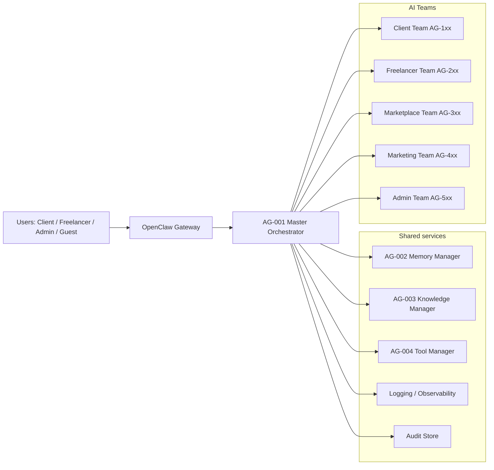
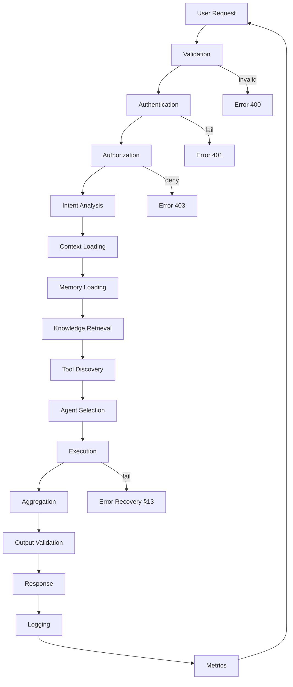
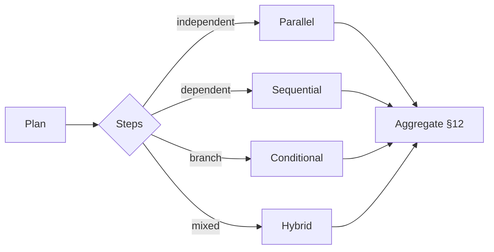
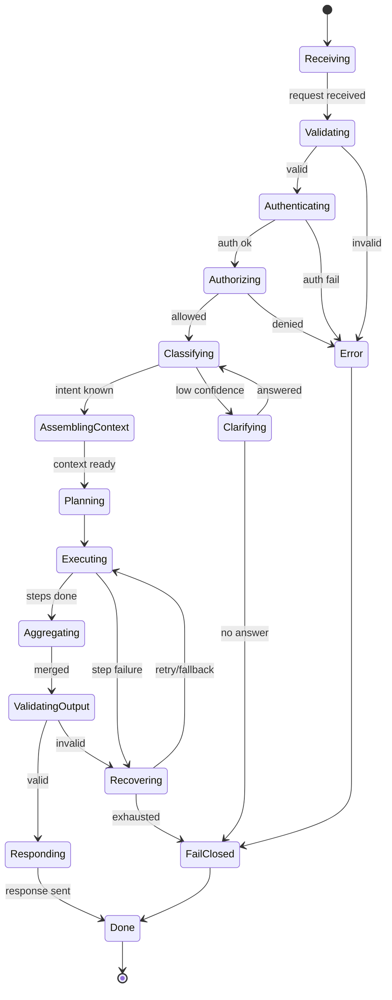
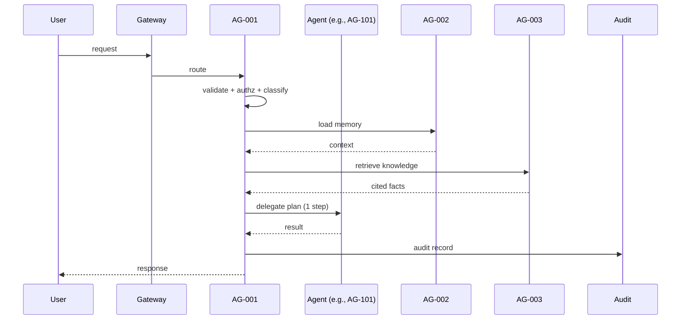
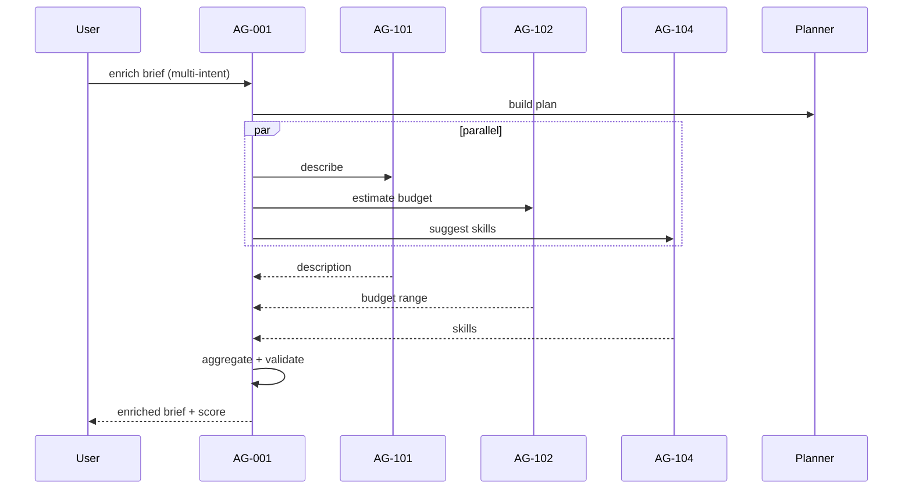
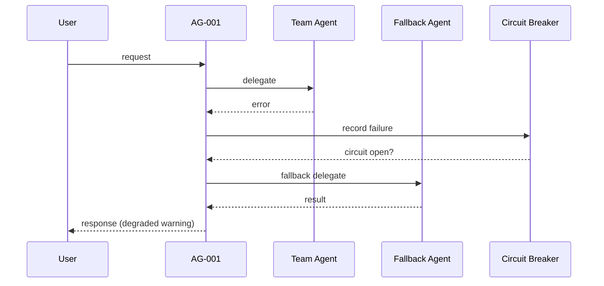

# AG-001 — Master Orchestrator · Engineering Specification v1.0

**Component:** AG-001 Master Orchestrator · **Spec version:** 1.0.0 · **Status:** In Development · **Priority:** Critical
**Owner:** FreelancifyHub Engineering · **Last updated:** 2026-08-01

> [!IMPORTANT]
> This is the official **engineering specification** for **AG-001 Master
> Orchestrator** — the implementation guide. It is fully governed by and must
> never contradict:
>
> - [`docs/freelancify-ai-blueprint-v1.0.md`](./freelancify-ai-blueprint-v1.0.md) — architecture (esp. §4, §7, §9, §15–17, §23–24)
> - [`docs/product-requirements-v1.md`](./product-requirements-v1.md) — functional spec (esp. BR-AI-_, BR-RATE-_, AC-*)
> - [`docs/agent-catalog-v1.md`](./agent-catalog-v1.md) — agent registry (esp. AG-001 entry, §9)
>
> No implementation code is included. Interfaces are **logical contracts only**
> (§15). Unresolved decisions are listed in §24 (Open Questions), not guessed.

---

## Table of Contents

1. [Executive Summary](#1-executive-summary)
2. [System Context](#2-system-context)
3. [Responsibilities](#3-responsibilities)
4. [Request Lifecycle](#4-request-lifecycle)
5. [Intent Classification](#5-intent-classification)
6. [Agent Routing Engine](#6-agent-routing-engine)
7. [Context Engine](#7-context-engine)
8. [Memory Coordination](#8-memory-coordination)
9. [Knowledge Coordination](#9-knowledge-coordination)
10. [Tool Coordination](#10-tool-coordination)
11. [Execution Planner](#11-execution-planner)
12. [Response Aggregation](#12-response-aggregation)
13. [Error Handling](#13-error-handling)
14. [Security](#14-security)
15. [APIs (Logical Contracts)](#15-apis-logical-contracts)
16. [Events](#16-events)
17. [State Machine](#17-state-machine)
18. [Sequence Diagrams](#18-sequence-diagrams)
19. [Observability](#19-observability)
20. [Cost Management](#20-cost-management)
21. [Performance Targets](#21-performance-targets)
22. [Configuration](#22-configuration)
23. [Testing Strategy](#23-testing-strategy)
24. [Risks](#24-risks)
25. [Future Roadmap](#25-future-roadmap)
26. [Acceptance Criteria](#26-acceptance-criteria)
27. [Open Questions](#27-open-questions)
28. [Decision Records (ADR)](#28-decision-records-adr)

---

## 1. Executive Summary

### Purpose

Define exactly how **AG-001 Master Orchestrator** operates: the single entry
point for every agent interaction in the Freelancify AI ecosystem. This
document is the implementation guide for intent classification, routing,
context/memory/knowledge/tool coordination, execution planning, aggregation,
error recovery, security, observability and cost control.

### Scope

**In scope:** the orchestrator's request lifecycle, routing engine, context
engine, coordination contracts with AG-002/AG-003/AG-004, execution planner,
response aggregation, error handling, security, observability, cost control,
events, state machine, configuration and testing strategy.

**Out of scope:** implementation code; business logic of any team agent;
memory/knowledge/tool internals (owned by AG-002/003/004); channel handling
(OpenClaw gateway, blueprint §6); model provider details.

### Responsibilities (summary)

- Classify intents and select the correct agent/team.
- Assemble minimal context; coordinate memory, knowledge and tools.
- Plan and execute (single/parallel/sequential/conditional/hybrid).
- Aggregate responses, recover from failures, and stay fail-closed.
- Enforce security, emit observability, and control cost.

### Non-Responsibilities

| Not responsible for                         | Why / owner                               |
| ------------------------------------------- | ----------------------------------------- |
| Business decisions (pricing, approval, ban) | Team agents + humans (BR-AI-2/3)          |
| Persisting long-term state                  | AG-002 Memory Manager                     |
| Grounding facts / citations                 | AG-003 Knowledge Manager                  |
| Executing or permitting tools               | AG-004 Tool Manager (mediation only)      |
| Money / identity mutations                  | Escrow + approval gates (BR-ESC, BR-AI-2) |
| Channel/session plumbing                    | OpenClaw gateway (blueprint §6)           |
| Rendering UI                                | Edge layer (blueprint §5)                 |

### Business Value

- Deterministic, safe coordination across all six teams (catalog §16).
- Full auditability of every decision (blueprint §9.2, §23).
- One changeable routing/config surface instead of hard-coded agent calls.

---

## 2. System Context

The orchestrator sits between the OpenClaw gateway (edge) and all teams,
sitting above shared services.



> [!NOTE]
> AG-001 is the **only** component that talks to team agents. Agents never call
> each other directly (hub-and-spoke, blueprint §7.3).

---

## 3. Responsibilities

| #   | Responsibility             | Behaviour                                                         |
| --- | -------------------------- | ----------------------------------------------------------------- |
| R1  | **Intent Detection**       | Extract user intent from the request (see §5)                     |
| R2  | **Request Classification** | Classify intent + risk class (normal / money / identity / policy) |
| R3  | **Agent Selection**        | Pick agent/team via the Routing Engine (§6)                       |
| R4  | **Context Assembly**       | Build minimal request context via Context Engine (§7)             |
| R5  | **Memory Coordination**    | Load/save context with AG-002 (§8)                                |
| R6  | **Knowledge Coordination** | Retrieve grounded facts via AG-003 (§9)                           |
| R7  | **Tool Coordination**      | Validate + execute tool calls via AG-004 (§10)                    |
| R8  | **Execution Planning**     | Compose single/multi-agent plans (§11)                            |
| R9  | **Response Aggregation**   | Merge/rank/format outputs (§12)                                   |
| R10 | **Error Recovery**         | Retry, degrade, escalate, fail-closed (§13)                       |
| R11 | **Observability**          | Emit logs, metrics, traces, events (§19)                          |
| R12 | **Cost Control**           | Budget tokens, cache, reuse responses (§20)                       |
| R13 | **Security**               | AuthN/Z, injection defense, PII/secrets, audit (§14)              |

---

## 4. Request Lifecycle



| Step                   | Owner                | Key behaviour                                      |
| ---------------------- | -------------------- | -------------------------------------------------- |
| 1. Validation          | AG-001               | Schema-validate request; reject malformed payloads |
| 2. Authentication      | AG-001 + gateway     | Verify identity (OAuth2/Bearer)                    |
| 3. Authorization       | AG-001               | Enforce user role + namespace scope                |
| 4. Intent Analysis     | AG-001 (LLM)         | Classify intent + confidence (§5)                  |
| 5. Context Loading     | Context Engine       | Assemble minimal context (§7)                      |
| 6. Memory Loading      | AG-002               | Fetch short-term/project/user memory               |
| 7. Knowledge Retrieval | AG-003               | Ground facts with citations                        |
| 8. Tool Discovery      | AG-004               | Enumerate permitted tools for intent               |
| 9. Agent Selection     | Routing Engine       | Pick agent + plan (§6)                             |
| 10. Execution          | Execution Planner    | Run plan (§11)                                     |
| 11. Aggregation        | Response Aggregation | Merge/rank/format (§12)                            |
| 12. Output Validation  | AG-001               | Validate against output contract (§15)             |
| 13. Response           | AG-001               | Return traceable response                          |
| 14. Logging            | AG-001               | Emit events + audit (§19)                          |
| 15. Metrics            | AG-001               | Emit latency/cost/error metrics                    |

---

## 5. Intent Classification

### Supported intents (v1)

| Intent             | Route target                | Risk class |
| ------------------ | --------------------------- | ---------- |
| `project.create`   | AG-101 → AG-102/103/104/105 | Normal     |
| `project.edit`     | AG-101                      | Normal     |
| `project.view`     | Read path                   | Normal     |
| `bids.review`      | Client → AG-206 (shortlist) | Normal     |
| `hire.create`      | AG-301/302 + approval gate  | Money      |
| `payment.release`  | Escrow + human gate         | Money      |
| `proposal.create`  | AG-201 (+ AG-205)           | Normal     |
| `profile.optimize` | AG-202                      | Normal     |
| `portfolio.create` | AG-203                      | Normal     |
| `resume.create`    | AG-204                      | Normal     |
| `match.recommend`  | AG-206                      | Normal     |
| `career.advise`    | AG-207                      | Normal     |
| `contract.create`  | AG-301                      | Money      |
| `milestone.plan`   | AG-302                      | Money      |
| `review.create`    | AG-303                      | Normal     |
| `dispute.open`     | AG-305 + Admin              | Policy     |
| `support.ask`      | AG-306 (rail) + AG-003      | Normal     |
| `fraud.review`     | AG-502 (Admin)              | Policy     |
| `analytics.query`  | AG-501                      | Normal     |
| `marketing.*`      | AG-4xx (Admin/Marketing)    | Normal     |
| `admin.*`          | AG-5xx (Admin)              | Policy     |

### Confidence thresholds

| Level  | Confidence  | Action                                                               |
| ------ | ----------- | -------------------------------------------------------------------- |
| High   | ≥ 0.80      | Route directly                                                       |
| Medium | 0.55 – 0.79 | Route + include clarification nudge in response                      |
| Low    | < 0.55      | Do **not** guess — fall back to clarify (T1 escalation, catalog §18) |

### Fallback rules

- Unknown intent → fail-closed message + human escalation path (blueprint §4.6).
- Unavailable agent → route to best-capability substitute listed in the
  catalog's fallback field; if none → fail-closed.
- Classification timeout → treat as Low confidence.

### Ambiguous requests

- Ask one targeted clarifying question, never a list (blueprint §10.5).
- Use user context (role, page) as a prior before asking.

### Multi-intent handling

- Detect multiple intents; execute in dependency order (sequential or hybrid,
  §11); always surface a summary of what was done.
- If intents conflict (e.g., `payment.release` + `dispute.open`) → stop and
  ask; never auto-resolve.

---

## 6. Agent Routing Engine

### Routing strategy

- **Config-driven rule table first** (deterministic), LLM classification only
  for genuinely ambiguous intents (blueprint §9.3, §9.5).
- Routing table lives in configuration (§22) and the Knowledge Base policy
  docs; it is not embedded in prompts.

### Priority rules

1. **Explicit role/scope match** (user role + namespace) wins.
2. **Risk class** overrides: money/identity/policy intents route to gated paths.
3. Most-specific intent matches first (first-match-wins, blueprint-style).
4. Ambiguity defers to lowest-cost clarifying path.

### Capability matching

- Match intent → agent capability matrix (catalog §15 dependency graph).
- An agent must declare the capability in its catalog entry; the orchestrator
  never assumes capability.

### Load distribution

- Orchestrator is stateless (blueprint §9.3) → replicas scale horizontally.
- Long or batch work is queued (event-driven workers, blueprint §18).
- Priority queues: `payment/security > user-facing > batch`.

### Fallback agents

| Intent           | Primary | Fallback               | Condition   |
| ---------------- | ------- | ---------------------- | ----------- |
| Brief enrichment | AG-101  | Manual editor          | AG-101 down |
| Matching         | AG-206  | Rules-based ranker     | AG-206 down |
| Support          | AG-306  | AG-003 KB answer       | AG-306 down |
| Analytics        | AG-501  | Preset charts (AG-503) | AG-501 down |

### Escalation rules

- T1 clarify → T2 team → T3 human approval (money/identity) → T4 Admin
  (dispute/fraud) → T5 incident (catalog §18, blueprint §4).
- Escalation is always logged with reason + SLA timer.

---

## 7. Context Engine

### Context assembly

- Compose: request payload + resolved identity + role scope + active plan
  state + relevant memory + cited knowledge + tool availability.
- **Minimal context principle:** include only what the selected agent needs.

### Context compression

- Trim conversation tails to the last N turns + summarised older context.
- Summaries are written back to AG-002 (short-term) before eviction.

### Context prioritization

1. Policy/security constraints (highest priority).
2. Fresh, cited knowledge (AG-003).
3. User/project state (AG-002).
4. History (lowest; compressed).

### Token budget management

- Per-request token budget assigned by intent class (§20).
- Budget is split: system/policy < context < agent working memory < output.
- Overflow → compress context first, then drop history, never policy.

---

## 8. Memory Coordination

Interaction with **AG-002 Memory Manager** (catalog §9; blueprint §15).

| Memory type          | Read at                           | Write at             | TTL                  |
| -------------------- | --------------------------------- | -------------------- | -------------------- |
| Short-term (session) | Lifecycle step 6                  | After each turn      | Session              |
| Conversation         | Step 6                            | After response       | Configurable (days)  |
| Project              | Step 6 (namespace `project:<id>`) | On state change      | Project life         |
| User                 | Step 6 (namespace `user:<id>`)    | On preference change | Long-term            |
| Long-term            | Step 6                            | Rare                 | Long-term + archived |

Rules:

- Keys are namespaced `domain:entity:attribute` (blueprint §15.3).
- Writes carry owner + reason for audit.
- Cross-namespace reads are rejected (blueprint §15, BR-ADM-1).
- On memory read failure → proceed with degraded context, log event.

---

## 9. Knowledge Coordination

Interaction with **AG-003 Knowledge Manager** (catalog §9; blueprint §16).

| Source type        | Used for                 | Citation required |
| ------------------ | ------------------------ | ----------------- |
| Policies           | Rules, guardrails (BR-*) | Yes               |
| FAQs               | Support answers          | Yes               |
| Platform docs      | Product behaviour        | Yes               |
| External knowledge | Research (AG-401 output) | Yes               |

- **Caching:** hot query results cached with the KB version tag; invalidated on
  KB version bump (blueprint §16.3).
- If retrieval fails or returns nothing → the agent must **not** answer
  uncited facts; it responds fail-closed (BR-AI-4).
- Knowledge freshness flags surface as "may be stale" to the caller.

---

## 10. Tool Coordination

Interaction with **AG-004 Tool Manager** (catalog §9; blueprint §17).

| Stage                     | Behaviour                                                       |
| ------------------------- | --------------------------------------------------------------- |
| **Discovery**             | AG-004 returns tools allowed for the selected agent             |
| **Selection**             | Orchestrator/agent picks the minimal tool for the step          |
| **Permission validation** | AG-004 default-deny; allow-list enforced                        |
| **Execution**             | Through AG-004 only; never direct                               |
| **Timeouts**              | Per-tool timeout (default 10s; long tasks 60s)                  |
| **Retries**               | Idempotent tools: max 3 backoff; mutating tools: no blind retry |

Rules:

- Mutating tools (money/identity) require an approval gate (blueprint §17.4).
- Tool result schema is validated before use in the agent's context.
- Denied calls return `TOOL_DENIED` with reason (catalog AG-004 acceptance).

---

## 11. Execution Planner

| Mode            | Use case                                                  | Notes                   |
| --------------- | --------------------------------------------------------- | ----------------------- |
| **Single**      | One agent, one intent (most requests)                     | Default path            |
| **Parallel**    | Independent reads (e.g., AG-102 + AG-103)                 | Fan-out/fan-in, bounded |
| **Sequential**  | Dependent steps (e.g., AG-101 → AG-104 → AG-206)          | Dependency order        |
| **Conditional** | Branch on confidence/risk (e.g., risk class → gate)       | Policy-driven           |
| **Hybrid**      | Mixed (e.g., parallel estimates then sequential planning) | Composed plans          |



Planning rules:

- Plans are **declarative, versioned and re-runnable** (idempotent, blueprint §9.5).
- Fan-out is bounded (max 5 concurrent; §21).
- Every plan step records the agent used + result for audit.

---

## 12. Response Aggregation

| Concern                 | Behaviour                                                                    |
| ----------------------- | ---------------------------------------------------------------------------- |
| **Merge responses**     | Combine agent outputs into one coherent answer                               |
| **Conflict resolution** | On disagreement → lowest-confidence claim flagged, not merged silently       |
| **Ranking**             | Multi-option outputs (e.g., candidate shortlists) rank by fit score          |
| **Confidence scoring**  | Per-answer confidence emitted with the response                              |
| **Formatting**          | Follow the response contract (§15); plain language; citations where required |

Rules:

- Never merge conflicting money/identity facts; surface the conflict.
- Aggregate audit: response references every contributing agent + event.
- Fail-closed output includes an explicit "I couldn't complete this" state.

---

## 13. Error Handling

| Failure               | Detection                          | Recovery                                      |
| --------------------- | ---------------------------------- | --------------------------------------------- |
| **Agent failure**     | Agent returns error / no heartbeat | Fallback agent or re-plan; log                |
| **Timeout**           | Step deadline exceeded             | Cancel step; retry (if idempotent); degrade   |
| **Tool failure**      | AG-004 returns error               | Retry idempotent; surface `TOOL_FAILED`       |
| **Memory failure**    | AG-002 error                       | Degrade context; continue; log                |
| **Knowledge failure** | AG-003 error                       | Block uncited answers; fail-closed            |
| **LLM failure**       | Provider error / invalid output    | Retry with fallback model (§20)               |
| **Partial success**   | Some steps done                    | Return partial + explicit "incomplete" marker |

### Retry matrix

| Failure                  | Retryable | Max attempts | Backoff |
| ------------------------ | --------- | ------------ | ------- |
| Idempotent tool call     | Yes       | 3            | exp     |
| Non-idempotent tool call | No        | 1            | —       |
| LLM call                 | Yes       | 3            | exp     |
| Classification           | Yes       | 2            | short   |
| Memory/KB read           | Yes       | 2            | short   |

### Circuit breaker strategy

- Per dependency (agent/tool/LLM): on ≥ 5 consecutive failures → open for
  `circuit.openMs` (default 30s) → fall back to substitute; half-open probe
  after cooldown.
- Circuit state is emitted as a metric and alert (§19).

---

## 14. Security

| Concern                      | Controls                                                                                           |
| ---------------------------- | -------------------------------------------------------------------------------------------------- |
| **Authentication**           | OAuth2/Bearer verified at gateway + orchestrator (BR/authn)                                        |
| **Authorization**            | Role scopes + namespace allow-lists (BR-ADM-1)                                                     |
| **Prompt injection defense** | Treat user input as data, not instructions; sandboxed tool args; output validation (blueprint §24) |
| **Data leakage prevention**  | Namespace isolation; no cross-namespace context; context minimisation (§7)                         |
| **PII protection**           | Redaction at logger boundary; data minimisation (blueprint §24)                                    |
| **Secrets handling**         | Never in prompts/logs; env-only (BR secrets)                                                       |
| **Audit logging**            | Every route/policy/approval/tool decision written to audit store (blueprint §23)                   |

Fail-closed guarantee: any security uncertainty halts the request and
escalates (blueprint §4.6).

---

## 15. APIs (Logical Contracts)

Logical interfaces only — no implementation.

### Input contract

```text
POST orchestrator/request
{
  "trace_id": "uuid",            // correlation id
  "user": { "id", "role", "scopes" },
  "request": { "type", "payload" },  // validated schema
  "context": { "page", "project_id"? }
}
```

### Output contract

```text
{
  "trace_id": "uuid",
  "status": "ok" | "partial" | "fail_closed",
  "answer": { "text", "citations"?, "confidence" },
  "actions": [ { "event", "agent", "result" } ],
  "warnings": [ "..." ]?
}
```

### Error contracts

| Code                  | Meaning                                                 |
| --------------------- | ------------------------------------------------------- |
| `400 INVALID_REQUEST` | Schema/validation failure                               |
| `401 UNAUTHENTICATED` | Missing/invalid credentials                             |
| `403 UNAUTHORIZED`    | Role/scope denied                                       |
| `409 CONFLICT`        | Conflicting multi-intent detected                       |
| `422 UNPROCESSABLE`   | Valid but semantically invalid (e.g., ambiguous intent) |
| `429 RATE_LIMITED`    | Rate limit exceeded (BR-RATE-2)                         |
| `500 INTERNAL`        | Orchestrator failure (retryable per §13)                |
| `503 DEGRADED`        | Dependency unavailable → fail-closed/fallback           |

---

## 16. Events

| Event                | Emitted at       | Payload highlights                 |
| -------------------- | ---------------- | ---------------------------------- |
| `RequestReceived`    | Lifecycle step 1 | trace_id, user, request type       |
| `IntentDetected`     | Step 4           | intent, confidence, risk class     |
| `AgentSelected`      | Step 9           | agent id, fallback?, plan version  |
| `ExecutionStarted`   | Step 10          | plan id, mode                      |
| `ExecutionCompleted` | Step 11          | per-step results                   |
| `ExecutionFailed`    | Error path       | failure type, retry, circuit state |
| `ResponseGenerated`  | Step 13          | status, confidence, cost           |

All events carry `trace_id` and feed logs, metrics, and the audit store
(blueprint §23, §19 this spec).

---

## 17. State Machine



---

## 18. Sequence Diagrams

### 18.1 Single-agent request



### 18.2 Multi-agent request



### 18.3 Failure recovery



---

## 19. Observability

| Concern           | Detail                                                                                   |
| ----------------- | ---------------------------------------------------------------------------------------- |
| **Logs**          | pino JSON; `service=freelancify-ai`, `agent=AG-001`, `trace_id`, `event` (blueprint §23) |
| **Metrics**       | Routing accuracy, p95 latency, cost/request, error rate, circuit state, concurrency      |
| **Tracing**       | Trace ID across every hop (lifecycle step 14)                                            |
| **Alerts**        | Error-rate spike, circuit open, approval-gate timeout, cost > 2× baseline                |
| **Dashboards**    | Routing, latency, cost, fail-closed rate, audit write success                            |
| **Health checks** | `/healthz` liveness + `/readyz` readiness (dependency check)                             |

---

## 20. Cost Management

| Control              | Policy                                                                                                       |
| -------------------- | ------------------------------------------------------------------------------------------------------------ |
| **Model selection**  | Default `claude-sonnet`, fallback `gpt-4o`; `high` reasoning only for scoring/fraud intents (catalog AG-001) |
| **Token budgets**    | Per-intent-class budget (§7.4); hard caps per request                                                        |
| **Caching strategy** | Cache classification + KB retrieval (version-tagged, §9)                                                     |
| **Response reuse**   | Identical/idempotent requests return cached result when safe                                                 |
| **Rate limiting**    | 100 req/min per user (BR-RATE-2); per-agent caps via AG-004                                                  |
| **Cost monitoring**  | Cost/request attributed to agent; alert on anomaly (AG-504)                                                  |

---

## 21. Performance Targets

| Target                     | Value                                                              |
| -------------------------- | ------------------------------------------------------------------ |
| **Latency (single-agent)** | p95 < 2.5s (AI paths) / < 500ms (non-AI paths)                     |
| **Latency (multi-agent)**  | p95 < 8s (bounded parallel fan-out)                                |
| **Availability**           | 99.9% (with graceful degradation to fallbacks)                     |
| **Scalability**            | Horizontal, stateless replicas; queue-based batch (§6)             |
| **Concurrency**            | Max 5 parallel steps/plan; autoscale replicas by queue depth + CPU |

---

## 22. Configuration

Configuration is versioned, validated (Zod at runtime), and reviewed.

| Key                               | Default         | Purpose                       |
| --------------------------------- | --------------- | ----------------------------- |
| `orchestrator.confidence.high`    | 0.80            | High-confidence threshold     |
| `orchestrator.confidence.low`     | 0.55            | Low-confidence threshold      |
| `orchestrator.fanout.max`         | 5               | Parallel steps per plan       |
| `orchestrator.tool.timeoutMs`     | 10000           | Default tool timeout          |
| `orchestrator.circuit.failures`   | 5               | Circuit-open threshold        |
| `orchestrator.circuit.openMs`     | 30000           | Circuit cooldown              |
| `orchestrator.cost.maxPerRequest` | (USD)           | Hard cost cap                 |
| `orchestrator.model.primary`      | `claude-sonnet` | Primary model                 |
| `orchestrator.model.fallback`     | `gpt-4o`        | Fallback model                |
| `orchestrator.cache.ttl`          | 300s            | Response/classification cache |

### Feature flags

| Flag                     | Default | Effect                     |
| ------------------------ | ------- | -------------------------- |
| `multiIntent.enabled`    | true    | Enable multi-intent plans  |
| `parallel.enabled`       | true    | Enable parallel execution  |
| `circuitBreaker.enabled` | true    | Enable circuit breaker     |
| `cache.responses`        | true    | Enable safe response reuse |

### Limits

- Per-user 100 req/min (BR-RATE-2).
- Per-plan 8 steps; per-request 20k output tokens cap.
- Batch job queue max depth per shard.

---

## 23. Testing Strategy

| Layer           | Scope                                                               | Examples                 |
| --------------- | ------------------------------------------------------------------- | ------------------------ |
| **Unit**        | Classification thresholds, routing table, retry matrix, budget calc | Confidence gating        |
| **Integration** | AG-001 ↔ AG-002/003/004 contracts                                   | Memory load, tool denial |
| **Contract**    | Input/output/error schemas (§15)                                    | 400/403/429 mapping      |
| **Load**        | Throughput at 100 req/min/user + autoscale                          | p95 under load           |
| **Chaos**       | Dependency failure (agent/KB/tool down)                             | Fallback + circuit open  |
| **Security**    | Injection, namespace leaks, PII redaction                           | Prompt-injection suite   |
| **Acceptance**  | GIVEN/WHEN/THEN against §26 criteria                                | Fail-closed behaviour    |

---

## 24. Risks

| Category        | Risk                            | Likelihood | Impact   | Mitigation                                          |
| --------------- | ------------------------------- | ---------- | -------- | --------------------------------------------------- |
| **Technical**   | LLM outage                      | Med        | High     | Fallback model, degraded mode                       |
| **Technical**   | Misclassification → wrong agent | Med        | Med      | Confidence gates, clarify, audit                    |
| **Technical**   | Fan-out cost/latency blow-up    | Med        | Med      | Budgets, caps, caching                              |
| **Operational** | Circuit breaker false trips     | Low        | Med      | Tune threshold, half-open probes                    |
| **Operational** | Audit loss                      | Low        | Critical | Durable audit store, write-fail halts sensitive ops |
| **Business**    | Fail-closed harms UX            | Med        | Low      | Clear messaging + fast human escalation             |

---

## 25. Future Roadmap

| Version | Scope                                                                                                       |
| ------- | ----------------------------------------------------------------------------------------------------------- |
| **v1**  | Deterministic routing, single/multi intent, fallbacks, circuit breaker, cost caps, audit (this spec)        |
| **v2**  | Adaptive routing (learned from outcomes), semantic intent, self-tuning budgets, plan reuse                  |
| **v3**  | Autonomous multi-hop research plans, cross-request planning, dynamic team formation (still gated by safety) |

---

## 26. Acceptance Criteria

Measurable criteria (GIVEN / WHEN / THEN). All gate **Production** status.

| #         | Criterion                                                                                                  |
| --------- | ---------------------------------------------------------------------------------------------------------- |
| AC-ORC-1  | A valid request routes to the correct agent ≥ 99% of the time (routing test set).                          |
| AC-ORC-2  | Low-confidence intent (< 0.55) never executes an action — it clarifies or fails closed.                    |
| AC-ORC-3  | Money/identity intents always require an approval gate (BR-AI-3); 0 bypasses.                              |
| AC-ORC-4  | Every request emits a full event set (`RequestReceived`→`ResponseGenerated`) with a shared `trace_id`.     |
| AC-ORC-5  | Every decision (route, policy, tool, approval) is written to the audit store; 0 gaps.                      |
| AC-ORC-6  | p95 single-agent latency ≤ 2.5s; multi-agent ≤ 8s under target load.                                       |
| AC-ORC-7  | Dependency failure triggers fallback or fail-closed within the retry matrix (§13); no silent wrong answer. |
| AC-ORC-8  | Cross-namespace context reads are rejected 100% (namespace allow-list).                                    |
| AC-ORC-9  | Per-user rate limit 100 req/min returns `429 RATE_LIMITED` with `Retry-After`.                             |
| AC-ORC-10 | Circuit breaker opens after 5 consecutive dependency failures and recovers after cooldown.                 |

---

## 27. Open Questions

| #    | Question                                                                   | Owner              | Blocking?     |
| ---- | -------------------------------------------------------------------------- | ------------------ | ------------- |
| OQ-1 | Exact embedding/cache backend for classification cache                     | Platform           | No            |
| OQ-2 | Per-intent token budget table values (to be tuned in load testing)         | Platform           | No            |
| OQ-3 | Whether `marketing.*` intents require role gate at gateway or orchestrator | Security           | No            |
| OQ-4 | Default conversation TTL for short-term memory                             | Product            | No            |
| OQ-5 | Approval-gate UI handoff contract (async vs sync)                          | Product + Platform | Yes (Phase 4) |

---

## 28. Decision Records (ADR)

| ID          | Decision                                            | Rationale                                  | Cross-ref      |
| ----------- | --------------------------------------------------- | ------------------------------------------ | -------------- |
| ADR-ORC-001 | Config-driven routing first, LLM only for ambiguity | Determinism + testability (blueprint §9.3) | Blueprint §9.5 |
| ADR-ORC-002 | Star topology; orchestrator is the only talker      | Auditability, no hidden coupling           | Blueprint §7.3 |
| ADR-ORC-003 | Orchestrator is stateless                           | Horizontal scaling                         | Blueprint §9.3 |
| ADR-ORC-004 | Fail-closed on any uncertainty                      | Safety philosophy                          | Blueprint §4.6 |
| ADR-ORC-005 | Logical contracts only in this spec                 | Avoids premature implementation            | Catalog AG-001 |
| ADR-ORC-006 | Circuit breaker on every external dependency        | Bounded blast radius                       | §13            |
| ADR-ORC-007 | Audit write is mandatory for sensitive operations   | Compliance + trust (blueprint §24)         | §14            |

---

## Appendix A — Cross-references

| Reference              | Used for                |
| ---------------------- | ----------------------- |
| Blueprint §4           | Fail-closed philosophy  |
| Blueprint §7           | Multi-agent topology    |
| Blueprint §9           | Master Orchestrator     |
| Blueprint §15 / AG-002 | Memory coordination     |
| Blueprint §16 / AG-003 | Knowledge coordination  |
| Blueprint §17 / AG-004 | Tool coordination       |
| Blueprint §23          | Logging standards       |
| Blueprint §24          | Security standards      |
| PRD BR-AI-1..5         | AI guardrails           |
| PRD BR-RATE-2          | Rate limits             |
| PRD AC-24..26          | AI guardrail acceptance |
| Catalog AG-001 entry   | Component contract      |

## Appendix B — Amendment Record

| Version | Date       | Change                                                           |
| ------- | ---------- | ---------------------------------------------------------------- |
| 1.0     | 2026-08-01 | Initial release of the AG-001 Master Orchestrator specification. |
