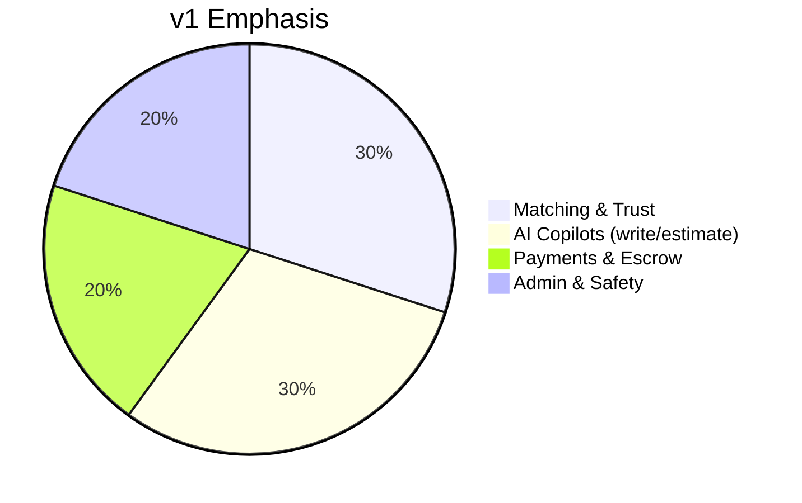
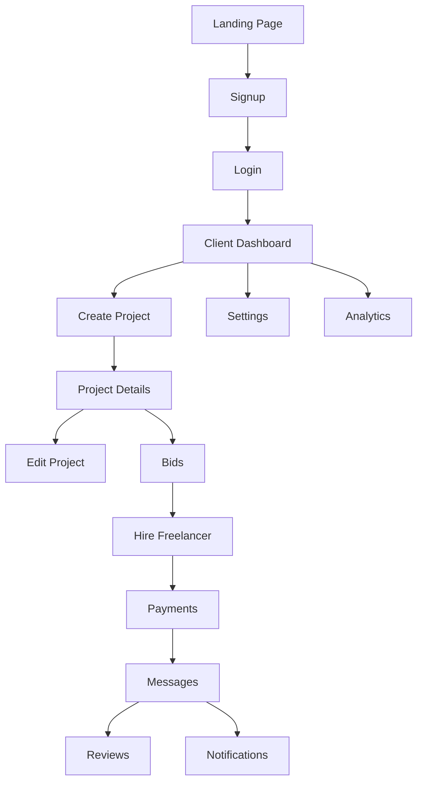
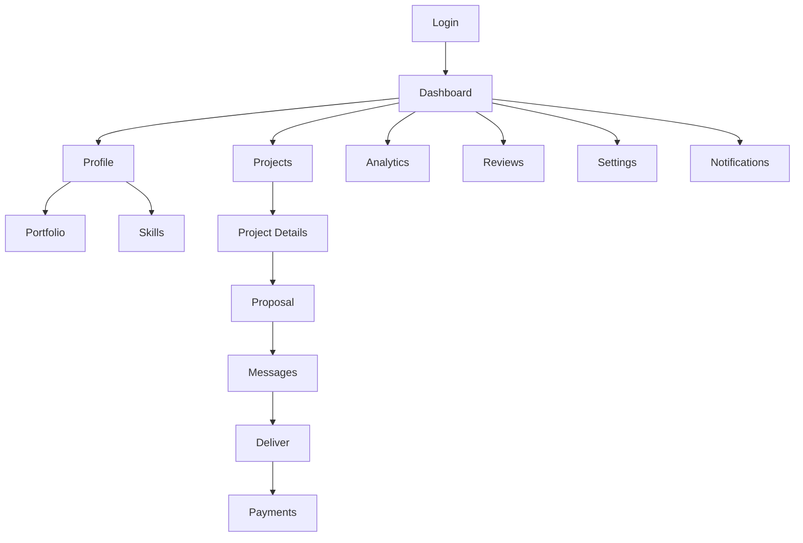
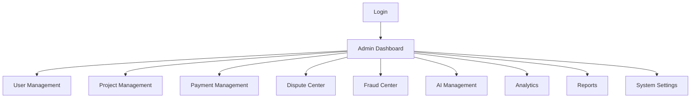
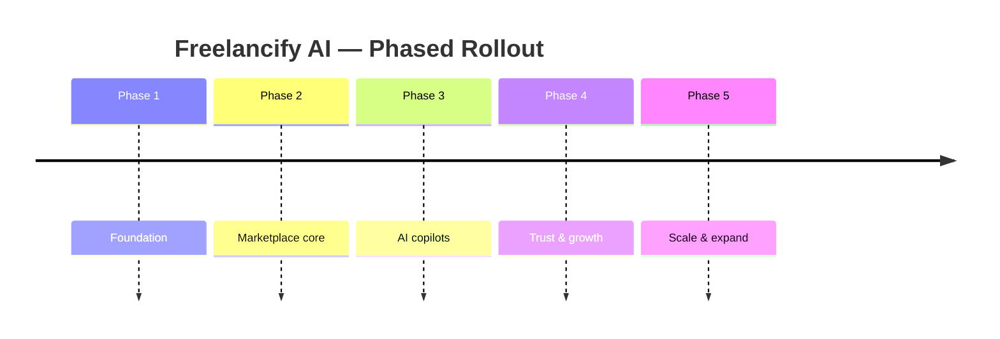

# Freelancify AI — Product Requirements Document (PRD)

**Version:** v1.0 · **Status:** Official functional specification · **Owner:** FreelancifyHub Product & Engineering
**Last updated:** 2026-08-01

> [!NOTE]
> This PRD is the **official functional specification** for the Freelancify AI
> ecosystem. It defines what we build and why. It complements (but does not
> replace) the architecture guide
> [`freelancify-ai-blueprint-v1.0.md`](./freelancify-ai-blueprint-v1.0.md),
> which defines _how_ the system is engineered.
>
> No implementation code is included in this document.

---

## Table of Contents

1. [Executive Summary](#executive-summary)
2. [Vision](#vision)
3. [Business Goals](#business-goals)
4. [User Personas](#user-personas)
5. [Marketplace Journey](#marketplace-journey)
6. [Client Journey](#client-journey)
7. [Freelancer Journey](#freelancer-journey)
8. [Admin Journey](#admin-journey)
9. [AI Features](#ai-features)
10. [Business Rules](#business-rules)
11. [Functional Requirements](#functional-requirements)
12. [Non-Functional Requirements](#non-functional-requirements)
13. [Success Metrics](#success-metrics)
14. [Risks](#risks)
15. [Roadmap](#roadmap)
16. [Acceptance Criteria](#acceptance-criteria)
17. [Glossary](#glossary)

---

## Executive Summary

**Freelancify AI** is the intelligence layer of **FreelancifyHub**, an
AI-powered freelance marketplace connecting **Clients** (buyers) and
**Freelancers** (sellers) under a trusted, escrow-protected, transparent
transaction model.

The product wraps every step of the freelance lifecycle — posting, matching,
pricing, vetting, contracting, delivering and paying — with AI assistance that
is **grounded, explainable and human-approved** for consequential actions.

**Key differentiators:**

- **AI at every step:** from brief-writing to proposal-writing to career
  advice, AI is a copilot, never a black box.
- **Trust by design:** escrowed payments, dispute resolution, scam detection,
  and reviews are guarded by humans.
- **Two-sided marketplace economics:** matching quality and trust metrics are
  the two north stars.

**In scope for v1:** the client, freelancer and admin journeys described below,
22 AI features, a free/pro plan model, and a phased rollout.

---

## Vision

> **FreelancifyHub is the freelance marketplace where AI removes the busywork**
> — writing, estimating, matching, and paperwork — so that clients hire faster
> and freelancers focus on doing great work. Trust, fairness and transparency
> are non-negotiable.

The product vision is **"hire and get hired in minutes, get paid with
confidence."** The marketplace feels like it is assisted by a brilliant
assistant on both sides of every transaction.

---

## Business Goals

| #   | Goal               | Target (v1)                                | Metric           |
| --- | ------------------ | ------------------------------------------ | ---------------- |
| BG1 | Fast time-to-hire  | Median < 5 days from post to hire          | Time-to-hire     |
| BG2 | High match quality | ≥ 70% bid acceptance on matched projects   | Acceptance rate  |
| BG3 | Marketplace trust  | Fraud flags resolved in < 24 h             | Resolution SLA   |
| BG4 | Revenue growth     | 5% platform fee on released payments       | GMV, fee revenue |
| BG5 | AI adoption        | ≥ 60% of posts use ≥ 1 AI feature          | Feature adoption |
| BG6 | Retention          | 30-day client & freelancer retention ≥ 50% | Retention rate   |

> [!IMPORTANT]
> Business goals map 1:1 to **AI team OKRs** in the blueprint (§8) and to the
> **Success Metrics** section of this PRD.

---

## User Personas

### 1. Client — "Priya, the Startup Founder"

| Attribute    | Detail                                                             |
| ------------ | ------------------------------------------------------------------ |
| Demographics | 28–45, non-technical or semi-technical, startup/small business     |
| Goal         | Ship a project fast without hiring a full-time team                |
| Pain         | Writes poor briefs, overpays, wastes time reviewing junk bids      |
| Motivation   | Speed, quality, transparency, safe payments                        |
| AI needs     | Wants AI to write/polish the brief, suggest budget/skills/timeline |
| Trust model  | Relies on escrow + reviews + verified freelancers                  |
| Channel      | Web, mobile, email/chat notifications                              |

### 2. Freelancer — "Omar, the Full-Stack Developer"

| Attribute    | Detail                                                          |
| ------------ | --------------------------------------------------------------- |
| Demographics | 22–45, 1–10 yrs experience, remote worker                       |
| Goal         | Find well-matched projects, win work, grow reputation           |
| Pain         | Writes weak proposals, undersells, unclear timelines            |
| Motivation   | Relevant opportunities, fair pay, career growth                 |
| AI needs     | Wants AI-drafted proposals, profile optimisation, career advice |
| Trust model  | Wants verified skills, on-time escrow release, fair reviews     |
| Channel      | Web, mobile, notifications                                      |

### 3. Admin — "Sana, the Operations Lead"

| Attribute    | Detail                                                      |
| ------------ | ----------------------------------------------------------- |
| Demographics | 25–50, operations/support/policy                            |
| Goal         | Keep the marketplace safe, fair and profitable              |
| Pain         | Manual moderation, payment disputes, fraud triage           |
| Motivation   | Efficiency, control, auditability                           |
| AI needs     | AI-assisted triage, analytics, dispute/fraud evidence packs |
| Trust model  | Human-decides; AI prepares evidence                         |
| Channel      | Admin web console                                           |

---

## Marketplace Journey

The end-to-end lifecycle that every participant moves through.

```mermaid
flowchart LR
    S[Sign up] --> R{Choose role}
    R --> C[Client]
    R --> F[Freelancer]

    C --> CP[Create profile]
    CP --> PP[Post project]
    PP --> AI1[AI: improve brief, budget, skills, timeline, success score]
    AI1 --> Publish[Publish project]
    Publish --> Bids[Receive bids]
    Bids --> FR[Review freelancer profiles]
    FR --> H{Hire?}
    H -->|yes| Pay[Pay via Stripe → escrow]
    H -->|no| Publish
    Pay --> Chat[Chat]
    Chat --> Deliver[Work delivered]
    Deliver --> RR[Review + release payment]
    RR --> Fee[Platform fee deducted]
    Fee --> LRev[Leave review]

    F --> FP[Create profile]
    FP --> Port[Complete portfolio + skills]
    Port --> AI2[AI: optimize profile]
    AI2 --> AI3[AI: recommend projects]
    AI3 --> Sub[Submit proposal]
    Sub --> AI4[AI: generate proposal]
    AI4 --> Chat
    Deliver --> Paid[Receive released payment]
    Paid --> Earn[View earnings analytics]
    Earn --> AI5[AI: career recommendations]
```

### Lifecycle steps

| Step             | Who               | Outcome                                        |
| ---------------- | ----------------- | ---------------------------------------------- |
| 1. Onboarding    | All               | Verified account + role selection              |
| 2. Profile setup | Client/Freelancer | Profile ready, AI-optimised                    |
| 3. Posting       | Client            | Published, AI-enriched project                 |
| 4. Matching      | System            | Recommended freelancers + recommended projects |
| 5. Bidding       | Freelancer        | Proposals submitted (AI-assisted)              |
| 6. Hiring        | Client            | Bid accepted, funds escrowed                   |
| 7. Delivery      | Freelancer        | Work submitted                                 |
| 8. Payment       | System            | Release + platform fee                         |
| 9. Review        | Both              | Ratings and reviews posted                     |
| 10. Retention    | System            | Re-engage via AI recommendations               |

---

## Client Journey

### Overview

---

### 1. Landing Page

| Attribute               | Content                                                         |
| ----------------------- | --------------------------------------------------------------- |
| **Purpose**             | Acquire users; explain the AI-powered marketplace; drive signup |
| **User Goals**          | Understand value in < 30s; start as Client or Freelancer        |
| **Business Goals**      | Conversion to signup (BG: signup conversion ≥ 4%)               |
| **AI Features**         | AI testimonial snippets, personalised value prop (locale/A/B)   |
| **UI Components**       | Hero, role selector, social proof, feature grid, FAQ, CTA       |
| **Validation**          | Role selection required before signup funnel continues          |
| **Success Criteria**    | ≥ 4% visitor→signup; bounces < 45%                              |
| **Edge Cases**          | Returning user → CTA "Continue"; region-specific pricing shown  |
| **Errors**              | Third-party scripts blocked → graceful fallback copy            |
| **Future Enhancements** | AI-powered role-match quiz; live platform stats                 |

### 2. Signup

| Attribute               | Content                                                           |
| ----------------------- | ----------------------------------------------------------------- |
| **Purpose**             | Account creation with role selection                              |
| **User Goals**          | Register fast (email/OAuth); pick Client or Freelancer            |
| **Business Goals**      | Clean data; verified accounts (BG: fraud reduction)               |
| **AI Features**         | (None in v1)                                                      |
| **UI Components**       | Email/password, OAuth (Google/GitHub), role toggle, T&C           |
| **Validation**          | Email format; strong password (8+ chars); role required           |
| **Success Criteria**    | Signup completion ≥ 70%; bounce at role step < 15%                |
| **Edge Cases**          | Duplicate email → merge prompt; bot signup → CAPTCHA/email verify |
| **Errors**              | Network failure → retry with state preserved; invalid token       |
| **Future Enhancements** | AI-generated starter profile from social/email hints              |

### 3. Login

| Attribute               | Content                                               |
| ----------------------- | ----------------------------------------------------- |
| **Purpose**             | Authenticate existing users                           |
| **User Goals**          | Quick, secure access                                  |
| **Business Goals**      | Retain sessions; reduce support load                  |
| **AI Features**         | (None in v1)                                          |
| **UI Components**       | Email/password, OAuth, password reset, remember-me    |
| **Validation**          | Credential check; MFA when enabled                    |
| **Success Criteria**    | Login success ≥ 95%; session restore seamless         |
| **Edge Cases**          | Locked account → support path; password reset expiry  |
| **Errors**              | "Invalid credentials"; rate-limited attempts (≤5/min) |
| **Future Enhancements** | Passkeys; AI "we noticed unusual login" alerts        |

### 4. Client Dashboard

| Attribute               | Content                                                                       |
| ----------------------- | ----------------------------------------------------------------------------- |
| **Purpose**             | Home base: project status, active engagements, next actions                   |
| **User Goals**          | See what needs attention; resume work instantly                               |
| **Business Goals**      | Drive engagement; surface revenue-generating actions                          |
| **AI Features**         | Smart next-action cards; project health hints                                 |
| **UI Components**       | Project list (status chips), pending actions, recent messages, quick-post CTA |
| **Validation**          | Data freshness (auto-refresh); no stale action cards                          |
| **Success Criteria**    | 70% of sessions take an action; < 2s load                                     |
| **Edge Cases**          | Zero projects → onboarding coach; many projects → pagination                  |
| **Errors**              | Analytics unavailable → degraded mode with retry                              |
| **Future Enhancements** | AI daily brief; predicted churn alerts                                        |

### 5. Create Project

| Attribute               | Content                                                                                                    |
| ----------------------- | ---------------------------------------------------------------------------------------------------------- |
| **Purpose**             | Post a project with AI assistance                                                                          |
| **User Goals**          | Describe the project and publish quickly                                                                   |
| **Business Goals**      | High-quality, complete listings (BG: match quality)                                                        |
| **AI Features**         | **Project Description AI, Budget Estimator, Timeline Estimator, Skill Suggestions, Project Success Score** |
| **UI Components**       | Title, description, budget, timeline, skills, milestones, success-score gauge                              |
| **Validation**          | Title ≥ 10 chars; budget ≥ platform min ($50); ≥ 1 skill                                                   |
| **Success Criteria**    | ≥ 60% of posts complete the AI-enrichment; publish < 4 min                                                 |
| **Edge Cases**          | Partial AI failure → fall back to manual inputs, retry AI                                                  |
| **Errors**              | AI timeout → graceful retry; budget below min → validation block                                           |
| **Future Enhancements** | Voice-to-brief; AI interview-style brief builder                                                           |

### 6. Project Details

| Attribute               | Content                                                    |
| ----------------------- | ---------------------------------------------------------- |
| **Purpose**             | View a published project and its AI-enriched brief         |
| **User Goals**          | Confirm quality, share/attach files, track status          |
| **Business Goals**      | Keep listings live and complete                            |
| **AI Features**         | Read-only view of AI fields; improvement suggestions       |
| **UI Components**       | Brief sections, milestones, budget/timeline chips, actions |
| **Validation**          | Display from immutable published snapshot                  |
| **Success Criteria**    | 0 rendering defects; quick copy-to-clipboard               |
| **Edge Cases**          | Archived project → read-only banner                        |
| **Errors**              | Not-found project → friendly 404                           |
| **Future Enhancements** | AI field-level edit suggestions                            |

### 7. Edit Project

| Attribute               | Content                                                 |
| ----------------------- | ------------------------------------------------------- |
| **Purpose**             | Modify a draft or published project                     |
| **User Goals**          | Fix details; re-run AI enrichment                       |
| **Business Goals**      | Keep listings accurate (reduces disputes)               |
| **AI Features**         | Re-run Description AI / estimators on change            |
| **UI Components**       | Inline edit form with live success-score update         |
| **Validation**          | Same rules as Create; version history kept              |
| **Success Criteria**    | Edit save < 2s; published edits flagged in activity log |
| **Edge Cases**          | Editing while bids exist → notify bidders of changes    |
| **Errors**              | Concurrent edit conflict → warn + merge prompt          |
| **Future Enhancements** | AI change-summary for bidders                           |

### 8. Bids

| Attribute               | Content                                                      |
| ----------------------- | ------------------------------------------------------------ |
| **Purpose**             | Review, compare and respond to proposals                     |
| **User Goals**          | Find the best freelancer quickly                             |
| **Business Goals**      | Maximise hire rate; minimise wasted review time              |
| **AI Features**         | **Project Matching** (candidate ranking), proposal summaries |
| **UI Components**       | Bid list (sorted), comparison table, profiles, accept/reject |
| **Validation**          | Bids must pass quality filters (see Business Rules)          |
| **Success Criteria**    | Review-to-decision < 48 h; top-ranked bid accepted ≥ 60%     |
| **Edge Cases**          | No bids → AI nudges matched freelancers to apply             |
| **Errors**              | Bid withdrawn during review → inline notice                  |
| **Future Enhancements** | AI negotiation assistant                                     |

### 9. Hire Freelancer

| Attribute               | Content                                                  |
| ----------------------- | -------------------------------------------------------- |
| **Purpose**             | Accept a bid and begin the engagement                    |
| **User Goals**          | Confirm terms; start the project                         |
| **Business Goals**      | Escrow-funded engagements (BG: GMV)                      |
| **AI Features**         | **Contract Generator, Milestone Generator**              |
| **UI Components**       | Terms summary, milestone plan, contract preview, confirm |
| **Validation**          | Budget and milestones required; funds to be escrowed     |
| **Success Criteria**    | Hire completion ≥ 75% after bid acceptance               |
| **Edge Cases**          | Freelancer declines after acceptance → re-match          |
| **Errors**              | Escrow payment failure → clear retry path                |
| **Future Enhancements** | AI negotiation on milestone splits                       |

### 10. Payments

| Attribute               | Content                                                          |
| ----------------------- | ---------------------------------------------------------------- |
| **Purpose**             | Fund escrow, track balance, release payments                     |
| **User Goals**          | Pay safely; control releases                                     |
| **Business Goals**      | Fee revenue; payment reliability                                 |
| **AI Features**         | (No AI on money) — analytics hints on spend                      |
| **UI Components**       | Balance, escrow status, release buttons, Stripe card/fee display |
| **Validation**          | Funds < escrow required → block; release only on milestone       |
| **Success Criteria**    | Release-to-fee deduct < 24 h; payment success ≥ 98%              |
| **Edge Cases**          | Insufficient funds → prompt top-up; refunds → Business Rules     |
| **Errors**              | Stripe decline → friendly retry; double-click protection         |
| **Future Enhancements** | AI spend insights; multi-currency auto-conversion                |

### 11. Messages

| Attribute               | Content                                                                       |
| ----------------------- | ----------------------------------------------------------------------------- |
| **Purpose**             | In-project chat with the hired freelancer                                     |
| **User Goals**          | Communicate requirements and feedback                                         |
| **Business Goals**      | Keep work on-platform (dispute evidence)                                      |
| **AI Features**         | **Support Assistant** (side rail), scam prompts flagged by **Scam Detection** |
| **UI Components**       | Threads, file upload, typing indicator, AI-help panel                         |
| **Validation**          | Messages persisted; profanity/policy filters                                  |
| **Success Criteria**    | Median reply < 30 min; on-platform chat adoption ≥ 80%                        |
| **Edge Cases**          | Offline user → push/email digest; file size limits                            |
| **Errors**              | Send failure → retry with draft preserved                                     |
| **Future Enhancements** | AI reply suggestions; meeting scheduler                                       |

### 12. Reviews

| Attribute               | Content                                                            |
| ----------------------- | ------------------------------------------------------------------ |
| **Purpose**             | Post a review after payment release                                |
| **User Goals**          | Give fair, quick feedback                                          |
| **Business Goals**      | Reputation system integrity                                        |
| **AI Features**         | **Review Generator** (draft from timeline)                         |
| **UI Components**       | Star rating (1–5), comment box, AI-draft button                    |
| **Validation**          | Only parties to a completed milestone can review; 1 per engagement |
| **Success Criteria**    | ≥ 50% of completed engagements receive a review                    |
| **Edge Cases**          | Timeout window (30 days) → auto-close; retaliatory review → flag   |
| **Errors**              | Submit failure → retry preserving text                             |
| **Future Enhancements** | Verified-purchase badges; AI review summaries                      |

### 13. Settings

| Attribute               | Content                                                             |
| ----------------------- | ------------------------------------------------------------------- |
| **Purpose**             | Manage account, privacy, notification prefs                         |
| **User Goals**          | Control profile and preferences                                     |
| **Business Goals**      | Compliance (GDPR); consent records                                  |
| **AI Features**         | (None in v1)                                                        |
| **UI Components**       | Profile, security (MFA), privacy, notifications, data export/delete |
| **Validation**          | Consent toggles persisted and auditable                             |
| **Success Criteria**    | Settings save < 1s; data-export < 24 h                              |
| **Edge Cases**          | Account deletion with active projects → blocked with workflow       |
| **Errors**              | Save conflict → retry                                               |
| **Future Enhancements** | AI privacy coach                                                    |

### 14. Notifications

| Attribute               | Content                                             |
| ----------------------- | --------------------------------------------------- |
| **Purpose**             | Keep users informed of relevant events              |
| **User Goals**          | Never miss a bid, message or milestone              |
| **Business Goals**      | Engagement + reduced churn                          |
| **AI Features**         | Intelligent notification ranking (dismiss/priority) |
| **UI Components**       | Bell, in-app toast, email/push digests, preferences |
| **Validation**          | Events follow rules; digests grouped daily          |
| **Success Criteria**    | Notification CTR ≥ 12%; opt-out rate < 5%           |
| **Edge Cases**          | Quiet hours; excessive events → digest, not spam    |
| **Errors**              | Delivery failure → retry with backoff               |
| **Future Enhancements** | AI personalised digests                             |

### 15. Analytics (Client)

| Attribute               | Content                                            |
| ----------------------- | -------------------------------------------------- |
| **Purpose**             | Track project performance and spend                |
| **User Goals**          | Understand costs, timelines and bid quality        |
| **Business Goals**      | Demonstrate value (retention)                      |
| **AI Features**         | **Analytics Assistant** (natural-language queries) |
| **UI Components**       | Spend, milestones, bid stats, charts, ask-AI box   |
| **Validation**          | Numbers reconcile with payment ledger              |
| **Success Criteria**    | ≥ 40% of active clients view analytics monthly     |
| **Edge Cases**          | Empty data → guidance copy; large data → aggregate |
| **Errors**              | Query failure → fallback to preset charts          |
| **Future Enhancements** | Predictive budget alerts                           |

---

## Freelancer Journey

### Overview

---

### 1. Dashboard

| Attribute            | Content                                                         |
| -------------------- | --------------------------------------------------------------- |
| **Purpose**          | Freelancer home: recommended work, active jobs, earnings        |
| **User Goals**       | Find opportunities; track deliverables                          |
| **AI Features**      | **Project Matching** recommendations; **Career Advisor** nudges |
| **Business Rules**   | Show only open, un-bid, matched projects                        |
| **Success Criteria** | ≥ 60% of sessions open a recommendation; < 2s load              |
| **Validation**       | Recommendations exclude projects already applied to             |
| **Errors**           | Matching service down → show recent generic list with retry     |
| **Future Features**  | AI priority ranking by "win probability"                        |

### 2. Profile

| Attribute            | Content                                                         |
| -------------------- | --------------------------------------------------------------- |
| **Purpose**          | Professional profile clients see                                |
| **User Goals**       | Look credible; get hired                                        |
| **AI Features**      | **Profile Optimizer**; **Resume Builder** sync                  |
| **Business Rules**   | AI edits must preserve factual claims; consent required to save |
| **Success Criteria** | Optimised profiles complete ≥ 85%; edit save < 2s               |
| **Validation**       | No fabrication; required fields (headline, bio, location)       |
| **Errors**           | Optimiser failure → manual edit remains available               |
| **Future Features**  | Profile strength score over time                                |

### 3. Portfolio

| Attribute            | Content                                            |
| -------------------- | -------------------------------------------------- |
| **Purpose**          | Show work samples                                  |
| **User Goals**       | Showcase best work                                 |
| **AI Features**      | **Portfolio Generator** (from past projects/links) |
| **Business Rules**   | Only freelancer-owned work; rights confirmed       |
| **Success Criteria** | ≥ 50% of active freelancers have ≥ 3 items         |
| **Validation**       | File types/sizes; link validity checked            |
| **Errors**           | Upload failure → retry, preserve metadata          |
| **Future Features**  | AI case-study writer per portfolio item            |

### 4. Skills

| Attribute            | Content                                                       |
| -------------------- | ------------------------------------------------------------- |
| **Purpose**          | Declare and verify skills                                     |
| **User Goals**       | Represent abilities accurately                                |
| **AI Features**      | **Skill Suggestions**; verification hints                     |
| **Business Rules**   | Skills must map to the taxonomy; verified skills carry badges |
| **Success Criteria** | ≥ 80% of freelancers list ≥ 3 verified skills                 |
| **Validation**       | Taxonomy match required; no duplicate skills                  |
| **Errors**           | Unknown skill → suggest closest taxonomy match                |
| **Future Features**  | Micro-tests to self-verify skills                             |

### 5. Projects

| Attribute            | Content                                                         |
| -------------------- | --------------------------------------------------------------- |
| **Purpose**          | Browse and apply to projects                                    |
| **User Goals**       | Find well-matched, open work                                    |
| **AI Features**      | **Project Matching** ranking + fit score                        |
| **Business Rules**   | Only open projects; respect availability; 1 application/project |
| **Success Criteria** | Apply-to-match ratio ≥ 40%; search < 1s                         |
| **Validation**       | Filter accuracy (budget, skills, timeline)                      |
| **Errors**           | No results → relax filters suggestion                           |
| **Future Features**  | Saved searches + AI alerts                                      |

### 6. Project Details (Freelancer)

| Attribute            | Content                                         |
| -------------------- | ----------------------------------------------- |
| **Purpose**          | Full project brief before applying              |
| **User Goals**       | Judge fit and requirements                      |
| **AI Features**      | AI-fit summary (why this project matches)       |
| **Business Rules**   | Budget/timeline shown; escrow terms transparent |
| **Success Criteria** | Fit summary viewed ≥ 70% of detail visits       |
| **Validation**       | Brief fields render from published snapshot     |
| **Errors**           | Project closed mid-view → notice                |
| **Future Features**  | AI "ask the client" question suggestion         |

### 7. Proposal

| Attribute            | Content                                                  |
| -------------------- | -------------------------------------------------------- |
| **Purpose**          | Submit a bid/proposal                                    |
| **User Goals**       | Win the project with a strong proposal                   |
| **AI Features**      | **Proposal Writer** (draft from brief + profile)         |
| **Business Rules**   | Bid amount within project range; no off-platform contact |
| **Success Criteria** | Proposal completion ≥ 70%; AI draft edit rate ≥ 50%      |
| **Validation**       | Bid ≥ platform min; message length 50–1000 words         |
| **Errors**           | AI timeout → template fallback                           |
| **Future Features**  | A/B proposal variants                                    |

### 8. Messages (Freelancer)

| Attribute            | Content                                          |
| -------------------- | ------------------------------------------------ |
| **Purpose**          | Communicate with clients                         |
| **User Goals**       | Clarify requirements, share updates              |
| **AI Features**      | **Scam Detection** flags; reply-suggestion panel |
| **Business Rules**   | On-platform only until contract; file limits     |
| **Success Criteria** | First reply < 4 h on winning proposals           |
| **Validation**       | Policy filter; PII sharing warnings              |
| **Errors**           | Send failure → retry                             |
| **Future Features**  | AI meeting/update drafts                         |

### 9. Payments (Freelancer)

| Attribute            | Content                                                    |
| -------------------- | ---------------------------------------------------------- |
| **Purpose**          | View earnings, releases, and payout status                 |
| **User Goals**       | Get paid on time; track money                              |
| **AI Features**      | (None in v1); earnings insights later                      |
| **Business Rules**   | Payouts after release + settlement window; taxes displayed |
| **Success Criteria** | Payout tracking accurate; release-to-payout < 3 days       |
| **Validation**       | Ledger reconciliation daily                                |
| **Errors**           | Payout failure → support ticket + retry                    |
| **Future Features**  | AI cash-flow forecast                                      |

### 10. Analytics (Freelancer)

| Attribute            | Content                                              |
| -------------------- | ---------------------------------------------------- |
| **Purpose**          | Earnings and performance analytics                   |
| **User Goals**       | Understand income and wins                           |
| **AI Features**      | **Analytics Assistant**; **Career Advisor** insights |
| **Business Rules**   | Aggregated, owned by the freelancer                  |
| **Success Criteria** | ≥ 45% of freelancers check monthly                   |
| **Validation**       | Matches ledger                                       |
| **Errors**           | Query failure → preset charts                        |
| **Future Features**  | Win-rate prediction                                  |

### 11. Reviews (Freelancer)

| Attribute            | Content                                                |
| -------------------- | ------------------------------------------------------ |
| **Purpose**          | Review clients and view own reputation                 |
| **User Goals**       | Maintain reputation; give feedback                     |
| **AI Features**      | **Review Generator** (draft)                           |
| **Business Rules**   | 1 review per completed engagement; retaliation flagged |
| **Success Criteria** | Reviews posted ≥ 50%; disputes on reviews < 2%         |
| **Validation**       | Window (30 days) enforced                              |
| **Errors**           | Submit failure → retry                                 |
| **Future Features**  | Reputation snapshot report                             |

### 12. Settings (Freelancer)

| Attribute            | Content                                   |
| -------------------- | ----------------------------------------- |
| **Purpose**          | Account, privacy, payouts, notifications  |
| **User Goals**       | Manage availability, payment details      |
| **AI Features**      | (None in v1)                              |
| **Business Rules**   | Payout method verified before withdrawals |
| **Success Criteria** | Save < 1s; payout method verified         |
| **Validation**       | Availability impacts matching feed        |
| **Errors**           | Payout verification failure → clear retry |
| **Future Features**  | AI availability planner                   |

### 13. Notifications (Freelancer)

| Attribute            | Content                                |
| -------------------- | -------------------------------------- |
| **Purpose**          | Alerts on matches, messages, payments  |
| **User Goals**       | Catch opportunities fast               |
| **AI Features**      | Priority-ranked notifications          |
| **Business Rules**   | Daily digest cap; quiet hours honoured |
| **Success Criteria** | Match notification CTR ≥ 20%           |
| **Validation**       | No duplicates; dedupe keys             |
| **Errors**           | Delivery failure → retry/backoff       |
| **Future Features**  | AI opportunity digest                  |

---

## Admin Journey

### 1. Dashboard

- **Purpose:** At-a-glance platform health (GMV, active projects, flags, SLA).
- **Business Rules:** KPIs reconcile with ledgers; SLA timers visible.
- **Success Criteria:** Load < 2s; alerts actionable.

### 2. User Management

- **Purpose:** Search, verify, suspend, and restore users.
- **Business Rules:** Suspensions require a reason + audit record; appeals tracked.
- **AI Features:** Risk-score hints from **Scam Detection**.
- **Success Criteria:** Verification decisions logged; lookup < 1s.

### 3. Project Management

- **Purpose:** Review, feature, or remove projects.
- **Business Rules:** Removal reasons required; client notified with appeal path.
- **Success Criteria:** Review queue SLA met; audit trail complete.

### 4. Payment Management

- **Purpose:** Monitor escrow, releases, refunds, payouts.
- **Business Rules:** Escrow is external (Stripe); admin actions are approved + logged.
- **Success Criteria:** Reconciliation daily, 0 unexplained variance.

### 5. Dispute Center

- **Purpose:** Resolve client/freelancer disputes.
- **AI Features:** **Dispute Assistant** evidence pack + resolution recommendation.
- **Business Rules:** Human decides; evidence is time-boxed; appeals allowed.
- **Success Criteria:** Resolution median < 5 days; satisfaction ≥ 70%.

### 6. Fraud Center

- **Purpose:** Triage fraud alerts.
- **AI Features:** **Scam Detection** ranked alerts with evidence.
- **Business Rules:** No auto-bans; every action human-approved.
- **Success Criteria:** False-positive rate < 10%; high-risk < 24 h SLA.

### 7. AI Management

- **Purpose:** Enable/disable agents, review logs, adjust prompts, monitor costs.
- **Business Rules:** Changes versioned; rollout gated by success metrics.
- **Success Criteria:** Feature-flag control with audit.

### 8. Analytics

- **Purpose:** Platform analytics and funnel insights.
- **AI Features:** **Analytics Assistant** natural-language exploration.
- **Business Rules:** Aggregated data; row-level access limited.
- **Success Criteria:** Funnel accuracy; drill-down < 3s.

### 9. Reports

- **Purpose:** Scheduled/compliance reports.
- **Business Rules:** Templates reviewed; PII redacted; exports gated.
- **Success Criteria:** Scheduled on time; export < 10 min.

### 10. System Settings

- **Purpose:** Platform config: fees, limits, feature flags, tax rules.
- **Business Rules:** Changes require 2 admin approvals (sensitive).
- **Success Criteria:** Config versioned + auditable; apply < 1 min.

> [!NOTE]
> The prompt lists 10 admin pages; "System Settings" completes the set. Admin
> flow follows the blueprint's **Admin AI Team** charter (humans decide, AI
> prepares).

---

## AI Features

> [!IMPORTANT]
> Every AI feature follows the same contract: **Purpose, Inputs, Outputs,
> Trigger, Business Rules, Permissions, Limitations, Future Ideas**. All AI
> output is grounded in the Knowledge Base (§16 blueprint) and logged for audit.

### Feature matrix

| #   | Feature                | Who          | Inputs                            | Outputs                    | Trigger        |
| --- | ---------------------- | ------------ | --------------------------------- | -------------------------- | -------------- |
| F1  | Project Description AI | Client       | Raw brief, files                  | Polished description       | On post / edit |
| F2  | Budget Estimator       | Client       | Brief, scope, market data         | Budget range + rationale   | On post / edit |
| F3  | Timeline Estimator     | Client       | Scope, milestones, team           | Duration estimate          | On post / edit |
| F4  | Skill Suggestions      | Client       | Brief text                        | Required skill list        | On post / edit |
| F5  | Project Success Score  | Client       | Full brief                        | Score 0–100 + drivers      | On post / edit |
| F6  | Proposal Writer        | Freelancer   | Brief, profile, history           | Proposal draft             | On apply       |
| F7  | Profile Optimizer      | Freelancer   | Profile, past wins                | Optimised copy             | On request     |
| F8  | Portfolio Generator    | Freelancer   | Past projects/links               | Portfolio items            | On request     |
| F9  | Resume Builder         | Freelancer   | Profile, portfolio                | Structured resume          | On request     |
| F10 | Cover Letter Generator | Freelancer   | Project + resume                  | Cover letter               | On apply       |
| F11 | Project Matching       | Both         | Brief, profiles, history          | Ranked matches + fit score | On post/search |
| F12 | Review Generator       | Both         | Timeline, interactions            | Review draft               | On release     |
| F13 | Contract Generator     | Client       | Terms, milestones, fees           | Contract                   | On hire        |
| F14 | Milestone Generator    | Client       | Budget, scope, timeline           | Milestone plan             | On hire        |
| F15 | Scam Detection         | System/Admin | Messages, users, payment patterns | Risk flags + evidence      | Continuous     |
| F16 | Dispute Assistant      | Admin        | Dispute + evidence                | Case summary + options     | On dispute     |
| F17 | Support Assistant      | Both         | User question, KB                 | Grounded answer            | On question    |
| F18 | Marketing Assistant    | Marketing    | Campaign brief, brand KB          | Campaign content           | On request     |
| F19 | SEO Assistant          | Marketing    | Pages, keywords                   | SEO recommendations        | On request     |
| F20 | Email Assistant        | Marketing    | Audience, template                | Email drafts               | On request     |
| F21 | Analytics Assistant    | Both/Admin   | Natural-language query, data      | Chart + narrative          | On query       |
| F22 | Career Advisor         | Freelancer   | Profile, market, history          | Career recommendations     | Periodic       |

### Detail — per feature

#### F1. Project Description AI

- **Purpose:** Turn rough briefs into clear, complete project descriptions.
- **Inputs:** Raw text, uploaded files, selected skills/budget/timeline.
- **Outputs:** Structured description (headline, summary, deliverables, acceptance criteria).
- **Trigger:** Post or edit; auto-run on first draft.
- **Business Rules:** Must not invent requirements; must keep user's intent; length 50–500 words.
- **Permissions:** Client only; writes only to the project's owner scope.
- **Limitations:** Cannot resolve ambiguity it cannot see; may require 1–2 clarifying prompts.
- **Future Ideas:** Voice-to-brief; interview-style builder.

#### F2. Budget Estimator

- **Purpose:** Suggest a realistic budget range.
- **Inputs:** Brief, skill set, market rates (KB), duration.
- **Outputs:** Range (min/mid/max) + cost drivers.
- **Trigger:** Post/edit; re-run when scope changes.
- **Business Rules:** Range ≥ platform minimum ($50); transparent assumptions.
- **Permissions:** Client only; pricing model in KB is approved by Marketplace team.
- **Limitations:** Estimates are not quotes; variability ±20% flagged.
- **Future Ideas:** Live market-rate dashboard.

#### F3. Timeline Estimator

- **Purpose:** Estimate delivery duration from scope.
- **Inputs:** Scope, milestones, availability, skill levels.
- **Outputs:** Duration estimate + milestone dates.
- **Trigger:** Post/edit; re-run on milestone changes.
- **Business Rules:** Estimates use hours-from-scope model; ceilings applied.
- **Permissions:** Client; Freelancer sees final plan.
- **Limitations:** Dependent on freelancer capacity data quality.
- **Future Ideas:** Projected-delay alerts.

#### F4. Skill Suggestions

- **Purpose:** Recommend skills a project needs.
- **Inputs:** Brief text, taxonomy, past similar projects.
- **Outputs:** Ordered skill list (required/nice-to-have).
- **Trigger:** Post/edit.
- **Business Rules:** Skills come from the taxonomy only.
- **Permissions:** Client; used by Matcher.
- **Limitations:** Taxonomy coverage; niche skills may be missed.
- **Future Ideas:** Auto-verified skill synonyms.

#### F5. Project Success Score

- **Purpose:** Predict the probability a project gets hired.
- **Inputs:** Brief completeness, budget realism, clarity, skill match pool.
- **Outputs:** Score 0–100 + top 3 improvement drivers.
- **Trigger:** Post/edit; recompute on save.
- **Business Rules:** Score is advisory; never blocks publishing.
- **Permissions:** Client (own project).
- **Limitations:** Model bias risk; recalibrated monthly.
- **Future Ideas:** Post-publish score updates.

#### F6. Proposal Writer

- **Purpose:** Draft personalised proposals.
- **Inputs:** Project brief, freelancer profile, prior wins.
- **Outputs:** Proposal draft (structured).
- **Trigger:** Freelancer clicks "Generate".
- **Business Rules:** Must be factual (no invented credentials); 50–1000 words.
- **Permissions:** Freelancer (own profile data only).
- **Limitations:** Quality depends on profile completeness.
- **Future Ideas:** A/B variants; tone matching.

#### F7. Profile Optimizer

- **Purpose:** Improve profile discoverability and credibility.
- **Inputs:** Profile, portfolio, past ratings, market demand.
- **Outputs:** Headline/bio/skill-set suggestions.
- **Trigger:** On request or monthly nudge.
- **Business Rules:** No fabrication; changes need freelancer consent.
- **Permissions:** Freelancer (own profile).
- **Limitations:** Cannot fix missing evidence.
- **Future Ideas:** Profile strength score.

#### F8. Portfolio Generator

- **Purpose:** Build portfolio items from past work.
- **Inputs:** Links, files, project descriptions, ownership confirmation.
- **Outputs:** Portfolio cards (title, blurb, tags).
- **Trigger:** On request.
- **Business Rules:** Rights confirmed by user; no NDA-encumbered content.
- **Permissions:** Freelancer (own content).
- **Limitations:** External link scraping may fail (graceful).
- **Future Ideas:** Auto case-studies.

#### F9. Resume Builder

- **Purpose:** Produce a structured resume from profile data.
- **Inputs:** Profile, skills, portfolio, employment history.
- **Outputs:** Resume (PDF/Markdown) sections.
- **Trigger:** On request/export.
- **Business Rules:** Reflects verified fields; export is a copy, not source of truth.
- **Permissions:** Freelancer.
- **Limitations:** Formatting on exotic locales.
- **Future Ideas:** ATS-optimised variants.

#### F10. Cover Letter Generator

- **Purpose:** Draft a project-specific cover letter.
- **Inputs:** Project, resume, tone preference.
- **Outputs:** Cover letter draft.
- **Trigger:** On apply.
- **Business Rules:** Factual; length ≤ 300 words.
- **Permissions:** Freelancer.
- **Limitations:** None beyond F6 limits.
- **Future Ideas:** Voice variants.

#### F11. Project Matching

- **Purpose:** Rank candidates for projects and projects for freelancers.
- **Inputs:** Brief, profiles, history, availability, budget.
- **Outputs:** Ranked list + fit scores + reasons.
- **Trigger:** Post, search, and daily digest.
- **Business Rules:** Transparent factors; fairness audit; no auto-hire.
- **Permissions:** Client sees shortlist; Freelancer sees own matches.
- **Limitations:** Depends on profile/brief quality.
- **Future Ideas:** Embedding-based semantic match.

#### F12. Review Generator

- **Purpose:** Draft a review from interaction history.
- **Inputs:** Milestones, messages, outcome.
- **Outputs:** Review draft + suggested rating.
- **Trigger:** On payment release.
- **Business Rules:** Neutral tone; user edits/confirms before posting.
- **Permissions:** Parties to the engagement only.
- **Limitations:** Cannot read off-platform context.
- **Future Ideas:** Verified badge.

#### F13. Contract Generator

- **Purpose:** Produce a contract from agreed terms.
- **Inputs:** Terms, milestones, budget, fee, parties.
- **Outputs:** Contract document (template-based).
- **Trigger:** On hire.
- **Business Rules:** Templates approved by Legal; binding after both sign.
- **Permissions:** Both parties; Admin read.
- **Limitations:** Not legal advice; jurisdiction flags.
- **Future Ideas:** E-signature integration.

#### F14. Milestone Generator

- **Purpose:** Propose a milestone/deliverable plan.
- **Inputs:** Budget, scope, timeline, payment split rules.
- **Outputs:** Milestone plan (deliverables, amounts, dates).
- **Trigger:** On hire.
- **Business Rules:** Sum = budget; escrow split rules enforced.
- **Permissions:** Client proposes; freelancer accepts.
- **Limitations:** Requires realistic scope input.
- **Future Ideas:** Progress-based auto-replanning.

#### F15. Scam Detection

- **Purpose:** Detect fraud, phishing and policy abuse.
- **Inputs:** Messages, payment patterns, device/session signals.
- **Outputs:** Risk score + flags + evidence pack.
- **Trigger:** Continuous/event-driven.
- **Business Rules:** No auto-bans; human decision; false-positive review.
- **Permissions:** System/Admin only (user-facing alerts limited).
- **Limitations:** Evolving scam vectors; drift management.
- **Future Ideas:** Graph-based fraud network analysis.

#### F16. Dispute Assistant

- **Purpose:** Help admins resolve disputes faster.
- **Inputs:** Dispute record, messages, deliverables, payments.
- **Outputs:** Timeline summary, evidence pack, resolution options.
- **Trigger:** On dispute open.
- **Business Rules:** Recommendation only; admin decides; appeal path kept.
- **Permissions:** Admin; parties see redacted outcome.
- **Limitations:** Cannot judge subjective quality.
- **Future Ideas:** Auto-mediation suggestions.

#### F17. Support Assistant

- **Purpose:** Answer user questions grounded in the KB.
- **Inputs:** User question, context, KB.
- **Outputs:** Grounded answer + source link; or escalation.
- **Trigger:** Chat/help.
- **Business Rules:** Must cite KB; fail-closed to human if unsure.
- **Permissions:** Client/Freelancer (own context only).
- **Limitations:** KB coverage; no account actions without verification.
- **Future Ideas:** Proactive troubleshooting.

#### F18. Marketing Assistant

- **Purpose:** Create on-brand campaign content.
- **Inputs:** Campaign brief, brand KB, audience segments.
- **Outputs:** Content drafts (post/social/landing).
- **Trigger:** On request.
- **Business Rules:** Human review before publish; brand voice enforced.
- **Permissions:** Marketing team.
- **Limitations:** Needs brand KB quality.
- **Future Ideas:** Personalised landing variants.

#### F19. SEO Assistant

- **Purpose:** Recommend on-page SEO improvements.
- **Inputs:** Page content, keyword set, competitor data.
- **Outputs:** Title/meta/heading recommendations.
- **Trigger:** On request/schedule.
- **Business Rules:** Recommendations actionable; no keyword stuffing.
- **Permissions:** Marketing.
- **Limitations:** Ranking not guaranteed.
- **Future Ideas:** Content gap analysis.

#### F20. Email Assistant

- **Purpose:** Draft lifecycle and campaign emails.
- **Inputs:** Audience, template, offer, tone.
- **Outputs:** Email drafts (subject + body + CTA).
- **Trigger:** On request / automated lifecycle.
- **Business Rules:** Opt-out honoured; spam policy compliant.
- **Permissions:** Marketing; sends are gated.
- **Limitations:** Deliverability depends on list health.
- **Future Ideas:** Send-time optimisation.

#### F21. Analytics Assistant

- **Purpose:** Answer natural-language data questions.
- **Inputs:** Query, permitted dataset.
- **Outputs:** Chart + narrative + SQL/measure definition.
- **Trigger:** On query.
- **Business Rules:** Row-level security enforced; results explainable.
- **Permissions:** Per-role dataset scopes.
- **Limitations:** Query complexity caps; semantics must be validated.
- **Future Ideas:** Scheduled auto-reports.

#### F22. Career Advisor

- **Purpose:** Recommend career actions for freelancers.
- **Inputs:** Profile, earnings, market trends, ratings.
- **Outputs:** Recommendations (skills to add, pricing, categories).
- **Trigger:** Monthly or on request.
- **Business Rules:** Actionable + honest; no inflated promises.
- **Permissions:** Freelancer (own data).
- **Limitations:** Market predictions are directional.
- **Future Ideas:** Skill-demand forecasts.

---

## Business Rules

> [!NOTE]
> Business rules are the **source of truth for behaviour**. They map to
> workflows in the blueprint (§18) and are enforced by the Workflow Engine.

### Projects

- BR-PROJ-1: A project must have a title (≥10 chars), description (≥50 chars), budget (≥ $50), ≥1 skill and a timeline to publish.
- BR-PROJ-2: Only Clients can create projects.
- BR-PROJ-3: A project can be **draft → published → in-progress → completed → closed** (state machine).
- BR-PROJ-4: Published edits notify active bidders.
- BR-PROJ-5: Projects auto-close after 90 days inactive.

### Bids

- BR-BID-1: Only Freelancers with a complete profile (≥1 skill, portfolio ≥1 item) may bid.
- BR-BID-2: One active bid per freelancer per project.
- BR-BID-3: Bid amount within project budget range; below min → validation error.
- BR-BID-4: Bids may be withdrawn before acceptance; withdrawn bids are hidden.
- BR-BID-5: Accepting a bid ends bidding on that project.

### Payments

- BR-PAY-1: Payments are processed by **Stripe**.
- BR-PAY-2: The platform fee is **5%** of released amounts, deducted at release.
- BR-PAY-3: A payment method must be verified before funding escrow.
- BR-PAY-4: All payment records are immutable and reconcile daily.

### Escrow

- BR-ESC-1: On hire, the full milestone budget is captured into escrow.
- BR-ESC-2: Funds release only on client-confirmed milestone completion.
- BR-ESC-3: Release is final except in approved dispute outcomes.
- BR-ESC-4: Escrow status is visible to both parties at all times.

### Refunds

- BR-REF-1: Refunds require a dispute or mutual agreement.
- BR-REF-2: Refunds above $1,000 require admin approval.
- BR-REF-3: Refunds are processed to the original payment method.

### Disputes

- BR-DIS-1: Disputes can be opened within 14 days of release or on a milestone.
- BR-DIS-2: Evidence window: 7 days for submissions.
- BR-DIS-3: Admin decision within 5 business days; one appeal allowed.
- BR-DIS-4: Dispute decisions are final after appeal.

### Reviews & Ratings

- BR-REV-1: Only parties to a completed milestone can review (1 per engagement).
- BR-REV-2: Review window: 30 days post-release; auto-close after.
- BR-REV-3: Rating is 1–5 stars; reviews may not be edited after 24 h.
- BR-REV-4: Retaliatory or fake reviews are flagged and removable by Admin.
- BR-REV-5: Rating shown is a rolling average of the last 12 months.

### Messaging

- BR-MSG-1: Pre-hire, messaging is masked/on-platform to prevent off-platform bypass.
- BR-MSG-2: Messages are stored for dispute evidence (policy-driven retention).
- BR-MSG-3: File uploads ≤ 25 MB; unsafe types blocked.
- BR-MSG-4: Off-platform contact solicitation is a policy violation.

### Notifications

- BR-NOT-1: Users control channels and frequency (Settings).
- BR-NOT-2: Daily digest cap; critical events (payment, dispute) bypass caps.
- BR-NOT-3: Quiet hours honoured (user-set).
- BR-NOT-4: Notification delivery is retried with backoff; deduplicated.

### AI Usage

- BR-AI-1: All AI output is logged with model, prompt-version and output version.
- BR-AI-2: AI never takes autonomous payment/refund/ban actions.
- BR-AI-3: AI output that affects money or identity requires human approval.
- BR-AI-4: AI must cite KB sources when answering factual questions.
- BR-AI-5: AI may not invent facts, credentials or prices.

### Rate Limits

- BR-RATE-1: AI feature calls are rate-limited per user (e.g., 20/day).
- BR-RATE-2: API limits: 100 req/min per user; 429 with `Retry-After`.
- BR-RATE-3: Auth attempts ≤ 5/min; email verification resends ≤ 3/day.

### Premium Features

- BR-PRE-1: Premium features are gated by plan (Free/Pro).
- BR-PRE-2: Upgrade/unlock is real-time; downgrade applies at cycle end.

### Free Plan

- BR-FREE-1: 1 active project at a time; 5 AI assists/day.
- BR-FREE-2: Basic support; community only.
- BR-FREE-3: Platform fee 5% (standard).

### Pro Plan (subscription)

- BR-PRO-1: Unlimited active projects; 100 AI assists/day.
- BR-PRO-2: Priority support; advanced analytics.
- BR-PRO-3: Reduced platform fee (3%); faster dispute SLA.
- BR-PRO-4: Access to Contract/Milestone generators and Career Advisor full insights.

### Admin Permissions

- BR-ADM-1: Admins act only within role scope (users/projects/payments/disputes/fraud/AI).
- BR-ADM-2: Sensitive actions (bans, refunds >$1k, config changes) require 2-admin approval.
- BR-ADM-3: Every admin action is audited with actor, reason, timestamp.
- BR-ADM-4: Admin AI-management changes are feature-flagged and reversible.

---

## Functional Requirements

Prioritised with **MoSCoW** for v1.

### Must Have

- FR-01 Signup/login with role selection (Client/Freelancer).
- FR-02 Profile creation for both roles.
- FR-03 Project create/edit/publish with AI enrichment (F1–F5).
- FR-04 Project browse + search + matching feed (F11).
- FR-05 Proposal submit with Proposal Writer (F6).
- FR-06 Bid review, accept/reject (Client).
- FR-07 Escrow funding via Stripe; milestone release; platform fee.
- FR-08 In-project messaging.
- FR-09 Reviews and ratings (1 per engagement).
- FR-10 Notifications (in-app + email).
- FR-11 Admin: user, project, payment, dispute, fraud management.
- FR-12 Scam Detection alerts (F15).
- FR-13 AI logging + audit trail.
- FR-14 Free/Pro plan gating.

### Should Have

- FR-15 Profile Optimizer (F7) and Skill Suggestions (F4).
- FR-16 Contract + Milestone generators (F13, F14) — Pro.
- FR-17 Dispute Assistant (F16).
- FR-18 Analytics Assistant (F21) for Client/Freelancer/Admin.
- FR-19 Earnings analytics for Freelancers.
- FR-20 Career Advisor (F22) — Pro.
- FR-21 Portfolio/Resume/Cover Letter generators (F8, F9, F10).
- FR-22 Admin Reports (scheduled exports).

### Could Have

- FR-23 Review Generator (F12).
- FR-24 Support Assistant (F17) — proactive.
- FR-25 Marketing Assistant + SEO + Email (F18–F20).
- FR-26 Mobile app (v1.5).

### Won't Have (v1)

- FR-27 Arbitrage/escrow-as-a-service.
- FR-28 AI autonomous negotiation or pricing commitments.
- FR-29 Off-platform payments or crypto.
- FR-30 Voice channel agents.
- FR-31 Enterprise/agency team features.

---

## Non-Functional Requirements

| Area                | Requirements                                                                                                                 |
| ------------------- | ---------------------------------------------------------------------------------------------------------------------------- |
| **Performance**     | P95 page load < 2.5s; AI enrich < 10s; search < 1s; API p95 < 500ms                                                          |
| **Security**        | TLS 1.2+; OAuth2 scopes; least-privilege tools; secrets in env only; audit log immutable; injection-resistant prompts        |
| **Scalability**     | Stateless replicas; queue-based batch (matching, embeddings, moderation); shard memory by namespace; auto-scale by CPU/queue |
| **Reliability**     | Retries + idempotency keys on mutations; dead-letter queues; graceful degradation when AI is down                            |
| **Availability**    | 99.9% target for API; AI features degrade to "unavailable" gracefully, not "error"                                           |
| **Maintainability** | Strict TypeScript, lint/format in CI; modules with contracts; docs-as-code                                                   |
| **Accessibility**   | WCAG 2.1 AA; keyboard navigable; screen-reader friendly                                                                      |
| **Localization**    | i18n-ready (en first); currency/locale formatting; timezone aware                                                            |
| **Monitoring**      | pino JSON logs; correlation IDs; health endpoints; alerting on error rate/queue depth                                        |
| **Observability**   | Distributed traces across agent hops; metrics for latency, cost, token usage; audit events                                   |

---

## Success Metrics

### Business KPIs

- GMV and platform fee revenue.
- Time-to-hire (median).
- Signup→hire conversion.
- Client and freelancer retention (30-day).
- Pro plan conversion rate.

### AI KPIs

- AI feature adoption (% of eligible actions using AI).
- AI assist acceptance rate (users keep/approve AI output).
- AI failure/trade error rate.
- AI cost per transaction.
- Latency p95 per feature.

### Marketplace KPIs

- Match quality (bid acceptance on matched projects).
- Bid-to-hire ratio.
- Escrow release speed.
- Dispute rate per 1,000 engagements.
- Fraud detection precision + recall.

### User KPIs

- NPS and CSAT.
- Median time-to-first-hire (client) and time-to-first-paid-work (freelancer).
- Review completion rate.
- Notification CTR and opt-out rate.

> [!IMPORTANT]
> Guardrail metrics (fairness, complaint rate, false positives) are tracked
> alongside every growth metric per the AI Philosophy (§4 blueprint).

---

## Risks

| Category      | Risk                                 | Likelihood | Impact   | Mitigation                                       |
| ------------- | ------------------------------------ | ---------- | -------- | ------------------------------------------------ |
| **Technical** | LLM provider outage/latency          | Med        | High     | Multi-provider routing; graceful AI-degradation  |
| **Technical** | AI hallucination in briefs/proposals | Med        | High     | Grounding + citations; human review gates        |
| **Technical** | Matching model drift/bias            | Med        | High     | Fairness audits; A/B outcome tests               |
| **Business**  | Low liquidity (no bids)              | High       | Med      | AI nudges + marketing; onboarding coach          |
| **Business**  | Freelancer churn to off-platform     | Med        | Med      | Value-add analytics; career advisor              |
| **Security**  | Payment/escrow fraud                 | Med        | Critical | Escrow by Stripe; scam detection; admin gates    |
| **Security**  | Prompt injection / tool abuse        | Med        | High     | Default-deny tools; input validation; sandboxing |
| **Security**  | Data breach / PII leak               | Low        | Critical | Encryption, least-privilege, audit, DPIA         |
| **Legal**     | Worker-classification disputes       | Med        | High     | Clear T&C; jurisdiction flags; legal review      |
| **Legal**     | GDPR/CCPA compliance                 | Med        | Med      | DSR tooling; consent records; data minimisation  |
| **Legal**     | Contract enforceability              | Med        | Med      | Legal-approved templates; e-signature            |

---

## Roadmap

### Phase 1 — Foundation

- Repo scaffolding (done), CI/CD, config, logging.
- Auth + roles, profiles, project CRUD.
- Stripe escrow (minimal: fund + release).
- Basic messaging.

### Phase 2 — Marketplace Core

- Bidding + matching (F11).
- Project Success Score (F5).
- Admin console (users, projects, payments).
- Notifications.

### Phase 3 — AI Copilots

- Description AI, Budget, Timeline, Skills (F1–F4).
- Proposal Writer (F6), Profile Optimizer (F7).
- Scam Detection (F15) v1.
- Free/Pro plans.

### Phase 4 — Trust & Growth

- Contracts + Milestones (F13, F14).
- Disputes + Dispute Assistant (F16).
- Reviews + Review Generator (F12).
- Analytics Assistant (F21), earnings analytics.

### Phase 5 — Scale & Expand

- Support Assistant (F17), Marketing/SEO/Email (F18–F20).
- Career Advisor (F22), Portfolio/Resume/Cover Letter (F8–F10).
- Multi-provider LLM, mobile app, new channels.

---

## Acceptance Criteria

Measurable, testable criteria for every major feature. Format:
**GIVEN … WHEN … THEN …** — each criterion maps to a test in the testing
strategy (blueprint §26).

### Auth & Onboarding

- AC-01: A new user can sign up with email or OAuth in < 3 min, selecting Client or Freelancer.
- AC-02: Unverified emails cannot post or bid.
- AC-03: Role cannot be changed after verified activity begins (support override allowed).

### Projects & AI Enrichment

- AC-04: Posting a project with ≤ 20-word brief yields a publishable enriched brief via F1.
- AC-05: Budget Estimator (F2) returns min/mid/max with rationale within 10s.
- AC-06: Skill Suggestions (F4) returns only taxonomy skills.
- AC-07: Project Success Score (F5) is 0–100 and never blocks publishing.
- AC-08: AI enrichment is logged with prompt + model version (BR-AI-1).

### Matching & Bidding

- AC-09: A published project produces a ranked shortlist within 5 minutes (F11).
- AC-10: Freelancers with complete profiles can submit exactly one active bid (BR-BID-2).
- AC-11: Accepting a bid transitions the project to in-progress and captures escrow (BR-ESC-1).
- AC-12: Bids below the project minimum are rejected with a clear message.

### Payments & Escrow

- AC-13: Funding escrow via Stripe succeeds; status visible to both parties.
- AC-14: Releasing a milestone pays the freelancer net of the 5% fee within 24 h.
- AC-15: Refunds > $1,000 require admin approval (BR-REF-2).
- AC-16: Payment ledger reconciles to zero variance nightly.

### Disputes & Fraud

- AC-17: Opening a dispute captures an evidence window and SLA of 5 business days.
- AC-18: Dispute Assistant (F16) produces a summary + evidence pack in < 2 min.
- AC-19: Scam Detection (F15) flags high-risk activity with evidence and no auto-ban.

### Reviews & Trust

- AC-20: Exactly one review is possible per completed engagement; window closes at 30 days.
- AC-21: Retaliatory/fake reviews can be removed by Admin and are logged.

### Admin

- AC-22: Sensitive admin actions require 2-admin approval and are fully audited (BR-ADM-2/3).
- AC-23: Admin AI-management changes are reversible via feature flags.

### AI Guardrails

- AC-24: No AI feature can initiate a payment, refund, or ban (BR-AI-2).
- AC-25: Factual AI answers include a KB citation (BR-AI-4).
- AC-26: All AI calls respect per-user rate limits (BR-RATE-1).

---

## Glossary

| Term                      | Definition                                                                    |
| ------------------------- | ----------------------------------------------------------------------------- |
| **AI copilot**            | An AI feature that drafts/suggests; the human reviews and confirms.           |
| **Bid / Proposal**        | A freelancer's offer to complete a project.                                   |
| **Client**                | A marketplace user who buys freelance work.                                   |
| **Escrow**                | Funds held by Stripe until milestone release is confirmed.                    |
| **Freelancer**            | A marketplace user who sells freelance services.                              |
| **Fit score**             | A 0–100 match quality between a project and a freelancer (F11).               |
| **GMV**                   | Gross merchandise value; total value of released payments.                    |
| **Knowledge Base (KB)**   | The curated, versioned ground-truth store agents cite (blueprint §16).        |
| **Milestone**             | A discrete deliverable with amount and due date within a project.             |
| **Platform fee**          | The % deducted from released payments (5% Free, 3% Pro).                      |
| **Pro Plan**              | Paid subscription with unlimited projects and premium AI features.            |
| **Project Success Score** | Advisory 0–100 prediction of a project's hire likelihood (F5).                |
| **Tool Registry**         | The default-deny catalogue of capabilities agents may invoke (blueprint §17). |
| **Workflow Engine**       | Executes declarative multi-step flows incl. approval gates (blueprint §18).   |

---

## Appendix: Document map

| Document                                       | Purpose                                             | Relationship          |
| ---------------------------------------------- | --------------------------------------------------- | --------------------- |
| This PRD                                       | _What_ we build and _why_                           | Parent spec           |
| `docs/freelancify-ai-blueprint-v1.0.md`        | _How_ the system is architected                     | Architecture guide    |
| `docs/agent-catalog-v1.md`                     | The registry of every AI agent (AG-NNN)             | Component registry    |
| `docs/master-orchestrator-specification-v1.md` | Engineering spec for AG-001 Master Orchestrator     | Component spec        |
| `docs/shared-memory-architecture-v1.md`        | Engineering spec for AG-002 Shared Memory           | Component spec        |
| `docs/tool-registry-architecture-v1.md`        | Engineering spec for AG-004 Tool Manager & Registry | Component spec        |
| `docs/knowledge-base-architecture-v1.md`       | Engineering spec for AG-003 Knowledge Manager       | Component spec        |
| `docs/agent-development-kit-v1.md`             | Standard for authoring every AI agent               | Engineering standard  |
| `docs/architecture.md`                         | Repo/runtime foundation deep-dive                   | Engineering reference |
| `docs/ai-ecosystem.md`                         | AI folder/agent conventions                         | Operating guide       |
| `prompts/`                                     | Requirements originals (prompts1–prompts4)          | Spec source           |
