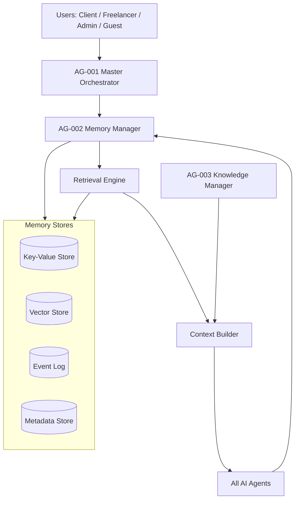
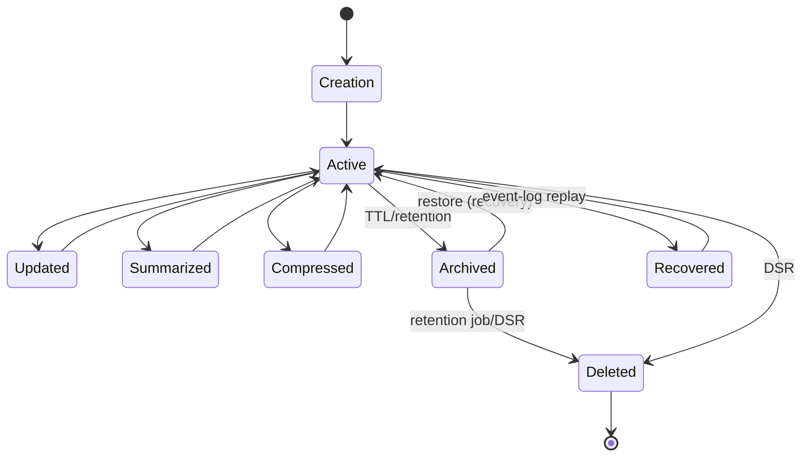
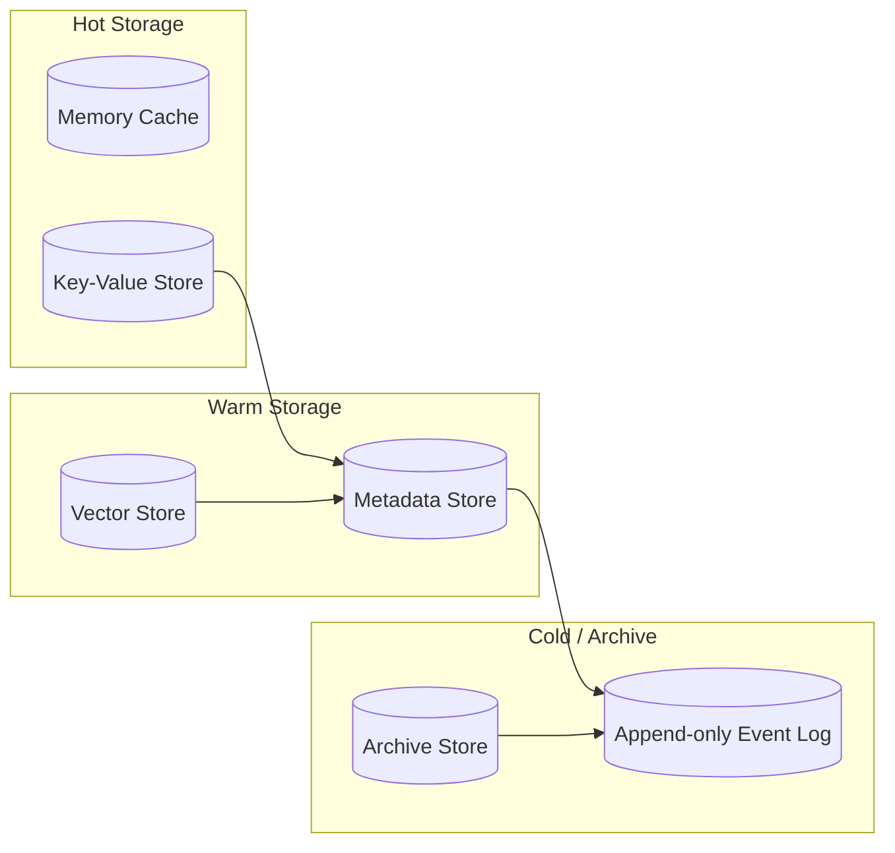
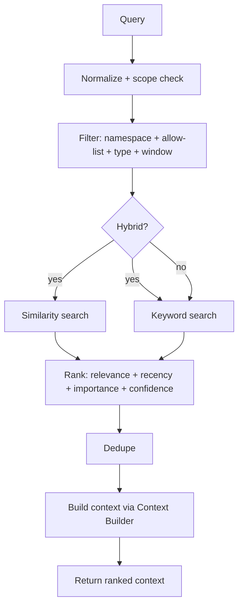

# Freelancify AI — Shared Memory Architecture v1.0

**Component:** AG-002 Memory Manager · **Spec version:** 1.0.0 · **Status:** In Development · **Priority:** Critical
**Owner:** FreelancifyHub Engineering · **Last updated:** 2026-08-01

> [!IMPORTANT]
> This is the official **engineering specification for the complete AI Memory
> System** and the implementation contract for **AG-002 Memory Manager**. It is
> governed by, and must never contradict:
>
> - [`docs/freelancify-ai-blueprint-v1.0.md`](./freelancify-ai-blueprint-v1.0.md) — architecture (esp. §15, §23, §24)
> - [`docs/product-requirements-v1.md`](./product-requirements-v1.md) — functional spec (esp. BR-AI-*, BR-ADM-1, privacy/right-to-forget)
> - [`docs/agent-catalog-v1.md`](./agent-catalog-v1.md) — agent registry (esp. AG-002 entry)
> - [`docs/master-orchestrator-specification-v1.md`](./master-orchestrator-specification-v1.md) — AG-001 memory coordination (§8)
>
> No implementation code is included. Interfaces are **logical contracts only**
> (§15). Validation against the four source documents is reported in
> §Appendix A–C.

---

## Table of Contents

1. [Executive Summary](#1-executive-summary)
2. [Memory Philosophy](#2-memory-philosophy)
3. [Memory Architecture](#3-memory-architecture)
4. [Memory Types](#4-memory-types)
5. [Memory Lifecycle](#5-memory-lifecycle)
6. [Memory Ownership](#6-memory-ownership)
7. [Memory Access Matrix](#7-memory-access-matrix)
8. [Memory Retrieval Strategy](#8-memory-retrieval-strategy)
9. [Context Builder](#9-context-builder)
10. [Summarization Strategy](#10-summarization-strategy)
11. [Memory Consolidation](#11-memory-consolidation)
12. [Memory Quality](#12-memory-quality)
13. [Memory Security](#13-memory-security)
14. [Privacy](#14-privacy)
15. [APIs (Logical Contracts)](#15-apis-logical-contracts)
16. [Events](#16-events)
17. [Configuration](#17-configuration)
18. [Storage Strategy](#18-storage-strategy)
19. [Retrieval Pipeline](#19-retrieval-pipeline)
20. [Failure Handling](#20-failure-handling)
21. [Observability](#21-observability)
22. [Performance](#22-performance)
23. [Testing Strategy](#23-testing-strategy)
24. [Risks](#24-risks)
25. [Future Roadmap](#25-future-roadmap)
26. [Acceptance Criteria](#26-acceptance-criteria)
27. [Open Questions](#27-open-questions)
28. [Architecture Decision Records (ADR)](#28-architecture-decision-records-adr)
29. [Appendices](#29-appendices)

---

## 1. Executive Summary

### Purpose

Define the shared memory system that every Freelancify AI agent uses to stay
consistent across conversations, projects and time. This document is the
implementation contract for **AG-002 Memory Manager** (catalog §9, blueprint §15).

### Scope

**In scope:** memory types, lifecycle, ownership, access control, retrieval,
context building, summarization, consolidation, quality, security, privacy,
storage tiers, APIs, events, configuration, failure handling, observability,
performance and testing.

**Out of scope:** implementation code; knowledge content (AG-003, blueprint §16);
tool execution (AG-004); agent routing (AG-001, see orchestrator spec);
channel/session plumbing (OpenClaw gateway, blueprint §6).

### Business Value

- Stateless agents with **consistent, seamless** multi-session UX (blueprint §15).
- Namespaced isolation → trust, compliance and auditability.
- Right-to-forget and retention that are engineered in, not bolted on.

### Responsibilities

| #   | Responsibility                                                 |
| --- | -------------------------------------------------------------- |
| M1  | Store/retrieve namespaced state for all agents (blueprint §15) |
| M2  | Enforce namespace allow-lists and cross-namespace isolation    |
| M3  | Apply per-type TTL, retention and deletion policies            |
| M4  | Provide session/conversation continuity + handoff context      |
| M5  | Maintain the append-only event log (replay source)             |
| M6  | Summarize, compress and consolidate memory                     |
| M7  | Emit observability and audit events                            |

### Non-Responsibilities

| Not responsible for           | Owner                               |
| ----------------------------- | ----------------------------------- |
| Factual grounding / citations | AG-003 Knowledge Manager            |
| Tool permissions / execution  | AG-004 Tool Manager                 |
| Business decisions            | Team agents + humans (BR-AI-2/3)    |
| Rendering or channel handling | Edge layer / gateway                |
| Storing raw PII blobs         | Policy forbids (§13, blueprint §15) |

---

## 2. Memory Philosophy

### Why memory exists

Agents are stateless (blueprint §7.4). Without memory, every interaction would
forget the user, the project, or the negotiation. Memory is the **continuity
layer** that makes the ecosystem feel coherent while keeping agents
independent and replaceable.

### Memory principles

1. **Namespaced by default** — every key belongs to exactly one namespace.
2. **Owner + reason on every write** — auditability (blueprint §15.3).
3. **Minimal storage** — store references, not duplicates.
4. **Ephemeral by design** — TTL before retention before archive.
5. **Fail-degrade, never fail-wrong** — a missing memory is a gap, never a guess.

### Consistency principles

- The **event log is the source of truth**; key-value stores are derived caches.
- Writes are ordered; readers see last-committed state per namespace.
- Idempotent writes (`owner + key + version`) prevent duplication.
- Cross-request consistency is eventual within a namespace, strong within a
  single request's plan (orchestrator spec §8).

### Privacy principles

- **Data minimisation**: never store what you don't need (blueprint §24).
- **No raw PII duplication** (blueprint §15.4): reference identifiers only.
- **Right to forget**: deletion is a first-class operation (§14).
- **Consent tracked**: preferences/consent are memory, enforced everywhere.

---

## 3. Memory Architecture



| Layer                   | Role                                                            |
| ----------------------- | --------------------------------------------------------------- |
| **Users**               | Interact via the gateway (blueprint §6)                         |
| **Master Orchestrator** | Routes requests; asks AG-002 for context (orchestrator spec §8) |
| **Memory Manager**      | AG-002 — owns namespaces, lifecycle, retrieval                  |
| **Memory Stores**       | Key-value + vector + event log + metadata (§18)                 |
| **Retrieval**           | Hybrid search + ranking (§8, §19)                               |
| **Context Builder**     | Assembles final agent context (§9)                              |

---

## 4. Memory Types

Eleven memory types. Each entry includes the full attribute set.

### 4.1 Short-Term Memory

| Attribute            | Value                                         |
| -------------------- | --------------------------------------------- |
| **Purpose**          | In-request working memory for the active plan |
| **Owner**            | AG-001 (plans), all agents (scratch)          |
| **Lifetime**         | Request/plan duration                         |
| **TTL**              | 0 (dies with request)                         |
| **Retention Policy** | None                                          |
| **Size Limits**      | 64 KB / request                               |
| **Priority**         | High                                          |
| **Security Level**   | Internal                                      |
| **Encryption**       | At rest (AES-256)                             |
| **Deletion Policy**  | Immediate at request end                      |

### 4.2 Conversation Memory

| Attribute            | Value                                         |
| -------------------- | --------------------------------------------- |
| **Purpose**          | Per-thread interaction history for continuity |
| **Owner**            | Client/Freelancer agents (thread owner)       |
| **Lifetime**         | Thread + retention window                     |
| **TTL**              | Configurable (default 30 days)                |
| **Retention Policy** | Rolling window + incremental summaries        |
| **Size Limits**      | 500 messages / thread active                  |
| **Priority**         | High                                          |
| **Security Level**   | Confidential (may contain user content)       |
| **Encryption**       | At rest + in transit (TLS)                    |
| **Deletion Policy**  | TTL then archived; DSR erasure supported      |

### 4.3 User Memory

| Attribute            | Value                                                      |
| -------------------- | ---------------------------------------------------------- |
| **Purpose**          | Preferences, consent, identity preferences (blueprint §15) |
| **Owner**            | The user's own namespace + their serving agents            |
| **Lifetime**         | Account lifetime                                           |
| **TTL**              | None (long-lived)                                          |
| **Retention Policy** | Until deletion request                                     |
| **Size Limits**      | 512 KB / user                                              |
| **Priority**         | Critical                                                   |
| **Security Level**   | Confidential                                               |
| **Encryption**       | At rest + in transit                                       |
| **Deletion Policy**  | Full erasure on DSR (right to forget, §14)                 |

### 4.4 Project Memory

| Attribute            | Value                                                   |
| -------------------- | ------------------------------------------------------- |
| **Purpose**          | Project/proposal/engagement state (blueprint §15)       |
| **Owner**            | Marketplace + Client/Freelancer agents (shared, scoped) |
| **Lifetime**         | Project + archive period                                |
| **TTL**              | Project life + 90 days archive                          |
| **Retention Policy** | Milestone summaries; archive on close                   |
| **Size Limits**      | 2 MB / project                                          |
| **Priority**         | Critical                                                |
| **Security Level**   | Confidential                                            |
| **Encryption**       | At rest + in transit                                    |
| **Deletion Policy**  | Purge per policy or dispute hold                        |

### 4.5 Workspace Memory

| Attribute            | Value                                                             |
| -------------------- | ----------------------------------------------------------------- |
| **Purpose**          | Per-agent/team operational state (OpenClaw workspace, catalog §4) |
| **Owner**            | The owning team/agent                                             |
| **Lifetime**         | Workspace lifetime                                                |
| **TTL**              | None                                                              |
| **Retention Policy** | Versioned; archived on workspace close                            |
| **Size Limits**      | 1 MB / workspace                                                  |
| **Priority**         | Medium                                                            |
| **Security Level**   | Internal                                                          |
| **Encryption**       | At rest                                                           |
| **Deletion Policy**  | On workspace deletion                                             |

### 4.6 Organization Memory

| Attribute            | Value                                                            |
| -------------------- | ---------------------------------------------------------------- |
| **Purpose**          | Org-level shared context (teams/companies using the marketplace) |
| **Owner**            | Admin/enterprise agents                                          |
| **Lifetime**         | Organization lifetime                                            |
| **TTL**              | None                                                             |
| **Retention Policy** | Until org deletion                                               |
| **Size Limits**      | 4 MB / org                                                       |
| **Priority**         | Medium                                                           |
| **Security Level**   | Confidential                                                     |
| **Encryption**       | At rest + in transit                                             |
| **Deletion Policy**  | DSR + org deletion                                               |

### 4.7 Knowledge References

| Attribute            | Value                                                               |
| -------------------- | ------------------------------------------------------------------- |
| **Purpose**          | Pointers to KB documents (citations, version tags) — **not copies** |
| **Owner**            | AG-003 (source of truth), agents (references)                       |
| **Lifetime**         | Until KB version invalidates                                        |
| **TTL**              | Matches KB version                                                  |
| **Retention Policy** | Invalidated on KB version bump                                      |
| **Size Limits**      | 32 KB / reference set                                               |
| **Priority**         | High                                                                |
| **Security Level**   | Internal                                                            |
| **Encryption**       | At rest                                                             |
| **Deletion Policy**  | On KB version invalidation                                          |

### 4.8 Temporary Memory

| Attribute            | Value                                  |
| -------------------- | -------------------------------------- |
| **Purpose**          | Ephemeral scratch (mid-work artifacts) |
| **Owner**            | Writing agent                          |
| **Lifetime**         | Minutes                                |
| **TTL**              | 15 minutes                             |
| **Retention Policy** | None                                   |
| **Size Limits**      | 32 KB / write                          |
| **Priority**         | Low                                    |
| **Security Level**   | Internal                               |
| **Encryption**       | At rest                                |
| **Deletion Policy**  | Sweeper on TTL                         |

### 4.9 Session Memory

| Attribute            | Value                                               |
| -------------------- | --------------------------------------------------- |
| **Purpose**          | Active session context (device, session token refs) |
| **Owner**            | Gateway + AG-001                                    |
| **Lifetime**         | Session                                             |
| **TTL**              | Session duration                                    |
| **Retention Policy** | None (purged at logout/expiry)                      |
| **Size Limits**      | 32 KB / session                                     |
| **Priority**         | Medium                                              |
| **Security Level**   | Confidential                                        |
| **Encryption**       | At rest + in transit                                |
| **Deletion Policy**  | On logout/expiry                                    |

### 4.10 Long-Term Memory

| Attribute            | Value                                                         |
| -------------------- | ------------------------------------------------------------- |
| **Purpose**          | Durable entity state + consolidated summaries (blueprint §15) |
| **Owner**            | AG-002 (canonical) + domain agents                            |
| **Lifetime**         | Years                                                         |
| **TTL**              | None (retention-governed)                                     |
| **Retention Policy** | Annual consolidation; compliance holds                        |
| **Size Limits**      | 10 MB / entity                                                |
| **Priority**         | High                                                          |
| **Security Level**   | Confidential                                                  |
| **Encryption**       | At rest + in transit                                          |
| **Deletion Policy**  | DSR erasure; compliance-driven                                |

### 4.11 Archived Memory

| Attribute            | Value                                         |
| -------------------- | --------------------------------------------- |
| **Purpose**          | Cold storage for compliance/legal (immutable) |
| **Owner**            | AG-002 (archive writer)                       |
| **Lifetime**         | Compliance window                             |
| **TTL**              | None                                          |
| **Retention Policy** | Legal hold + expiry                           |
| **Size Limits**      | Unbounded (billed)                            |
| **Priority**         | Low                                           |
| **Security Level**   | Confidential                                  |
| **Encryption**       | At rest (AES-256) + immutability              |
| **Deletion Policy**  | Only by retention job / legal order           |

---

## 5. Memory Lifecycle



| Phase             | Behaviour                                                         |
| ----------------- | ----------------------------------------------------------------- |
| **Creation**      | Write with `owner + key + reason + version`; emit `MemoryCreated` |
| **Update**        | Version-bump; overwrite with history; emit `MemoryUpdated`        |
| **Read**          | Namespace-checked; emit `MemoryRetrieved` (audited)               |
| **Summarization** | Roll up long context; store summary + pointer                     |
| **Compression**   | Drop history beyond window; keep summary                          |
| **Archiving**     | Move to cold tier; emit `MemoryArchived`                          |
| **Deletion**      | Logical delete + physical purge; emit `MemoryDeleted`             |
| **Recovery**      | Replay event log after store failure                              |

---

## 6. Memory Ownership

| Owner                 | Owns (namespaces)                                   | Notes                          |
| --------------------- | --------------------------------------------------- | ------------------------------ |
| **AG-001**            | `system:plans`, session context                     | Active-plan working state      |
| **AG-002**            | `system:canonical`, `system:archive`                | Canonical + archival ownership |
| **Client Agents**     | `client:<id>`, `project:<id>` (client side)         | User/project memory            |
| **Freelancer Agents** | `freelancer:<id>`, `project:<id>` (freelancer side) | Career/earnings state          |
| **Admin Agents**      | `org:*`, `system:*`, `workspace:admin:*`            | Org + compliance state         |

> [!NOTE]
> `project:<id>` is **shared but scoped**: each party writes only its role's
> attributes; read of the other party's attributes requires allow-list policy
> (blueprint §15, BR-ADM-1).

---

## 7. Memory Access Matrix

Permissions per agent group × memory type (`R` read · `W` write · `U` update · `D` delete).

| Agent group        | Short-term | Conversation | User     | Project   | Workspace | Org  | KB Ref | Temp | Session | Long-term | Archived |
| ------------------ | ---------- | ------------ | -------- | --------- | --------- | ---- | ------ | ---- | ------- | --------- | -------- |
| AG-001             | RWU        | R            | R        | R         | R         | R    | R      | R    | RWU     | R         | R        |
| AG-002             | RWUD       | RWUD         | W*       | W*        | RWUD      | RWUD | RW     | RWUD | R       | RWUD      | RWUD     |
| Client agents      | RWU        | RWU          | RWU(own) | RWU(role) | R         | R    | R      | RWU  | R       | W(own)    | R        |
| Freelancer agents  | RWU        | RWU          | RWU(own) | RWU(role) | R         | R    | R      | RWU  | R       | W(own)    | R        |
| Marketplace agents | R          | R            | R        | RWU(own)  | R         | R    | RW     | RWU  | R       | W         | R        |
| Marketing agents   | RWU        | R            | R        | R         | RWU       | R    | R      | RWU  | R       | R         | R        |
| Admin agents       | RWU        | R            | W*       | R         | RWUD      | RWUD | RWUD   | RWU  | R       | RWUD      | RWUD     |

\* AG-002 and Admin may write user memory only for consent/retention records.

Rules:

- Cross-namespace reads require an explicit allow-list entry (rejected 100% otherwise).
- Deletes are restricted to the namespace owner + AG-002/Admin.
- All `D` operations require an audit record with reason (blueprint §23).

---

## 8. Memory Retrieval Strategy

| Strategy              | Used for                 | Notes                                                                                 |
| --------------------- | ------------------------ | ------------------------------------------------------------------------------------- |
| **Similarity search** | Semantic recall (vector) | Embeddings of stored summaries                                                        |
| **Keyword search**    | Exact/lexical match      | Fast, deterministic                                                                   |
| **Hybrid search**     | Default                  | Merge similarity + keyword with weights                                               |
| **Recency**           | Freshness weighting      | Decay factor per type (TTL-aware)                                                     |
| **Importance**        | Priority weighting       | Type priority + user-specified importance                                             |
| **Confidence**        | Write-time confidence    | High-confidence wins ties                                                             |
| **Ranking**           | Final ordering           | Weighted combination: `0.4·relevance + 0.3·recency + 0.2·importance + 0.1·confidence` |
| **Filtering**         | Scope control            | Namespace + allow-list + time window + type                                           |

Rules:

- Retrieval is always filtered by the caller's namespace allow-list first.
- Never return raw content the caller is not permitted to see (blueprint §15).

---

## 9. Context Builder

Assembles the context payload handed to the orchestrator (orchestrator spec §7).

| Concern                 | Behaviour                                                              |
| ----------------------- | ---------------------------------------------------------------------- |
| **Ordering**            | Policy/security → fresh cited knowledge → entity state → history       |
| **Prioritization**      | Highest priority memory types surface first (§4 priorities)            |
| **Compression**         | Long history replaced by summaries (§10)                               |
| **Deduplication**       | Same `key+version` fetched once                                        |
| **Token budget**        | Respects orchestrator per-intent token budget (orchestrator spec §7.4) |
| **Context window mgmt** | Overflow → drop history, then summaries, never policy                  |

Context output shape (logical):

```text
context = {
  scope: namespace,
  policies: [refs],        // highest priority
  knowledge: [cited refs], // from AG-003
  state: { ... },          // entity/project state
  history: [summaries],    // compressed
}
```

---

## 10. Summarization Strategy

| Type             | Strategy                                                                   |
| ---------------- | -------------------------------------------------------------------------- |
| **Conversation** | Incremental rolling summary every N turns (default 10); keep tail verbatim |
| **Project**      | Milestone-level summaries; status + decisions + open items                 |
| **User**         | Preference-drift summaries; updated on change                              |
| **Long-term**    | Periodic consolidation of related records (§11)                            |
| **Incremental**  | New summary = diff from last; never regenerate wholesale                   |

Rules:

- Summaries are written by the writing agent via AG-002 `summarize` (§15).
- Every summary stores a pointer to the records it condenses.
- Summarization is logged and emits `MemorySummarized`.

---

## 11. Memory Consolidation

| Concern                 | Behaviour                                                                                      |
| ----------------------- | ---------------------------------------------------------------------------------------------- |
| **Merge duplicates**    | Same `entity+attribute+value` (idempotent keys) → one canonical record                         |
| **Conflict resolution** | Latest timestamp wins; ties broken by confidence; conflicts are logged, never silently dropped |
| **Canonical records**   | AG-002 owns the canonical view per entity attribute; all readers consume it                    |

Consolidation runs on a schedule and post-summarization. It is idempotent and
replayable from the event log.

---

## 12. Memory Quality

| Dimension        | Definition                                         | Monitor                 |
| ---------------- | -------------------------------------------------- | ----------------------- |
| **Freshness**    | Stale flags for exceeded TTL / superseded versions | Stale-doc rate          |
| **Accuracy**     | Value matches source of truth (event log)          | Replay divergence       |
| **Completeness** | Required attributes present for entity type        | Coverage %              |
| **Consistency**  | No duplicate/conflicting canonical records         | Duplicate count         |
| **Confidence**   | Write-time confidence metadata preserved           | Confidence distribution |

Quality issues are surfaced as metrics + alerts (§21) and fed to consolidation.

---

## 13. Memory Security

| Concern            | Controls                                                                 |
| ------------------ | ------------------------------------------------------------------------ |
| **Encryption**     | AES-256 at rest; TLS 1.2+ in transit; key rotation (blueprint §24)       |
| **PII protection** | Classification; minimisation; redaction at boundaries (blueprint §24)    |
| **Access control** | Namespace + allow-list; role scopes (BR-ADM-1)                           |
| **Audit logs**     | Append-only audit for reads/writes/updates/deletes of confidential types |
| **Secrets**        | Never stored in memory; env-only                                         |
| **Compliance**     | GDPR/CCPA DSR tooling; retention legal holds                             |

Fail-closed: any access without an explicit allow-list entry is rejected
(blueprint §4.6).

---

## 14. Privacy

| Concern             | Behaviour                                                            |
| ------------------- | -------------------------------------------------------------------- |
| **User deletion**   | Full account erasure: delete all user namespaces + archive hold      |
| **Right to forget** | DSR erasure job: logical delete → purge within 24 h (SLA)            |
| **Retention**       | Per-type retention windows (§4); no indefinite PII                   |
| **Consent**         | Consent records are user memory; privacy choices enforced everywhere |

DSR flow: request → verify → erase user + session + conversation → archive
minimal legal hold → confirm. Emits `MemoryDeleted` for each namespace.

---

## 15. APIs (Logical Contracts)

Logical interfaces only — no implementation.

| Operation            | Request (logical)                                               | Response                               | Errors                                        |
| -------------------- | --------------------------------------------------------------- | -------------------------------------- | --------------------------------------------- |
| **Save Memory**      | `{ owner, namespace, key, type, value, ttl?, reason, version }` | `{ key, version }`                     | `400`, `401`, `403`, `409` (version conflict) |
| **Load Memory**      | `{ namespace, key, callerScope }`                               | `{ value, version, meta }`             | `400`, `403`                                  |
| **Search Memory**    | `{ namespace, query, filters, limit }`                          | `{ results[ {key, score, snippet} ] }` | `400`, `403`                                  |
| **Update Memory**    | `{ namespace, key, patch, reason, expectedVersion }`            | `{ key, version }`                     | `409` on version mismatch                     |
| **Delete Memory**    | `{ namespace, key, reason, hard }`                              | `{ key, status }`                      | `403` (non-owner)                             |
| **Archive Memory**   | `{ namespace, key, reason }`                                    | `{ key, archiveId }`                   | `400`                                         |
| **Summarize Memory** | `{ namespace, scope, type }`                                    | `{ summaryKey, entries }`              | `400`, `403`                                  |

All APIs require a `trace_id`; writes require `owner + reason` (blueprint §15.3).

---

## 16. Events

| Event              | Emitted at     | Payload highlights                   |
| ------------------ | -------------- | ------------------------------------ |
| `MemoryCreated`    | Save (new key) | owner, namespace, key, type, version |
| `MemoryUpdated`    | Update         | key, old/new version, reason         |
| `MemoryArchived`   | Archive        | key, archiveId, reason               |
| `MemoryDeleted`    | Delete/purge   | key, hard flag, reason               |
| `MemoryRetrieved`  | Read           | key/query, caller scope              |
| `MemorySummarized` | Summarize      | scope, summaryKey, entries           |

Events carry `trace_id` and feed the event log, metrics and audit store.

---

## 17. Configuration

| Key                               | Default         | Purpose                      |
| --------------------------------- | --------------- | ---------------------------- |
| `memory.ttl.conversation`         | 30d             | Conversation retention       |
| `memory.ttl.temporary`            | 15m             | Temporary scratch TTL        |
| `memory.retention.projectArchive` | 90d             | Project archive window       |
| `memory.compression.window`       | 500 msgs        | Conversation active window   |
| `memory.summarize.every`          | 10 turns        | Summary cadence              |
| `memory.summarize.agent`          | `claude-sonnet` | Summarizer model             |
| `memory.limits.userBytes`         | 512KB           | User memory cap              |
| `memory.limits.projectBytes`      | 2MB             | Project memory cap           |
| `memory.cache.hotTtl`             | 300s            | Hot-cache TTL                |
| `memory.retrieval.hybridWeight`   | 0.5             | Similarity vs keyword weight |

### Feature flags

| Flag                         | Default | Effect                       |
| ---------------------------- | ------- | ---------------------------- |
| `hybridSearch.enabled`       | true    | Enable hybrid retrieval      |
| `incrementalSummary.enabled` | true    | Enable incremental summaries |
| `rightToForget.enabled`      | true    | Enable DSR erasure           |
| `eventLogReplay.enabled`     | true    | Enable recovery replay       |

---

## 18. Storage Strategy

Logical architecture only.



| Tier               | Contents                        | Access                  |
| ------------------ | ------------------------------- | ----------------------- |
| **Hot**            | Recent active keys (cache + KV) | Fast reads (p95 < 20ms) |
| **Warm**           | Embeddings + metadata           | Retrieval (p95 < 200ms) |
| **Cold / Archive** | Archived + event log            | Batch/rare (seconds)    |

Stores:

- **Vector store** — similarity search (§8).
- **Metadata store** — key attributes, TTL, owner, version.
- **Event log** — append-only source of truth (§2, recovery).

---

## 19. Retrieval Pipeline



---

## 20. Failure Handling

| Failure               | Detection                 | Recovery                                        |
| --------------------- | ------------------------- | ----------------------------------------------- |
| **Store unavailable** | Connection error          | Serve from cache; queue writes; degrade context |
| **Corruption**        | Checksum/version mismatch | Rebuild key from event log replay               |
| **Duplicate records** | Idempotency key match     | Return existing; no second write                |
| **Timeout**           | Deadline exceeded         | Fail fast; retry (idempotent only)              |
| **Partial failures**  | Some shards ok            | Per-namespace success; report partial           |
| **Recovery**          | Post-incident             | Event-log replay; verify checksums              |

Retry: idempotent writes ≤ 3 backoff; reads 1 retry then degrade.

---

## 21. Observability

| Concern        | Detail                                                                                   |
| -------------- | ---------------------------------------------------------------------------------------- |
| **Logs**       | pino JSON; `service=freelancify-ai`, `agent=AG-002`, `trace_id`, `event`                 |
| **Metrics**    | Read/write latency, throughput, cache hit-rate, TTL churn, duplicate rate, backlog depth |
| **Tracing**    | `trace_id` across every memory hop                                                       |
| **Alerts**     | Store down, corruption detected, write backlog, DSR SLA breach                           |
| **Dashboards** | Namespace usage, tier distribution, retrieval ranking quality                            |

---

## 22. Performance

| Target          | Value                                                             |
| --------------- | ----------------------------------------------------------------- |
| **Latency**     | Hot read p95 < 20ms; warm retrieval p95 < 200ms; write p95 < 50ms |
| **Throughput**  | ≥ 5,000 ops/s per shard (scale-out)                               |
| **Scalability** | Shard by namespace; add shards independently                      |
| **Caching**     | Hot cache TTL 300s; invalidate on update/delete/archive           |

---

## 23. Testing Strategy

| Layer           | Scope                                               |
| --------------- | --------------------------------------------------- |
| **Unit**        | Key validation, TTL logic, ranking formula, dedupe  |
| **Integration** | AG-002 ↔ AG-001 (orchestrator spec §8), AG-003 refs |
| **Load**        | Throughput + p95 under target concurrency           |
| **Chaos**       | Store outage, corruption, partial shard failure     |
| **Recovery**    | Event-log replay correctness                        |
| **Security**    | Cross-namespace reads, PII redaction, injection     |

---

## 24. Risks

| Category        | Risk                                   | Likelihood | Impact   | Mitigation                                    |
| --------------- | -------------------------------------- | ---------- | -------- | --------------------------------------------- |
| **Technical**   | Vector drift (poor retrieval)          | Med        | Med      | Hybrid search, quality monitors, re-embed     |
| **Technical**   | Scale bottlenecks                      | Med        | Med      | Namespace sharding, caching, tiering          |
| **Operational** | Wrong eviction (important memory lost) | Med        | Med      | Importance weights, summaries before eviction |
| **Operational** | Replay divergence                      | Low        | High     | Checksums, versioning, reconciliation         |
| **Security**    | Cross-namespace leak                   | Low        | Critical | Allow-list enforcement, test coverage         |
| **Business**    | Compliance breach                      | Low        | Critical | DSR tooling, retention holds, audits          |

---

## 25. Future Roadmap

| Version | Scope                                                                               |
| ------- | ----------------------------------------------------------------------------------- |
| **v1**  | Namespaced KV + event log + TTL, hybrid retrieval, context builder, DSR (this spec) |
| **v2**  | Semantic memory (vector-first), automatic consolidation, preference learning        |
| **v3**  | Federated/org memory graph, cross-marketplace shared context, self-tuning TTL       |

---

## 26. Acceptance Criteria

| #         | Criterion                                                               |
| --------- | ----------------------------------------------------------------------- |
| AC-MEM-1  | Hot read p95 ≤ 20ms; warm retrieval p95 ≤ 200ms under target load.      |
| AC-MEM-2  | Cross-namespace reads are rejected 100% without an allow-list entry.    |
| AC-MEM-3  | Every write carries `owner + reason`; 100% coverage.                    |
| AC-MEM-4  | TTL expiry is enforced; expired keys are unreachable.                   |
| AC-MEM-5  | Right-to-forget erasure completes within 24 h SLA.                      |
| AC-MEM-6  | Event-log replay restores a corrupted store with 0 divergence.          |
| AC-MEM-7  | Dedupe: identical writes (same key+version) do not duplicate records.   |
| AC-MEM-8  | Cache is invalidated on update/delete/archive (no stale reads).         |
| AC-MEM-9  | Confidential memory reads/writes are fully audit-logged.                |
| AC-MEM-10 | Summarization never drops data without a pointer to the source records. |

---

## 27. Open Questions

| #      | Question                                              | Owner            | Blocking? |
| ------ | ----------------------------------------------------- | ---------------- | --------- |
| OQ-M-1 | Vector store provider vs in-house embeddings backend  | Platform         | No        |
| OQ-M-2 | Exact retention windows for compliance (legal review) | Legal/Compliance | Phase 4   |
| OQ-M-3 | Multi-marketplace org memory sharing scope            | Product          | No        |
| OQ-M-4 | Whether session memory lives in AG-002 or gateway     | Platform         | No        |
| OQ-M-5 | Archive immutability tooling (WORM) requirements      | Security         | No        |

---

## 28. Architecture Decision Records (ADR)

| ID          | Decision                                          | Rationale                          | Cross-ref            |
| ----------- | ------------------------------------------------- | ---------------------------------- | -------------------- |
| ADR-MEM-001 | Namespace-based isolation                         | Trust + compliance (blueprint §15) | Blueprint §15        |
| ADR-MEM-002 | Event log as source of truth; KV as derived cache | Recovery + audit                   | Blueprint §15.3      |
| ADR-MEM-003 | Per-type TTL/retention                            | Bounded growth + policy            | Blueprint §15        |
| ADR-MEM-004 | Hybrid retrieval (vector + keyword)               | Robustness to drift                | §8                   |
| ADR-MEM-005 | References over copies (no raw PII)               | Data minimisation                  | Blueprint §15.4      |
| ADR-MEM-006 | Write-behind queue + fail-degrade                 | Availability under outage          | §20                  |
| ADR-MEM-007 | Incremental summarization                         | Cost + fidelity                    | §10                  |
| ADR-MEM-008 | Tiered storage (hot/warm/cold/archive)            | Cost + latency                     | §18                  |
| ADR-MEM-009 | Canonical record consolidation                    | Single source per attribute        | §11                  |
| ADR-MEM-010 | Owner + reason on every write                     | Auditability                       | Blueprint §15.3, §23 |

---

## 29. Appendices

### Appendix A — Consistency Report

| Source                          | Check                                                          | Result        |
| ------------------------------- | -------------------------------------------------------------- | ------------- |
| Blueprint §15                   | Namespaces, allow-list, event log, TTL, no PII duplication     | ✅ Consistent |
| Blueprint §23/24                | Logging, encryption, PII, audit                                | ✅ Consistent |
| PRD BR-AI-2/3                   | No autonomous money/identity; human gates                      | ✅ Consistent |
| PRD BR-ADM-1                    | Admin data-scope enforcement                                   | ✅ Consistent |
| PRD right-to-forget (GDPR/CCPA) | DSR, retention                                                 | ✅ Consistent |
| Catalog AG-002                  | Version 1.0.0, namespace/TTL/session/project/user              | ✅ Consistent |
| Orchestrator spec §8            | Memory types, owner+reason, cross-namespace rejection, degrade | ✅ Consistent |

### Appendix B — Assumptions Report

| #      | Assumption                                                                                                                                                   | Rationale                                |
| ------ | ------------------------------------------------------------------------------------------------------------------------------------------------------------ | ---------------------------------------- |
| AS-M-1 | Workspace/Organization Memory are new types not named in the blueprint; defined here per OpenClaw workspace concept + enterprise teams (catalog §22 future). | Prompt requires them; no contradiction.  |
| AS-M-2 | Session Memory is distinguished from Conversation Memory (device/session refs vs thread history).                                                            | Clarity; both names required.            |
| AS-M-3 | Archive is immutable (WORM) pending OQ-M-5.                                                                                                                  | Compliance-safe default.                 |
| AS-M-4 | Summarizer model defaults to `claude-sonnet`.                                                                                                                | Follows catalog defaults (blueprint §6). |
| AS-M-5 | Hot cache TTL 300s is a starting value, tuned in load testing.                                                                                               | Matches orchestrator cache default.      |

### Appendix C — Missing Decisions Report

| #      | Missing decision                                    | Where to resolve      | Impact           |
| ------ | --------------------------------------------------- | --------------------- | ---------------- |
| MD-M-1 | Exact retention windows per compliance jurisdiction | Legal review (OQ-M-2) | Retention config |
| MD-M-2 | Vector store provider                               | Platform (OQ-M-1)     | Storage strategy |
| MD-M-3 | Session memory placement                            | Platform (OQ-M-4)     | Ownership        |
| MD-M-4 | WORM archive tooling                                | Security (OQ-M-5)     | Archive tier     |

No blocking decision is unresolved for v1 core functionality.

### Appendix D — Amendment Record

| Version | Date       | Change                                                           |
| ------- | ---------- | ---------------------------------------------------------------- |
| 1.0     | 2026-08-01 | Initial release of the Shared Memory Architecture specification. |
