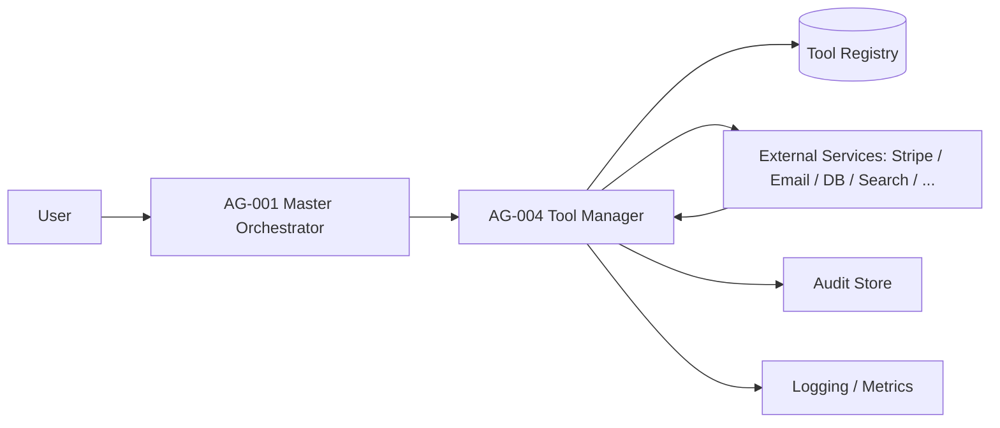
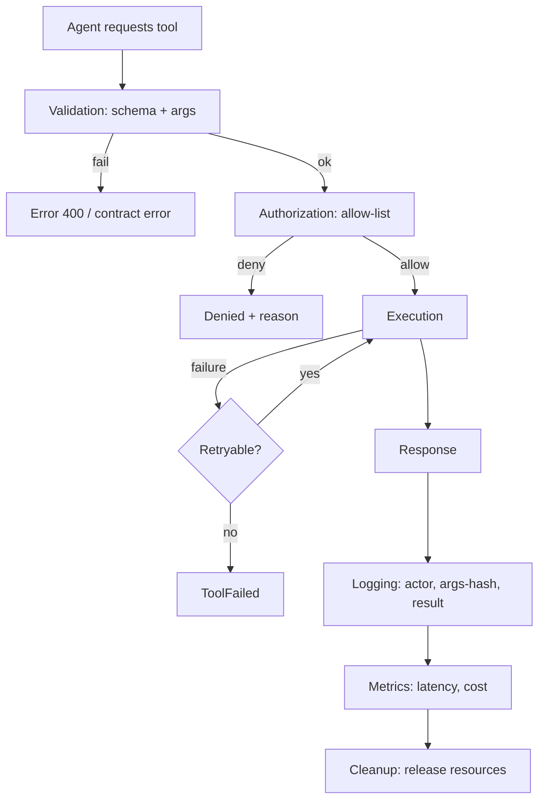

# Freelancify AI — Tool Registry & Integration Architecture v1.0

**Component:** AG-004 Tool Manager + Tool Registry · **Spec version:** 1.0.0 · **Status:** In Development · **Priority:** Critical
**Owner:** FreelancifyHub Engineering · **Last updated:** 2026-08-01

> [!IMPORTANT]
> This is the official **engineering specification for AG-004 Tool Manager and
> the complete Tool Registry** — the implementation contract for the tool
> ecosystem used by every AI agent. It is governed by, and must never
> contradict:
>
> - [`docs/freelancify-ai-blueprint-v1.0.md`](./freelancify-ai-blueprint-v1.0.md) — architecture (esp. §17, §23, §24)
> - [`docs/product-requirements-v1.md`](./product-requirements-v1.md) — functional spec (esp. BR-AI-_, BR-RATE-_, BR-PAY-*)
> - [`docs/agent-catalog-v1.md`](./agent-catalog-v1.md) — agent registry (esp. AG-004 entry)
> - [`docs/master-orchestrator-specification-v1.md`](./master-orchestrator-specification-v1.md) — AG-001 tool coordination (§10)
> - [`docs/shared-memory-architecture-v1.md`](./shared-memory-architecture-v1.md) — AG-002 memory tools
>
> No implementation code is included. Interfaces are **logical contracts only**
> (§13). Validation is reported in §Appendix A–C.

---

## Table of Contents

1. [Executive Summary](#1-executive-summary)
2. [Tool Philosophy](#2-tool-philosophy)
3. [High-Level Architecture](#3-high-level-architecture)
4. [Tool Categories](#4-tool-categories)
5. [Official Tool Registry](#5-official-tool-registry)
6. [Tool Access Matrix](#6-tool-access-matrix)
7. [Tool Discovery](#7-tool-discovery)
8. [Tool Execution Lifecycle](#8-tool-execution-lifecycle)
9. [Security](#9-security)
10. [Integration Patterns](#10-integration-patterns)
11. [Error Handling](#11-error-handling)
12. [Performance](#12-performance)
13. [APIs (Logical Contracts)](#13-apis-logical-contracts)
14. [Events](#14-events)
15. [Configuration](#15-configuration)
16. [Observability](#16-observability)
17. [Testing Strategy](#17-testing-strategy)
18. [Risks](#18-risks)
19. [Future Roadmap](#19-future-roadmap)
20. [Acceptance Criteria](#20-acceptance-criteria)
21. [Open Questions](#21-open-questions)
22. [Architecture Decision Records (ADR)](#22-architecture-decision-records-adr)
23. [Appendices](#23-appendices)

---

## 1. Executive Summary

### Purpose

Define the complete tool ecosystem: how capabilities are catalogued, permitted,
executed, observed and governed. This document is the implementation contract
for **AG-004 Tool Manager** (catalog §9; blueprint §17) and the **Tool
Registry**.

### Scope

**In scope:** tool philosophy, categories, the official registry (TL-001…TL-020),
access matrix, discovery, execution lifecycle, security, integration patterns,
error handling, performance, APIs, events, configuration, observability and
testing.

**Out of scope:** implementation code; business logic (BR-AI-2/3); memory
internals (AG-002); knowledge content (AG-003); agent routing (AG-001).

### Business Value

- **Least privilege** at scale: every agent gets exactly the tools it needs.
- Full **audit of side effects**: every invocation recorded (blueprint §17.2).
- Safe autonomy: mutating tools are gated; nothing executes without a permit.

### Responsibilities

| #   | Responsibility                                            |
| --- | --------------------------------------------------------- |
| T1  | Own the Tool Registry (register/deprecate/remove)         |
| T2  | Validate tool contracts (JSON Schema)                     |
| T3  | Enforce default-deny allow-lists per agent                |
| T4  | Rate-limit, time out, retry and cost-track invocations    |
| T5  | Log and audit every invocation (actor, args-hash, result) |
| T6  | Provide tool discovery/search to the orchestrator         |

### Non-Responsibilities

| Not responsible for                 | Owner                                    |
| ----------------------------------- | ---------------------------------------- |
| Deciding _which_ tool an agent uses | Agent + AG-001 (orchestrator spec §10)   |
| Persisting agent state              | AG-002                                   |
| Factual grounding                   | AG-003                                   |
| Business decisions                  | Team agents + humans                     |
| Running external services           | External providers (Stripe, Email, etc.) |

---

## 2. Tool Philosophy

| Principle           | Meaning                                                                               |
| ------------------- | ------------------------------------------------------------------------------------- |
| **Why tools exist** | Give agents safe, bounded capabilities without unrestricted autonomy (blueprint §17)  |
| **Tool isolation**  | Tools are independently versioned and tested; one tool = one capability               |
| **Least privilege** | Default-deny; every capability granted explicitly per agent (blueprint §17.3)         |
| **Safety**          | Mutating tools require approval gates; no autonomous money/identity actions (BR-AI-2) |
| **Reliability**     | Idempotency where possible; retries + circuit breakers (§11)                          |
| **Versioning**      | Semver per tool; breaking changes are major and reviewed (§7)                         |

---

## 3. High-Level Architecture

| Layer                   | Role                                                                            |
| ----------------------- | ------------------------------------------------------------------------------- |
| **User**                | Request source via gateway                                                      |
| **Master Orchestrator** | Requests tool discovery + execution on behalf of agents (orchestrator spec §10) |
| **Tool Manager**        | Enforces policy, validates, executes, observes                                  |
| **Tool Registry**       | Catalog of tools + contracts + permissions                                      |
| **External services**   | Actual capabilities (Stripe, Email, Search, Database…)                          |

---

## 4. Tool Categories

Fourteen categories. Each entry includes the full attribute set.

### 4.1 Core Tools

| Attribute                    | Value                                                                           |
| ---------------------------- | ------------------------------------------------------------------------------- |
| **Purpose**                  | Platform primitives every agent needs (config, cache, scheduler, feature flags) |
| **Responsibilities**         | Provide safe access to platform configuration and scheduling                    |
| **Business Value**           | Foundation for all other tools                                                  |
| **Supported Operations**     | read-config, write-config (gated), cache-get/set, schedule, flag-check          |
| **Dependencies**             | TL-014 (secrets), TL-015 (config), TL-016 (flags), TL-020 (cache)               |
| **Failure Modes**            | Config miss, cache miss, scheduler drift                                        |
| **Security Requirements**    | Config writes are admin-gated; cache keyed by namespace                         |
| **Performance Requirements** | p95 < 20ms                                                                      |

### 4.2 Memory Tools

| Attribute                    | Value                                                                 |
| ---------------------------- | --------------------------------------------------------------------- |
| **Purpose**                  | Access the shared memory system via AG-002                            |
| **Responsibilities**         | Save/load/search memory through AG-002 APIs (memory spec §15)         |
| **Business Value**           | Stateless agents with continuity                                      |
| **Supported Operations**     | memory.save, memory.load, memory.search, memory.update, memory.delete |
| **Dependencies**             | AG-002, TL-002                                                        |
| **Failure Modes**            | Store unavailable, version conflict                                   |
| **Security Requirements**    | Namespace allow-list enforced by AG-002                               |
| **Performance Requirements** | Hot read p95 < 20ms                                                   |

### 4.3 Knowledge Tools

| Attribute                    | Value                                             |
| ---------------------------- | ------------------------------------------------- |
| **Purpose**                  | Retrieve grounded facts with citations via AG-003 |
| **Responsibilities**         | knowledge.query, knowledge.cite                   |
| **Business Value**           | Verified, citable answers (BR-AI-4)               |
| **Supported Operations**     | knowledge.search, knowledge.get-version           |
| **Dependencies**             | AG-003, TL-003                                    |
| **Failure Modes**            | Retrieval miss, stale docs                        |
| **Security Requirements**    | Read-only; version trust                          |
| **Performance Requirements** | p95 < 200ms                                       |

### 4.4 Database Tools

| Attribute                    | Value                                                             |
| ---------------------------- | ----------------------------------------------------------------- |
| **Purpose**                  | Product data access                                               |
| **Responsibilities**         | Safe, contract-validated queries; no direct agent SQL             |
| **Business Value**           | Data-driven agents with guardrails                                |
| **Supported Operations**     | query (validated), read-one, list, count                          |
| **Dependencies**             | TL-001                                                            |
| **Failure Modes**            | Lock contention, query timeout, connection pool exhaustion        |
| **Security Requirements**    | Read-only for agents; writes admin-gated; SQL injection hardening |
| **Performance Requirements** | p95 < 100ms (cached reads)                                        |

### 4.5 Payment Tools

| Attribute                    | Value                                                                             |
| ---------------------------- | --------------------------------------------------------------------------------- |
| **Purpose**                  | Payments, escrow, refunds, payouts via Stripe (PRD BR-PAY, BR-ESC)                |
| **Responsibilities**         | fund-escrow, release-milestone, refund, payout-status                             |
| **Business Value**           | Trusted money movement                                                            |
| **Supported Operations**     | payment.create, payment.status, payment.refund                                    |
| **Dependencies**             | TL-004                                                                            |
| **Failure Modes**            | Decline, idempotency replay, provider outage                                      |
| **Security Requirements**    | **Approval gate required**; never auto-execute (BR-AI-2/3); PCI handled by Stripe |
| **Performance Requirements** | p95 < 1s (provider-bound)                                                         |

### 4.6 Messaging Tools

| Attribute                    | Value                                            |
| ---------------------------- | ------------------------------------------------ |
| **Purpose**                  | In-platform messaging (BR-MSG)                   |
| **Responsibilities**         | message.send (scoped), thread.read               |
| **Business Value**           | On-platform communication + evidence             |
| **Supported Operations**     | message.send, message.read, file.attach (≤ 25MB) |
| **Dependencies**             | TL-005                                           |
| **Failure Modes**            | Delivery failure, policy rejection               |
| **Security Requirements**    | Policy filter before send; PII redaction in logs |
| **Performance Requirements** | Send p95 < 300ms                                 |

### 4.7 Notification Tools

| Attribute                    | Value                                      |
| ---------------------------- | ------------------------------------------ |
| **Purpose**                  | In-app/email/push notifications (BR-NOT)   |
| **Responsibilities**         | notify.send, digest, quiet-hours honouring |
| **Business Value**           | Engagement + retention                     |
| **Supported Operations**     | notify.send, notify.digest, notify.prefs   |
| **Dependencies**             | TL-006                                     |
| **Failure Modes**            | Provider failure, opt-out violation        |
| **Security Requirements**    | Opt-out honoured; no PII in payload        |
| **Performance Requirements** | Async; queue-backed                        |

### 4.8 Analytics Tools

| Attribute                    | Value                                          |
| ---------------------------- | ---------------------------------------------- |
| **Purpose**                  | Natural-language data queries (PRD F21)        |
| **Responsibilities**         | analytics.query with row-level security        |
| **Business Value**           | Data-driven decisions                          |
| **Supported Operations**     | analytics.query, analytics.chart               |
| **Dependencies**             | TL-008                                         |
| **Failure Modes**            | Query complexity cap, scope leak risk          |
| **Security Requirements**    | Row-level security; per-role scopes (BR-ADM-1) |
| **Performance Requirements** | Drill-down < 3s                                |

### 4.9 Storage Tools

| Attribute                    | Value                                           |
| ---------------------------- | ----------------------------------------------- |
| **Purpose**                  | File storage (portfolio, briefs, deliverables)  |
| **Responsibilities**         | file.put, file.get, file.delete (scoped)        |
| **Business Value**           | Artifact persistence                            |
| **Supported Operations**     | file.put, file.get, file.meta                   |
| **Dependencies**             | TL-010                                          |
| **Failure Modes**            | Upload failure, quota, virus scan               |
| **Security Requirements**    | MIME/type allow-list; malware scan; signed URLs |
| **Performance Requirements** | Upload p95 < 2s (25MB)                          |

### 4.10 Search Tools

| Attribute                    | Value                                           |
| ---------------------------- | ----------------------------------------------- |
| **Purpose**                  | Product + vector search (PRD F11 matching)      |
| **Responsibilities**         | search.query (product), vector.query (semantic) |
| **Business Value**           | Matching quality                                |
| **Supported Operations**     | search.query, vector.query, search.rank         |
| **Dependencies**             | TL-007, TL-011                                  |
| **Failure Modes**            | Index lag, embedding drift                      |
| **Security Requirements**    | Result filtering by namespace                   |
| **Performance Requirements** | p95 < 100ms (product), < 200ms (vector)         |

### 4.11 Security Tools

| Attribute                    | Value                                           |
| ---------------------------- | ----------------------------------------------- |
| **Purpose**                  | Secrets, audit, risk primitives (blueprint §24) |
| **Responsibilities**         | secrets.get (scoped), audit.write, token.rotate |
| **Business Value**           | Secure + compliant operations                   |
| **Supported Operations**     | secrets.get, audit.write, token.verify          |
| **Dependencies**             | TL-014, TL-017                                  |
| **Failure Modes**            | Secret miss, rotation race                      |
| **Security Requirements**    | Highest control; admin-gated                    |
| **Performance Requirements** | p95 < 50ms                                      |

### 4.12 Monitoring Tools

| Attribute                    | Value                                 |
| ---------------------------- | ------------------------------------- |
| **Purpose**                  | Health, logs, metrics (blueprint §23) |
| **Responsibilities**         | health.check, metrics.emit, log.write |
| **Business Value**           | Reliability + observability           |
| **Supported Operations**     | health.check, metrics.emit, log.write |
| **Dependencies**             | TL-009, TL-018, TL-019                |
| **Failure Modes**            | Collector down, cardinality explosion |
| **Security Requirements**    | No PII/secrets in payloads            |
| **Performance Requirements** | Async; non-blocking                   |

### 4.13 Admin Tools

| Attribute                    | Value                                                    |
| ---------------------------- | -------------------------------------------------------- |
| **Purpose**                  | Administrative operations (BR-ADM)                       |
| **Responsibilities**         | user.suspend (gated), config.change (gated), flag.manage |
| **Business Value**           | Safe platform control                                    |
| **Supported Operations**     | admin.action (2-approval), admin.report                  |
| **Dependencies**             | Multiple                                                 |
| **Failure Modes**            | Approval bypass risk                                     |
| **Security Requirements**    | 2-admin approval; full audit (BR-ADM-2/3)                |
| **Performance Requirements** | p95 < 500ms                                              |

### 4.14 Future Tools

| Attribute                    | Value                                                                        |
| ---------------------------- | ---------------------------------------------------------------------------- |
| **Purpose**                  | Reserve namespace for upcoming capabilities (voice, enterprise, arbitration) |
| **Responsibilities**         | None yet; registry slots                                                     |
| **Business Value**           | Extensible by convention (§7)                                                |
| **Supported Operations**     | (none)                                                                       |
| **Dependencies**             | (none)                                                                       |
| **Failure Modes**            | (n/a)                                                                        |
| **Security Requirements**    | Same default-deny                                                            |
| **Performance Requirements** | (n/a)                                                                        |

---

## 5. Official Tool Registry

Registry convention: `TL-NNN`. Initial registry: 20 tools. Each entry includes
the full attribute set.

> [!NOTE]
> `Status` values: `Production` · `In Development` · `Planned`. Timeouts,
> retries and rate limits use the Common Defaults (§15) unless overridden.

### TL-001 Database

| Field                                                    | Value                                                             |
| -------------------------------------------------------- | ----------------------------------------------------------------- |
| **Tool ID / Name / Version / Owner / Status / Category** | TL-001 · Database · 1.2.0 · Platform Data · Production · Database |
| **Purpose**                                              | Validated product-data access for agents                          |
| **Capabilities**                                         | read-one, list, count, query (validated)                          |
| **Inputs**                                               | `{ query (allow-listed), params, limit, namespace }`              |
| **Outputs**                                              | Rows / count / error                                              |
| **Permissions**                                          | Read for all teams; write admin-gated                             |
| **Dependencies**                                         | TL-014 (secrets), connection pool                                 |
| **Authentication**                                       | mTLS/service token                                                |
| **Authorization**                                        | Role scope + row-level                                            |
| **Rate Limits**                                          | 200/s per shard                                                   |
| **Timeouts**                                             | 10s (read), 60s (batch)                                           |
| **Retry Policy**                                         | Read ≤ 2; write none (non-idempotent)                             |
| **Circuit Breaker**                                      | On 5 failures → 30s open                                          |
| **Caching**                                              | Hot cache TTL 300s (TL-020)                                       |
| **Logging**                                              | Query + row-count, no PII                                         |
| **Monitoring**                                           | Latency, pool usage, slow queries                                 |
| **Audit Requirements**                                   | Writes + any PII query                                            |
| **Error Codes**                                          | `DB_TIMEOUT`, `DB_DENIED`, `DB_SCHEMA`                            |
| **Cost Considerations**                                  | Query cost attributed per agent                                   |
| **KPIs**                                                 | p95 latency, error rate, denied rate                              |
| **Future Roadmap**                                       | Read-replica routing                                              |

### TL-002 Memory

| Field                                                    | Value                                                      |
| -------------------------------------------------------- | ---------------------------------------------------------- |
| **Tool ID / Name / Version / Owner / Status / Category** | TL-002 · Memory · 1.0.0 · AG-002 · In Development · Memory |
| **Purpose**                                              | Shared-memory access via AG-002 (memory spec §15)          |
| **Capabilities**                                         | memory.save/load/search/update/delete                      |
| **Inputs**                                               | `{ owner, namespace, key, type, value, ttl?, reason }`     |
| **Outputs**                                              | `{ key, version }` / search results                        |
| **Permissions**                                          | Namespace allow-list (memory spec §7)                      |
| **Dependencies**                                         | AG-002                                                     |
| **Authentication**                                       | Service token                                              |
| **Authorization**                                        | Namespace + role                                           |
| **Rate Limits**                                          | Per-namespace caps                                         |
| **Timeouts**                                             | 2s                                                         |
| **Retry Policy**                                         | Idempotent ≤ 3                                             |
| **Circuit Breaker**                                      | On 5 failures → 30s open                                   |
| **Caching**                                              | Read-through hot cache                                     |
| **Logging**                                              | owner, key, reason (no value)                              |
| **Monitoring**                                           | hit-rate, latency, backlog                                 |
| **Audit Requirements**                                   | Confidential reads/writes                                  |
| **Error Codes**                                          | `MEM_DENIED`, `MEM_CONFLICT`, `MEM_TIMEOUT`                |
| **Cost Considerations**                                  | Storage + egress                                           |
| **KPIs**                                                 | hit-rate, write error rate                                 |
| **Future Roadmap**                                       | Vector memory queries                                      |

### TL-003 Knowledge

| Field                                                    | Value                                                            |
| -------------------------------------------------------- | ---------------------------------------------------------------- |
| **Tool ID / Name / Version / Owner / Status / Category** | TL-003 · Knowledge · 1.1.0 · AG-003 · In Development · Knowledge |
| **Purpose**                                              | Grounded, cited retrieval (blueprint §16)                        |
| **Capabilities**                                         | knowledge.search, knowledge.get-version                          |
| **Inputs**                                               | `{ query, scope, limit }`                                        |
| **Outputs**                                              | Cited snippets + version                                         |
| **Permissions**                                          | Read-only                                                        |
| **Dependencies**                                         | AG-003, TL-011 (vector)                                          |
| **Authentication**                                       | Service token                                                    |
| **Authorization**                                        | Read scope                                                       |
| **Rate Limits**                                          | Per-agent query caps                                             |
| **Timeouts**                                             | 5s                                                               |
| **Retry Policy**                                         | ≤ 2                                                              |
| **Circuit Breaker**                                      | Yes                                                              |
| **Caching**                                              | Version-tagged cache (memory spec §9)                            |
| **Logging**                                              | Query + citation usage                                           |
| **Monitoring**                                           | Latency, citation coverage, freshness                            |
| **Audit Requirements**                                   | None (read)                                                      |
| **Error Codes**                                          | `KB_MISS`, `KB_STALE`, `KB_TIMEOUT`                              |
| **Cost Considerations**                                  | Embedding cost per query                                         |
| **KPIs**                                                 | Citation rate, accuracy                                          |
| **Future Roadmap**                                       | Semantic dedup                                                   |

### TL-004 Stripe

| Field                                                    | Value                                                                  |
| -------------------------------------------------------- | ---------------------------------------------------------------------- |
| **Tool ID / Name / Version / Owner / Status / Category** | TL-004 · Stripe · 1.3.0 · Payments Platform · In Development · Payment |
| **Purpose**                                              | Payments, escrow, refunds, payouts (PRD BR-PAY/ESC)                    |
| **Capabilities**                                         | payment.create, payment.status, payment.refund, escrow.release         |
| **Inputs**                                               | `{ projectId, amount, idempotencyKey, actor }`                         |
| **Outputs**                                              | Payment/escrow status                                                  |
| **Permissions**                                          | Money actions **approval-gated** (BR-AI-3)                             |
| **Dependencies**                                         | TL-014 (API key)                                                       |
| **Authentication**                                       | Stripe secret (env/TL-014)                                             |
| **Authorization**                                        | Service identity + approval gate                                       |
| **Rate Limits**                                          | Provider caps                                                          |
| **Timeouts**                                             | 10s                                                                    |
| **Retry Policy**                                         | Idempotent ≤ 3 (key-based)                                             |
| **Circuit Breaker**                                      | On provider failures                                                   |
| **Caching**                                              | Status cache (short TTL)                                               |
| **Logging**                                              | Actor, amount-hash, idempotency key                                    |
| **Monitoring**                                           | Success rate, fee revenue                                              |
| **Audit Requirements**                                   | **All** money actions (blueprint §23)                                  |
| **Error Codes**                                          | `PAY_DECLINED`, `PAY_ESCROW`, `PAY_APPROVAL_REQUIRED`                  |
| **Cost Considerations**                                  | Stripe fees; per-transaction                                           |
| **KPIs**                                                 | Payment success ≥ 98%, release < 24h                                   |
| **Future Roadmap**                                       | Multi-currency                                                         |

### TL-005 Email

| Field                                                    | Value                                                            |
| -------------------------------------------------------- | ---------------------------------------------------------------- |
| **Tool ID / Name / Version / Owner / Status / Category** | TL-005 · Email · 1.1.0 · Comms Platform · Production · Messaging |
| **Purpose**                                              | Transactional + campaign email (BR-NOT)                          |
| **Capabilities**                                         | email.send, email.template                                       |
| **Inputs**                                               | `{ to (scoped), template, vars, campaign? }`                     |
| **Outputs**                                              | Delivery status                                                  |
| **Permissions**                                          | Scoped; marketing sends gated                                    |
| **Dependencies**                                         | TL-014 (keys)                                                    |
| **Authentication**                                       | Provider token                                                   |
| **Authorization**                                        | Scope + consent                                                  |
| **Rate Limits**                                          | Provider caps + opt-out guard                                    |
| **Timeouts**                                             | 5s (queue async)                                                 |
| **Retry Policy**                                         | ≤ 3 backoff                                                      |
| **Circuit Breaker**                                      | Yes                                                              |
| **Caching**                                              | Template cache                                                   |
| **Logging**                                              | Template + campaign, no content PII                              |
| **Monitoring**                                           | Deliverability, bounce rate                                      |
| **Audit Requirements**                                   | Marketing sends                                                  |
| **Error Codes**                                          | `EMAIL_DENIED`, `EMAIL_BOUNCE`                                   |
| **Cost Considerations**                                  | Per-send                                                         |
| **KPIs**                                                 | CTR, opt-out < 5%                                                |
| **Future Roadmap**                                       | Send-time optimisation                                           |

### TL-006 Notifications

| Field                                                    | Value                                                                 |
| -------------------------------------------------------- | --------------------------------------------------------------------- |
| **Tool ID / Name / Version / Owner / Status / Category** | TL-006 · Notifications · 1.0.0 · Platform · Production · Notification |
| **Purpose**                                              | In-app/email/push notifications (BR-NOT)                              |
| **Capabilities**                                         | notify.send, notify.digest, notify.prefs                              |
| **Inputs**                                               | `{ user, type, channel, priority, quietHours? }`                      |
| **Outputs**                                              | Delivery ack                                                          |
| **Permissions**                                          | Respects user prefs + quiet hours                                     |
| **Dependencies**                                         | TL-005 (email), push provider                                         |
| **Authentication**                                       | Service token                                                         |
| **Authorization**                                        | User pref allow                                                       |
| **Rate Limits**                                          | Digest cap (BR-NOT-2)                                                 |
| **Timeouts**                                             | Async                                                                 |
| **Retry Policy**                                         | Backoff retry                                                         |
| **Circuit Breaker**                                      | Yes                                                                   |
| **Caching**                                              | Pref cache                                                            |
| **Logging**                                              | Type + channel                                                        |
| **Monitoring**                                           | Delivery, CTR, opt-out                                                |
| **Audit Requirements**                                   | None                                                                  |
| **Error Codes**                                          | `NOTIF_DENIED`, `NOTIF_DUPE`                                          |
| **Cost Considerations**                                  | Push/email per-send                                                   |
| **KPIs**                                                 | CTR ≥ 12%, opt-out < 5%                                               |
| **Future Roadmap**                                       | AI-ranked digests                                                     |

### TL-007 Search

| Field                                                    | Value                                                               |
| -------------------------------------------------------- | ------------------------------------------------------------------- |
| **Tool ID / Name / Version / Owner / Status / Category** | TL-007 · Search · 1.2.0 · Search Platform · In Development · Search |
| **Purpose**                                              | Product search (PRD F11)                                            |
| **Capabilities**                                         | search.query, search.rank                                           |
| **Inputs**                                               | `{ query, filters, page, namespace }`                               |
| **Outputs**                                              | Ranked results                                                      |
| **Permissions**                                          | Namespace-scoped results                                            |
| **Dependencies**                                         | Index + TL-020                                                      |
| **Authentication**                                       | Service token                                                       |
| **Authorization**                                        | Read scope                                                          |
| **Rate Limits**                                          | Per-user caps                                                       |
| **Timeouts**                                             | 500ms                                                               |
| **Retry Policy**                                         | ≤ 2                                                                 |
| **Circuit Breaker**                                      | Yes                                                                 |
| **Caching**                                              | Hot query cache                                                     |
| **Logging**                                              | Query (anonymised)                                                  |
| **Monitoring**                                           | Latency, CTR, index lag                                             |
| **Audit Requirements**                                   | None                                                                |
| **Error Codes**                                          | `SRCH_TIMEOUT`, `SRCH_LAG`                                          |
| **Cost Considerations**                                  | Index + query cost                                                  |
| **KPIs**                                                 | p95 < 100ms, match acceptance                                       |
| **Future Roadmap**                                       | Semantic ranking                                                    |

### TL-008 Analytics

| Field                                                    | Value                                                                   |
| -------------------------------------------------------- | ----------------------------------------------------------------------- |
| **Tool ID / Name / Version / Owner / Status / Category** | TL-008 · Analytics · 1.0.0 · Data Platform · In Development · Analytics |
| **Purpose**                                              | Natural-language data queries (PRD F21)                                 |
| **Capabilities**                                         | analytics.query, analytics.chart                                        |
| **Inputs**                                               | `{ query, dataset (scoped), filters }`                                  |
| **Outputs**                                              | Chart + narrative                                                       |
| **Permissions**                                          | Per-role dataset scopes (BR-ADM-1)                                      |
| **Dependencies**                                         | Warehouse                                                               |
| **Authentication**                                       | Service token                                                           |
| **Authorization**                                        | Row-level                                                               |
| **Rate Limits**                                          | Per-role caps                                                           |
| **Timeouts**                                             | 10s                                                                     |
| **Retry Policy**                                         | ≤ 2                                                                     |
| **Circuit Breaker**                                      | Yes                                                                     |
| **Caching**                                              | Query result cache                                                      |
| **Logging**                                              | Query + scope                                                           |
| **Monitoring**                                           | Query latency, scope violations                                         |
| **Audit Requirements**                                   | Scope-limited data                                                      |
| **Error Codes**                                          | `ANL_SCOPE`, `ANL_COMPLEXITY`                                           |
| **Cost Considerations**                                  | Query cost                                                              |
| **KPIs**                                                 | Drill-down < 3s, 0 leaks                                                |
| **Future Roadmap**                                       | Scheduled auto-reports                                                  |

### TL-009 Logging

| Field                                                    | Value                                                         |
| -------------------------------------------------------- | ------------------------------------------------------------- |
| **Tool ID / Name / Version / Owner / Status / Category** | TL-009 · Logging · 1.0.0 · Platform · Production · Monitoring |
| **Purpose**                                              | Structured log ingestion (blueprint §23)                      |
| **Capabilities**                                         | log.write                                                     |
| **Inputs**                                               | `{ level, event, trace_id, meta }`                            |
| **Outputs**                                              | Ack                                                           |
| **Permissions**                                          | Write to own service scope                                    |
| **Dependencies**                                         | Collector                                                     |
| **Authentication**                                       | Service token                                                 |
| **Authorization**                                        | Service scope                                                 |
| **Rate Limits**                                          | Sampling for debug                                            |
| **Timeouts**                                             | Async                                                         |
| **Retry Policy**                                         | Local buffer + retry                                          |
| **Circuit Breaker**                                      | No (buffer)                                                   |
| **Caching**                                              | Buffer                                                        |
| **Logging**                                              | Self-described                                                |
| **Monitoring**                                           | Drop rate                                                     |
| **Audit Requirements**                                   | Redaction at boundary                                         |
| **Error Codes**                                          | `LOG_BACKPRESSURE`                                            |
| **Cost Considerations**                                  | Volume-based                                                  |
| **KPIs**                                                 | 0 drop of audit events                                        |
| **Future Roadmap**                                       | Anomaly detection                                             |

### TL-010 File Storage

| Field                                                    | Value                                                                       |
| -------------------------------------------------------- | --------------------------------------------------------------------------- |
| **Tool ID / Name / Version / Owner / Status / Category** | TL-010 · File Storage · 1.1.0 · Storage Platform · In Development · Storage |
| **Purpose**                                              | Portfolio/brief/deliverable files                                           |
| **Capabilities**                                         | file.put, file.get, file.meta                                               |
| **Inputs**                                               | `{ owner, scope, mime, size, data? }`                                       |
| **Outputs**                                              | Object key / signed URL                                                     |
| **Permissions**                                          | Owner + scoped                                                              |
| **Dependencies**                                         | Object store                                                                |
| **Authentication**                                       | Service token + signed URL                                                  |
| **Authorization**                                        | Namespace                                                                   |
| **Rate Limits**                                          | Upload caps (≤ 25MB, BR-MSG-3)                                              |
| **Timeouts**                                             | 30s                                                                         |
| **Retry Policy**                                         | ≤ 3 resumable                                                               |
| **Circuit Breaker**                                      | Yes                                                                         |
| **Caching**                                              | CDN                                                                         |
| **Logging**                                              | Key + scope                                                                 |
| **Monitoring**                                           | Upload success, quota                                                       |
| **Audit Requirements**                                   | Deletes                                                                     |
| **Error Codes**                                          | `FILE_TYPE`, `FILE_QUOTA`, `FILE_VIRUS`                                     |
| **Cost Considerations**                                  | Storage + egress                                                            |
| **KPIs**                                                 | Upload success, malware 0                                                   |
| **Future Roadmap**                                       | Streaming preview                                                           |

### TL-011 Vector Search

| Field                                                    | Value                                                                  |
| -------------------------------------------------------- | ---------------------------------------------------------------------- |
| **Tool ID / Name / Version / Owner / Status / Category** | TL-011 · Vector Search · 1.0.0 · Knowledge Platform · Planned · Search |
| **Purpose**                                              | Semantic retrieval for AG-003 and matching                             |
| **Capabilities**                                         | vector.query, vector.upsert                                            |
| **Inputs**                                               | `{ embedding, k, filters }`                                            |
| **Outputs**                                              | Ranked vector hits                                                     |
| **Permissions**                                          | Read for agents; upsert KB editors                                     |
| **Dependencies**                                         | Vector index                                                           |
| **Authentication**                                       | Service token                                                          |
| **Authorization**                                        | Scope                                                                  |
| **Rate Limits**                                          | Per-agent                                                              |
| **Timeouts**                                             | 500ms                                                                  |
| **Retry Policy**                                         | ≤ 2                                                                    |
| **Circuit Breaker**                                      | Yes                                                                    |
| **Caching**                                              | Embedding cache                                                        |
| **Logging**                                              | Query (anon)                                                           |
| **Monitoring**                                           | Recall, latency                                                        |
| **Audit Requirements**                                   | None                                                                   |
| **Error Codes**                                          | `VEC_TIMEOUT`, `VEC_DRIFT`                                             |
| **Cost Considerations**                                  | Embedding cost                                                         |
| **KPIs**                                                 | Recall, p95 < 200ms                                                    |
| **Future Roadmap**                                       | HNSW tuning                                                            |

### TL-012 Web Search

| Field                                                    | Value                                                     |
| -------------------------------------------------------- | --------------------------------------------------------- |
| **Tool ID / Name / Version / Owner / Status / Category** | TL-012 · Web Search · 1.0.0 · Research · Planned · Search |
| **Purpose**                                              | External research (AG-401)                                |
| **Capabilities**                                         | web.search, web.fetch (sandboxed)                         |
| **Inputs**                                               | `{ query, site?, limit }`                                 |
| **Outputs**                                              | Sourced snippets                                          |
| **Permissions**                                          | Marketing + Security only                                 |
| **Dependencies**                                         | Search provider                                           |
| **Authentication**                                       | Provider key                                              |
| **Authorization**                                        | Service scope                                             |
| **Rate Limits**                                          | Provider caps                                             |
| **Timeouts**                                             | 5s                                                        |
| **Retry Policy**                                         | ≤ 2                                                       |
| **Circuit Breaker**                                      | Yes                                                       |
| **Caching**                                              | Result cache                                              |
| **Logging**                                              | Query + sources                                           |
| **Monitoring**                                           | Source quality                                            |
| **Audit Requirements**                                   | None                                                      |
| **Error Codes**                                          | `WEB_TIMEOUT`, `WEB_UNVERIFIED`                           |
| **Cost Considerations**                                  | Per-query                                                 |
| **KPIs**                                                 | Citation quality                                          |
| **Future Roadmap**                                       | Crawler                                                   |

### TL-013 Scheduler

| Field                                                    | Value                                                         |
| -------------------------------------------------------- | ------------------------------------------------------------- |
| **Tool ID / Name / Version / Owner / Status / Category** | TL-013 · Scheduler · 1.0.0 · Platform · In Development · Core |
| **Purpose**                                              | Cron/batch triggers (digests, consolidation)                  |
| **Capabilities**                                         | schedule.create, schedule.list, schedule.trigger              |
| **Inputs**                                               | `{ cron, job, payload, owner }`                               |
| **Outputs**                                              | Job id                                                        |
| **Permissions**                                          | Platform + approved agents                                    |
| **Dependencies**                                         | Queue                                                         |
| **Authentication**                                       | Service token                                                 |
| **Authorization**                                        | Owner scope                                                   |
| **Rate Limits**                                          | Job quotas                                                    |
| **Timeouts**                                             | n/a (async)                                                   |
| **Retry Policy**                                         | Job retry ≤ 3                                                 |
| **Circuit Breaker**                                      | Yes                                                           |
| **Caching**                                              | n/a                                                           |
| **Logging**                                              | Job + status                                                  |
| **Monitoring**                                           | Miss rate, backlog                                            |
| **Audit Requirements**                                   | Job creation                                                  |
| **Error Codes**                                          | `SCHED_CONFLICT`, `SCHED_OVERLAP`                             |
| **Cost Considerations**                                  | Compute per job                                               |
| **KPIs**                                                 | On-time trigger ≥ 99%                                         |
| **Future Roadmap**                                       | Dynamic scheduling                                            |

### TL-014 Secrets Manager

| Field                                                    | Value                                                               |
| -------------------------------------------------------- | ------------------------------------------------------------------- |
| **Tool ID / Name / Version / Owner / Status / Category** | TL-014 · Secrets Manager · 1.2.0 · Security · Production · Security |
| **Purpose**                                              | Secure secret retrieval + rotation (blueprint §24)                  |
| **Capabilities**                                         | secrets.get (scoped), token.rotate                                  |
| **Inputs**                                               | `{ secretId, callerScope }`                                         |
| **Outputs**                                              | Secret reference (never logged)                                     |
| **Permissions**                                          | Scoped service identity only                                        |
| **Dependencies**                                         | KMS/vault                                                           |
| **Authentication**                                       | mTLS + workload identity                                            |
| **Authorization**                                        | Least-privilege scope                                               |
| **Rate Limits**                                          | Strict                                                              |
| **Timeouts**                                             | 1s                                                                  |
| **Retry Policy**                                         | ≤ 2                                                                 |
| **Circuit Breaker**                                      | Yes                                                                 |
| **Caching**                                              | Short-lived cache                                                   |
| **Logging**                                              | Access log (no value)                                               |
| **Monitoring**                                           | Access anomalies                                                    |
| **Audit Requirements**                                   | All access                                                          |
| **Error Codes**                                          | `SEC_DENIED`, `SEC_ROTATING`                                        |
| **Cost Considerations**                                  | Low                                                                 |
| **KPIs**                                                 | 0 leak, rotation SLA                                                |
| **Future Roadmap**                                       | Auto-rotation                                                       |

### TL-015 Configuration

| Field                                                    | Value                                                         |
| -------------------------------------------------------- | ------------------------------------------------------------- |
| **Tool ID / Name / Version / Owner / Status / Category** | TL-015 · Configuration · 1.0.0 · Platform · Production · Core |
| **Purpose**                                              | Versioned configuration access                                |
| **Capabilities**                                         | config.get, config.list                                       |
| **Inputs**                                               | `{ key, version?, env }`                                      |
| **Outputs**                                              | Config value                                                  |
| **Permissions**                                          | Read; writes admin-gated                                      |
| **Dependencies**                                         | Config store                                                  |
| **Authentication**                                       | Service token                                                 |
| **Authorization**                                        | Scope                                                         |
| **Rate Limits**                                          | n/a                                                           |
| **Timeouts**                                             | 1s                                                            |
| **Retry Policy**                                         | ≤ 2                                                           |
| **Circuit Breaker**                                      | No                                                            |
| **Caching**                                              | Cache + invalidation                                          |
| **Logging**                                              | Key access (no value)                                         |
| **Monitoring**                                           | Cache hit                                                     |
| **Audit Requirements**                                   | Writes                                                        |
| **Error Codes**                                          | `CFG_MISS`                                                    |
| **Cost Considerations**                                  | Low                                                           |
| **KPIs**                                                 | 0 stale config                                                |
| **Future Roadmap**                                       | Schema-typed config                                           |

### TL-016 Feature Flags

| Field                                                    | Value                                                         |
| -------------------------------------------------------- | ------------------------------------------------------------- |
| **Tool ID / Name / Version / Owner / Status / Category** | TL-016 · Feature Flags · 1.0.0 · Platform · Production · Core |
| **Purpose**                                              | Safe, reversible rollouts (blueprint §25)                     |
| **Capabilities**                                         | flag.check, flag.list                                         |
| **Inputs**                                               | `{ flag, entity }`                                            |
| **Outputs**                                              | Bool + variant                                                |
| **Permissions**                                          | Read; manage admin-gated                                      |
| **Dependencies**                                         | Flag store                                                    |
| **Authentication**                                       | Service token                                                 |
| **Authorization**                                        | Scope                                                         |
| **Rate Limits**                                          | n/a                                                           |
| **Timeouts**                                             | 500ms                                                         |
| **Retry Policy**                                         | ≤ 2                                                           |
| **Circuit Breaker**                                      | No (fail-open w/ default)                                     |
| **Caching**                                              | Hot cache                                                     |
| **Logging**                                              | Flag checks (sampled)                                         |
| **Monitoring**                                           | Flag adoption                                                 |
| **Audit Requirements**                                   | Flag changes                                                  |
| **Error Codes**                                          | `FLAG_MISS`                                                   |
| **Cost Considerations**                                  | Low                                                           |
| **KPIs**                                                 | Rollback < 1 min                                              |
| **Future Roadmap**                                       | Autoscale flags                                               |

### TL-017 Audit

| Field                                                    | Value                                                                    |
| -------------------------------------------------------- | ------------------------------------------------------------------------ |
| **Tool ID / Name / Version / Owner / Status / Category** | TL-017 · Audit · 1.0.0 · Security/Compliance · In Development · Security |
| **Purpose**                                              | Append-only audit records (blueprint §23)                                |
| **Capabilities**                                         | audit.write                                                              |
| **Inputs**                                               | `{ event, actor, action, reason, trace_id }`                             |
| **Outputs**                                              | Ack                                                                      |
| **Permissions**                                          | Write only; read Admin/compliance                                        |
| **Dependencies**                                         | Durable store                                                            |
| **Authentication**                                       | Service token                                                            |
| **Authorization**                                        | Write scope                                                              |
| **Rate Limits**                                          | None (must not drop)                                                     |
| **Timeouts**                                             | 500ms (sync critical)                                                    |
| **Retry Policy**                                         | ≤ 3; buffer on outage                                                    |
| **Circuit Breaker**                                      | No (fail-closed for sensitive ops)                                       |
| **Caching**                                              | No                                                                       |
| **Logging**                                              | Self-described                                                           |
| **Monitoring**                                           | Write failure rate                                                       |
| **Audit Requirements**                                   | Itself append-only                                                       |
| **Error Codes**                                          | `AUDIT_BACKPRESSURE`                                                     |
| **Cost Considerations**                                  | Storage growth                                                           |
| **KPIs**                                                 | 0 dropped sensitive events                                               |
| **Future Roadmap**                                       | WORM                                                                     |

### TL-018 Health Check

| Field                                                    | Value                                                              |
| -------------------------------------------------------- | ------------------------------------------------------------------ |
| **Tool ID / Name / Version / Owner / Status / Category** | TL-018 · Health Check · 1.0.0 · Platform · Production · Monitoring |
| **Purpose**                                              | Liveness/readiness (orchestrator spec §19)                         |
| **Capabilities**                                         | health.live, health.ready                                          |
| **Inputs**                                               | `{ component }`                                                    |
| **Outputs**                                              | Status + dependencies                                              |
| **Permissions**                                          | Read                                                               |
| **Dependencies**                                         | All critical deps                                                  |
| **Authentication**                                       | None (internal)                                                    |
| **Authorization**                                        | Internal                                                           |
| **Rate Limits**                                          | Poll-driven                                                        |
| **Timeouts**                                             | 1s                                                                 |
| **Retry Policy**                                         | None                                                               |
| **Circuit Breaker**                                      | No                                                                 |
| **Caching**                                              | No                                                                 |
| **Logging**                                              | Transition events                                                  |
| **Monitoring**                                           | Availability                                                       |
| **Audit Requirements**                                   | None                                                               |
| **Error Codes**                                          | `HEALTH_DEGRADED`                                                  |
| **Cost Considerations**                                  | Negligible                                                         |
| **KPIs**                                                 | 99.9% availability                                                 |
| **Future Roadmap**                                       | SLO burn alerts                                                    |

### TL-019 Metrics

| Field                                                    | Value                                                         |
| -------------------------------------------------------- | ------------------------------------------------------------- |
| **Tool ID / Name / Version / Owner / Status / Category** | TL-019 · Metrics · 1.0.0 · Platform · Production · Monitoring |
| **Purpose**                                              | Emit telemetry (blueprint §23)                                |
| **Capabilities**                                         | metrics.emit, metrics.histogram                               |
| **Inputs**                                               | `{ metric, value, labels, trace_id }`                         |
| **Outputs**                                              | Ack                                                           |
| **Permissions**                                          | Service scope                                                 |
| **Dependencies**                                         | Collector                                                     |
| **Authentication**                                       | Service token                                                 |
| **Authorization**                                        | Scope                                                         |
| **Rate Limits**                                          | Cardinality caps                                              |
| **Timeouts**                                             | Async                                                         |
| **Retry Policy**                                         | Buffer                                                        |
| **Circuit Breaker**                                      | No                                                            |
| **Caching**                                              | Buffer                                                        |
| **Logging**                                              | None                                                          |
| **Monitoring**                                           | Drop rate                                                     |
| **Audit Requirements**                                   | None                                                          |
| **Error Codes**                                          | `METRIC_CARDINALITY`                                          |
| **Cost Considerations**                                  | Volume                                                        |
| **KPIs**                                                 | 0 drop                                                        |
| **Future Roadmap**                                       | Pre-aggregation                                               |

### TL-020 Cache

| Field                                                    | Value                                                 |
| -------------------------------------------------------- | ----------------------------------------------------- |
| **Tool ID / Name / Version / Owner / Status / Category** | TL-020 · Cache · 1.0.0 · Platform · Production · Core |
| **Purpose**                                              | Hot cache for reads (memory spec §22)                 |
| **Capabilities**                                         | cache.get, cache.set, cache.invalidate                |
| **Inputs**                                               | `{ key (namespaced), ttl }`                           |
| **Outputs**                                              | Value / miss                                          |
| **Permissions**                                          | Namespace-scoped                                      |
| **Dependencies**                                         | Cache engine                                          |
| **Authentication**                                       | Service token                                         |
| **Authorization**                                        | Namespace                                             |
| **Rate Limits**                                          | Per-key                                               |
| **Timeouts**                                             | 50ms                                                  |
| **Retry Policy**                                         | ≤ 2                                                   |
| **Circuit Breaker**                                      | No (fail-through)                                     |
| **Caching**                                              | Self                                                  |
| **Logging**                                              | Hit/miss (sampled)                                    |
| **Monitoring**                                           | Hit rate, invalidation                                |
| **Audit Requirements**                                   | None                                                  |
| **Error Codes**                                          | `CACHE_MISS`                                          |
| **Cost Considerations**                                  | Memory                                                |
| **KPIs**                                                 | Hit rate ≥ 90%                                        |
| **Future Roadmap**                                       | Distributed invalidation                              |

---

## 6. Tool Access Matrix

Permission letters per agent group (`R` read · `W` write · `E` execute · `A` admin · `-` none).

| Tool                 | Core (AG-001..004) | Client (1xx) | Freelancer (2xx) | Marketplace (3xx) | Marketing (4xx) | Admin (5xx) |
| -------------------- | ------------------ | ------------ | ---------------- | ----------------- | --------------- | ----------- |
| TL-001 Database      | E                  | E            | E                | E                 | R               | A           |
| TL-002 Memory        | A                  | E            | E                | E                 | E               | E           |
| TL-003 Knowledge     | E                  | E            | E                | E                 | E               | E           |
| TL-004 Stripe        | R                  | -            | R                | AE                | -               | A           |
| TL-005 Email         | E                  | E            | E                | E                 | AE              | A           |
| TL-006 Notifications | E                  | E            | E                | E                 | E               | A           |
| TL-007 Search        | E                  | E            | E                | E                 | E               | E           |
| TL-008 Analytics     | E                  | E            | E                | E                 | E               | AE          |
| TL-009 Logging       | E                  | E            | E                | E                 | E               | E           |
| TL-010 File Storage  | E                  | E            | E                | E                 | R               | A           |
| TL-011 Vector Search | E                  | -            | -                | E                 | -               | E           |
| TL-012 Web Search    | E                  | -            | -                | -                 | E               | E           |
| TL-013 Scheduler     | AE                 | -            | -                | E                 | E               | A           |
| TL-014 Secrets       | A                  | -            | -                | -                 | -               | A           |
| TL-015 Configuration | E                  | -            | -                | -                 | -               | A           |
| TL-016 Feature Flags | E                  | -            | -                | -                 | -               | A           |
| TL-017 Audit         | AE                 | -            | -                | -                 | -               | AE          |
| TL-018 Health Check  | E                  | -            | -                | -                 | -               | E           |
| TL-019 Metrics       | E                  | -            | -                | -                 | -               | E           |
| TL-020 Cache         | A                  | E            | E                | E                 | E               | A           |

> [!NOTE]
> `AE` on TL-004/TL-005/TL-008/TL-013/TL-017 means the group can **Execute**;
> **Admin** actions (register/remove/config) are reserved to AG-004 + Admin
> (blueprint §17.4).

---

## 7. Tool Discovery

| Stage            | Behaviour                                                                       |
| ---------------- | ------------------------------------------------------------------------------- |
| **Registration** | Tool owner submits contract (JSON Schema) → AG-004 validates → `ToolRegistered` |
| **Discovery**    | Orchestrator asks AG-004: `search tool by intent` (orchestrator spec §10)       |
| **Versioning**   | Semver; breaking contract → major + review (§2)                                 |
| **Deprecation**  | Notice + migration window → `ToolDeprecated` → removal                          |
| **Lifecycle**    | Planned → In Development → Production → Deprecated → Removed                    |

Agents **cannot** register tools (blueprint §17.4); only AG-004 + Admin.

---

## 8. Tool Execution Lifecycle

| Stage             | Behaviour                             |
| ----------------- | ------------------------------------- |
| **Validation**    | JSON-Schema contract check            |
| **Authorization** | Default-deny allow-list (§6)          |
| **Execution**     | Through AG-004 only; timeouts applied |
| **Response**      | Validated against output schema       |
| **Logging**       | actor, args-hash, result, trace_id    |
| **Metrics**       | latency, cost, error                  |
| **Cleanup**       | Release pool/lease; close contexts    |

---

## 9. Security

| Concern                         | Controls                                                    |
| ------------------------------- | ----------------------------------------------------------- |
| **Authentication**              | Service identity / mTLS / workload identity                 |
| **Authorization**               | Role scopes + allow-list (BR-ADM-1)                         |
| **Secrets management**          | TL-014; env-only; never in logs                             |
| **API keys**                    | Rotated; scoped to service                                  |
| **Token rotation**              | Scheduled; short-lived                                      |
| **Least privilege**             | Default-deny (blueprint §17)                                |
| **Sandboxing**                  | Tools run in isolated processes/containers                  |
| **Prompt injection protection** | Args treated as data; validated; no instruction passthrough |
| **Output validation**           | Output schema enforced before use                           |

---

## 10. Integration Patterns

| Pattern          | Use case           | Examples               |
| ---------------- | ------------------ | ---------------------- |
| **Synchronous**  | Immediate reads    | TL-007, TL-008, TL-003 |
| **Asynchronous** | Non-blocking       | TL-005, TL-006         |
| **Event-driven** | Reaction to events | TL-013 jobs, webhooks  |
| **Queue-based**  | Durable processing | Batches, digests       |
| **Webhook**      | External callbacks | Stripe events, e-sign  |
| **Streaming**    | Live data          | Logs, metrics          |

---

## 11. Error Handling

| Failure                | Behaviour                                       |
| ---------------------- | ----------------------------------------------- |
| **Timeout**            | Fail fast; mark `ToolTimedOut`                  |
| **Dependency failure** | Circuit breaker; fallback tool or degrade       |
| **Retry**              | Idempotent ≤ 3 backoff; mutating no blind retry |
| **Fallback**           | Registry-declared substitute (blueprint §17)    |
| **Circuit breaker**    | Open on 5 consecutive failures; 30s cooldown    |
| **Dead letter queue**  | Unrecoverable jobs → DLQ for ops                |
| **Partial success**    | Report partial; never present as complete       |

---

## 12. Performance

| Concern                | Target                                             |
| ---------------------- | -------------------------------------------------- |
| **Latency**            | Internal p95 < 100ms; external bounded by provider |
| **Concurrency**        | Bounded pools; orchestrator fan-out ≤ 5            |
| **Throughput**         | ≥ 5,000 invocations/s per shard                    |
| **Caching**            | Hot reads cached (TL-020); hit rate ≥ 90%          |
| **Connection pooling** | Reused; never per-request connect                  |

---

## 13. APIs (Logical Contracts)

Logical interfaces only — no implementation.

| Operation         | Request (logical)                   | Response                             | Errors                            |
| ----------------- | ----------------------------------- | ------------------------------------ | --------------------------------- |
| **Register Tool** | `{ toolSchema, owner, category }`   | `{ toolId, version }`                | `400`, `403`                      |
| **Remove Tool**   | `{ toolId, reason }`                | `{ status }`                         | `403`, `409` (in use)             |
| **Execute Tool**  | `{ toolId, args, agent, trace_id }` | `{ result }`                         | `400`, `403`, `409`, `429`, `503` |
| **Search Tool**   | `{ intent, agent, limit }`          | `{ tools[ {id, version, schema} ] }` | `400`                             |
| **List Tools**    | `{ category?, status? }`            | `{ tools[] }`                        | `400`                             |
| **Validate Tool** | `{ toolSchema }`                    | `{ valid, errors[] }`                | `400`                             |

---

## 14. Events

| Event            | Emitted at   | Payload highlights           |
| ---------------- | ------------ | ---------------------------- |
| `ToolRegistered` | Registration | toolId, version, owner       |
| `ToolRemoved`    | Removal      | toolId, reason               |
| `ToolExecuted`   | Success      | toolId, agent, latency, cost |
| `ToolFailed`     | Failure      | toolId, error, retry count   |
| `ToolTimedOut`   | Timeout      | toolId, deadline             |
| `ToolRetried`    | Retry        | toolId, attempt              |
| `ToolDeprecated` | Deprecation  | toolId, notice               |

All events carry `trace_id` (blueprint §23).

---

## 15. Configuration

| Key                     | Default   | Purpose                |
| ----------------------- | --------- | ---------------------- |
| `tool.timeout.ms`       | 10000     | Default timeout        |
| `tool.timeout.longMs`   | 60000     | Long-running tools     |
| `tool.retry.max`        | 3         | Idempotent retries     |
| `tool.circuit.failures` | 5         | Circuit-open threshold |
| `tool.circuit.openMs`   | 30000     | Cooldown               |
| `tool.rate.default`     | per-agent | Rate limits            |
| `tool.cache.hotTtl`     | 300s      | Result cache           |

### Feature flags

| Flag                     | Default | Effect                       |
| ------------------------ | ------- | ---------------------------- |
| `approvalGate.money`     | true    | Money tools require approval |
| `circuitBreaker.enabled` | true    | Enable breakers              |
| `sandbox.enabled`        | true    | Sandbox tool execution       |
| `dlq.enabled`            | true    | Dead-letter queue            |

### Environment profiles

| Profile       | Timeouts | Sandbox | Notes     |
| ------------- | -------- | ------- | --------- |
| `development` | lenient  | on      | local     |
| `staging`     | standard | on      | anon data |
| `production`  | strict   | on      | hardened  |

---

## 16. Observability

| Concern        | Detail                                                     |
| -------------- | ---------------------------------------------------------- |
| **Logs**       | pino JSON; `agent=AG-004`, `trace_id`, `event`             |
| **Metrics**    | latency, error rate, denied rate, cost/call, circuit state |
| **Tracing**    | Trace across validation→execution→response                 |
| **Alerts**     | Circuit open, denied-rate spike, cost anomaly, DLQ depth   |
| **Dashboards** | Tool usage, top costs, error codes, access denials         |

---

## 17. Testing Strategy

| Layer           | Scope                                              |
| --------------- | -------------------------------------------------- |
| **Unit**        | Schema validation, allow-list logic, retry math    |
| **Integration** | AG-004 ↔ AG-001 (orchestrator §10), external mocks |
| **Contract**    | Every tool's JSON Schema + error codes             |
| **Load**        | Throughput + p95 under target                      |
| **Security**    | Injection, sandbox escape, namespace leaks         |
| **Chaos**       | Provider outage → fallback/circuit                 |
| **Acceptance**  | §20 criteria                                       |

---

## 18. Risks

| Category        | Risk                    | Likelihood | Impact   | Mitigation                    |
| --------------- | ----------------------- | ---------- | -------- | ----------------------------- |
| **Technical**   | External provider drift | Med        | Med      | Contract tests, fallbacks     |
| **Technical**   | Scale bottleneck        | Med        | Med      | Pooling, caching, sharding    |
| **Operational** | Misconfig grants        | Low        | High     | Default-deny, reviews, tests  |
| **Operational** | DLQ overflow            | Med        | Med      | Alerting, replay tooling      |
| **Security**    | Sandbox escape          | Low        | Critical | Isolation, least privilege    |
| **Business**    | Tool abuse              | Low        | High     | Rate limits, audit, approvals |

---

## 19. Future Roadmap

| Version | Scope                                                                            |
| ------- | -------------------------------------------------------------------------------- |
| **v1**  | Registry (20 tools), allow-list, contracts, circuit breakers, audit (this spec)  |
| **v2**  | Tool self-description, auto-schema generation, semantic discovery                |
| **v3**  | Dynamic tool composition, external partner tools via OAuth, federated registries |

---

## 20. Acceptance Criteria

| #        | Criterion                                                                              |
| -------- | -------------------------------------------------------------------------------------- |
| AC-TL-1  | Unauthorised tool calls are denied with a reason 100% of the time (catalog AG-004 AC). |
| AC-TL-2  | Every invocation emits `ToolExecuted`/`ToolFailed`/`ToolTimedOut` with `trace_id`.     |
| AC-TL-3  | All money/identity tools require an approval gate; 0 bypasses (BR-AI-3).               |
| AC-TL-4  | Contract validation blocks malformed args; contract-pass rate ≥ 99%.                   |
| AC-TL-5  | Circuit breaker opens after 5 consecutive failures and recovers after cooldown.        |
| AC-TL-6  | Internal tool p95 latency ≤ 100ms under target load.                                   |
| AC-TL-7  | Retry policy honours idempotency (mutating tools never blind-retried).                 |
| AC-TL-8  | Audit coverage for sensitive tool calls is 100%.                                       |
| AC-TL-9  | Registering a tool requires owner + schema; agents cannot self-register.               |
| AC-TL-10 | Dead-letter queue captures all unrecoverable failures with replay support.             |

---

## 21. Open Questions

| #       | Question                                           | Owner    | Blocking? |
| ------- | -------------------------------------------------- | -------- | --------- |
| OQ-TL-1 | Tool sandbox runtime (containers vs process)       | Platform | No        |
| OQ-TL-2 | Webhook security model for Stripe/e-sign callbacks | Security | Phase 4   |
| OQ-TL-3 | Per-tool rate-limit values (load test driven)      | Platform | No        |
| OQ-TL-4 | Whether Web Search is restricted to Marketing only | Product  | No        |
| OQ-TL-5 | DLQ retention period                               | Ops      | No        |

---

## 22. Architecture Decision Records (ADR)

| ID         | Decision                                               | Rationale                      | Cross-ref       |
| ---------- | ------------------------------------------------------ | ------------------------------ | --------------- |
| ADR-TL-001 | Tool abstraction behind contracts (JSON Schema)        | Replaceable providers; testing | Blueprint §17   |
| ADR-TL-002 | AG-004 owns the registry; agents cannot self-register  | Central control, no drift      | Blueprint §17.4 |
| ADR-TL-003 | Default-deny allow-list permission model               | Least privilege                | Blueprint §17.3 |
| ADR-TL-004 | Semver per tool; breaking = major                      | Safe change management         | §7              |
| ADR-TL-005 | Idempotency-aware retry (mutating never blind-retried) | Safety + consistency           | §11             |
| ADR-TL-006 | Secrets via TL-014 only; env-first                     | No secrets in code/logs        | Blueprint §24   |
| ADR-TL-007 | All external APIs mediated by AG-004                   | Single audit point             | Blueprint §17   |
| ADR-TL-008 | Sandboxed tool execution                               | Contain blast radius           | §9              |
| ADR-TL-009 | Every invocation observed (events + metrics)           | Operability                    | Blueprint §23   |
| ADR-TL-010 | Registry designed for future tool types (Future Tools) | Extensibility                  | §4.14           |
| ADR-TL-011 | Approval gates on mutating/money tools                 | Human-in-the-loop              | BR-AI-3         |

---

## 23. Appendices

### Appendix A — Consistency Report

| Source                | Check                                                     | Result        |
| --------------------- | --------------------------------------------------------- | ------------- |
| Blueprint §17         | Default-deny, contracts, allow-list, audit, idempotency   | ✅ Consistent |
| Blueprint §23/24      | Logging, security, secrets                                | ✅ Consistent |
| PRD BR-AI-2/3         | No autonomous money/identity; gates                       | ✅ Consistent |
| PRD BR-RATE-*         | Rate limits (429 + Retry-After)                           | ✅ Consistent |
| PRD BR-PAY/ESC        | Stripe, escrow, fee                                       | ✅ Consistent |
| Catalog AG-004        | 1.0.0, contracts, default-deny, audit, no self-register   | ✅ Consistent |
| Orchestrator spec §10 | Discovery/selection/permission/timeout/retry; TOOL_DENIED | ✅ Consistent |
| Memory spec §15       | Memory tools via AG-002                                   | ✅ Consistent |

### Appendix B — Assumptions Report

| #       | Assumption                                                                                       | Rationale                         |
| ------- | ------------------------------------------------------------------------------------------------ | --------------------------------- |
| AS-TL-1 | External providers (Stripe/Email/Search) are logical; real endpoints selected at implementation. | Provider-agnostic (blueprint §6). |
| AS-TL-2 | Web Search restricted to Marketing + Security for v1.                                            | OQ-TL-4; safety default.          |
| AS-TL-3 | Default timeouts 10s/60s from orchestrator spec §10.                                             | Direct cross-reference.           |
| AS-TL-4 | Registry starts at 20 tools per the required list; more tools are additive.                      | Spec scope.                       |
| AS-TL-5 | "Future Tools" category is a reserved namespace, not an implemented capability.                  | §4.14.                            |

### Appendix C — Missing Decisions Report

| #       | Missing decision                     | Where to resolve       | Impact                  |
| ------- | ------------------------------------ | ---------------------- | ----------------------- |
| MD-TL-1 | Sandbox runtime choice               | Platform (OQ-TL-1)     | Security implementation |
| MD-TL-2 | Webhook signature/verification model | Security (OQ-TL-2)     | Integration             |
| MD-TL-3 | Per-tool rate-limit values           | Load testing (OQ-TL-3) | Configuration           |
| MD-TL-4 | DLQ retention                        | Ops (OQ-TL-5)          | Operations              |

No blocking decision for v1 core.

### Appendix D — Amendment Record

| Version | Date       | Change                                                           |
| ------- | ---------- | ---------------------------------------------------------------- |
| 1.0     | 2026-08-01 | Initial release of the Tool Registry & Integration Architecture. |
